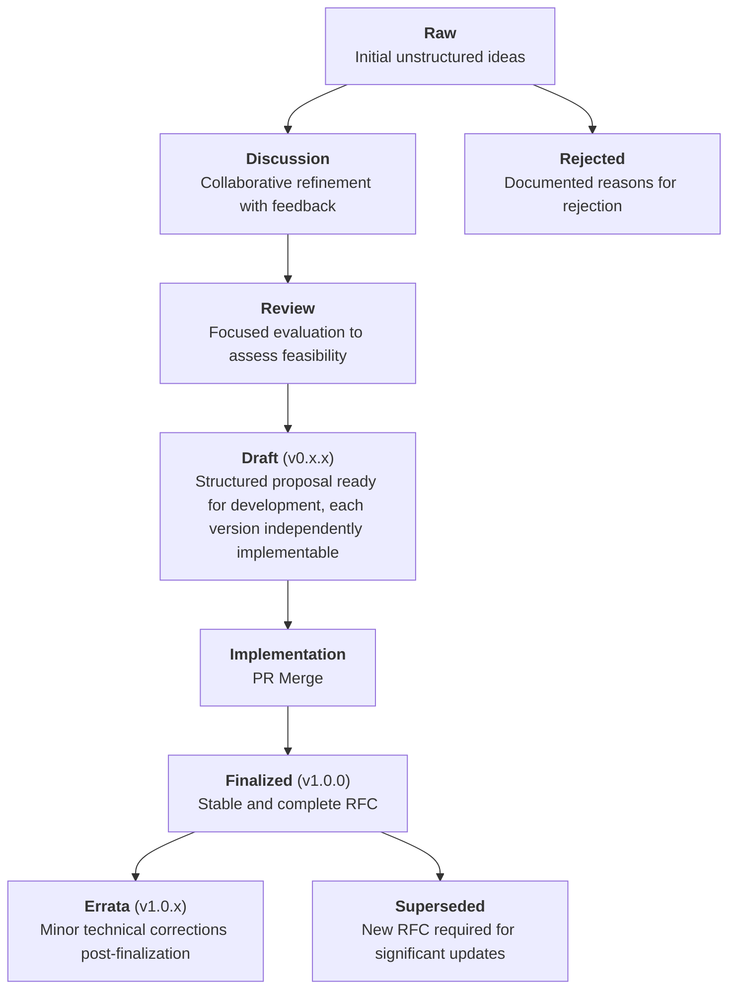

# RFC-0001: RFC Life Cycle and Process

- **RFC Number:** 0001  
- **Title:** RFC Life Cycle and Process
- **Status:** Raw
- **Author(s):** QYuQianchen  
- **Created:** 2025-02-20  
- **Updated:** 2025-02-20  
- **Version:** v0.1.0 (Raw)
- **Supersedes:** N/A
- **References:**

## Abstract

This RFC defines the life cycle, contribution process, versioning system, and governance model for RFCs at HOPR.
It outlines stages, naming conventions, and validation rules that MUST be followed to ensure consistency
and clarity across all RFC submissions.
The process ensures iterative development with feedback loops and transparent updates with pull requests (PR).

## Motivation

HOPR project requires a clear and consistent process for managing technical proposals, documenting protocol architecture.
A well-defined life cycle MUST be established to maintain coherence, ensure quality, and streamline future development.

## Terminology

The key words "MUST", "MUST NOT", "REQUIRED", "SHALL", "SHALL NOT", "SHOULD", "SHOULD NOT", "RECOMMENDED",
"MAY", and "OPTIONAL" in this document are to be interpreted as described
in [IETF RFC 2119](https://datatracker.ietf.org/doc/html/rfc2119).

**Draft:** An RFC is considered a draft from the moment it is proposed for review.
A draft MUST include a clear summary, context, and initial technical details.
Drafts MUST follow the v0.x.x versioning scheme, with each version being independently implementable.
A draft version is assigned as soon as the first PR is created.

## Specification

### 1. RFC Life Cycle Stages

#### **Mermaid Diagram for RFC Life Cycle Stages**



#### **Stage Descriptions:**

- **Raw:** The RFC **MUST** begin as a raw draft reflecting initial ideas.
The draft MAY contain incomplete details but MUST provide a clear objective.
- **Discussion:** Upon submission of the initial PR, the RFC number and `v0.1.0` version are assigned.
Feedback SHALL be gathered via PRs, with iterative updates reflected in version increments `(v0.x.x)`.
- **Review:** The RFC **MUST** undergo at least one review cycle.
The draft **SHOULD** incorporate significant feedback and each iteration **MUST** be independently implementable.
- **Draft:** The RFC moves into active development and refinement.
Each update **SHALL** increment the version (`v0.x.x`) to indicate progress.
- **Implementation:** Merging to the main branch signifies readiness for practical use, triggering the finalization process.
- **Finalized:** The RFC is considered stable and complete, with version `v1.0.0` assigned.
Only errata modifications are permitted afterward.
- **Errata:** Minor technical corrections post-finalization **MUST** be documented
and result in a patch version increment (`v1.0.x`).
Errata are technical corrections or factual updates made after an RFC has been finalized.
They **MUST NOT** alter the intended functionality or introduce new features.
- **Superseded:** Significant updates requiring functionality changes **MUST** be documented in a new RFC,
starting at `v2.0.0` or higher. The original RFC must include information that it has been superseded,
accompanied with a link to the new RFC that supersedes it.
- **Rejected:** If an RFC does not progress past the discussion stage, reasons **MUST** be documented.

### 2. File Structure

```plaintext
RFC-0001-rfc-life-cycle-process/
│
├── 0001-rfc-life-cycle-process.md
├── errata/
│   └── 0001-v1.0.1-erratum.md
└── assets/
    └── life-cycle-overview.png
```

---

### 3. Validation Rules

- Repository **MUST** be prefixed with uppercased "RFC", followed by its RFC number,
and a succinct title all in lowercase joined by hyphens. E.g. `RFC-0001-rfc-life-cycle-process`
- Main file **MUST** be prefixed with its RFC number and a succinct title
all in lowercase joined by hyphens. E.g. `0001-rfc-life-cycle-process.md`
- All assets **MUST** reside in the `assets/` folder.
- Errata **MUST** reside in the `errata/` folder.

## Design Considerations

- Modular RFCs **SHOULD** be preferred.
- PR system **MUST** be the primary mechanism for contribution, review, and errata handling.

## Compatibility

- New RFCs **MUST** maintain backward compatibility unless explicitly stated.
- Errata **MUST NOT** introduce backward-incompatible changes.
- Breaking changes **MUST** be reflected in a major version increment (`v2.0.0`).

## Security Considerations

- Security review phase **MUST** be included before finalization.
- Errata **MUST** undergo security review if impacting critical components.

## Drawbacks

- Strict naming conventions **MAY** limit creative flexibility.

## Alternatives

- Collaborative document editing tools, e.g. hackmd.

## Unresolved Questions

- Handling emergency RFCs
- Enforcing cross-RFC dependencies
- Formal approval timeline for errata

## Future Work

- Automated validation tools
- CI/CD integration for automated versioning and errata checks
- Web interface for publishing RPCs

## References

- [IETF RFC 2119](https://datatracker.ietf.org/doc/html/rfc2119)
- <https://www.rfc-editor.org/rfc/rfc2616>
- <https://www.rfc-editor.org/styleguide/>
- <https://datatracker.ietf.org/doc/rfc9114/>
- <https://katzenpost.network/docs/>
- <https://github.com/rust-lang/rfcs>
- <https://github.com/rust-lang/rfcs/blob/master/0000-template.md>
- <https://github.com/martinthomson/i-d-template/blob/main/example/draft-todo-yourname-protocol.md>
- <https://github.com/rpaulo/quic-base-drafts/tree/master>
- <https://www.rfc-editor.org/rfc/rfc2026.txt>
- <https://rfc.zeromq.org>
- <https://github.com/unprotocols/rfc>
- <https://cwiki.apache.org/confluence/pages/viewpage.action?pageId=120722035#LightweightRFCProcess-Collaboration>
- <https://authors.ietf.org/en/templates-and-schemas>
- <https://raw.githubusercontent.com/martinthomson/internet-draft-template/main/draft-todo-yourname-protocol.md>
- <https://github.com/unprotocols/rfc/tree/master/2>
- <https://zguide.wdfiles.com/local--files/main%3A_start/zguide-c.pdf>
- <https://github.com/vacp2p/rfc-index>
