# RFC-0008: Return path incentivization

- **RFC Number:** 0008  
- **Title:** Return path incentivization
- **Status:** Discussion
- **Author(s):** QYuQianchen  
- **Created:** 2025-03-28 
- **Updated:** 2025-03-28
- **Version:** v0.1.0 (Raw)  
- **Supersedes:** N/A
- **References:** [RFC0003](../RFC-0003-hopr-packet-protocol/0003-hopr-packet-protocol.md)

## Abstract

<!-- Provide a brief and clear summary of the RFC, outlining its purpose, context, and scope. -->

This RFC introduces a privacy-preserving mechanism to compensate Exit nodes (Recipients) for forwarding 
response traffic via Return Paths (RP) in the HOPR protocol.
The protocol enables senders to fund exit nodes' relay costs through shielded deposits and verifiable 
secret sharing (VSSS), maintaining unlinkability while ensuring economic sustainability. 
The system operates as a supplementary layer to existing 
[RFC0003 HOPR packet protocol](../RFC-0003-hopr-packet-protocol/0003-hopr-packet-protocol.md).

## Motivation

<!-- Explain the problem this RFC aims to solve.
Discuss existing limitations, technical gaps, and why the proposed solution is necessary. -->
When a sender uses HOPR protocol to send requests and expects responses, response data will be sent 
through the network as in HOPR packets through pre-selected paths. 
The Return Path (RP) information is embedded in a dedicated HOPR packet header, i.e. 
"Single Use Reply Blocks" (SURBs) headers given by the Entry node.
Given that the Exit-to-Entry response may exceed the Entry-to-Exit request in size, 
the Entry node preemptively supplies multiple SURBs to the Exit, which may or may not be consumed.

In the Return Path mechanism, Exit nodes incur costs 
when opening outgoing channels to the First Relay (FR) to return data to the Entry (Sender). 
While the HOPR protocol provides per-hop incentives through probabilistic payments, 
it does not yet offer a privacy-preserving way to compensate the Exit node for this work - 
especially since the Return Path is initiated by the Sender but executed by the Recipient.

To incentivize Exit nodes to deliver response and offset their extra computation compared with other relay nodes, 
this propose an incentivization mechanism for the RPs, which has the following properties:

- **Privacy**: No Sender-Recipient linkage is revealed on-chain.
- **Fairness**: Recipients are only compensated for actual SURB usage.
- **Incentives**: Shorter Return Paths result in surplus rewards for the Recipient.

## Terminology

<!-- Define key terms, abbreviations, and domain-specific language used throughout the RFC. -->

The key words "MUST", "MUST NOT", "REQUIRED", "SHALL", "SHALL NOT", "SHOULD", "SHOULD NOT", "RECOMMENDED",
"MAY", and "OPTIONAL" in this document are to be interpreted as described
in [IETF RFC 2119](https://datatracker.ietf.org/doc/html/rfc2119) when, and only when, they appear in all
capitals, as shown here.

- **Single Use Reply Blocks (SURB)**
- **Sender**
- **Recipient**
- **Return Path (RP)**: 

- **Shielded Pool**: An anonymized pool of HOPR tokens supporting private deposits and withdrawals using zk-SNARK.
- **Committment**: A cryptographic representation of a deposit. `commitment = H(nullifier || commitment_secret)`
- **Committment Secret $S_{commitment}$**: A random value known only to the depositor and used to generate the commitment.
- **Nullifier**: Unique secret value of a deposit. Random 32 bytes hexdecimal value.
- **Nullifier Hash**: Public unique identifier for deposit claims. 32 bytes hexdecimal value.
- **Winning Probability $P_{win}$**: Each ticket issuer decides on the probability at which this ticket can be a win. 
A winning ticket can claim the associated value. The minimum winning probability is set globally at the network level.
- **SURB Batch**: Set of some Single-Use Reply Blocks for transmitting response.
- **Shielded Pool Deposit Amount $D$**: Fixed amount covering 3-hop relay costs for one batch that will be deposited into the shielded pool.
The value is configurable per network. Every Sender MUST deposit the same value to the shielded pool.
- **Verifiable Shamir Secret Sharing (VSSS)**: A protected secret value gets split into shares among participants. 
In the context of SURB, Sender knows the secret and generates the shares as the solution to the PoR challenge.
Each share gets returned to the Recipient through First Relays' acknowlegment.
The number of shares corresponds to the size of the SURB batch.
- **VSSS threshold**: The minimum number of shares needed to reconstruct the secret.
- **VSSS sharing factor $F$**: The percentage of VSSS threshold over the size of SURB Batch.
This value is set at the network level. Each relay node MUST use the same sharing factor.
- **Acknowledgement Vector**: Set of FR responses ${ack_1,...ack_k}$ proving SURB usage

## Specification
<!-- 
Comprehensive description of the proposed solution, including:

- Protocol overview
- Technical details (data formats, APIs, endpoints)
- Supported use cases

```mermaid
sequenceDiagram
    participant S as Sender
    participant R as Recipient (Exit)
    participant FR as First Relayer
    participant ShieldedPool as Shielded Pool

    Note over S,R: 🔐 Session Initiation
    R->>S: Send session nonce (hash(nonce))

    Note over S,ShieldedPool: 💸 Deposit Phase
    S->>S: Generate commitment_secret, nullifier
    S->>ShieldedPool: Deposit fixed HOPR amount
    S->>ShieldedPool: Insert commitment and hash(nonce) in Merkle tree
    S->>R: Send SURBs with VSSS shares, <br/> and Merkle path to deposit
    R->>ShieldedPool: Verify the deposit is locked in and unused

    Note over R,FR: 🚀 Return Path Usage
    R->>FR: Use SURB to send response
    FR-->>R: Return ack (VSSS share)

    loop Until all SURBs are used
        R->>FR: Use next SURB
        FR-->>R: Return ack (VSSS share)
    end

    Note over R: 🧩 Secret Reconstruction
    R->>R: Reconstruct secret from VSSS shares
    R->>R: Compute nullifier and commitment hash
    R->>R: Generate ZK Proof on the knowledge of nonce, commitment_secret, nullifier

    Note over R: 🧾 ZK Withdrawal
    R->>ShieldedPool: Submit ZK proof of:
    R->>ShieldedPool: 1) Nullifier not spent
    R->>ShieldedPool: 2) Commitment and hash(nonce) exist at the same path in Merkle tree
    R->>ShieldedPool: 3) Secret matches commitment
    ShieldedPool-->>R: Reward transferred
```

- Diagrams (stored in `assets/` and referenced as ``) -->

### 1. Session Initiation
#### Recipient-defined nonce through handshake
Recipient create a random nonce (`recipient_nonce` $n_r$) that is used once per Session.
During the Session initiation, Recipient send to Sender the hash of the nonce $H(n_r)$ as a unique identifier.
Sender creates an ephemeral key-pair for shielded pool deposit.

#### Computing deposit commitment and VSSS parameters
Sender generates locally two random values {`commitment_secret` $S_c$ and `nullifier` $n_{nullifier}$}.
   - `nullifier`: 256-bit random value
   - `secret`: 256-bit random value
   - `commitment`: $H(n_{nullifier} \hspace{0.5em} || \hspace{0.5em} S_c)$

Sender takes network-level properties and computes the relavant parametes for SURB creation.
- Size of SURB Batch: Computed from the global set shielded pool deposit amount, Sender specific winning probability (which is at least the value of the global minimum winning probability), global ticket price. Shielded Pool Deposit Amount $D$ * winning_probability $P_{win}$ / (default_hop_count 3 * ticket_price $p_{ticket}$) 
$$ N_{batch} = \frac{D \times P_{win}}{(3 \times p_{ticket})}$$
- Threshold of VSSS for the batch $k$: VSSS threhsold factor $F$ * Size of SURB Batch 
$$k = F \times N_{batch}$$

Sender does the path selections and thus know a full list of the public keys of FRs.

Sender does the VSSS for the `commitment_secret` $S_c$
- The Sender generates a polynomial of degree $k = threshold \times N_{batch}$ for the size of SURB Batch $N_{batch}$.
- Each SURB carries a share $s_i$.
- The Sender publishes coefficient commitments: $C_j = g^a_j \hspace{0.5em} mod \hspace{0.5em} p$

#### Sending SURBs
- Upon SURB usage, the FR sends $s_i$ back to the Recipient.
- The Recipient reconstructs `secret` from shares and verifies it using commitments.

If the Recipient fails to reconstruct the secret, the Recipient can decide to stop sending return packets.
This prevents Senders from cheating or prematurely claiming the deposit. 

### 2. Zero-knowledge deposit on chain
Sender uses any key that contains HOPR token for deposit to the shielded pool. 
It is RECOMMENDED to use an ephemeral key.
Sender interacts with the shielded pool to store a leaf with the tuple of {commitment, recipient_nonce} in the Merkle tree.
The Merkle path is returned upon a successful deposit. 

### 3. SURB Batch Construction
Each SURB in batch contains:
- Header: Standard RP header (per [RFC0003](../RFC-0003-hopr-packet-protocol/0003-hopr-packet-protocol.md))
- Share: $s_i = f(i)$ where f is VSSS polynomial
- VSSS batchIndex: $i$

When the SURB Batch gets sent to the Recipient. Public inputs of the deposit commitment is also sent along:
- merkle path of the deposit
- nullifier hash $H(n_{nullifier})$
- commitment $H(n_{nullifier} \hspace{0.5em} || \hspace{0.5em} S_c)$
- VSSS $\pi_{vsss}$:
    - coefficient commitments: $[C_0,...C_{k-1}]$
    - VSSS threshold: $k_{vsss}$

### 4. Verify deposit
Recipient checks that the deposit to the shielded pool is valid by verifying the provided leaf is stored at the given Merkle path.
Recipient checks the nullifier hash has not be used.

### 5. Secret reconstruction
When a SURB is successfully used, the FR returns the acknowledgement of of a packet that contains the VSSS share $s_i$.
The Recipient reconstructs `secret` from shares and verifies it using coefficient commitments when the shares reaches the VSSS threshold $k_{vsss}$

This prevents Senders from cheating or prematurely claiming the deposit.
When a fraud of early claim from the Sender is detected, Recipient SHALL immediately terminate the return of responses.

### 6. Reward withdrawal

To claim compensation, the Recipient:

1. Reconstructs the commitment secret $S_c$ from FR acknowledgements ($s_i$)
2. Computes `nullifier` and $H(n_{nullifier} \hspace{0.5em} || \hspace{0.5em} S_c)$
3. Generate proofs $\pi_{withdrawal}$ for:
    - Nullifier is the preimage of nullifier hash $hash(n_{nullifier}) \equiv H(n_{nullifier})$
    - Recipient nonce is the preimage of recipient nonce hash $hash(n_r) \equiv H(n_r)$
    - $S_c$  matches the deposit commitment $hash(n_{nullifier} \hspace{0.5em} || \hspace{0.5em} S_c)) \equiv H(n_{nullifier} \hspace{0.5em} || \hspace{0.5em} S_c)$
    - Nullifier is unused on-chain
    - {Commitment, recipient nonce} tuple exists in the Merkle tree 
4. With inputs:
    - *Private* nullifier $n_{nullifier}$
    - *Private* commitment secret $S_{c}$
    - *Private* Merkle tree path
    - *Private* recipient nonce  $n_r$
    - *Public* Merkle root
    - *Public* Nullifier hash 

The Recipient submits a ZKP on-chain to claim the deposit anonymously.

## Design Considerations

<!-- Discuss critical design decisions, trade-offs, and justification for chosen approaches over alternatives. -->

Recipient MAY gain extra rewards in the case when not all the deposit amount is consumed by SURBs.

For actual SURB usage with hop counts ${h_1,...h_{batchSize}}$ where $h_i \in [0, 3]$, the extra reward $R$ can be computed as:

$$R = D -\sum_{i=1}^{batchSize} \frac{h_i \times p_{ticket}}{P_{win}}$$
## Compatibility

<!-- Address backward compatibility, migration paths, and impact on existing systems. -->

## Security Considerations

<!-- Identify potential security risks, threat models, and mitigation strategies. -->

## Drawbacks

<!-- Discuss potential downsides, risks, or limitations associated with the proposed solution. -->
1. Current low winning probability may stress the VSSS computation
2. To directly use an ephemeral key for deposit. The ephemeral key should have access to HOPR tokens and necessary native tokens to complet such transactions.

## Alternatives

<!-- Outline alternative approaches that were considered and reasons for their rejection. -->

## Unresolved Questions

<!-- Highlight questions or issues that remain open for discussion. -->

## Future Work

<!-- Suggest potential areas for future exploration, enhancements, or iterations. -->

## References

Include all relevant references, such as:

- Other RFCs
- Research papers
- External documentation
