# RFC-0008: Return path incentivization

- **RFC Number:** 0008  
- **Title:** Return path incentivization
- **Status:** Discussion
- **Author(s):** NumberFour8, QYuQianchen 
- **Created:** 2025-03-28 
- **Updated:** 2025-04-07
- **Version:** v0.2.0 (Raw)  
- **Supersedes:** N/A
- **References:** [RFC0003](../RFC-0003-hopr-packet-protocol/0003-hopr-packet-protocol.md)

## Abstract

<!-- Provide a brief and clear summary of the RFC, outlining its purpose, context, and scope. -->

This RFC introduces a privacy-preserving mechanism to compensate Exit nodes (Recipients) for forwarding 
response traffic via Return Paths (RP) in the HOPR protocol.
The protocol enables senders to fund exit nodes' relay costs through shielded deposits, stealth addresses,
and verifiable secret sharing (VSSS), maintaining unlinkability while ensuring economic sustainability. 
The system operates as a supplementary layer to existing 
[RFC0003 HOPR packet protocol](../RFC-0003-hopr-packet-protocol/0003-hopr-packet-protocol.md).

## Motivation

<!-- Explain the problem this RFC aims to solve.
Discuss existing limitations, technical gaps, and why the proposed solution is necessary. -->
When a sender uses HOPR protocol to send requests and expects responses, response data will be sent 
through the network as in HOPR packets through pre-selected paths. 
The Return Path (RP) information is embedded in a dedicated HOPR packet header, i.e. 
"Single Use Reply Blocks" (SURBs) headers given by the Entry node.
Given that the Exit-to-Entry response may exceed the Entry-to-Exit request in size, 
the Entry node preemptively supplies multiple SURBs to the Exit, which may or may not be consumed.

In the Return Path mechanism, Exit nodes incur costs 
when opening outgoing channels to the First Relay (FR) to return data to the Entry (Sender). 
While the HOPR protocol provides per-hop incentives through probabilistic payments, 
it does not yet offer a privacy-preserving way to compensate the Exit node for this work - 
especially since the Return Path is initiated by the Sender but executed by the Recipient.

To incentivize Exit nodes to deliver response and offset their extra computation compared with other relay nodes, 
this propose an incentivization mechanism for the RPs, which has the following properties:

- **Privacy**: No Sender-Recipient linkage is revealed on-chain.
- **Fairness**: Recipients are only compensated for actual SURB usage.
- **Incentives**: Shorter Return Paths result in surplus rewards for the Recipient.

## Terminology

<!-- Define key terms, abbreviations, and domain-specific language used throughout the RFC. -->

The key words "MUST", "MUST NOT", "REQUIRED", "SHALL", "SHALL NOT", "SHOULD", "SHOULD NOT", "RECOMMENDED",
"MAY", and "OPTIONAL" in this document are to be interpreted as described
in [IETF RFC 2119](https://datatracker.ietf.org/doc/html/rfc2119) when, and only when, they appear in all
capitals, as shown here.

- **Single Use Reply Blocks (SURB)**
- **Sender**: Sender of packets.
- **Recipient**: Recipient of packets and SURBs. It has private key $r$, public key $R$, and Ethereum address $E_R$
- **Return Path (RP)**: 

- **Shielded Pool**: An anonymized pool of HOPR tokens supporting private deposits and withdrawals using zk-SNARK.
- **Nullifier $s_n$**: Unique secret value of a deposit. Random 32 bytes hexdecimal value.
- **Nullifier Hash $h$**: Public unique identifier for deposit claims. 32 bytes hexdecimal value. $h = H_1(s_n)$
- **Deposit Committment Secret $s_{c}$**: A random value known only to the Sender and used to generate the commitment.
- **Deposit Committment $C_{d}$**: A cryptographic representation of a deposit. $C_{d} = H_2(s_n \Vert s_{c})$
- **Stealth Secret $s_{s}$**: An one-time pad secret value jointly picked by the Sender and the Recipient.
This value defines the derivation of the stealth address of Recipient. $s_{s} = a + b$
- **Sender-picked nonce $a$**: Random value chosen by the Sender. Partial contribution to the stealth address.
- **Recipient-picked nonce $b$**: Random value chosen by the Recipient. Partial contribution to the stealth address.
- **Stealth Address $E_{B_s}$**: Stealth address of the Recipient. It has private key $b_{s}$ and public key $B_{s}$. 
- **Winning Probability $P_{win}$**: Each ticket issuer decides on the probability at which this ticket can be a win. 
A winning ticket can claim the associated value. The minimum winning probability is set globally at the network level.
- **SURB Batch**: Set of some Single-Use Reply Blocks for transmitting response.
- **Shielded Pool Deposit Amount $D$**: Fixed amount covering 3-hop relay costs for one batch that will be deposited into the shielded pool.
The value is configurable per network. Every Sender MUST deposit the same value to the shielded pool.
- **Verifiable Shamir Secret Sharing (VSSS)**: A protected secret value gets split into shares among participants. 
In the context of SURB, Sender knows the secret and generates the shares as the solution to the PoR challenge.
Each share gets returned to the Recipient through First Relays' acknowlegment.
The number of shares corresponds to the size of the SURB batch.
- **VSSS threshold**: The minimum number of shares needed to reconstruct the secret.
- **VSSS sharing factor $F$**: The percentage of VSSS threshold over the size of SURB Batch.
This value is set at the network level. Each relay node MUST use the same sharing factor.
- **Acknowledgement Vector**: Set of FR responses ${ack_1,...ack_k}$ proving SURB usage

## Specification
<!-- 
Comprehensive description of the proposed solution, including:

- Protocol overview
- Technical details (data formats, APIs, endpoints)
- Supported use cases

```mermaid
sequenceDiagram
    participant S as Sender
    participant R as Recipient (Exit)
    participant FR as First Relayer
    participant ShieldedPool as Shielded Pool
    participant SR as Stealth Recipient
    participant A as Gasless Agent

    Note over S,ShieldedPool: 💸 Shielded Deposit Phase
    S->>S: Generate commitment_secret and nullifier
    S->>ShieldedPool: Deposit fixed HOPR amount to the shielded pool
    S-->>ShieldedPool: Insert commitment in Merkle tree
    S->>S: Generate proof for Gasless Agent <br/> to withdraw to the stealth address

    Note over S,R: 🔐 Session Initiation
    R->>S: Send the public key to the recipient-picked nonce B
    S->>S: Sender-picked secret a, its public key A, and stealth address
    
    Note over A,ShieldedPool: 📥 Zero-knowledge (ZK) allocation on chain
    A->>ShieldedPool: Allocate the deposit to the stealth address with proof
    ShieldedPool-->>SR: Reward allocated to the stealth address

    Note over S: 📦 SURB batch and Verifiable Shamir Secret Sharing (VSSS) creation
    S->S: Create VSSS shared secrets and commitments for a
    S->S: Create SURBs 

    Note over S,R: 📢 Send SURBs and VSSS
    S->>R: Send SURBs with VSSS commitments, <br/> public stealth challenge, and <br/> ticket challenges to shared steath secret
    R->>R: Compute stealth address and verify valid deposit
    R->>R: Verify VSSS commitments

    Note over R,FR: 🚀 Return Path Usage
    R->>FR: Use SURB to send response
    FR-->>R: Return ack (VSSS share)

    loop Until all SURBs are used
        R->>FR: Use next SURB
        FR-->>R: Return ack (VSSS share)
    end

    Note over R: 🧩 Secret Reconstruction
    R->>R: Reconstruct stealth secret from VSSS shares
    R->>R: Compute private key to the stealth secret

    Note over R,ShieldedPool: 🧾 Payment Retrieval 
    R->>ShieldedPool: (Gasless) Request to withdraw
    SR-->>R: Reward transferred from stealth address to the Recipient
```

- Diagrams (stored in `assets/` and referenced as ``) -->

### 1. Zero-knowledge (ZK) deposit on chain
Sender MUST generate random secret values for zk deposit as a committment of payment to the stealth address of the Recipient
- Deposit Committment Secret $s_{c}$: 256-bit random value
- Nullifier $s_n$: 256-bit random value

Compute the deposit committment $C_{d} = H_2(s_n \Vert s_{c})$ where $H_2$ is 
an adequate hash fuction to for zero-knowledge proofs.
Sender uses any wallet that contains HOPR token for deposit to the shielded pool. 
Sender interacts with the shielded pool to send HOPR token of amount $D$ and store the commitment $C_d$ to a leaf to the Merkle tree at a path.

### 2. Session Initiation
Recipient picks a random nonce $b$ as its secret to the that is used once per Session.
During the Session initiation, Recipient send to Sender an ephemeral public key $B$ which is computed from $B = b * r * G$,
where $G$ is the generator point of secp256k1 curve.

### 3. Zero-knowledge (ZK) allocation on chain
Sender MUST pick a nonce $a$, a 256-bit random value.
Sender computes the stealth public key $B_s$ of the Recipient based on the ephemeral public key shared by the Recipient $B_s = B + a * R \equiv b * r * G + a * r * G \equiv s_s * r * G$ 
where $B$ is the public key of the ephemeral Recipient and $G$ is the generator point of secp256k1 curve. 
The address of Recipient's stealth address $E_{B_s}$ can calculated from the public key of the stealth address $B_s$

Sender generates zk proofs to shielded pool "withdrawal". This withdrawal assigns the deposit to the stealth address of the Recipient .
This prevents Senders from cheating or prematurely claiming the deposit.
Sender SHALL use an ephemeral wallet or a gasless agent to perform the allocation anonymously. 
Tokens are still held in the Shielded Pool.

Agent:
1. Reconstructs the commitment secret $S_c$ from FR acknowledgements ($s_i$)
2. Generate proofs $\pi_{withdrawal}$ for:
    - Nullifier is the preimage of nullifier hash $H_1(s_n) \equiv h$
    - Nullifier is unused on-chain
    - Commitment $C_D$ exists in the Merkle tree 
    - $S_c$ matches the deposit commitment $C_{d} \equiv H_2(s_n \Vert s_{c})$ 
3. With inputs:
    - *Private* nullifier $n_{nullifier}$
    - *Private* commitment secret $S_{c}$
    - *Private* Merkle tree path
    - *Public* Merkle root
    - *Public* Nullifier hash 

### 4. SURB Batch Construction
Sender takes network-level properties and computes the relavant parametes for SURB creation.
- Size of SURB Batch: Computed from the global set shielded pool deposit amount, Sender specific winning probability (which is at least the value of the global minimum winning probability), global ticket price. Shielded Pool Deposit Amount $D$ * winning_probability $P_{win}$ / (default_hop_count 3 * ticket_price $p_{ticket}$) 
$$ N_{batch} = \frac{D \times P_{win}}{(3 \times p_{ticket})}$$
- Threshold of VSSS for the batch $k$: VSSS threhsold factor $F$ * Size of SURB Batch 
$k = F \times N_{batch}$. The threshold SHALL consider exit node reward into its computation.

Sender does the path selections and thus know a full list of the public keys of FRs.

### 5. Verifiable Shamir Secret Sharing (VSSS) commitment
Sender does the VSSS for the "Sender-picked nonce" $a$
- The Sender generates a polynomial of degree $k = threshold \times N_{batch}$ for the size of SURB Batch $N_{batch}$.
- Each SURB carries a share $s_i$.
- The Sender publishes coefficient commitments: $C_j = g^a_j \hspace{0.5em} mod \hspace{0.5em} p$

Each SURB in batch contains:
- Header: Standard RP header (per [RFC0003](../RFC-0003-hopr-packet-protocol/0003-hopr-packet-protocol.md))
- Share: $s_i = f(i)$ where f is VSSS polynomial
- VSSS batchIndex: $i$

When the SURB Batch gets sent to the Recipient. Public inputs of the deposit commitment is also sent along:
- merkle path of the deposit
- nullifier hash $h$
- commitment $C_{d} = H_2(s_n \Vert s_{c})$
- VSSS $\pi_{vsss}$:
    - coefficient commitments: $[C_0,...C_{k-1}]$
    - VSSS threshold: $k_{vsss}$

### 6. Sending SURBs
Sender is MUST sends SURBs with 
- commitments of shared secrets
- public key to the Sender-picked nonce $A \equiv a * R \equiv a * r * G$
- VSSS threshold $k$

Recipent verifies the valid deposit to the stealth address as well as the integrity of the commitments.

The stealth address can be computed as $B_{s} = A + b * R \equiv = (a + b) * r * G$
Deposit can be verified in the Shielded Pool where deposit is allocated to the stealth address

#### 7. Using SURBs
- Upon SURB usage, the FR sends $s_i$ back to the Recipient.
- The Recipient reconstructs `secret` from shares and verifies it using commitments.

If any fraud is detected, Recipient SHALL immediately terminate the return of responses.

### 8. Stealth secret reconstruction
When a SURB is successfully used, the FR returns the acknowledgement of of a packet that contains the VSSS share $s_i$.
The Recipient reconstructs the Sender-pick secret $a$ from shares and verifies it using coefficient commitments when the shares reaches the VSSS threshold $k_{vsss}$

Once the Sender-pick secret is reconstructed, a stealth secret can be calculated as $s_s = a + b$

### 9. Recipient claims Reward

To claim compensation, the Recipient SHALL directly claim from the Shielded Pool, providing the correct stealth secret as input $m$. 
Any other wallet MAY claim for the Recipient, if the stealth secret $s_s$ is known to them.
The Shielded Pool sends the deposit to the Recipient, if $m * G + R \equiv B_s$ holds

## Design Considerations

<!-- Discuss critical design decisions, trade-offs, and justification for chosen approaches over alternatives. -->

Recipient MAY gain extra rewards in the case when not all the deposit amount is consumed by SURBs.

For actual SURB usage with hop counts ${h_1,...h_{batchSize}}$ where $h_i \in [0, 3]$, the extra reward $R$ can be computed as:

$$R = D -\sum_{i=1}^{batchSize} \frac{h_i \times p_{ticket}}{P_{win}}$$
## Compatibility

<!-- Address backward compatibility, migration paths, and impact on existing systems. -->

## Security Considerations

<!-- Identify potential security risks, threat models, and mitigation strategies. -->

## Drawbacks

<!-- Discuss potential downsides, risks, or limitations associated with the proposed solution. -->
1. Current low winning probability may stress the VSSS computation
2. While malicious Recipients may attempt to troll Senders by initiating Sessions and preventing SURB usage (thereby locking deposits), they cannot profit from this behavior without successfully relaying packets. Mitigations such as slashing or reputation-based deterrents are potential solutions but are considered out of scope for this RFC.

## Alternatives

<!-- Outline alternative approaches that were considered and reasons for their rejection. -->

## Unresolved Questions

<!-- Highlight questions or issues that remain open for discussion. -->

## Future Work

<!-- Suggest potential areas for future exploration, enhancements, or iterations. -->

## References

Include all relevant references, such as:

- Other RFCs
- Research papers
- External documentation
