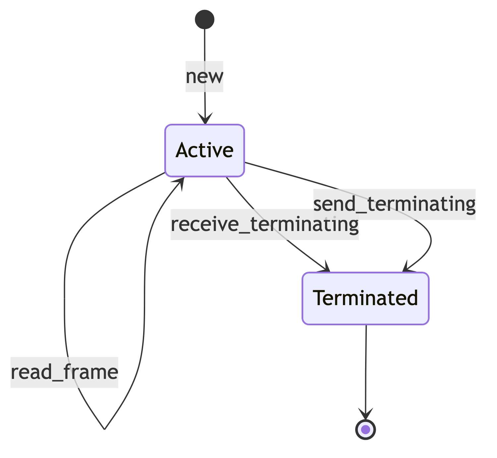
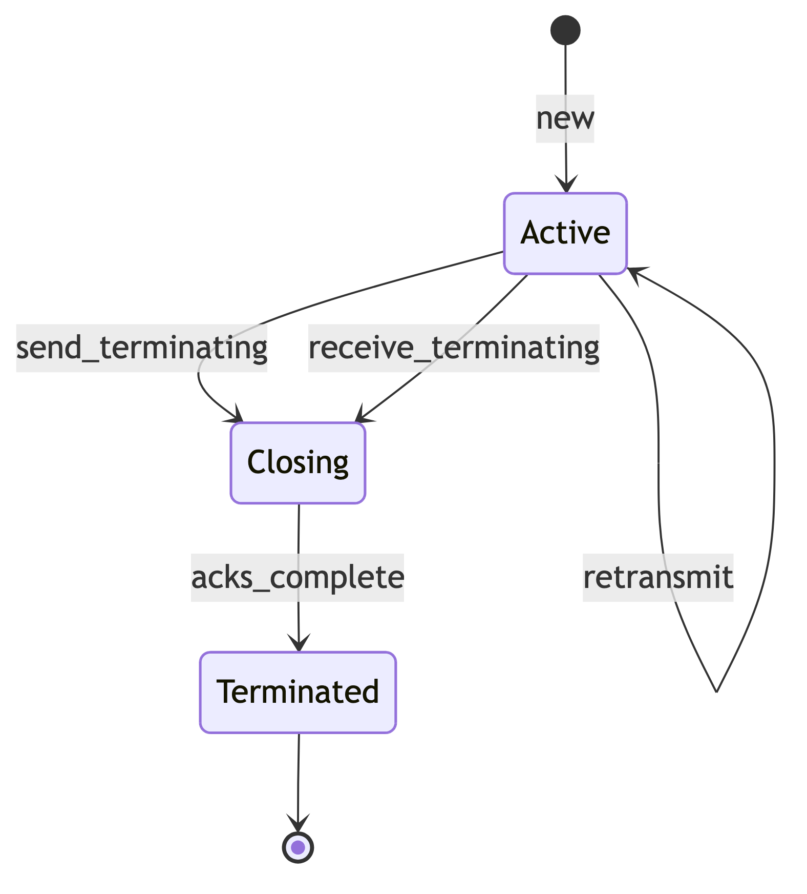
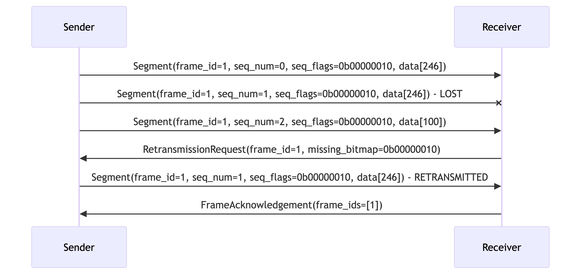
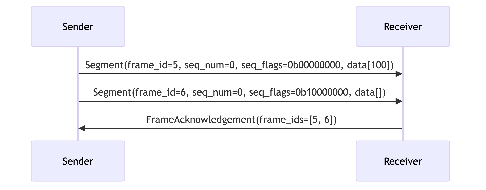

# RFC-0008: Session Data Protocol

- **RFC Number:** 0008
- **Title:** Session Data Protocol
- **Status:** Finalised
- **Author(s):** Tino Breddin (@tolbrino), Lukas Pohanka (@NumberFour8)
- **Created:** 2025-08-15
- **Updated:** 2025-10-27
- **Version:** v1.0.0 (Finalised)
- **Supersedes:** none
- **Related Links:** [RFC-0002](../RFC-0002-mixnet-keywords/0002-mixnet-keywords.md),
  [RFC-0004](../RFC-0004-hopr-packet-protocol/0004-hopr-packet-protocol.md),
  [RFC-0009](../RFC-0009-session-start-protocol/0009-session-start-protocol.md)

## 1. Abstract

This RFC specifies the HOPR session data protocol, which provides reliable and unreliable data transmission capabilities over the HOPR mixnet. The
protocol implements TCP-like features [01] including message segmentation, reassembly, acknowledgement, and retransmission, whilst maintaining
simplicity and efficiency suitable for mixnet deployment. This protocol works in conjunction with the HOPR session start protocol
([RFC-0009](../RFC-0009-session-start-protocol/0009-session-start-protocol.md)) to provide complete session management capabilities for applications
within the HOPR ecosystem.

The protocol supports both reliable (TCP-like) and unreliable (UDP-like) transmission modes, allowing applications to choose the appropriate trade-off
between reliability and latency for their use case.

## 2. Motivation

The HOPR mixnet uses HOPR packets ([RFC-0004](../RFC-0004-hopr-packet-protocol/0004-hopr-packet-protocol.md)) to transport data between nodes. This
fundamental packet-sending mechanism operates as a fire-and-forget transport similar to UDP [03], providing no guarantees of delivery, ordering, or
message boundaries. Whilst this simplicity is appropriate for the packet layer, application developers typically require higher-level features such as:

- **Reliable delivery**: ensuring that messages are delivered or that the sender is notified of failures
- **Message ordering**: receiving messages in the order they were sent
- **Message segmentation**: handling messages larger than the fixed packet size
- **Flow control**: managing transmission rates to prevent overwhelming receivers

To ease adoption, HOPR nodes must provide a way for applications to use these features without reimplementing TCP [01] or UDP [02] from scratch. Since
the HOPR protocol is not IP-based, implementing these protocols directly would require complex IP protocol emulation.

The HOPR session data protocol fills this gap by providing both reliable and unreliable data transmission modes directly over the HOPR packet transport.
Session establishment and lifecycle management are handled by the HOPR session start protocol
([RFC-0009](../RFC-0009-session-start-protocol/0009-session-start-protocol.md)), whilst this protocol focuses exclusively on efficient data
transmission once a session is established.

## 3. Terminology
The keywords "MUST", "MUST NOT", "REQUIRED", "SHALL", "SHALL NOT", "SHOULD", "SHOULD NOT", "RECOMMENDED", "MAY", and "OPTIONAL" in this document are
to be interpreted as described in [04] when, and only when, they appear in all capitals, as shown here.

All terminology used in this document, including general mix network concepts and HOPR-specific definitions, is provided in [RFC-0002](../RFC-0002-mixnet-keywords/0002-mixnet-keywords.md). That document serves as the authoritative reference for the terminology and conventions adopted 
across the HOPR RFC series. Additionally, this document defines the following session-protocol-specific terms:

- **frame**: a logical unit of data transmission in the session protocol. Frames can be of arbitrary length and are identified by a unique frame ID.
  Frames represent complete application messages that may span multiple packets.

- **segment**: a fixed-size fragment of a frame. Frames larger than the packet MTU are split into segments for transmission, with each segment carrying
  metadata about its position within the frame to enable reassembly.

- **frame ID**: a 32-bit unsigned integer that uniquely identifies a frame within a session (1-indexed, starting from 1). Frame ID values are interpreted
  as big-endian unsigned integers and increment sequentially with each new frame.

- **sequence number (SeqNum)**: an 8-bit unsigned integer indicating a segment's position within its frame (0-indexed, starting from 0). This enables
  correct reassembly of frames from segments.

- **sequence flags (SeqFlags)**: an 8-bit value encoding additional segment metadata, including whether the segment is the final segment of a frame and
  whether it represents a terminating segment.

- **session socket**: the endpoint abstraction that implements the session protocol, available in both reliable and unreliable variants. Session sockets
  provide familiar send/receive APIs to applications.

- **MTU (maximum transmission unit)**: the maximum size of a single HOPR protocol message payload, denoted as `C` throughout this specification. This is
  determined by the packet format defined in [RFC-0004](../RFC-0004-hopr-packet-protocol/0004-hopr-packet-protocol.md).

- **terminating segment**: a special segment with the termination flag set that signals the graceful end of a session. Terminating segments carry no data
  payload.

## 4. Specification

### 4.1 Protocol Overview

The HOPR session data protocol operates at version 1 and consists of three message types that work together to provide reliable or unreliable data
transmission:

1. **segment messages**: Carry actual data fragments
2. **retransmission request messages**: Request missing segments
3. **frame acknowledgement messages**: Confirm successful frame receipt

The protocol supports two operational modes:

- **Unreliable Mode**: Fast, stateless operation similar to UDP [03]
- **Reliable Mode**: Stateful operation with acknowledgements and retransmissions

Session establishment and lifecycle management are handled by the HOPR Session Start Protocol. All multi-byte integer fields use network byte order
(big-endian) encoding to ensure consistent interpretation across different architectures.

### 4.2 Session Data Protocol Message Format

All Session Data Protocol messages follow a common structure:

| Field       | Size     | Description               | Value                          |
| ----------- | -------- | ------------------------- | ------------------------------ |
| **Version** | 1 byte   | Protocol version          | MUST be `0x01` for version 1   |
| **Type**    | 1 byte   | Message type discriminant | See Message Types table below  |
| **Length**  | 2 bytes  | Payload length in bytes   | Maximum is `C - 4`             |
| **Payload** | Variable | Message-specific data     | Format depends on message type |

#### 4.2.1 Message Types

| Type Code | Name                   | Description                       |
| --------------- | ----------------------------------- | ---------------------------------------------------- |
| `0x00`    | Segment                | Carries actual data fragments     |
| `0x01`    | Retransmission Request | Requests missing segments         |
| `0x02`    | Frame Acknowledgement  | Confirms successful frame receipt |

#### 4.2.2 Byte Order

All multi-byte integer fields and values in the Session Data Protocol MUST be encoded and interpreted in network byte order (big-endian). This applies
to:

**Protocol Message Fields:**

- **Length** field (2 bytes) in the common message format
- **Frame ID** field (4 bytes) in Segment, Retransmission Request, and Frame Acknowledgement messages
- Any future numeric fields added to the protocol

This requirement ensures consistent interpretation across different architectures and prevents interoperability issues between implementations.

### 4.3 Segment Message

#### 4.3.1 Segment Structure

| Field               | Size     | Description                             | Valid Range                    |
| ------------------- | -------- | --------------------------------------- | ------------------------------ |
| **Frame ID**        | 4 bytes  | Frame identifier                        | 1 to 4,294,967,295             |
| **Sequence Number** | 1 byte   | Segment position within frame (0-based) | 0-63                           |
| **Sequence Flags**  | 1 byte   | Segment metadata flags                  | See Sequence Flags table below |
| **Segment Data**    | Variable | Payload data                            | 0 to (`C - 10`) bytes          |

#### 4.3.2 Sequence Flags Bitmap

| Bit | Flag Name            | Description                     | Values                          |
| --- | -------------------- | ------------------------------- | ------------------------------- |
| 7   | **Termination Flag** | Indicates terminating segment   | `0` = Normal, `1` = Terminating |
| 6   | **Reserved**         | Reserved for future use         | MUST be `0`                     |
| 5-0 | **Segment Count**    | Total segments in frame minus 1 | `0`-`63` (1-64 segments)        |

#### 4.3.3 Segmentation Rules

| Rule                       | Requirement | Description                                                       |
| -------------------------- | ----------- | ----------------------------------------------------------------- |
| **Segmentation Threshold** | MUST        | Frames MUST be segmented when larger than `(C - 10)` bytes        |
| **Maximum Segments**       | MUST        | Maximum 64 segments per frame (6-bit sequence length field limit) |
| **Segment Sizing**         | SHOULD      | Each segment except the last SHOULD be of equal size              |
| **Empty Segments**         | MUST        | Empty segments MUST be valid (used for terminating segments)      |
| **Frame ID Ordering**      | MUST        | Frame IDs MUST be monotonically increasing within a session       |

#### 4.3.4 Protocol Constants

| Constant                   | Value         | Description                                        |
| -------------------------- | ------------- | -------------------------------------------------- |
| **Protocol Version**       | `0x01`        | Current protocol version                           |
| **Segment Overhead**       | 10 bytes      | Header overhead per segment (4 common + 6 segment) |
| **Maximum Frame ID**       | 4,294,967,295 | Maximum 32-bit frame identifier                    |
| **Maximum Segments**       | 64            | Maximum segments per frame                         |
| **Maximum Payload Length** | `C - 4` bytes | Maximum message payload size                       |

### 4.4 Retransmission Request Message

#### 4.4.1 Request Structure

The message contains a sequence of 5-byte entries:

| Field              | Size    | Description                | Format                         |
| ------------------ | ------- | -------------------------- | ------------------------------ |
| **Frame ID**       | 4 bytes | Frame identifier           | 1 to 4,294,967,295             |
| **Missing Bitmap** | 1 byte  | Bitmap of missing segments | See Missing Bitmap table below |

#### 4.4.2 Missing Bitmap Format

| Bit | Sequence Number | Description                   |
| ------- | -------------------------------- | -------------------------------------------------------------- |
| 0   | Segment 0       | `1` = Missing, `0` = Received |
| 1   | Segment 1       | `1` = Missing, `0` = Received |
| 2   | Segment 2       | `1` = Missing, `0` = Received |
| 3   | Segment 3       | `1` = Missing, `0` = Received |
| 4   | Segment 4       | `1` = Missing, `0` = Received |
| 5   | Segment 5       | `1` = Missing, `0` = Received |
| 6   | Segment 6       | `1` = Missing, `0` = Received |
| 7   | Segment 7       | `1` = Missing, `0` = Received |

**Note:** This message MUST be used only for frames with up to 8 segments (due to bitmap size limitation). Reliable sessions are limited to 7 segments
per frame. Unreliable sessions SHOULD not have this limitation.

#### 4.4.3 Request Rules

| Rule              | Requirement | Description                                          |
| ----------------- | ----------- | ---------------------------------------------------- |
| **Ordering**      | MUST        | Entries MUST be ordered by Frame ID (ascending)      |
| **Padding**       | MAY         | Frame ID of `0` indicates padding (ignored)          |
| **Entry Limit**   | MUST        | Maximum entries per message: `(C - 4) / 5`           |
| **Segment Limit** | MUST        | Only the first 8 segments per frame can be requested |

### 4.5 Frame Acknowledgement Message

#### 4.5.1 Acknowledgement Structure

| Field             | Size         | Description                              | Rules                                 |
| ----------------- | ------------ | ---------------------------------------- | ------------------------------------- |
| **Frame ID List** | 4 bytes each | List of fully received frame identifiers | See Acknowledgement Rules table below |

#### 4.5.2 Acknowledgement Rules

| Rule             | Requirement | Description                                     |
| ---------------- | ----------- | ----------------------------------------------- |
| **Ordering**     | MUST        | Frame IDs MUST be in ascending order            |
| **Padding**      | MAY         | Frame ID of `0` indicates padding (ignored)     |
| **Entry Limit**  | MUST        | Maximum frame IDs per message: `(C - 4) / 4`    |
| **Completeness** | MUST        | Only acknowledge frames that are fully received |

### 4.6 Protocol State Machines

#### 4.6.1 Unreliable Socket State Machine

#### 4.6.2 Reliable Socket State Machine

### 4.7 Timing and Reliability Parameters

#### 4.7.1 Unreliable Mode

- No acknowledgements or retransmissions
- Frames may be delivered out-of-order
- No delivery guarantees
- Suitable for real-time or loss-tolerant applications

#### 4.7.2 Reliable Mode Parameters

| Parameter                    | Default Value | Description                           | Requirement            |
| ---------------------------- | ------------- | ------------------------------------- | ---------------------- |
| **Frame Timeout**            | 800ms         | Time before requesting retransmission | SHOULD be configurable |
| **Acknowledgement Window**   | 255 frames    | Maximum unacknowledged frames         | MUST NOT exceed 255    |
| **Retransmission Limit**     | 3 attempts    | Maximum retransmission attempts       | Implementation-defined |
| **Acknowledgement Batching** | 100ms         | Maximum delay for batching ACKs       | SHOULD be configurable |

### 4.8 Session Termination

1. Either party MAY send a terminating segment (empty segment with the termination flag set)
2. Upon receiving a terminating segment:
   - Unreliable sockets SHOULD close immediately
   - Reliable sockets MUST complete pending acknowledgements before closing
3. No data frames MUST be sent after a terminating segment

### 4.9 Example Message Exchanges

All numeric values in the examples below are shown in their logical representation. Frame IDs and other multi-byte integers are encoded in big-endian
format on the wire.

#### 4.9.1 Simple Frame Transmission (Unreliable Mode)

Sending a 300-byte frame with MTU=256 (246 bytes available per segment after 10-byte overhead):

#### 4.9.2 Frame with Retransmission (Reliable Mode)

Reliable transmission where the middle segment is lost and retransmitted:

#### 4.9.3 Multiple Frame Acknowledgement (Reliable Mode)

Efficiently acknowledging multiple received frames in a batch:

#### 4.9.4 Session Termination (Reliable Mode)

Graceful session termination with acknowledgement:

#### 4.9.5 Session Termination (Unreliable Mode)

Immediate session termination without acknowledgement:

## 5. Design Considerations

### 5.1 Maximum Segments Limitation

The protocol limits frames to 64 segments due to the 6-bit sequence length field. This provides a good balance among:

- Frame size flexibility (up to 64 × MTU)
- Protocol overhead (1 byte for sequence information)
- Implementation complexity (simple bitmap for retransmissions)

### 5.2 Frame ID Space

The 32-bit Frame ID space allows for over 4 billion frames per session. Frame IDs MUST be monotonically increasing to enable:

- Duplicate detection
- Out-of-order delivery handling
- Simple state management

The Session MUST terminate when a Frame ID of 0 is encountered by the receiving side, indicating an overflow.

### 5.3 Retransmission Request Design

Limiting retransmission requests to the first 8 segments per frame:

- Keeps message format simple (1-byte bitmap)
- Covers the common case (most frames have ≤8 segments)
- Frames requiring >8 segments can use smaller frame sizes

### 5.4 Protocol Overhead

- Minimum overhead per segment: 10 bytes (4 header + 6 segment header)
- Maximum protocol efficiency: (C - 10) / C
- For C = 1024: ~99% efficiency
- For C = 256: ~96% efficiency

## 6. Compatibility

### 6.1 Version Compatibility

- Version 1 is the initial Session Data protocol version
- Future versions MUST use different version numbers
- Implementations MUST reject messages with unknown versions
- Version negotiation is out of scope for this specification

### 6.2 Transport Requirements

- Requires bidirectional communication channel
- No assumptions about ordering or reliability

## 7. Security Considerations

### 7.1 Protocol Security

- The protocol provides NO encryption or authentication
- Security MUST be provided by the underlying transport
- Frame IDs are predictable and MUST NOT be used for security

## 8. Future Work

- Enhanced acknowledgement schemes for better efficiency
- Forward error correction for high-loss environments

## 9. Implementation Notes

### 9.1 Testing Recommendations

- Test with various MTU sizes (256, 512, 1024, 1500, 9000)
- Simulate packet loss, reordering, and duplication
- Verify termination handling under all conditions
- Stress test with maximum frame sizes and counts

## 10. References

[01] Postel, J. (1981). [Transmission Control Protocol](https://datatracker.ietf.org/doc/html/rfc793). _IETF RFC 793_.

[02] Bormann, C. & Hoffman, P. (2013). [Concise Binary Object Representation (CBOR)](https://datatracker.ietf.org/doc/html/rfc7049). _IETF RFC 7049_.

[03] Postel, J. (1980). [User Datagram Protocol](https://datatracker.ietf.org/doc/html/rfc768). _IETF RFC 768_.

[04] Bradner, S. (1997). [Key words for use in RFCs to Indicate Requirement Levels](https://datatracker.ietf.org/doc/html/rfc2119). _IETF RFC 2119_.
