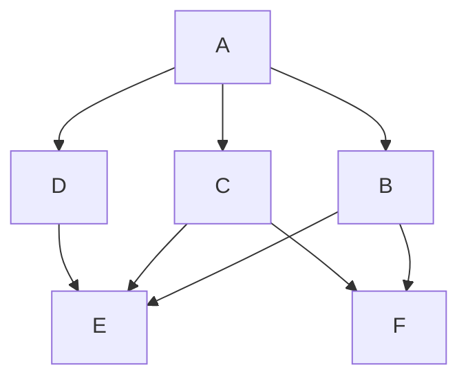
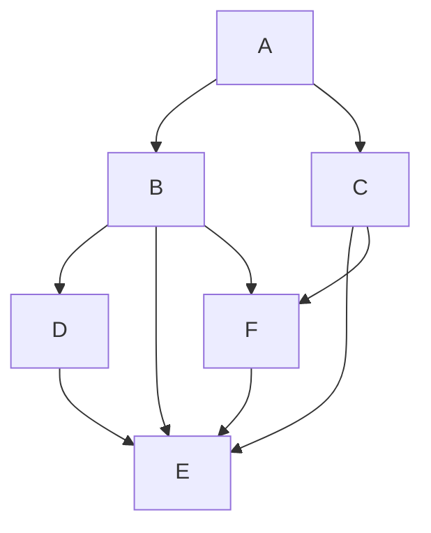

# RFC-0010: Network path discovery mechanism

- **RFC Number:** 0010
- **Title:** Network path discovery  
- **Status:** Raw
- **Author(s):** @Teebor-Choka  
- **Created:** 2025-02-25  
- **Updated:** 2025-03-05  
- **Version:** v0.0.0 (Raw)
- **Supersedes:** None 
- **References:** **TODO**

## Abstract

This document describes a dynamic network probing mechanism allowing real-time network link reliability evaluation in a fully anonymous manner using the HOPR protocol mechanics. A realistic network topology view is essential for mechanisms improving the end-to-end transport by dynamically enforcing slashing of paths containing nodes with unstable or adversarial behavior.

## Notational convention
The key words "MUST", "MUST NOT", "REQUIRED", "SHALL", "SHALL NOT", "SHOULD", "SHOULD NOT", "RECOMMENDED", "NOT RECOMMENDED", "MAY", and "OPTIONAL" in this document are to be interpreted as described in BCP 14 [RFC2119] [RFC8174] when, and only when, they appear in all capitals, as shown here.

## Motivation

HOPR network is a continuous unstructured decentralized peer-to-peer mix network (mixnet), composed of nodes serving either as a producer, relayer or consumer of messages. The primary tenet of this network is the HOPR protocol enforcing cryptographic privacy guarantees for the end-to-end communication and hiding the message producer from the message consumer. HOPR protocol ensures privacy by allowing the message producer to generate the entire propagation path, thereby ensuring that intermediate relay nodes can only relay the data, but cannot affect the transport path taken.

Structured end-to-end communication over the HOPR protocol requires the communication producer to select communication paths across the entire network:
- from the producer to the consumer
- in case of a bidirectional communication also from the consumer to the producer

As such, the HOPR protocol does not specify any communication flow control with upper protocol layers handling that instead, putting pressure on the transport components to create as stable propagation paths in terms of transport link properties, as possible.

Because in the mixnet both the forward and the return path must be constructed by the producer to guarantee its anonymity, the producer MUST have a working view of the recent network topology in order to be able to create a forward and return path pool.


## Terminology

mixnet - network composed of relayers performing message mixing
producer - node originating the messages in the mixnet 
consumer - node receiving the message in the mixnet
relayer - node passing the message from one of producer/relayer to one of consumer/relayer

## Design Considerations

Each producer SHOULD:
- be able to distinguish a sufficiently large amount of nodes in the network to guarantee privacy by the sheer size of the path pool
- be capable of identifying unstable, malicious or adversarial nodes
- be able to establish basic propagation metrics for Quality of Service (QoS) estimation

Given the capabilities from the previous paragraph, the message producer should be able to establish a workable snapshot of the network, its topology, state and constraints, allowing for optimal selection or slashing of message propagation paths.

The probing traffic and measurement packets MUST be indistinguishible from the ordinary traffic in order to gaurantee recording of proper private message propagation characterstics of the network nodes. Due to dynamic and unstable nature of the decentralized peer-to-peer nature of the mixnet, the message producer SHOULD use a dynamic mechanism for establishing 

For uni- and bi-directional communication to react to the changing nature of the network the producer MUST actively probe the network in a **continuous** manner.

The measurement traffic itself SHOULD obey economic feasability, i.e. it SHOULD be proportional to the actual traffic and MAY be used as part of the Cover Traffic (CT).

Any measurements obtained from the probing traffic SHOULD be node specific and MUST not be subject to data or topology exchange with other nodes.

The collected telemetry for measured path:
* MUST contain the path passability
  * path traversability by a single or multiple message
* MAY be used to provide extra information
  * telemetry transfered as a message content

By having the probing traffic indistinguishable from the actual message propagation in the mixnet, it is not possible to verify some immediate properties of the nearest peers. For this purpose a separate mechanism not described in this document SHOULD exist.

TODO: could there be a pure p2p transport level mechanism only?


## Specification
The network probing mechanism aims to probe the network topology, therefore it SHOULD be guided by the graph network algorithms performing the discovery.

Multiple graph search algorithms are specified for the probing functionality and both should be used together. With increasing network size it is unrealistic to probe the network for an up-to-date full topology.

### Network probing
The network discovery algorithms SHOULD make the following assumptions about the network:
1. the network topology is not static
   * the network topology can change as individual nodes peer preferences or open/close channels
   * for peers that require a relay the disappearance of the relay can cause topologoy reconfiguration
2. every other node can be unreliable
   * rooted deeply in the physical network infrastructure performance
3. every other node can be malicious
   * any behavior resembling malicious behavior should be considered malicious and appropriately flagged

Given these assumptions, the network probing algorithms for topology discovery should use multiple complementing mechanisms, a breadth-first and a depth-first algorithm.

Initially, a general and close network discovery should be performed using primarily the breadth-first approach.

Once a statistically sufficient topology is identified to support path randomization, the depth-first approach can take over to probe specific topology paths of interest (e.g. exit node peers).

The advantage of depth-first approach lies in the fact that it's results can be combined with the breadth-first approach in order to identify potentially unreliable or malicious peers faster, but allows focusing on specific peers in the path as static anchors (for QoS, exit behavior functionality,...). 

The network topology is an oriented graph structure that consists of nodes performing the probing data relay functionality. Each edge corresponds to a combination of properties defined by the physical transport and the HOPR protocol that MUST be present in order for the algorithm to present :
1. existence of HOPR staking channel from the node in the path in the direction of the relayer
2. presence of a physical transport connection allowing the data transfer

While 1. is known from the blockchain, 2. must be discovered on the physical network and is subject to the network probing. The only exception to 1. in the HOPR protocol [], is the last (i.e. the last relayer to the destination), where a staking channel is not required for the data to be delivered.

The network probing mechanism, abstracting the transport interactions completely consists of 3 components:
1. path generating probing algorithm
2. evaluation mechanism
3. retention and slashing mechanism


#### Path generating probing algorithm
The primary responsibility of the path generating component is to apply different algorithms to prepare pre-generated paths that would offer insights in algorithm selected sections of the network with the goal of collecting path viability information.

The algorithm MUST use a loopback form of communication to hide the nature of the probing traffic from the relayer, i.e. the probing node is both the sender and receiver of the probing traffic, effectively making every node used in the path a probed relayer and all individual edges between two consecutive relayers the probed connection. Using this approach does not guarantee that all necessary and relevant information can be extracted from the single probing attempt, but in combination with other results from other probing attempts aids in building the picture of the overall network topology and network dynamics.

A combination of breadth-first and depth-first algorithms is used to ensure that the probing process does not anneal to a usable network topology slowly, or that it focuses only on small sub-topology due to the network size.

Loopback probing options with respect to the sender:
1. immediate 0-hop: observe only whether ACK arrived from the counterparty and how long it took for it to arrive, use the junk format
2. 1-hop to self: first order checks - immediate peer connections - does not check anything extra other than 1, but does it in a stealthy way
3. 2-hop to self: checks second order communication, can replace some 3-hop paths to decrease probing paths
4. 3-hop to self: full path bidirectional channel probing for 1-hop


Algorithm:
- discovery algorithm works in competing modes: bread and width first
- basic operations:
  1. discover immediate peers
  2. generate paths for n-hop connections (referential probing = low frequency)
  3. for sessions prepopulate the cache from 
  4. perform higher frequency checks up to X% of the original traffic


##### Breadth-first algorithm (BFA)
Breadth-First Search (BFS) is a graph traversal algorithm used to systematically explore nodes and edges in a graph. It MUST start at the sender and explores the neighboring nodes at the current depth level before moving on to nodes at the next depth level.

BFA SHOULD primarily be used for the initial network topology discovery with the goal of identifying a statistically significant minimum number of peers with the desired QoS and connectability properties.

This algorithm SHOULD be primarily implemented in terms of the **1-hop to self**.

Given a network topology around the node A (Fig. 1):


Fig. 1: Network topology for BFA inspired network probing 

The probing traffic from node `A` would follow the BFA pattern of establishing the telemetry from the immediate vicinity of `A` using a 1-hop probing traffic:
```
A -> B -> A
A -> C -> A
A -> D -> A
```

Once the immediate vicinity is probed, a larger share of the probin traffic should use the depth-first algorithm phasing the BFA into lower proportian.

##### Depth-first algorithm (DFA)
Depth-First Search (DFS) is a graph traversal algorithm that explores as far as possible along each branch before backtracking. It MUST start the current node to explore each branch of the graph deeply before moving to another branch.

DFS is particularly useful for solving problems related to maze exploration and pathfinding.

This algorithm SHOULD be primarily implemented in terms of the **n-hop to self**, where `n > 1` and `n < MAX_HOPR_SUPPORTED_PATH_LENGTH`, with each edge probed as soon as feasible, but at the same time not at the expense of other edges in the topology. `n` SHOULD be chosen randomly, but MUST conform with the minimum requirement for edge traversal.

Given a network topology around the node A (Fig. 2):


Fig. 2: Network topology for DFA inspired network probing 

The probing traffic from node `A` would follow the DFA pattern of establishing the telemetry to the furthest interesting point in the network using an `n`-hop probing traffic with `n` generated randomly:
```
A -> B -> F -> A
A -> C -> F -> E -> A
A -> B -> D -> A
```

##### BFA and DFA interactions 
Average values calculated over the differences of various observations can be used to establish individual per node properties. From the previous example, given multiple averaged telemetry values over the path it is possible to establish ansemble information about the topology.

Example:
With average path latencies observed over these paths as:
```
A -> B -> A = 421ms
A -> B -> F -> A = 545ms
```

It is possible to establish the average latency of introducing the node `F` into the path as `A -> B -> F -> A` - `A -> B -> A` = 545 - 421 = 124ms.


#### Throughput considerations
Paths SHOULD be used by the discovery mechanism in a way that would allow sustained throughput, i.e. the maximum achievable packet rate 
- calculate load balancing over paths based on the min stake on the path
- actual throughput as measured by the real traffic
- how to combine these together??

### Telemetry
Refers to data and metadata collected by the probing mechanism about the traversed transport path.

#### Next-hop telemetry (PPT)
Supplemental PPT MUST be used as a source of information for a possibly channel opening and closing strategy responsible for reorganizing the first hop connections from the current node.

The PPT SHOULD provide the basic evaluation of the transport channel in the absence of an open onchain channel and MUST provide at least these transport channel observations using 0-hop as specified in the HOPR protocol []:
1. latency
   - duration between a send-message and a corresponding acknowledgement
2. packet drop
   - track ratio of missing/all expected acknowledgements for each message on the channel 

The PPT MAY be utilized as an information source by other mechanisms, e.g. the channel manipulation strategy optimizing the outgoing network topology.

#### Non-probing telemetry
The non-probing telemetry MAY track the next-hop telemetry targets with the goal of adding more relevant channel information for the nearest 0-hop.

Each outgoing message should be tracked for the same set of telemetry as the PPT on the per message basis.

#### Probing telemetry
Telemetry data pertains to the content of the probing message sent over the network. 

The content of the probing message:
  - iterating counter to verify the mixing property over a path 
  - path identification for attribution
  - timestamp of packet creation for channel latency observations

```
          +-------------+------------+------------+
Probing   |   Counter   |   PathId   |  Timestamp |
Message   |     8B      |     8B     |     16B    |
          +-------------+------------+------------+
```

### Component requirements
Infrastructure changes:
- remove the concept of channel graph's quality based on Network observations
  - keep only the onchain channel
- add a process:
  - to generate a low rate continuous stream of all network paths
  - to generate session specific paths for session obfuscation
- new path graph resulting from this (binary option)
- cache paths for a specific configurable minimal time window
- session incorporation: session level metrics, session specific path probing, session derived cover traffic exploratory flow


## Compatibility

This feature affects only a single node in the network that can arbitrarily change the behavior without affecting the network.

The network probing mechanism MUST be compatible with the loopback session mechanism [].

## Security Considerations

The probing traffic is not free in terms of both the physical resources, as well as the value incurred on various levels of the HOPR protocol stack.

Security considerations could be in terms of resource use split into sub-issues:
1. Given a sufficiently volatile network, adversarial behavior could cause expenditure of the resources facilitating a draining attack.
2. The PPT could be a potential source of Denial of Service (DoS).

## Drawbacks

The probing mechanism has several drawbacks:

1. The probing activity is not free and a careful algorithm must be chosen to balance the probing and data transmission activity within a reasonable ratio.
2. Fully probing large networks in real time is unfeasible, therefore the algorithm should always be capped into a certain subnetwork within which it can offer reasonable guarantess about network visibility.
3. A priori knowledge about targets of interest is desired to minimize the time before the initial view of the network is established to allow non-blind data transmission.

## Alternatives

There are no alternative mechanisms that would retain the anonymity, hold trustless assumptions and consolidate the control over the probing mechanism under the communication source.

## Unresolved Questions


## Future Work

Future exploration should focus on:

1. improving the ability to collect additional network metrics primarily by extending the data payload transmitted along the loopback path
2. new path generating strategies allowing statistical inference of information from the path section overlaps.

## References

