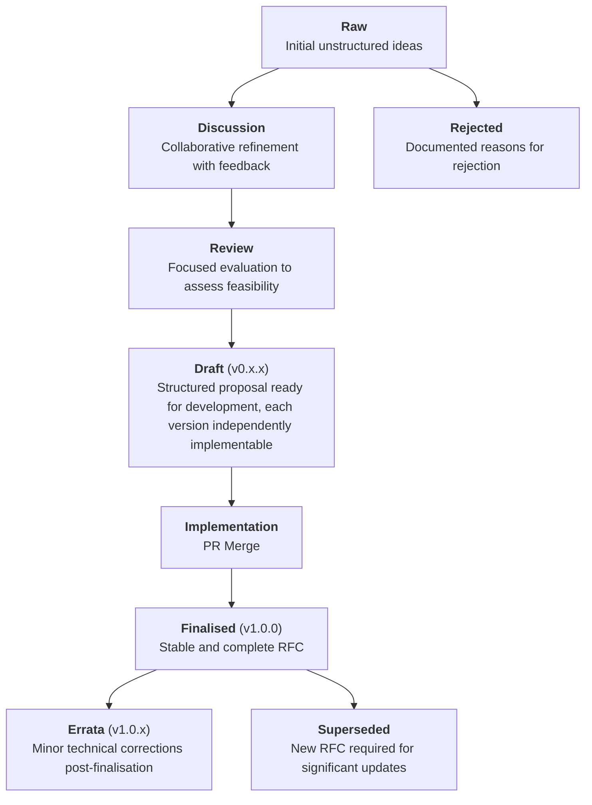

# RFC-0001: RFC Life Cycle, Process and Structure

- **RFC Number:** 0001
- **Title:** RFC Life Cycle, Process and Structure
- **Status:** Finalised
- **Author(s):** Qianchen Yu (@QYuQianchen), Tino Breddin (@tolbrino)
- **Created:** 2025-02-20
- **Updated:** 2025-08-20
- **Version:** v1.0.0 (Finalised)
- **Supersedes:** none
- **Related Links:** none

## 1. Abstract

This RFC defines the lifecycle, contribution process, versioning system, governance model, and document structure for RFCs within the HOPR
project. It specifies the stages RFCs progress through, along with the naming conventions, validation rules, and formatting standards that
MUST be followed to ensure consistency and clarity across all RFC submissions. The process ensures iterative development with feedback loops,
transparent updates via pull requests (PRs), and clear criteria for advancing through each stage.

## 2. Motivation

The HOPR project requires a clear and consistent process for managing technical proposals and documenting protocol architecture. A
well-defined lifecycle MUST be established and upheld to maintain coherence, ensure quality, streamline development, and provide clear
expectations for contributors. This process serves multiple purposes:

- **Quality assurance**: ensuring that RFCs undergo appropriate review and refinement before implementation
- **Transparency**: making the development process visible and accessible to all stakeholders
- **Version control**: tracking changes and maintaining compatibility across protocol versions  
- **Coordination**: allowing multiple contributors to work on related RFCs without conflicts or inconsistencies

## 3. Terminology

The key words "MUST", "MUST NOT", "REQUIRED", "SHALL", "SHALL NOT", "SHOULD", "SHOULD NOT", "RECOMMENDED", "MAY", and "OPTIONAL" in this document are
to be interpreted as described in [01].

**Draft**: an RFC is considered a draft from the moment it is proposed for review. A draft MUST include a clear summary, contextual background, and
initial technical details sufficient for evaluation. Drafts MUST follow the v0.x.x versioning scheme, with each version being independently reviewable
and, where appropriate, independently implementable. A draft version (v0.1.0) is assigned as soon as the first PR is created and the RFC number is
allocated.

## 4. Specification

### 4.1. RFC Life Cycle Stages

#### 4.1.1. Mermaid Diagram for RFC Life Cycle Stages



#### 4.1.2. Stage Descriptions

- **Raw:** The RFC MUST begin as a raw draft reflecting initial ideas. The draft MAY contain incomplete details but MUST provide a clear
  objective.
- **Discussion:** Upon submission of the initial PR, the RFC number and `v0.1.0` version are assigned. Feedback SHALL be gathered via PRs, with
  iterative updates reflected in version increments `(v0.x.x)`.
- **Review:** The RFC MUST undergo at least one review cycle. The draft SHOULD incorporate significant feedback and each iteration MUST be
  independently implementable.
- **Draft:** The RFC moves into active development and refinement. Each update SHALL increment the version (`v0.x.x`) to indicate progress.
- **Implementation:** Merging to the main branch signifies readiness for practical use, triggering the finalisation process.
- **Finalised:** The RFC is considered stable and complete, with version `v1.0.0` assigned. Only errata modifications are permitted afterwards.
- **Errata:** Minor technical corrections post-finalisation MUST be documented and result in a patch version increment (`v1.0.x`). Errata are
  technical corrections or factual updates made after an RFC has been finalised. They MUST NOT alter the intended functionality or introduce new
  features.
- **Superseded:** Significant updates requiring functionality changes MUST be documented in a new RFC, starting at `v2.0.0` or higher. The
  original RFC must include information that it has been superseded, accompanied by a link to the new RFC that supersedes it.
- **Rejected:** If an RFC does not progress past the discussion stage, the reasons MUST be documented.

### 4.2. File Structure

```plaintext
RFC-0001-rfc-life-cycle-process/
│
├── 0001-rfc-life-cycle-process.md
├── errata/
│   └── 0001-v1.0.1-erratum.md
└── assets/
    └── life-cycle-overview.png
```

---

### 4.3. Validation Rules

- The directory MUST be prefixed with uppercased "RFC", followed by its RFC number, and a succinct title all in lowercase joined by hyphens. E.g.,
  `RFC-0001-rfc-life-cycle-process`
- The main file MUST be prefixed with its RFC number and a succinct title all in lowercase joined by hyphens. E.g. `0001-rfc-life-cycle-process.md`
- All assets MUST reside in the `assets/` folder.
- Errata MUST reside in the `errata/` folder.

### 4.4. RFC Document Structure

All RFCs MUST follow a consistent document structure to ensure readability and maintainability.

#### 4.4.1. Metadata Preface

Every RFC MUST begin with the following metadata structure:

```markdown
# RFC-XXXX: [Title]

- **RFC Number:** XXXX
- **Title:** [Title in Title Case]
- **Status:** Raw | Discussion | Review | Draft | Implementation | Finalised | Errata | Rejected | Superseded
- **Author(s):** [Name (GitHub Handle)]
- **Created:** YYYY-MM-DD
- **Updated:** YYYY-MM-DD
- **Version:** vX.X.X (Status)
- **Supersedes:** RFC-YYYY (if applicable) | N/A
- **Related Links:** [RFC-XXXX](../RFC-XXXX-[slug]/XXXX-[slug].md) | none
```

#### 4.4.2. Reference Styles

RFCs MUST use two distinct reference styles:

##### 4.4.2.1. RFC-to-RFC References

- RFC references to other HOPR RFCs MUST be listed in the metadata's **Related Links:** field
- Format: `[RFC-XXXX](../RFC-XXXX-[slug]/XXXX-[slug].md)`
- Multiple references SHALL be separated by commas
- If no RFC references exist, the field MUST contain "none"
- Example:
  `[RFC-0002](../RFC-0002-mixnet-keywords/0002-mixnet-keywords.md), [RFC-0004](../RFC-0004-hopr-packet-protocol/0004-hopr-packet-protocol.md)`

##### 4.4.2.2. External References

- External references MUST be listed in a dedicated `## References` section at the end of the document
- References MUST use sequential numbering with zero-padding: [01], [02], etc.
- In-text citations MUST use the numbered format: "as described in [01]"
- References SHOULD be formatted in accordance with the following style, based on APA reference style with numeric labels in square brackets:
  ```
  [XX] Author(s). (Year). [Title](URL). _Publication_, Volume(Issue), pages.
  ```
- Example:
  ```
  [01] Chaum, D. (1981). [Untraceable Electronic Mail, Return Addresses, and Digital Pseudonyms](https://www.freehaven.net/anonbib/cache/chaum-mix.pdf). _Communications of the ACM, 24_(2), 84-90.
  ```

#### 4.4.3. Required Sections

All RFCs MUST include the following sections:

1. **Metadata Preface** (as defined in 4.4.1)
2. **Abstract** - Brief summary of the RFC's purpose and scope
3. **References** - External citations (if any)

#### 4.4.4. Terminology Formatting Standards

All RFCs MUST follow consistent terminology formatting to ensure clarity and professionalism:

- **Format**: Use bold with colons for term definitions: `**Term**: definition`
- **Capitalization**: Capitalize the first word of each term: `**Node**`, `**Relay node**`, `**Session protocol**`
- **Punctuation**: Always use colons after terms in definition lists
- **Consistency**: Apply the same formatting throughout each RFC and across all RFCs

Examples:
```
- **Node**: a process that implements the HOPR protocol and participates in the mixnet
- **Relay node**: a node that forwards messages from one node to another in the mixnet
- **Session protocol**: the protocol layer that provides reliable message delivery over HOPR packets
```

Incorrect examples:
```
- _Node_: (should use bold instead of italics)
- **Node**: (should capitalize first word)
- **Node** (should include colon)
- "Node": (should not use quotation marks)
```

## 5. Design Considerations

- Modular RFCs SHOULD be preferred.
- The PR system MUST be the primary mechanism for contribution, review, and errata handling.

## 6. Compatibility

- New RFCs MUST maintain backward compatibility unless explicitly stated.
- Errata MUST NOT introduce backward-incompatible changes.
- Breaking changes MUST be reflected in a major version increment (`v2.0.0`).

## 7. Security Considerations

- A security review phase MUST be completed before finalisation.
- Errata MUST undergo security review if impacting critical components.

## 8. Drawbacks

- Strict naming conventions MAY limit creative flexibility.

## 9. Alternatives

- Collaborative document editing tools, e.g., HackMD.

## 10. Unresolved Questions

- Handling emergency RFCs
- Enforcing cross-RFC dependencies
- Formal approval timeline for errata

## 11. Future Work

- Automated validation tools
- CI/CD integration for automated versioning and errata checks
- Web interface for publishing RFCs

## 12. References

[01] Bradner, S. (1997). [Key words for use in RFCs to Indicate Requirement Levels](https://datatracker.ietf.org/doc/html/rfc2119). _IETF RFC 2119_.

[02] [RFC Editor Style Guide](https://www.rfc-editor.org/styleguide/). RFC Editor.

[03] [Rust RFC Process](https://github.com/rust-lang/rfcs). Rust Language Team.

[04] [ZeroMQ RFC Process](https://rfc.zeromq.org). ZeroMQ Community.

[05] [VACP2P RFC Index](https://github.com/vacp2p/rfc-index). Vac Research.
