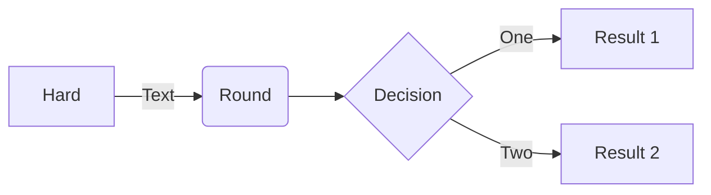

# RFC-0002: Common mixnet terms and keywords

- **RFC Number:** 0002
- **Title:** Common mixnet terms and keywords
- **Status:** Raw
- **Author(s):** \<Tino Breddin (tolbrino)\>
- **Created:** \<2025-04-01\>
- **Updated:** \<2025-04-01\>
- **Version:** v0.0.1 (Raw)
- **Supersedes:** none
- **References:** none

## Abstract

Provide a brief and clear summary of the RFC, outlining its purpose, context, and scope.

## Motivation

Explain the problem this RFC aims to solve.
Discuss existing limitations, technical gaps, and why the proposed solution is necessary.

## Terminology

Define key terms, abbreviations, and domain-specific language used throughout the RFC.

NOTE: This is a pre-liminary list of terms and keywords. It will be updated as
the RFC evolves.

## Specification

Comprehensive description of the proposed solution, including:

- Protocol overview
- Technical details (data formats, APIs, endpoints)
- Supported use cases
- Diagrams (stored in `assets/` and referenced as ``)

## Design Considerations

Discuss critical design decisions, trade-offs, and justification for chosen approaches over alternatives.

## Compatibility

Address backward compatibility, migration paths, and impact on existing systems.

## Security Considerations

Identify potential security risks, threat models, and mitigation strategies.

## Drawbacks

Discuss potential downsides, risks, or limitations associated with the proposed solution.

## Alternatives

Outline alternative approaches that were considered and reasons for their rejection.

## Unresolved Questions

Highlight questions or issues that remain open for discussion.

## Future Work

Suggest potential areas for future exploration, enhancements, or iterations.

## References

Include all relevant references, such as:

- Other RFCs
- Research papers
- External documentation
