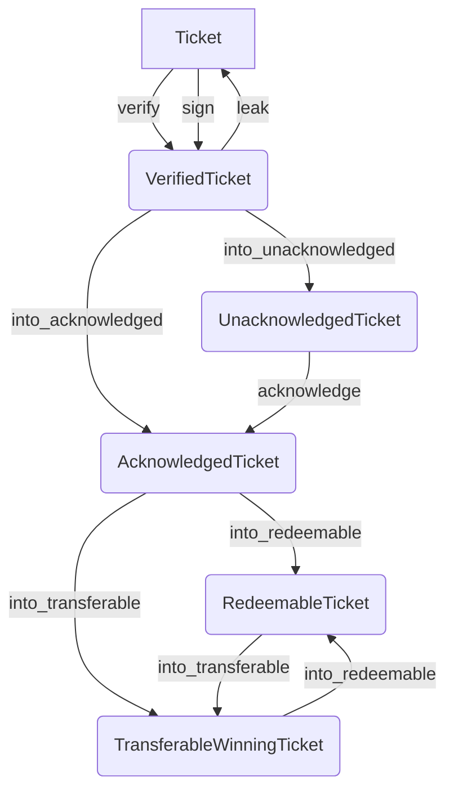

# RFC-0004: Proof of Relay

- **RFC Number:** 0004  
- **Title:** Proof of Relay 
- **Status:** Implementation
- **Author(s):** Lukas Pohanka (@NumberFour8), Qianchen Yu (@QYuQianchen)
- **Created:** 2025/04/02  
- **Updated:** 2025/08/22  
- **Version:** v1.0.0 (Finalized)  
- **Supersedes:** N/A
- **References:** [RFC-0002](../RFC-0002-mixnet-keywords/0002-mixnet-keywords.md), [RFC-0003](../RFC-0003-hopr-packet-protocol/0003-hopr-packet-protocol.md)

## Abstract

This RFC describes the structures and protocol for establishing a Proof of Relay (PoR) of HOPR packets
sent between two peers over a relay. In addition, such PoR can be used to unlock incentives for the node
relaying the packets to the destination.

## 1 Motivation

This RFC aims to solve the assurance of packet delivery between two peers inside a mixnet.
In particular, when data are sent from a sender (peer A), using
node B as a relay node, to deliver packet to the destination node C, the assurance is established
that:

1. node A has guarantees that node B delivered A's packets to node C
2. after successful relaying to C, node B posseses a cryptographic proof of the delivery
3. node B can use such proof to claim a reward from node A
4. the identity of node A is not revealed to node C


## 2 Terminology

This document builds upon standard terminology established in RFC-0002. Mentions to "HOPR packets" or
"mixnet packets" refer to a particular structure (`HOPR_Packet`) defined in RFC-0003.


In addition, this document also uses the following terms:

- **Channel (or Payment channel)**: a unidirectional directed relation of two parties (source node and destination node) that holds a monetary balance, that can be paid out by source to the destination, if certain conditions are met.

- **Ticket**: a structure that holds cryptographic material allowing probabilistic fund transfer within the Payment channel.

- **MIN_USED_BALANCE**: Minimum HOPR token values used in funding (including opening) channels and in redeeming tickets. Its default value is `1e-18` HOPR.
- **MAX_USED_BALANCE**: Maximum HOPR token values used in funding (including opening) channels and in redeeming tickets. Its default value is `1e7` HOPR.
- **VERSION**: Current version of the ledger that stores channel states. For hoprd v3.0, the version is "2.0.0".
- **domainSeparator**: To prevent replay attacks across different domains (e.g., contracts, chains) where the ledger that stores channel states MAY be deployed, all cryptographic signatures in the HOPR protocol are bound to a specific execution context using a domain separator.
- **chainId**: The chainId is a unique identifier for the ledger that stores channel states MAY be deployed.
- **Notice period (T_closure)**: Minimum elaspe required for an outgoing channel to transit from `PENDING_TO_CLOSE` to `CLOSED`

The above terms are formally defined in the following sections.

The key words "MUST", "MUST NOT", "REQUIRED", "SHALL", "SHALL NOT", "SHOULD", "SHOULD NOT", "RECOMMENDED",
"MAY", and "OPTIONAL" in this document are to be interpreted as described
in [IETF RFC 2119](https://datatracker.ietf.org/doc/html/rfc2119).

### 2.1 Cryptographic and security parameters

The documents make use of certain cryptographic and mathematical terms. A security parameter `L` is chosen
and corresponding cryptographic primitives are used in a concrete instantiations of this RFC.
The speficic instantiation of the current version of this protocol is given in Appendix 1.

The security parameter `L` SHALL NOT be less than 2^128 - meaning the chosen cryptographic primitives
instantiations below SHALL NOT have less than 128-bits of security.

- **EC group** refers to a specific elliptic curve `E` group over a finite field, where computational Diffie-Hellman problem is AT LEAST as
difficult as the chosen security parameter `L`. The elements of the field are denoted using lower-case letter, whereas the elements (also referred to as elliptic curve points, or EC points) of the EC group are denoted using upper-case letters.
- **MUL(a,B) (or simply a.B)** represents a multiplication of an EC point `B` by a scalar `a` from the corresponding finite field.
- **ADD(A,B)** represents an addition of two EC points `A` and `B` from the corresponding finite field.
- **Public key** refers to a non-identity EC group element (or its equivalent) of a large order.
- **Private key** refers to a scalar from a finite field of the chosen EC group. It represents a private key for a certain public key.
- **Hash `H(x)`** refers to a cryptographic hash function taking an input of any size, and returning a fixed length output. Security of `H`
against cryptographic attacks SHALL NOT be less than `L`.
- **Verifiable Random Function (VRF)** produces a pseudo-random value that is publicly verifiable but cannot be forged or precomputed.

Nodes and clients MUST implement handling for each of the above to ensure compliance and fault tolerance within the HOPR PoR protocol.

The concrete choices of the above cryptographic primitives for the implementation of version 1.0 are given in Appendix 1.

## 3 Payment channels

Let A, B and C be peers participating in the mixnet. Each node is in possesion of its own private key (`Kpriv_A`, `Kpriv_B`, `Kpriv_C`)
and the corresponding public key (`P_A`, `P_B`, `P_C`). The public keys of participating nodes are publicly exposed.

The public keys MUST be from an elliptic curve cryptosystem represented by an elliptic curve `E`.

Assume that node A wishes to communicate with node C, using node B as a relay.
Node A then opens a logical payment channel with node B (denoted A -> B), staking some funds into this channel. 
Such channel will hold the current balance and additional state information shared between A and B and is strictly directed in the direction A -> B.

For the purpose of this RFC, the amount of funds MUST be strictly greater than 0 and MUST be strictly less than 2^96.

There MUST NOT be more than a single payment channel between any two nodes A and B in this direction. Since
channel is uni-directional, there MAY BE channel A -> B and also B -> A at the same time.

Each channel has a unique channel ID, typically deterministic. 
The channel ID of the channel A -> B MAY be computed as a truncated version of `H(f(P_A)||f(P_B))` for efficient representation, where `||` stands for byte-wise concatenation.

The channel MUST always be in one of the 3 logical states:

1. Open
2. Pending to close
3. Closed


Such state can be described using `ChannelStatus` enumeration:

````
ChannelStatus { OPEN, PENDING_TO_CLOSE, CLOSED }
````

There is a structure called `Channel` that MUST contain at least the following fields:

1. `source`: public key of the source node (A in this case)
2. `destination`: public key of the destination node (beneficiary, B in this case)
3. `balance` : an unsigned 96-bit non-zero integer
4. `ticket_index`: an unsigned 48-bit integer
5. `channel_epoch`: an unsigned 24-bit non-zero integer
6. `status`: one of the `ChannelStatus` values


````
Channel {
	source: [u8; |P_A|],
	destination: [u8; |P_B|],
	balance: [u8; 12]
	ticket_index: [u8; 6]
	channel_epoch: [u8; 3]
	status: ChannelStatus
}
````

Such structure is sufficient to describe the payment channel A -> B.

Channels are uniquely identified by a `H(source || destination`.
Byte-string of a fixed length representing the output of this hash function is called `ChannelId` in this context.

### 3.1 Payment channel life-cycle

A payment channel between nodes A -> B MUST always be initiated by node A. It MUST be initialized with a non-zero `balance`,
a `ticket_index` equal to `0`, `channel_epoch` equal to `1` and `status` equal to `Open`.
To prevent spamming, the funding `balance` MUST be larger than `MIN_USED_BALANCE` and smaller than `MAX_USED_BALANCE`.

In such state, the node A is allowed communicate with node C via B and the node B can claim certain fixed amounts of `balance` to be paid out to it in return - as a reward for the relaying work. This will described in the later sections.

At any point in time, the channel initiator A can initiate a closure of the channel A -> B. Such transition MUST change
the `status` field to `PENDING_TO_CLOSE` and this change MUST be communicated to B.
In such state, the node A MUST NOT be allowed to communicate with C via B, but B MUST be allowed to still claim any unclaimed rewards from the channel. However, B MUST NOT be allowed to claim any rewards after a certain period `T_closure` has elapsed since the state transition.

After each claim is done by B, the `ticket_index` field MUST be incremented by 1, and such change MUST be communicated to both A and B.
The increment MAY be done by an independent trusted third party supervising the reward claims.

The initiator A SHALL transition the channel state to `CLOSED` (changing the `status` to `CLOSED`). Such transition MUST NOT be possible
before `T_closure` has elapsed. The transition MUST be communicated to B.
In such state, the node A MUST NOT be allowed to communicate with C via B, and B MUST NOT be allowed to claim any unclaimed
rewards from the channel. 
The `balance` in the channel A -> B MUST be reset to `0` and its `channel_epoch` MUST be incremented by `1`.

At any point of time when the channel is at the state other than `CLOSED`, the channel destination B MAY unilaterally transition the 
channel A -> B to state `CLOSED`. 
Node B SHALL claim unclaimed rewards before the state transition, because any unclaimed rewards becomes unclaimable after
the state transit, resulting a lost for node B.
To prevent spamming, the reward amount MUST be larger than `MIN_USED_BALANCE` and smaller than `MAX_USED_BALANCE`.


## 4 Ticket

Tickets are always created by a node that is the source (`A`) of an existing channel. It is created whenever `A` wishes to send a HOPR packet to a certain destination (`C`), while having the
existing channel's destination (`B`) act as a relay.

Their creation MAY happen at the same time as the HOPR packet, or MAY be precomputed in advance when usage of a certain path is known in-prior.

A Ticket:
1. MUST be tied (via a cryptographic challenge) to a single HOPR packet (from RFC-0003)
2. the cryptographic challenge MUST be solvable by the ticket recipient (`B`) once it delivers the corresponding HOPR packet to `C`
3. the solution of the cryptographic challenge MAY unlock a reward for ticket's recipient `B` at expense of `A`
4. MUST NOT contain information about packet's destination (`C`)

### 4.1 Ticket structure encoding

The Ticket has the following structure:

```
Ticket {
	channel_id: ChannelId,
	amount: u96,
	index: u48,
	index_offset: u32,
	encoded_win_prob: [u8; 7],
	channel_epoch: u24,
	challenge: ECPoint,
	signature: ECDSASignature
}
```

All multi-byte unsigned integers MUST use the big-endian encoding when serialized.

The `ECPoint` is an encoding of an Elliptic curve point on the chosen curve `E` that corresponds to a cryptographic challenge.
Such challenge is later solved by the ticket recipient once it forwards the attached packet to the next downstream node.

The encoding (for serialization) of the `ECPoint` MUST be unique and MAY be irreversible, in a sense, 
that the original elliptic point on the curve `E` is not recoverable, but the encoding uniquely identifies the said point.

The `ECDSASignature` MUST use the [ERC-2098 encoding](https://eips.ethereum.org/EIPS/eip-2098), the public key recovery bit is stored
in the most significant bit of the `s` value (which is guaranteed to be unused). Both `r` and `s` use big-endian encoding when serialized.

```
ECDSASignature {
	r: u256
	s: u256
}
```

The ECDSA signature of the ticket MUST be computed over the hash `H_ticket`, which is computed from the `Ticket` fields and
a domain separator `dst` as follows:

```
H_1 = H(channel_id || amount || index || index_offset || channel_epoch || encoded_win_prob || challenge)
H_2 = H(0xfcb7796f00000000000000000000000000000000000000000000000000000000 || H_1)`
H_ticket = H(0x1901 || dst || H_2)
```

The `Ticket` signature MUST be done over the same elliptic curve `E` using the private key of the ticket creator (issuer).


### 4.2 Construction of Proof-of-Relay (PoR) secrets

This section uses terms defined in Section 2.2 in RFC-0003, namely the `SharedSecret_i` generated for `i`-th node
on the path (`i` ranges from 0 (sender node) up to `n`  (destination node), i.e. `n` is equal to the path length).
Note, that for 0-hop path (a direct packet from sender to destination), `n` = 1.


In the PoR mechanism, a cryptographic secret is established between relay nodes and their adjacent nodes on the route.

Upon packet creation, the Sender node creates two structures:
1. the list of `ProofOfRelayString_i` for each `i`-th node on the path for i > 0 up to `n-1`. For `n=1`, the list will be empty
2. the `ProofOfRelayValues` structure


Each `ProofOfRelayString_i` contains the `challenge` for the ticket for node the `i+1`-th and the `hint` value fort the same node.
The `hint` value is later used by the `i+1`-th node to validate that the `challenge` is not bogus, before it delivers the packet
to the next hop. 

Due to this later verification, the `hint` MUST use an encoding useful for EC group computations on `E` (here denoted as `RawECPoint`).

```
ProofOfRelayString_i {
	challenge: ECPoint,
	hint: RawECPoint
}
```

The `ProofOfRelayValues` structure contains the `challenge` and `hint` to the first relayer on the path, plus
it MUST contain information about the path length. This information is later used to set the correct price
of the first ticket. 

Path length MUST be always less than 4 (i.e. maximum 3 hops).

```
ProofOfRelayValues {
	challenge: ECPoint,
	hint: RawECPoint,
	path_len: u8
}
```

#### 4.2.1 Creation of Proof of Relay strings and values

Let `HS` be the Hash to Field operation defined in RFC-0003 over the field of the chosen `E`.

The generation process of `ProofOfRelayString_i` proceeds as follows for each `i` from 0 to `n-1` :


1. The `SharedKey_i+1_ack` is derived from the shared secret (`SharedSecret_i`) provided during the HOPR packet construction. 
`SharedKey_i+1_ack` denotes the secret acknowledgement key for the next downstream node (`i+1`).


  - if `i` < `n` : `SharedKey_i+1_ack = HS(SharedKey_i, "HASH_KEY_ACK_KEY")`
  - if `i` = `n` : the `SharedKey_i+1_ack` MUST be generated as a uniformly random byte-string with the byte-length
of `E`'s field elements.


2. The own shared secret `SharedKey_i_own` from `SharedSecret_i` is generated as:

`SharedKey_i_own = HS(SharedKey_i, "HASH_KEY_OWN_KEY")`

3. The `hint` value is computed:
	- if `i` = 0: `hint = HS(SharedKey_0, "HASH_KEY_ACK_KEY`)
	- if `i` > 0: `hint = SharedKey_i+1_ack` (from step 1) 

4. For `i` > 0, the `ProofOfRelayString_i` is composed and added to the list:

  - `challenge` is computed as: `challenge = MUL(SharedKey_i_own + SharedKey_i+1_ack, G)` and encoded as `ECPoint`
  - `hint` is used from step 3.

5. For `i` = 0, the `ProofOfRelayValues` is created:
	- `challenge` is computed as: `challenge = MUL(SharedKey_i_own + SharedKey_i+1_ack, G)` and encoded as `ECPoint`
  - `hint` is used from step 3.
  - `path_length` is set to `n`


## 4.3 Creation of the ticket for the first relayer

The first ticket MUST be created by the packet Sender and MUST contain the `challenge` field equal
to the `challenge` in the `ProofOfRelayValues` from the previous step.

The `Ticket` structure is then complete and MUST be signed by the Sender, who MUST be always the first ticket's issuer.


As described in Section 2.5 in RFC-0003, the encoded `Ticket` structure becomes part of the `HOPR_Packet`.

## 4.4 Ticket processing at a node

This is inherently part of the packet processing process from the RFC-0003.
Once a node receives a `HOPR_Packet` structure, the `Ticket` is separated and its processing is a two step process:

1. The ticket is pre-verified (this is already mentioned in section 4.4 of RFC 0003).
2. If the packet is to be forwarded to a next node, the ticket MUST be verified and replaced with a new ticket
for the next node.

### 4.4.1 Ticket pre-verification

If the extracted `Ticket` structure cannot be deserialized, the corresponding packet MUST be discarded.

At this point, the node knows its `SharedSecret_i` with which it is able to decrypt the `HOPR_Packet` and
the `ProofOfRelayString_i` has already been extracted from the packet header (see section 4.2 in RFC-0003).

1. `SharedSecret_i` is used to compute `SharedSecret_i+1_ack` as defined in Section 4.2.1.
2. 
3. 


The `challenge` from the `Ticket` structure is extracted along with 

### 4.4.2 Ticket validation and replacement 

### 4.2.3 Ticket acknowledgement


## 5 Ticket and Channel interactions

### 5.1 Probablistic winning tickets

Probabilistic Payment Channels leverage probabilistic micropayments, reducing the number of on-chain transactions.
Payments are structured so that only a fraction (probability) results in an actual on-chain transfer, whereas most payments remain off-chain, 
significantly reducing transaction fees and maintaining privacy.

Probabilistic tickets issued between nodes have a consistent payout and do not require sequential processing or frequent on-chain operations.
The ticket winning probability is determined based on the anticipated throughput of the channel, allowing nodes with higher traffic 
to use lower winning probabilities and those with lower traffic to select probabilities closer to 1.
Both ticket issuer and receiver MUST NOT know the outcome (winning or losing) of the ticket before redemption to maintain fairness.

A ticket is a winner if:
```
keccak256(ticketHash || porSecret || vrfParams) < ticket.winProb
```
where
- `ticketHash` is the hash of the received ticket, known by both ticket issuer and recipient. 
- The `porSecret` is known by the ticket issuer and can be reconstructed by the ticket recipient as part of the PoR scheme upon receiving the acknowledgment for the forwarded ticket, as detailed in the next section. 
- The `vrfParams` refers to the deterministic pseudo-random value that is chosen by the ticket recipient, and is verifiable by using its public key. This value is unique for each ticket and adds entropy that can only be known by the ticket redeemer.

If the ticket is not a win, it MUST NOT be submitted on-chain.
If the ticket is a win, the ticket MAY be submitted using `RedeemableTicket` with matching VRF parameters.


### 5.2 Verify winning tickets with VRF

The VRF verification algorithm for ticket validation is:

1. Compute `ticketHash` from the received ticket.
2. Generate pseudo-random curve point (`bX`, `bY`):
```
(bX, bY) = hashToCurve(signer || ticketHash, domainSeparator)
```
where the `domainSeparator` is calculated as:
```
domainSeparator = keccak256(
  abi.encode(
    keccak256("EIP712Domain(string name,string version,uint256 chainId,address verifyingContract)"),
    keccak256(bytes("HoprChannels")),
    keccak256(bytes(VERSION)),
    chainId,
    address(this)
  )
)
```

3. Execute elliptic curve operations:
```
sB = scalarMult(s, bX, bY)
hV = scalarMult(h, vx, vy)
R = sB - hV
```
Compute verification scalar (`hCheck`):
```
hCheck = hashToScalar(signer || vx || vy || Rx || Ry || ticketHash, domainSeparator)
```
Validate VRF proof by ensuring: `hCheck == h`

Upon successful on-chain redemption of a **RedeemableTicket**:

* The spending channel’s `ticketIndex` MUST advance by `index_offset`.
* The spending channel’s `balance` MUST decrease by `amount`.
* If the counter-channel (earning channel) exists and is open, its `balance` MUST increase by `amount`; otherwise, the contract MUST transfer tokens to the redeemer.
* The redemption MUST fail if the channel is not `OPEN` or `PENDING_TO_CLOSE`, epoch mismatches, the aggregated interval is invalid, the balance is insufficient, the ticket is not a win, the VRF proof is invalid, or the signature does not match the channel.


## Appendix 1

The current implementation of the Proof of Relay protocol (which is in correspondence with the HOPR Packet protocol from RFC-0003):
- Hash function `H` is Keccak256
- Elliptic curve `E` is chosen as secp256k1
- HS is instantiated via `hash_to_field` using `secp256k1_XMD:SHA3-256_SSWU_RO_` as defined in [RFC-9380](https://www.rfc-editor.org/info/rfc9380)
- The one-way encoding `ECPoint` is done as `Keccak256(P)` where `P` denotes secp256k1 point in compressed form. The output of the hash is truncated to 20 bytes.

## Appendix 2

This appendix describes the ticket states which are implementation specific for the current Proof Of Relay implementation
as part of the HOPR protocol.


* **Ticket** (unsigned or signed, but not yet verified)

  * Contains all ticket fields (channel\_id, amount, index, index\_offset, winProb, channel\_epoch, challenge, signature).
  * A Ticket without a signature MUST NOT be accepted by peers and MUST NOT be transmitted except for internal construction.

* **VerifiedTicket** (signed and verified)

  * The signature MUST verify against `get_hash(domainSeparator)` and recover the ticket issuer’s address.
  * `verified_hash` MUST equal `Ticket::get_hash(domainSeparator)`; `verified_issuer` MUST equal the recovered signer.

* **UnacknowledgedTicket** (VerifiedTicket + own half-key)

  * Produced when the recipient binds its own PoR half-key to the VerifiedTicket while waiting for the downstream acknowledgement.

* **AcknowledgedTicket** (VerifiedTicket + PoR response)

  * Produced once the recipient learns the downstream half-key and reconstructs `Response`.
  * Carries a **status** that indicates off-chain processing intent:

    * `Untouched` (default): neither aggregated nor sent for redemption.
    * `BeingRedeemed`: currently submitted for on-chain redemption.
    * `BeingAggregated`: currently included in an off-chain aggregation flow.

* **RedeemableTicket** (winning, issuer-verified, VRF-bound)

  * Produced from an AcknowledgedTicket by attaching VRF parameters derived with the redeemer’s chain key and the `domainSeparator`.
  * A RedeemableTicket MUST be suitable for on-chain submission.

* **TransferableWinningTicket** (wire format for aggregation/transfer)

  * A compact, verifiable representation of a **winning** ticket intended for off-chain aggregation.

### Allowed transitions



1. `Ticket --sign--> VerifiedTicket`

   * Pre-conditions:

     * Ticket MUST include all mandatory fields and satisfy bounds (amount ≤ 10^25; index ≤ 2^48; index\_offset ≥ 1; channel\_epoch ≤ 2^24).
   * Post-conditions:

     * A valid ECDSA signature over `get_hash(domainSeparator)` is attached.

2. `Ticket --verify(issuer, domainSeparator)--> VerifiedTicket`

   * MUST recover `issuer` from `signature` over `get_hash(domainSeparator)`.
   * On failure, verification MUST be rejected.

3. `VerifiedTicket --into_unacknowledged(own_key)--> UnacknowledgedTicket`

   * Binds the recipient’s PoR half-key. No additional checks REQUIRED.

4. `UnacknowledgedTicket --acknowledge(ack_key)--> AcknowledgedTicket`

   * Compute `Response = combine(own_key, ack_key)`.
   * The derived challenge `Response.to_challenge()` MUST equal `ticket.challenge`.
   * On mismatch, the transition MUST fail with `InvalidChallenge` and the ticket MUST remain unacknowledged.

5. `AcknowledgedTicket(Untouched) --into_redeemable(chain_keypair, domainSeparator)--> RedeemableTicket`

   * The caller (redeemer) MUST NOT be the ticket issuer (Loopback prevention).
   * Derive VRF parameters over `(verified_hash, redeemer, domainSeparator)`.
   * The resulting RedeemableTicket MAY be submitted on-chain if winning (see §3).

6. `AcknowledgedTicket(Untouched) --into_transferable(chain_keypair, domainSeparator)--> TransferableWinningTicket`

   * Equivalent to `into_redeemable` followed by conversion to transferable form; retains VRF and response.

7. `TransferableWinningTicket --into_redeemable(expected_issuer, domainSeparator)--> RedeemableTicket`

   * MUST verify: `signer == expected_issuer` and the embedded signature over `get_hash(domainSeparator)`.
   * MUST recompute “win” locally (see §3). On failure, MUST reject.

8. `VerifiedTicket --leak()--> Ticket`

   * Debug/escape hatch only. Implementations SHOULD avoid downgrading state in production flows.

## References

Include all relevant references, such as:

- Other RFCs: RFC-0003 HOPR Packet Protocol
- External documentation: Coefficients used for simplified SWU mapping used by the hash to curve function: https://www.ietf.org/archive/id/draft-irtf-cfrg-hash-to-curve-16.html#name-suites-for-secp256k1
