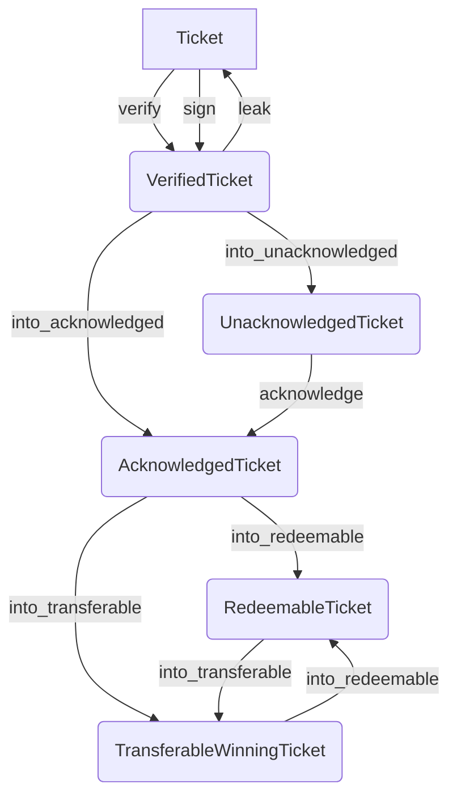

# RFC-0004: Proof of Relay

- **RFC Number:** 0004
- **Title:** Proof of Relay
- **Status:** Implementation
- **Author(s):** Lukas Pohanka (@NumberFour8), Qianchen Yu (@QYuQianchen)
- **Created:** 2025/04/02
- **Updated:** 2025/08/28
- **Version:** v0.9.0 (Draft)
- **Supersedes:** N/A
- **References:** [RFC-0002](../RFC-0002-mixnet-keywords/0002-mixnet-keywords.md), [RFC-0003](../RFC-0003-hopr-packet-protocol/0003-hopr-packet-protocol.md)

## Abstract

This RFC describes the structures and protocol for establishing a Proof of Relay (PoR) of HOPR packets
sent between two peers over a relay. In addition, such PoR can be used to unlock incentives for the node
relaying the packets to the destination.

## 1 Motivation

This RFC aims to solve the assurance of packet delivery between two peers inside a mixnet.
In particular, when data are sent from a sender (peer A) using
node B as a relay node to deliver the packet to the destination node C, the assurance is established
that:

1. node A has guarantees that node B delivered A's packets to node C
2. after successful relaying to C, node B possesses a cryptographic proof of the delivery
3. node B can use such proof to claim a reward from node A
4. the identity of node A is not revealed to node C

## 2 Terminology

This document builds upon standard terminology established in RFC-0002. Mentions to "HOPR packets" or
"mixnet packets" refer to a particular structure (`HOPR_Packet`) defined in RFC-0003.

In addition, this document also uses the following terms:

- **Channel (or Payment channel)**: a unidirectional directed relation of two parties (source node and destination node) that holds a monetary balance, that can be paid out by source to the destination, if certain conditions are met.
- **Ticket**: a structure that holds cryptographic material allowing probabilistic fund transfer within the Payment channel.
- **domainSeparator**: To prevent replay attacks across different domains (e.g., contracts, chains) where the ledger that stores channel states MAY be deployed, all cryptographic signatures in the HOPR protocol are bound to a specific execution context using a domain separator.
- **Notice period (T_closure)**: Minimum elapsed time required for an outgoing channel to transit from `PENDING_TO_CLOSE` to `CLOSED`

The above terms are formally defined in the following sections.

The key words "MUST", "MUST NOT", "REQUIRED", "SHALL", "SHALL NOT", "SHOULD", "SHOULD NOT", "RECOMMENDED",
"MAY", and "OPTIONAL" in this document are to be interpreted as described
in [IETF RFC 2119](https://datatracker.ietf.org/doc/html/rfc2119).

### 2.1 Cryptographic and security parameters

This document makes use of certain cryptographic and mathematical terms. A security parameter `L` is chosen,
and corresponding cryptographic primitives are used in a concrete instantiation of this RFC.
The specific instantiation of the current version of this protocol is given in Appendix 1.

The security parameter `L` SHALL NOT be less than 2^128 - meaning the chosen cryptographic primitives
instantiations below SHALL NOT have less than 128-bits of security.

- **EC group** refers to a specific elliptic curve `E` group over a finite field, where computational Diffie-Hellman problem is AT LEAST as
  difficult as the chosen security parameter `L`. The elements of the field are denoted using lower-case letter, whereas the elements (also referred to as elliptic curve points, or EC points) of the EC group are denoted using upper-case letters.
- **MUL(a,B)** represents a multiplication of an EC point `B` by a scalar `a` from the corresponding finite field.
- **ADD(A,B)** represents an addition of two EC points `A` and `B` from the corresponding finite field.
- **Public key** refers to a non-identity EC group element (or its equivalent) of a large order.
- **Private key** refers to a scalar from a finite field of the chosen EC group. It represents a private key for a certain public key.
- **Hash `H(x)`** refers to a cryptographic hash function taking an input of any size, and returning a fixed length output. Security of `H`
  against cryptographic attacks SHALL NOT be less than `L`.
- **Verifiable Random Function (VRF)** produces a pseudo-random value that is publicly verifiable but cannot be forged or precomputed.

Nodes and clients MUST implement handling for each of the above to ensure compliance and fault tolerance within the HOPR PoR protocol.

The concrete choices of the above cryptographic primitives for the implementation of version 1.0 are given in Appendix 1.

## 3 Payment channels

Let A, B and C be peers participating in the mixnet. Each node is in possesion of its own private key (`Kpriv_A`, `Kpriv_B`, `Kpriv_C`)
and the corresponding public key (`P_A`, `P_B`, `P_C`). The public keys of participating nodes are publicly exposed.

The public keys MUST be from an elliptic curve cryptosystem represented by an elliptic curve `E`.

Assume that node A wishes to communicate with node C, using node B as a relay.
Node A then opens a logical payment channel with node B (denoted A -> B), staking some funds into this channel.
Such channel will hold the current balance and additional state information shared between A and B and is strictly directed in the direction A -> B.

For the purpose of this RFC, the amount of funds MUST be strictly greater than 0 and MUST be strictly less than 2^96.

There MUST NOT be more than a single payment channel between any two nodes A and B in this direction. Since
channel is uni-directional, there MAY BE channel A -> B and also B -> A at the same time.

Each channel has a unique, deterministic identifier, which is channel ID.
The channel ID for A → B MUST be computed as:
`channel_id = H(f(P_A)||f(P_B))`
where `||` stands for byte-wise concatenation. This construction is directional (A first, then B).

The channel MUST always be in one of the 3 logical states:

1. Open
2. Pending to close
3. Closed

Such state can be described using `ChannelStatus` enumeration:

```
ChannelStatus { OPEN, PENDING_TO_CLOSE, CLOSED }
```

There is a structure called `Channel` that MUST contain at least the following fields:

1. `source`: public key of the source node (A in this case)
2. `destination`: public key of the destination node (beneficiary, B in this case)
3. `balance` : an unsigned 96-bit integer
4. `ticket_index`: an unsigned 48-bit integer
5. `channel_epoch`: an unsigned 24-bit non-zero integer
6. `status`: one of the `ChannelStatus` values

```
Channel {
	source: [u8; |P_A|],
	destination: [u8; |P_B|],
	balance: u96,
	ticket_index: u48,
	channel_epoch: u24,
	status: ChannelStatus
}
```

Such structure is sufficient to describe the payment channel A -> B.

Channels are uniquely identified by the `channel_id` above. The fixed‑length byte string returned by the function is called `ChannelId`.

### 3.1 Payment channel life-cycle

A payment channel between nodes A -> B MUST always be initiated by node A. It MUST be initialized with a non-zero `balance`,
a `ticket_index` equal to `0`, `channel_epoch` equal to `1` and `status` equal to `Open`.
To prevent spamming, the funding `balance` MUST be larger than `MIN_USED_BALANCE` and smaller than `MAX_USED_BALANCE`.

In such state, the node A is allowed communicate with node C via B and the node B can claim certain fixed amounts of `balance` to be paid out to it in return - as a reward for the relaying work. This will described in the later sections.

At any point in time, the channel initiator A can initiate a closure of the channel A -> B. Such transition MUST change
the `status` field to `PENDING_TO_CLOSE` and this change MUST be communicated to B.
In such state, the node A MUST NOT be allowed to communicate with C via B, but B MUST be allowed to still claim any unclaimed rewards from the channel.
However, B MUST NOT be allowed to claim any rewards after `T_closure` has elapsed since the transition to PENDING_TO_CLOSE.
`T_closure` MUST be measured in block timestamps, and both parties MUST derive it from the same source.

After each claim is done by B, the `ticket_index` field MUST be incremented by 1, and such change MUST be communicated to both A and B.
The increment MAY be done by an independent trusted third party supervising the reward claims.

The initiator A SHALL transition the channel state to `CLOSED` (changing the `status` to `CLOSED`). Such transition MUST NOT be possible
before `T_closure` has elapsed. The transition MUST be communicated to B.
In such state, the node A MUST NOT be allowed to communicate with C via B, and B MUST NOT be allowed to claim any unclaimed
rewards from the channel.
The `balance` in the channel A -> B MUST be reset to `0` and its `channel_epoch` MUST be incremented by `1`.

At any point of time when the channel is at the state other than `CLOSED`, the channel destination B MAY unilaterally transition the
channel A -> B to state `CLOSED`.
Node B SHALL claim unclaimed rewards before the state transition, because any unclaimed rewards becomes unclaimable after
the state transit, resulting a lost for node B.
To prevent spamming, the reward amount MUST be larger than `MIN_USED_BALANCE` and smaller than `MAX_USED_BALANCE`.

## 4 Tickets

Tickets are always created by a node that is the source (`A`) of an existing channel. It is created whenever `A` wishes to send a HOPR packet to a certain destination (`C`), while having the
existing channel's destination (`B`) act as a relay.

Their creation MAY happen at the same time as the HOPR packet, or MAY be precomputed in advance when usage of a certain path is known in-prior.

A Ticket:

1. MUST be tied (via a cryptographic challenge) to a single HOPR packet (from RFC-0003)
2. the cryptographic challenge MUST be solvable by the ticket recipient (`B`) once it delivers the corresponding HOPR packet to `C`
3. the solution of the cryptographic challenge MAY unlock a reward for ticket's recipient `B` at expense of `A`
4. MUST NOT contain information about packet's destination (`C`)

### 4.1 Ticket structure encoding

The Ticket has the following structure:

```
Ticket {
	channel_id: ChannelId,
	amount: u96,
	index: u48,
	index_offset: u32,
	encoded_win_prob: u56,
	channel_epoch: u24,
	challenge: ECPoint,
	signature: ECDSASignature
}
```

All multi-byte unsigned integers MUST use the big-endian encoding when serialized.

The `ECPoint` is an encoding of an Elliptic curve point on the chosen curve `E` that corresponds to a cryptographic challenge.
Such challenge is later solved by the ticket recipient once it forwards the attached packet to the next downstream node.

The encoding (for serialization) of the `ECPoint` MUST be unique and MAY be irreversible, in a sense,
that the original elliptic point on the curve `E` is not recoverable, but the encoding uniquely identifies the said point.

The `ECDSASignature` SHOULD use the [ERC-2098 encoding](https://eips.ethereum.org/EIPS/eip-2098), the public key recovery bit is stored
in the most significant bit of the `s` value (which is guaranteed to be unused). Both `r` and `s` use big-endian encoding when serialized.

```
ECDSASignature {
	r: u256
	s: u256
}
```

The ECDSA signature of the ticket MUST be computed over the [EIP‑712](https://eips.ethereum.org/EIPS/eip-712) hash `H_ticket` of the `Ticket` typed‑data using `domainSeparator` (`dst`):

```
H_1 = H(channel_id || amount || index || index_offset || channel_epoch || encoded_win_prob || challenge)
H_2 = H(0xfcb7796f00000000000000000000000000000000000000000000000000000000 || H_1)`
H_ticket = H(0x1901 || dst || H_2)
```

The `Ticket` signature MUST be done over the same elliptic curve `E` using the private key of the ticket creator (issuer).

### 4.2 Construction of Proof-of-Relay (PoR) secrets

This section uses terms defined in Section 2.2 in RFC-0003, namely the `SharedSecret_i` generated for `i`-th node
on the path (`i` ranges from 0 (sender node) up to `n` (destination node), i.e. `n` is equal to the path length).
Note, that for 0-hop path (a direct packet from sender to destination), `n` = 1.

In the PoR mechanism, a cryptographic secret is established between relay nodes and their adjacent nodes on the route.

Upon packet creation, the Sender node creates two structures:

1. the list of `ProofOfRelayString_i` for each `i`-th node on the path for i > 0 up to `n-1`. For `n=1`, the list will be empty
2. the `ProofOfRelayValues` structure

Each `ProofOfRelayString_i` contains the `challenge` for the ticket for node the `i+1`-th and the `hint` value fort the same node.
The `hint` value is later used by the `i+1`-th node to validate that the `challenge` is not bogus, before it delivers the packet
to the next hop.

Due to this later verification, the `hint` MUST use an encoding useful for EC group computations on `E` (here denoted as `RawECPoint`).

```
ProofOfRelayString_i {
	challenge: ECPoint,
	hint: RawECPoint
}
```

The `ProofOfRelayValues` structure contains the `challenge` and `hint` to the first relayer on the path, plus
it MUST contain information about the path length. This information is later used to set the correct price
of the first ticket.

Path length MUST be always less than 4 (i.e. maximum 3 hops).

```
ProofOfRelayValues {
	challenge: ECPoint,
	hint: RawECPoint,
	path_len: u8
}
```

#### 4.2.1 Creation of Proof of Relay strings and values

Let `HS` be the Hash to Field operation defined in RFC-0003 over the field of the chosen `E`.

The generation process of `ProofOfRelayString_i` proceeds as follows for each `i` from 0 to `n-1` :


1. The `SharedKey_i+1_ack` is derived from the shared secret (`SharedSecret_i`) provided during the HOPR packet construction. 
`SharedKey_i+1_ack` denotes the secret acknowledgement key for the next downstream node (`i+1`).
	- if `i` < `n` : `SharedKey_i+1_ack = HS(SharedKey_i, "HASH_KEY_ACK_KEY")`
	- if `i` = `n` : the `SharedKey_i+1_ack` MUST be generated as a uniformly random byte-string with the byte-length
of `E`'s field elements.


2. The own shared secret `SharedKey_i_own` from `SharedSecret_i` is generated as:

`SharedKey_i_own = HS(SharedKey_i, "HASH_KEY_OWN_KEY")`

3. The `hint` value is computed:

   - if `i` = 0: `hint = HS(SharedKey_0, "HASH_KEY_ACK_KEY`)
   - if `i` > 0: `hint = SharedKey_i+1_ack` (from step 1)

4. For `i` > 0, the `ProofOfRelayString_i` is composed and added to the list:

   - `challenge` is computed as: `challenge = MUL(SharedKey_i_own + SharedKey_i+1_ack, G)` and encoded as `ECPoint`
   - `hint` is used from step 3.

5. For `i` = 0, the `ProofOfRelayValues` is created:
   - `challenge` is computed as: `challenge = MUL(SharedKey_i_own + SharedKey_i+1_ack, G)` and encoded as `ECPoint`
   - `hint` is used from step 3.
   - `path_length` is set to `n`

## 4.3 Creation of the ticket for the first relayer

The first ticket MUST be created by the packet Sender and MUST contain the `challenge` field equal
to the `challenge` in the `ProofOfRelayValues` from the previous step.

### Multi-hop ticket: for `n` > 1

In this situation, the `Channel` between the Sender and the next hop MUST exist and be in the `OPEN` state.

1. The field `channel_id` MUST be set according to the `Channel` leading from the Sender to the
   first packet relayer.

2. The `amount` field SHOULD be set according to an expected packet price times the number of hops on the path (that is `n` - 1).

3. The `index` field MUST be set to the `ticket_index` + 1 from the corresponding `Channel`.

4. The `index_offset` MUST be set to 1 in the current implementation.

5. The `encoded_win_prob` SHOULD be set according to expected ticket winning probability in the network.

6. The `channel_epoch` MUST be set to the `channel_epoch` from the corresponding `Channel`.

### Zero-hop ticket: `n` = 1

This is a specific case when the packet is 0-hop (`n` = 1, it is sent directly from the Sender to the Recipient).
If the `Channel` between the Sender and Recipient does exist, it MUST be ignored.

The `Ticket` is still created:

1. The `channel_id` MUST be set to `H(P_S || P_R)` where `P_S` and `P_R` are public keys (or their encoding) of Sender and Recipient respectively.

2. The `amount`, `index` and `channel_epoch` MUST be 0

3. The `index_offset` MUST be 1

4. The `encoded_win_prob` MUST be set to a value equivalent to the 0 winning probability

In any case, once the `Ticket` structure is complete, it MUST be signed by the Sender, who MUST be always the first ticket's issuer.

As described in Section 2.5 in RFC-0003, the complete encoded `Ticket` structure becomes part of the outgoing `HOPR_Packet`.

## 4.4 Ticket processing at a node

This is inherently part of the packet processing from the RFC-0003.
Once a node receives a `HOPR_Packet` structure, the `Ticket` is separated and its processing is a two step process:

1. The ticket is pre-verified (this is already mentioned in section 4.4 of RFC 0003).
2. If the packet is to be forwarded to a next node, the ticket MUST be fully-verified
   - If successful, the ticket is replaced with a new ticket in the `HOPR_Packet` for the next hop

### 4.4.1 Ticket pre-verification

Failure to validate in any of the verification steps MUST result in discarding the ticket and the corresponding `HOPR_Packet`,
and interrupting the processing further.

If the extracted `Ticket` structure cannot be deserialized, the corresponding `HOPR_Packet` MUST be discarded.
It the `Ticket` has been issued for an unknown channel, or it does not correspond to the channel between
the packet sender and the node where it is being processed, or the channel is in the `CLOSED` state,
the corresponding `HOPR_Packet` MUST be discarded.

At this point, the node knows its `SharedSecret_i` with which it is able to decrypt the `HOPR_Packet` and
the `ProofOfRelayString_i` has already been extracted from the packet header (see section 4.2 in RFC-0003).

1. `SharedSecret_i` is used to derive `SharedSecret_i_own` as per Section 4.2.1
2. The `hint` is extracted from the `ProofOfRelayString_i`
3. Compute `challenge_check = ADD(SharedSecret_i_own, hint)`
4. The `HOPR_Packet` MUST be rejected if encoding of `challenge_check` does not match `challenge` from the `Ticket`

If the pre-verification fails at any point, it still applies that the discarded `HOPR_Packet` MUST be acknowledged (as per section 4.2.3.1).

### 4.4.2 Ticket validation and replacement

Let `corr_channel` be the `Channel` that corresponds to the `channel_id` on the `Ticket`. This channel MUST exist and
not be in the `CLOSED` state per previous section, otherwise the entire `HOPR_Packet` has been discarded.

If the packet is to be forwarded (as per section 4.3.1 in RFC-0003), the `Ticket` MUST be verified as follows:

1. the `signature` of the `Ticket` is verified - if the signature uses ERC-2098 encoding, the ticket issuer from the
   signature is recovered and compared to the public key of the packet sender (or its representation)
2. the `amount` MUST be checked, so that it is greater than some given minimum ticket amount (this SHOULD be done
   with respect to the path position)
3. the `channel_epoch` on the `Ticket` MUST be the current epoch of the `corr_channel`.
4. if MUST be checked that the packet sender has enough funds to cover the `amount` of the ticket

Once the above verifications have passed, verified ticket is stored as _unaknowledged_ by the node and SHOULD be indexed by `hint`.
The stored unaknowledged tickets are dealt with later (see 4.2.3).

A new `Ticket` for the packet forwarded to the next hop MUST be created.

The `HeaderPrefix` from the packet header contains the current path position, this information
is further used to determine which type of ticket to create.

The path position is used to derive the number of remaining hops.

If the number of remaining hops is > 1, it MUST be checked if a `Channel` for the next hop exists from the current node,
and if it is in the `OPEN` state. If not, the corresponding `HOPR_Packet` is discarded and the process is interrupted.

The process of `Ticket` creation from section 4.3 then applies, either with the `Channel` as the next hop channel
in a multi-hop ticket (if the number of remaining hops > 1), or creates a zero-hop ticket if the number of remaining hops is 1.

The following applies in addition to 4.3:

- the `amount` on the ticket in the multi-hop case MAY be adjusted (typically `amount` from previous ticket is diminished by the packet price)
- the `challenge` MUST be set to `challenge` from the `ProofOfRelayString_i` extracted from the `HOPR_Packet`

If the ticket validation fails at any point, it still applies that the discarded `HOPR_Packet` MUST be acknowledged (as per section 4.2.3.1).

### 4.2.3 Ticket acknowledgement

The following sections first describe how acknowledgements are created when sent back to the original packet's Sender,
and secondly how a received acknowledgement should be processed.

#### 4.2.3.1 Sending acknowledgement

Per section 4.3.3 in RFC-0003, each packet without `NoAckFlag` set MUST be acknowledged. Such an acknowledgement becomes
a payload of a 0-hop packet sent from the original packet's recipient to the original packet's sender.

```
Acknowledgement {
	ack_secret: ECScalar,
	signature: ECDSASignature
}
```

There are two possibilities how the `ack_secret` field is calculated:

1. if the `HOPR_Packet` being acknowledged has been successfully processed (along with successfully validated ticket), the `ack_secret`
   MUST be calculated as:

`ack_secret = HS(SharedSecret_i, "HASH_KEY_ACK_KEY")`

This EC field element MUST be encoded as a big-endian integer (denoted as `ECScalar`).

2. if the processing of the `HOPR_Packet` failed for any reason (either failure of the packet processing in RFC-0003 or during packet pre-verification or validation from Section 4.4): `ack_secret` is set to a randomly EC point on `E`.

This `signature` field contains the signature of the encoded `ack_secret` bytes. The signature done over `H(ack_secret)` using the private key of the acknowledging party. For this purpose the same EC cryptosystem for signing and verification as with `Ticket` SHOULD be used. The same encoding of the `signature` field is used as with the `Ticket`.

#### 4.2.3.2 Receiving an acknowledgement

After the `Ticket` has been extracted and validated by the relay node, it awaits until the packet acknowledgement is received back from the
next hop. The node SHOULD discard tickets that haven't been acknowledged for a certain given period of time.

Once an `Acknowledgement` is received the node MUST:

1. validate the `signature` of `ack_secret`. If invalid, the `Acknowledgement` MUST be discarded.
2. decode `ack_secret` calculate `hint = MUL(ack_secret, G)`

The node then searches for a previously stored _unacknowledged_ `Ticket` with the corresponding `hint` as index.

- If a `Ticket` with corresponding `hint` is found, it MUST be marked as _acknowledged_ and the `ack_secret` is then the missing part in the solution
  of the cryptographic challenge on that `Ticket` (which is corresponding to the packet that just has been acknowledged).

Let `SharedSecret_i_own` be the value from 1) in Section 4.4.1. The `response` to the `Ticket` challenge corresponding to the acknowledged packet is:

`response = ack_secret + SharedSecret_i_own`

The response is a field element of `E`.

- If no matching `Ticket` was found, the received `Acknowledgement` SHOULD be discarded.

#### 4.2.3.3 Derivation of VRF parameters for an Acknowledged ticket

Once the ticket becomes acknowledged, the node then calculates the `vrf_V` value, that will be useful to determine
if the ticket is suitable for value extraction.

Let `HC(msg, ctx)` be a suitable Hash to Curve function for `E`, where `msg` is an arbitrary binary message, `ctx` is a domain separator and
whose output is a point on `E`. See Appendix 1 for a concrete choice of `HC`.

Let `P` be the ticket recipient's public key in the EC cryptosystem on `E`.

Let `a` be the corresponding private key as field element of `E`.

The field element MUST be representable as an unsigned big-endian integer so it could be used e.g. as an input to a hash function `H`. Similarly,
`P` MUST be representable in an "uncompressed" form when given to a hash function as input.

Let `H_P` be an irreversible byte-representation of `P`.

Let `H_ticket` be the hash of a previously acknowledged ticket as per section 4.1.

Let `R` be a sequence of 64 uniformly randomly generated bytes using a CSPRNG.

```
B = HC(H_P || H_ticket, dst)
V = MUL(a, B)
r = HS(a || v || R, dst)
R_v = MUL(r, B)
h = HS(P || V || R_v || H_ticket)
s = r + h * a
```

The `vrf_V` is the uncompressed representation of the EC point `V` as `X || Y`, where `X` and `Y` are big-endian unsigned integer representation
of the EC point's coordinates.

## 5 Ticket and Channel interactions

### 5.1 Discovering acknowledged winning tickets

The aknowledged tickets are _probabilistic_ in the sense that the monetary value represented by the `amount` MUST be claimable
only if the aknowledged ticket is _winning_. This is determined using the `encoded_win_prob` field on the `Ticket`.

Let `luck` be an unsigned 56-bit integer in the big endian encoding created by truncating the output of the following hash output:

`H(H_ticket || response || vrf_V)`

The `H_ticket` is the hash of the `Ticket` as defined in section 4.1.

The `response` is a field element of `E` and MUST be encoded as big-endian unsigned integer (i.e. has the same encoding as `ECScalar`).

The `vrf_V` is a value computed by the ticket recipient during acknowledgement.

The `amount` on the `Ticket` MUST be claimable only if `luck` < `encoded_win_prob` on the `Ticket`. Such an acknowledged ticket is called _winning_ ticket.

### 5.2 Claiming a winning ticket

The monetary value represented by the `amount` on a _winning_ ticket can be claimable at some 3rd party which provides such service.
Such a 3rd party MUST have the ability to modify global state of all the involved `Channels`.

Such `amount` SHOULD be claimable only if the `Channel` corresponding the winning ticket has enough `balance` >= `amount`.

Any holder of a _winning_ ticket can claim the `amount` on the ticket by submitting the following:

- the entire encoded `Ticket` structure of the winning ticket
- `response` encoded as field element of `E`
- the public key `P` of the recipient of the ticket
- values `V`, `h` and `s` computed in Section 4.2.3.3

If the 3rd party wishes to verify the claim, it proceeds as follows.
If any of the below check fails, the `amount` MUST not be claimable.

1. Compute `H_ticket` as per 4.1 and verify the ticket's signature

2. The `Channel` matching `channel_id` MUST exist, MUST NOT be `CLOSED`, its `channel_epoch` MUST match with the one on the ticket
   and SHOULD have `balance` >= `amount`.

3. The `index` on the ticket MUST be greater or equal to `ticket_index` on the `Channel`

4. The 3rd party applies appropriate encoding to obtain `H_P` from `P`. The performs the following computations:

```
B = HC(H_P || H_ticket, dst)
sB = MUL(s, B)
hV = MUL(h, V)
R = sB - hV
h_check = HS(P || V || R || H_ticket, dst)
```

Finally, the `h_check` MUST be equal to `h`.

5. The result of `MUL(response, G)` MUST be equal to the `challenge` from the `Ticket`. If unique encoding of `ECPoint` was used, their encoding MAY be compared instead.

6. The `luck` value computed using the given `V` MUST be less than the `encoded_win_prob` from the `Ticket`

To satisfy the claim, the 3rd party MAY also adjust the balance on a `Channel` that is in the opposite direction of the claim (ticket receiver -> ticket issuer), if such channel exist and is in an `OPEN` state.

Upon successful redemption, the 3rd party MUST make sure that:

1. The `balance` on `Channel` from which the claim has been made MUST be decreased by `amount`
2. The `ticket_index` on `Channel` is set to `index` + `index_offset` (where `index` and `index_offset` are from the claimed ticket)

## Appendix 1

The current implementation of the Proof of Relay protocol (which is in correspondence with the HOPR Packet protocol from RFC-0003):

- Hash function `H` is Keccak256
- Elliptic curve `E` is chosen as secp256k1
- HS is instantiated via `hash_to_field` using `secp256k1_XMD:SHA3-256_SSWU_RO_` as defined in [RFC-9380](https://www.rfc-editor.org/info/rfc9380)
- HC is instantiated via `hash_to_curve` using `secp256k1_XMD:SHA3-256_SSWU_RO_` as defined in [RFC-9380](https://www.rfc-editor.org/info/rfc9380)
- The one-way encoding `ECPoint` is done as `Keccak256(P)` where `P` denotes secp256k1 point in uncompressed form. The output of the hash has the first 12 bytes removed, which leaves the length at 20 bytes.

- **MIN_USED_BALANCE** = `1e-18` HOPR.
- **MAX_USED_BALANCE** = `1e7` HOPR.

## Appendix 2

This appendix describes the ticket states which are implementation specific for the current Proof Of Relay implementation
as part of the HOPR protocol.

- **Ticket** (unsigned or signed, but not yet verified)

  - Contains all ticket fields (channel_id, amount, index, index_offset, winProb, channel_epoch, challenge, signature).
  - A Ticket without a signature MUST NOT be accepted by peers and MUST NOT be transmitted except for internal construction.

- **VerifiedTicket** (signed and verified)

  - The signature MUST verify against `get_hash(domainSeparator)` and recover the ticket issuer’s address.
  - `verified_hash` MUST equal `Ticket::get_hash(domainSeparator)`; `verified_issuer` MUST equal the recovered signer.

- **UnacknowledgedTicket** (VerifiedTicket + own half-key)

  - Produced when the recipient binds its own PoR half-key to the VerifiedTicket while waiting for the downstream acknowledgement.

- **AcknowledgedTicket** (VerifiedTicket + PoR response)

  - Produced once the recipient learns the downstream half-key and reconstructs `Response`.

- **RedeemableTicket** (winning, issuer-verified, VRF-bound)

  - Produced from an AcknowledgedTicket by attaching VRF parameters derived with the redeemer’s chain key and the `domainSeparator`.
  - A RedeemableTicket MUST be suitable for on-chain submission.

- **TransferableWinningTicket** (wire format for aggregation/transfer)

  - A compact, verifiable representation of a **winning** ticket intended for off-chain aggregation.

### Allowed transitions



1. `Ticket --sign--> VerifiedTicket`

   - Pre-conditions:

     - Ticket MUST include all mandatory fields and satisfy bounds (amount ≤ 10^25; index ≤ 2^48; index_offset ≥ 1; channel_epoch ≤ 2^24).

   - Post-conditions:

     - A valid ECDSA signature over `get_hash(domainSeparator)` is attached.

2. `Ticket --verify(issuer, domainSeparator)--> VerifiedTicket`

   - MUST recover `issuer` from `signature` over `get_hash(domainSeparator)`.
   - On failure, verification MUST be rejected.

3. `VerifiedTicket --into_unacknowledged(own_key)--> UnacknowledgedTicket`

   - Binds the recipient’s PoR half-key. No additional checks REQUIRED.

4. `UnacknowledgedTicket --acknowledge(ack_key)--> AcknowledgedTicket`

   - Compute `Response = combine(own_key, ack_key)`.
   - The derived challenge `Response.to_challenge()` MUST equal `ticket.challenge`.
   - On mismatch, the transition MUST fail with `InvalidChallenge` and the ticket MUST remain unacknowledged.

5. `AcknowledgedTicket(Untouched) --into_redeemable(chain_keypair, domainSeparator)--> RedeemableTicket`

   - The caller (redeemer) MUST NOT be the ticket issuer (Loopback prevention).
   - Derive VRF parameters over `(verified_hash, redeemer, domainSeparator)`.
   - The resulting RedeemableTicket MAY be submitted on-chain if winning (see §3).

6. `AcknowledgedTicket(Untouched) --into_transferable(chain_keypair, domainSeparator)--> TransferableWinningTicket`

   - Equivalent to `into_redeemable` followed by conversion to transferable form; retains VRF and response.

7. `TransferableWinningTicket --into_redeemable(expected_issuer, domainSeparator)--> RedeemableTicket`

   - MUST verify: `signer == expected_issuer` and the embedded signature over `get_hash(domainSeparator)`.
   - MUST recompute “win” locally (see §3). On failure, MUST reject.

8. `VerifiedTicket --leak()--> Ticket`

   - Debug/escape hatch only. Implementations SHOULD avoid downgrading state in production flows.

## Appendix 3

Domain separator (`dst`) for the current implementation (in Solidity) is derived as:

```

domainSeparator = keccak256(
  abi.encode(
    keccak256("EIP712Domain(string name,string version,uint256 chainId,address verifyingContract)"),
    keccak256(bytes("HoprChannels")),
    keccak256(bytes(VERSION)),
    chainId,
    address(this)
  )
)
```

## References
