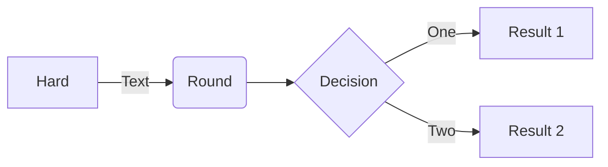

# RFC-0006: Automatic path discovery

- **RFC Number:** 0006
- **Title:** Automatic path discovery
- **Status:** Raw | Discussion | Prototype | Implementation | Finalized | Rejected | Superseded
- **Author(s):** \<Name (GitHub Handle)\>
- **Created:** \<YYYY-MM-DD\>
- **Updated:** \<YYYY-MM-DD\>
- **Version:** v0.x.x (Raw), v1.x.x (Finalized)
- **Supersedes:** RFC-YYYY (if applicable)
- **References:** [Related RFCs or Documentation Links]

## 1. Abstract

Provide a brief and clear summary of the RFC, outlining its purpose, context, and scope.

## 2. Motivation

Explain the problem this RFC aims to solve.
Discuss existing limitations, technical gaps, and why the proposed solution is necessary.

## 3. Terminology

Define key terms, abbreviations, and domain-specific language used throughout the RFC.

## 4. Specification

Comprehensive description of the proposed solution, including:

- Protocol overview
- Technical details (data formats, APIs, endpoints)
- Supported use cases
- Diagrams (stored in `assets/` and referenced as ``)

## 5. Design Considerations

Discuss critical design decisions, trade-offs, and justification for chosen approaches over alternatives.

## 6. Compatibility

Address backward compatibility, migration paths, and impact on existing systems.

## 7. Security Considerations

Identify potential security risks, threat models, and mitigation strategies.

## 8. Drawbacks

Discuss potential downsides, risks, or limitations associated with the proposed solution.

## 9. Alternatives

Outline alternative approaches that were considered and reasons for their rejection.

## 10. Unresolved Questions

Highlight questions or issues that remain open for discussion.

## 11. Future Work

Suggest potential areas for future exploration, enhancements, or iterations.

## 12. References

Include all relevant references, such as:

- Other RFCs
- Research papers
- External documentation
