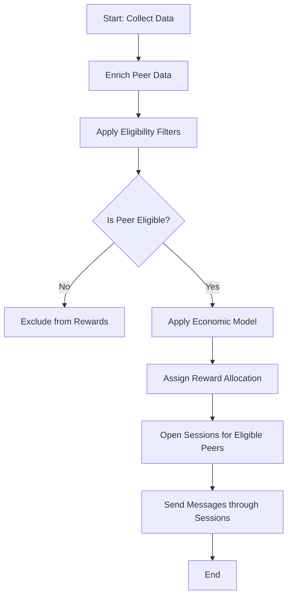
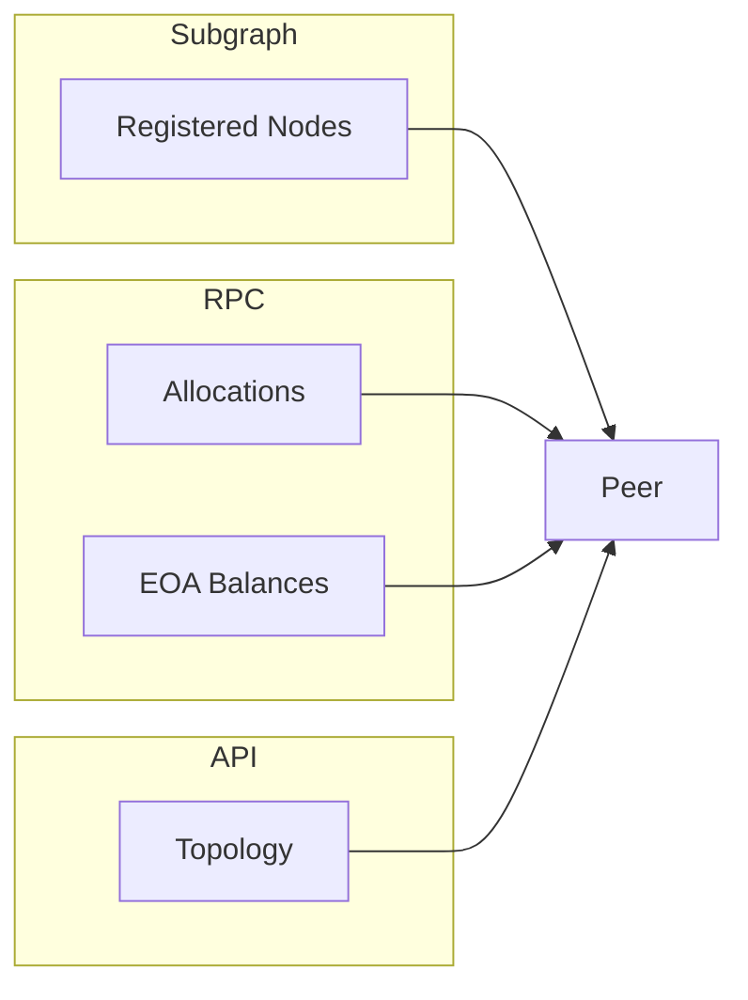
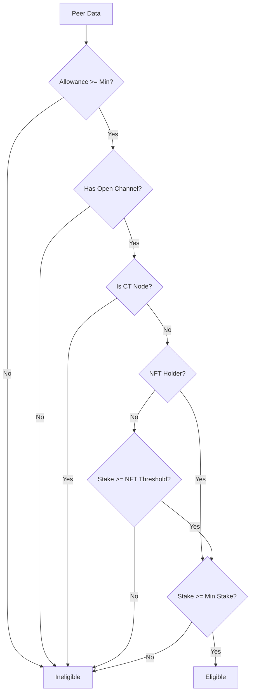
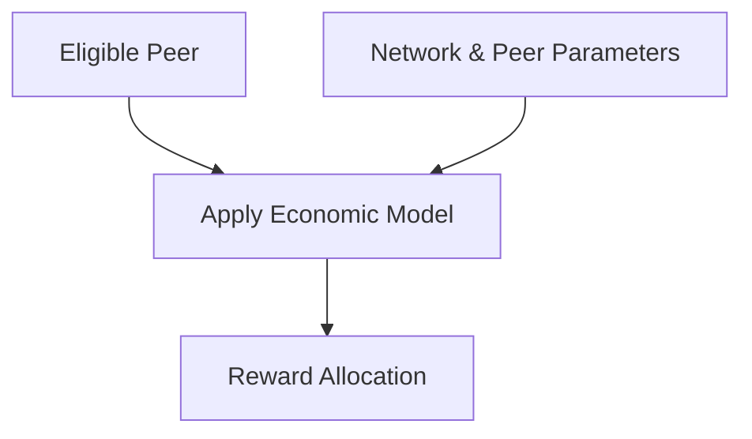
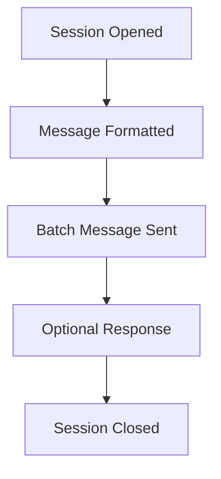

# RFC-0007: Economic Reward System

- **RFC Number:** 0007
- **Title:** Economic Reward System
- **Status:** Raw
- **Author(s):** Jean Demeusy (@jeandemeusy)
- **Created:** 2025-08-25
- **Updated:** 2025-08-25
- **Version:** v0.1.0 (Raw)
- **Supersedes:** none
- **Related Links:** none

## 1. Abstract

This RFC describes the mechanisms of the HOPR economic reward system, specifically how the eligible peer set is constructed and how rewards are
calculated and distributed among peers. The system ensures fair and sustainable incentivisation of node operators whilst preventing gaming and
maintaining network decentralisation.

The reward system operates by collecting data from multiple sources (blockchain, subgraphs, node APIs), filtering for eligible peers based on stake
and connectivity requirements, applying an economic model to calculate reward allocations, and distributing rewards through the HOPR network itself.

## 2. Motivation

The rewards calculation can be seen as an opaque procedure selecting who receives which amount. This RFC aims to lift the veil and clarify the
reasoning behind it.

The economic reward system is a necessary component of the HOPR mixnet, as it incentivises node runners to keep their nodes running in order to have a
network topology that is as stable as possible. It must employ fair logic that never favours or disadvantages a subset of node runners, and that
encourages sustainability without compromising decentralisation. It must also incentivise node runners to be connected to other nodes in the network
via channels. Isolated nodes are far less useful to the network than well-connected nodes.

## 3. Terminology

Terms defined in [RFC-0002](../RFC-0002-mixnet-keywords/0002-mixnet-keywords.md) are used. Additionally, this document defines the following economic
system-specific terms:

- _Subgraph_: an off-chain data indexer (such as The Graph protocol) that indexes blockchain events and provides queryable access to on-chain data
  including NFT holders, registered nodes, allocations, and EOA balances.
- _API_: the HOPR node HTTP API that provides real-time network data including topology information, peer connectivity, and channel balances.
- _EOA (Externally Owned Account)_: a blockchain account directly controlled by a private key (as opposed to a smart contract account). EOAs can
  initiate transactions and hold token balances.
- _Safe_: a smart contract wallet (specifically Gnosis Safe) used for holding tokens with multi-signature security. Node operators typically use Safes
  to manage their staked funds.
- _CT node_: a node running the Cover Traffic (CT) application, which is used by the HOPR Association to distribute rewards. CT nodes are excluded
  from receiving rewards to prevent self-dealing.
- _NFT Holder_: an address holding a specific NFT that grants preferential treatment in the reward system (lower staking thresholds).
- _SessionToSocket_: an implementation object that manages a UDP session and socket for communicating with a specific peer.
- _MessageFormat_: a class responsible for encoding message metadata and payload as bytes for transmission over the network.

The key words "MUST", "MUST NOT", "REQUIRED", "SHALL", "SHALL NOT", "SHOULD", "SHOULD NOT", "RECOMMENDED", "MAY", and "OPTIONAL" in this document are
to be interpreted as described in [01].

## 4. System Overview

The HOPR Cover Traffic (CT) system distributes rewards to eligible peers based on their participation and stake in the network. The reward
distribution process consists of several key stages:

1. **Data collection and enrichment**: gathering peer data from multiple sources (blockchain, subgraphs, node APIs) and enriching each peer's profile
   with on-chain and off-chain information
2. **Eligibility filtering**: applying a series of filters to determine which peers qualify for rewards based on stake, connectivity, and
   participation criteria
3. **Economic model application**: calculating the reward allocation (measured in message count) for each eligible peer using an economic model that
   considers stake amounts, network connectivity, and contribution metrics
4. **Message distribution**: managing the technical process of sending reward messages to eligible peers via UDP sessions, ensuring fair and robust
   distribution

This multi-stage process ensures that rewards are distributed fairly, transparently, and in proportion to each peer's contribution to network
stability and performance.

The following flowchart summarizes the overall process:

## 5. Data Collection and Enrichment

### 5.1 Data Sources

Data is gathered from multiple sources to build a comprehensive view of the network and its participants. The HOPR node API provides a list of
currently visible peers and the network topology, including open payment channels and their balances. Subgraphs supply information about registered
nodes and their associated Safes. Direct RPC calls are used to provide specific allocations to targeted accounts (which may increase a peer's
effective stake) and to retrieve those accounts' EOA balances. Finally, a static list of NFT owners is used to allow reward distribution to
individuals holding a special "OG NFT". This combination of sources ensures that both the live state of the network and relevant historical or
off-chain data are considered in the reward process.

### 5.2 Data Enrichment

Once collected, the data is used to enrich each peer object. Registered node information is used to associate each peer with a Gnosis Safe and other
node metadata. Allocations and EOA balances are incorporated to adjust the peer's effective stake and balance, reflecting both on-chain and off-chain
holdings. The network topology data is used to determine the peer's channel balance, which is important for both eligibility and reward calculation.
It is important to note that NFT holder status and CT node status are not directly added to the peer object during enrichment. Instead, these are
checked during the eligibility filtering phase.

The following diagram illustrates the data enrichment process:

## 6. Peer eligibility filtering

The eligibility filtering process is designed to ensure that only peers who are meaningfully participating in the network and contributing resources
are considered for rewards. The first filter checks that the peer's safe allowance meets a minimum threshold, ensuring that only active and funded
peers are included. Next, the system excludes any peer that is also a CT node to prevent self-rewarding. The NFT/stake requirement is then applied: if
a peer is not an NFT holder, they must meet a higher minimum stake threshold, while NFT holders may be subject to a lower threshold. Finally, all
peers must meet a minimum stake requirement, regardless of NFT status. Only those who pass all these checks are considered eligible for rewards.

The following flowchart details the filtering logic:

## 7. Economic Model Application

For each eligible peer, the system applies an economic model—such as a sigmoid or legacy model—to determine the number of messages (reward units) they
should receive over the course of a year. The model takes into account the peer's individual stake, the total network stake, the network's capacity,
and historical activity metrics such as message relay counts. The output of this model is the yearly message count for each peer, which directly
determines their share of rewards.

The following diagram shows the economic model application:

## 8. Message Timing and Delay Calculation

The timing between messages sent to each eligible peer is carefully calculated to ensure a fair and even distribution throughout the year. The base
delay between two messages is computed as the total number of seconds in a non-leap year divided by the peer's yearly message count. To allow for
efficient batching and aggregation, the system introduces two session parameters: `aggregated_packets` and `batch_size`. The actual sleep time between
message batches is the product of the base delay, the number of aggregated packets, and the batch size. This approach allows the system to send bursts
of messages followed by a pause, balancing throughput and network load. The values of these parameters can be tuned to optimise performance and
reliability.

The `aggregated_packets` parameter specifies how many messages are grouped together and sent in a single relay operation, while `batch_size`
determines how many such operations are performed before the system waits for the next delay interval. The product of these two parameters gives the
total number of messages sent in each cycle, and the delay is applied after each cycle. This mechanism provides fine-grained control over the message
sending pattern.

## 9. Message Sending Architecture

When it is time to send messages, the system first establishes a UDP session for each eligible peer, selecting a destination CT node at random
(excluding the local node). Each session is managed by a `SessionToSocket` object, which handles both the session metadata and the underlying UDP
socket. The socket is configured with appropriate buffer sizes and is closed when the session ends to prevent resource leaks.

Messages themselves are constructed using the `MessageFormat` class, which encodes all necessary metadata—such as sender, relayer, packet size, and
indices—into a raw byte string. The message is padded to the required packet size and sent through the UDP socket to the destination node's address
and port. The system can optionally wait for a response to measure round-trip time, which is useful for monitoring and diagnostics.

The batching of multiple message sendings is handled according to the session parameters described earlier. Multiple messages can be sent in a batch,
and after each batch, the system waits for the calculated delay before sending the next batch. This approach ensures that message delivery is both
efficient and aligned with the reward allocation determined by the economic model.

The following flowchart summarizes the message sending process:

## 10. Security and Monitoring

Security and monitoring are integral to the HOPR CT reward distribution process. To ensure transparency and facilitate troubleshooting, all delays and
message counts are tracked using Prometheus metrics. This allows operators and developers to monitor the system's performance in real time, detect
anomalies, and analyse historical trends.

Resource management is also a key concern. The system is designed to manage sessions and sockets carefully, ensuring that resources are allocated and
released appropriately. Sockets are closed when sessions end, and sessions are only maintained for as long as they are needed. This approach helps
prevent resource leaks, which could otherwise degrade system performance or cause failures over time.

Finally, the system enforces strict eligibility checks before sending messages. Only peers that have open payment channels and valid, active sessions
are eligible to receive messages. This ensures that rewards are distributed only to those who are actively participating in the network and have met
all necessary criteria, further enhancing the security and integrity of the reward process.

## 11. Appendix: Data Structures

### Registered Node

| Variable Name | Type | Purpose                                  |
| ------------- | ---- | ---------------------------------------- |
| address       | str  | Node's unique address                    |
| safe          | Safe | Associated Gnosis Safe object            |
| ...           | ...  | (Other metadata as provided by subgraph) |

### Safe

| Variable Name      | Type    | Purpose                                  |
| ------------------ | ------- | ---------------------------------------- |
| address            | str     | Safe contract address                    |
| balance            | Balance | Total balance held in the safe           |
| allowance          | Balance | Allowance available for node operations  |
| additional_balance | Balance | Extra balance from allocations/EOA       |
| owners             | list    | List of owner addresses                  |
| ...                | ...     | (Other metadata as provided by subgraph) |

### Allocation

| Variable Name    | Type    | Purpose                               |
| ---------------- | ------- | ------------------------------------- |
| address          | str     | Allocation contract address           |
| unclaimed_amount | Balance | Amount not yet claimed                |
| linked_safes     | set     | Safes associated with this allocation |
| num_linked_safes | int     | Number of safes linked                |

### EOA Balance

| Variable Name    | Type    | Purpose                        |
| ---------------- | ------- | ------------------------------ |
| address          | str     | EOA address                    |
| balance          | Balance | Balance held by the EOA        |
| linked_safes     | set     | Safes associated with this EOA |
| num_linked_safes | int     | Number of safes linked         |

### Topology Entry

| Variable Name    | Type    | Purpose                            |
| ---------------- | ------- | ---------------------------------- |
| address          | str     | Peer address                       |
| channels_balance | Balance | Total balance in outgoing channels |

### Peer (Enriched)

| Variable Name        | Type       | Purpose                      |
| -------------------- | ---------- | ---------------------------- |
| address              | Address    | Peer’s unique address        |
| version              | Version    | Peer’s software version      |
| safe                 | Safe       | Associated safe object       |
| channel_balance      | Balance    | Balance in outgoing channels |
| yearly_message_count | int/None   | Calculated reward allocation |
| params               | Parameters | Application parameters       |
| running              | bool       | Is the peer currently active |
| ...                  | ...        | (Other runtime attributes)   |

## 12. References

[01] Bradner, S. (1997). [Key words for use in RFCs to Indicate Requirement Levels](https://datatracker.ietf.org/doc/html/rfc2119). _IETF RFC 2119_.

## 13. Changelog

- 2025-06-26: Initial draft.
