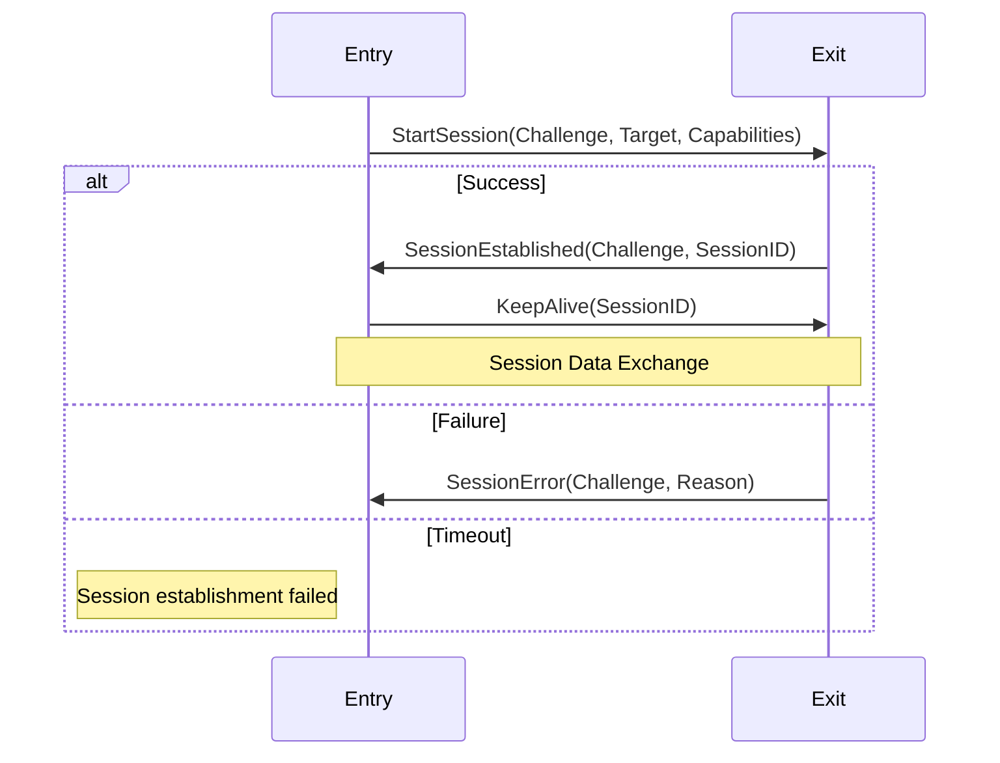
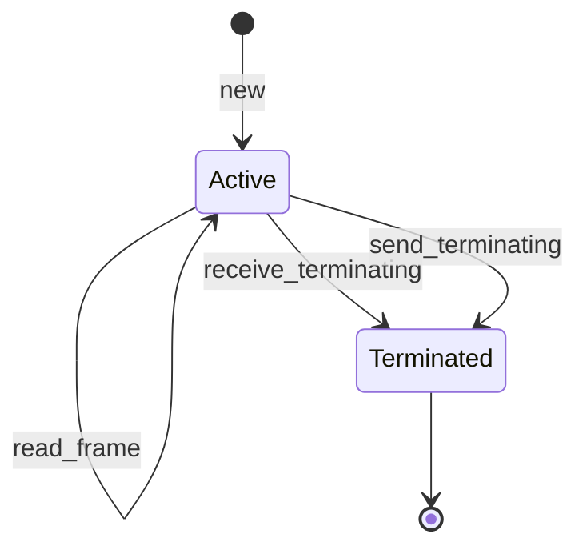
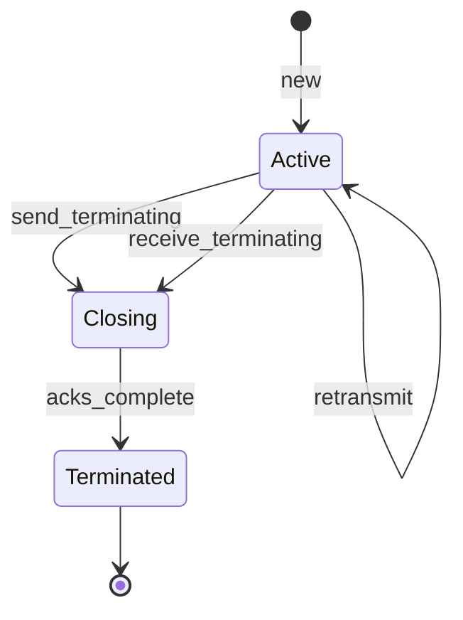

# RFC-0007: Session protocol

- **RFC Number:** 0007
- **Title:** Session protocol
- **Status:** Draft
- **Author(s):** Tino Breddin (tolbrino)
- **Created:** 2025-08-15
- **Updated:** 2025-08-18
- **Version:** v0.1.0 (Draft)
- **Supersedes:** N/A
- **Related Links:** [RFC-0002](../RFC-0002-mixnet-keywords/0002-mixnet-keywords.md), [RFC-0003](../RFC-0003-hopr-packet-protocol/0003-hopr-packet-protocol.md)

## 1. Abstract

This RFC specifies the HOPR Session Protocol, a comprehensive protocol suite designed for establishing and managing read-write sessions over unreliable networks. The protocol consists of two main sub-protocols: the Session Start protocol for session establishment and lifecycle management, and the Session Data protocol for data transmission with TCP-like [01] features including message segmentation, reassembly, acknowledgement, and retransmission. Together, these protocols provide both reliable and unreliable communication modes while maintaining simplicity and efficiency, making them suitable for various applications within the HOPR mixnet ecosystem.

## 2. Motivation

The HOPR mixnet uses HOPR packets (see [RFC-0003](../RFC-0003-hopr-packet-protocol/0003-hopr-packet-protocol.md)) to send data between nodes. This fundamental packet sending mechanisms however works, similar to UDP [03], as a fire-and-forget mechanisms and does not provide any higher-level features any application developer would expect. To ease adoption a HOPR node needs a way for existing applications to use it without having to implement TCP [01] or UDP all over again.
The HOPR Session Protocol fills that gap, it provides TCP and UDP interfaces to applications while covering the complexity of using the HOPR mixnet.

## 3. Terminology

- **Frame**: A logical unit of data transmission in the Session Protocol. Frames can be of arbitrary length and are identified by a unique Frame ID.

- **Segment**: A fixed-size fragment of a frame. Frames are split into segments for transmission, with each segment carrying metadata about its position within the frame.

- **Frame ID**: A 32-bit unsigned integer that uniquely identifies a frame within a session (1-indexed).

- **Sequence Number (SeqNum)**: An 8-bit unsigned integer indicating a segment's position within its frame (0-indexed).

- **Sequence Indicator (SeqIndicator)**: An 8-bit value. FIXME: add spec

- **Session Socket**: The endpoint abstraction that implements the Session Protocol, available in both reliable and unreliable variants.

- **MTU (Maximum Transmission Unit)**: The maximum size of a single protocol message, denoted as `C` throughout this specification.

- **Terminating Segment**: A special segment that signals the end of a frame.

- **Terminating Frame**: A special frame that signals the end of a session.

- **Challenge**: A 64-bit random value used in the Session Start protocol to correlate requests and responses.

- **Session Target**: The destination or purpose of a session, typically an address or service identifier, encoded in CBOR format.

- **Session Capabilities**: A bitmap of session features and options negotiated during session establishment.

- **CBOR (Concise Binary Object Representation)**: A binary data serialization format defined in RFC 7049 [02], used for encoding session identifiers and targets.

## 4. Specification

### 4.1 Protocol Overview

The HOPR Session Protocol consists of two main sub-protocols:

#### 4.1.1 Session Start Protocol

A handshake protocol for establishing sessions between peers, managing session lifecycle, and negotiating capabilities. This protocol operates at a higher layer and uses HOPR packets for transport.

#### 4.1.2 Session Data Protocol

The data transmission protocol that operates at version 1 and consists of three message types that work together to provide reliable or unreliable data transmission:

1. **Segment Messages**: Carry actual data fragments
2. **Retransmission Request Messages**: Request missing segments
3. **Frame Acknowledgement Messages**: Confirm successful frame receipt

The protocol supports two operational modes:

- **Unreliable Mode**: Fast, stateless operation similar to UDP [03]
- **Reliable Mode**: Stateful operation with acknowledgements and retransmissions

### 4.2 Session Start Protocol

The Session Start protocol manages session establishment and lifecycle using HOPR packets as transport. It operates at version 2 and provides a handshake mechanism for negotiating session parameters.

#### 4.2.1 Message Types

The protocol defines four message types:

1. **StartSession**: Initiates a new session
2. **SessionEstablished**: Confirms session establishment
3. **SessionError**: Reports session establishment failure
4. **KeepAlive**: Maintains session liveness

#### 4.2.2 Message Format

All Session Start messages follow this structure:

```
+--------+--------+--------+--------+
|Version |  Type  |     Length      |
+--------+--------+--------+--------+
|          Message Payload          |
|              ...                  |
+-----------------------------------+
```

- **Version** (1 byte): Protocol version, MUST be 0x02 for version 2
- **Type** (1 byte): Message type discriminant
  - 0x00: StartSession
  - 0x01: SessionEstablished
  - 0x02: SessionError
  - 0x03: KeepAlive
- **Length** (2 bytes): Big-endian payload length in bytes
- **Payload**: Message-specific data (CBOR-encoded where applicable)

#### 4.2.3 StartSession Message

Initiates a new session with the remote peer.

```
+--------+--------+--------+--------+
|          Challenge (8 bytes)      |
+--------+--------+--------+--------+
|          (continued)              |
+--------+--------+--------+--------+
|  Cap.  |    Additional Data      |
+--------+--------+--------+--------+
|  (cont)|     Target (CBOR)       |
+--------+--------+--------+--------+
|              ...                  |
+-----------------------------------+
```

- **Challenge** (8 bytes): Random challenge for correlating responses
- **Capabilities** (1 byte): Session capabilities bitmap
- **Additional Data** (4 bytes): Capability-dependent options (0x00000000 to ignore)
- **Target** (variable): CBOR-encoded session target (e.g., "127.0.0.1:1234")

#### 4.2.4 SessionEstablished Message

Confirms successful session establishment.

```
+--------+--------+--------+--------+
|      Original Challenge (8 bytes) |
+--------+--------+--------+--------+
|          (continued)              |
+--------+--------+--------+--------+
|       Session ID (CBOR)           |
+--------+--------+--------+--------+
|              ...                  |
+-----------------------------------+
```

- **Original Challenge** (8 bytes): Challenge from StartSession message
- **Session ID** (variable): CBOR-encoded session identifier assigned by responder

#### 4.2.5 SessionError Message

Reports session establishment failure.

```
+--------+--------+--------+--------+
|          Challenge (8 bytes)      |
+--------+--------+--------+--------+
|          (continued)              |
+--------+--------+--------+--------+
| Reason |
+--------+
```

- **Challenge** (8 bytes): Challenge from StartSession message
- **Reason** (1 byte): Error reason code
  - 0x00: Unknown error
  - 0x01: No slots available
  - 0x02: Busy

#### 4.2.6 KeepAlive Message

Maintains session liveness.

```
+--------+--------+--------+--------+
| Flags  |    Additional Data      |
+--------+--------+--------+--------+
| (cont) |    Session ID (CBOR)    |
+--------+--------+--------+--------+
|              ...                  |
+-----------------------------------+
```

- **Flags** (1 byte): Reserved for future use (MUST be 0x00)
- **Additional Data** (4 bytes): Flag-dependent options (0x00000000 to ignore)
- **Session ID** (variable): CBOR-encoded session identifier

#### 4.2.7 Protocol Flow



#### 4.2.8 Session Start Rules

1. Challenge values MUST be randomly generated
2. Session IDs MUST be unique per responder
3. Targets and Session IDs use CBOR encoding [02]
4. Messages MUST fit within HOPR packet payload limits
5. KeepAlive messages SHOULD be sent periodically to maintain session state

### 4.3 Session Data Protocol Message Format

All Session Data Protocol messages follow a common structure:

```
+--------+--------+--------+--------+
|Version |  Type  |     Length      |
+--------+--------+--------+--------+
|          Message Payload          |
|              ...                  |
+-----------------------------------+
```

- **Version** (1 byte): Protocol version, MUST be 0x01 for version 1
- **Type** (1 byte): Message type discriminant
  - 0x00: Segment
  - 0x01: Retransmission Request
  - 0x02: Frame Acknowledgement
- **Length** (2 bytes): Big-endian payload length in bytes (max 2047)
- **Payload**: Message-specific data

### 4.4 Segment Message

#### 4.4.1 Segment Structure

```
+--------+--------+--------+--------+
|            Frame ID               |
+--------+--------+--------+--------+
|Seq Idx |Seq Flag|   Segment Data  |
+--------+--------+                 |
|              ...                  |
+-----------------------------------+
```

- **Frame ID** (4 bytes): Big-endian frame identifier (MUST be > 0)
- **Sequence Index** (1 byte): Segment position within frame (0-based)
- **Sequence Flags** (1 byte):
  - Bit 7: Termination flag (1 = terminating segment)
  - Bit 6: Reserved (MUST be 0)
  - Bits 0-5: Total segments in frame minus 1 (max value: 63)
- **Segment Data**: Variable length payload data

#### 4.4.2 Segmentation Rules

1. Frames MUST be segmented when larger than `(C - 10)` bytes, where 10 is the segment overhead
2. Maximum segments per frame is 64 (limited by 6-bit sequence length field)
3. Each segment except the last SHOULD be of equal size
4. Empty segments are valid (used for terminating segments)
5. Frame IDs MUST be monotonically increasing within a session

### 4.5 Retransmission Request Message

#### 4.5.1 Request Structure

```
+--------+--------+--------+--------+
|           Frame ID 1              |
+--------+--------+--------+--------+
|Missing |           Frame ID 2     |
+--------+--------+--------+--------+
|       Missing   |    Frame ID 3   |
+--------+--------+--------+--------+
|              Missing              |
+--------+--------+--------+--------+
|              ...                  |
+-----------------------------------+
```

The message contains a sequence of 5-byte entries:

- **Frame ID** (4 bytes): Big-endian frame identifier
- **Missing Bitmap** (1 byte): Bitmap of missing segments
  - Bit N set = segment N is missing (N: 0-7)

#### 4.5.2 Request Rules

1. Entries MUST be ordered by Frame ID (ascending)
2. Frame ID of 0 indicates padding (ignored)
3. Maximum entries per message: `(C - 4) / 5`
4. Only the first 8 segments per frame can be requested

### 4.6 Frame Acknowledgement Message

#### 4.6.1 Acknowledgement Structure

```
+--------+--------+--------+--------+
|           Frame ID 1              |
+--------+--------+--------+--------+
|           Frame ID 2              |
+--------+--------+--------+--------+
|              ...                  |
+-----------------------------------+
```

- Contains a list of 4-byte Frame IDs that have been fully received
- Frame IDs MUST be in ascending order
- Frame ID of 0 indicates padding (ignored)
- Maximum frame IDs per message: `(C - 4) / 4`

### 4.7 Protocol State Machines

#### 4.7.1 Unreliable Socket State Machine



#### 4.7.2 Reliable Socket State Machine



### 4.8 Timing and Reliability Parameters

#### 4.8.1 Unreliable Mode

- No acknowledgements or retransmissions
- Frames may be delivered out-of-order
- No delivery guarantees
- Suitable for real-time or loss-tolerant applications

#### 4.8.2 Reliable Mode

- **Frame Timeout**: Default 800ms before requesting retransmission
- **Acknowledgement Window**: Max 255 unacknowledged frames
- **Retransmission Limit**: Implementation-defined (suggested: 3)
- **Acknowledgement Batching**: Delayed up to 100ms for efficiency

### 4.9 Session Termination

1. Either party MAY send a terminating segment (empty segment with termination flag set)
2. Upon receiving a terminating segment:
   - Unreliable sockets SHOULD close immediately
   - Reliable sockets MUST complete pending acknowledgements before closing
3. No data frames MUST be sent after a terminating segment

### 4.10 Example Message Exchanges

#### 4.10.1 Simple Frame Transmission (Unreliable Mode)

Sending a 300-byte frame with MTU=256:

```
Sender → Receiver:
  Segment(frame_id=1, seq_idx=0, seq_flags=0x02, data[246])
  Segment(frame_id=1, seq_idx=1, seq_flags=0x02, data[54])
```

#### 4.10.2 Frame with Retransmission (Reliable Mode)

Sending a frame where segment 1 is lost:

```
Sender → Receiver:
  Segment(frame_id=1, seq_idx=0, seq_flags=0x03, data[246])
  Segment(frame_id=1, seq_idx=1, seq_flags=0x03, data[246])  // Lost
  Segment(frame_id=1, seq_idx=2, seq_flags=0x03, data[100])

Receiver → Sender (after timeout):
  Request(frame_id=1, missing_bitmap=0b00000010)

Sender → Receiver:
  Segment(frame_id=1, seq_idx=1, seq_flags=0x03, data[246])

Receiver → Sender:
  Acknowledge(frame_ids=[1])
```

#### 4.10.3 Session Termination

```
Sender → Receiver:
  Segment(frame_id=5, seq_idx=0, seq_flags=0x81, data[])  // Terminating flag set
```

#### 4.10.4 Session Start Example

Complete session establishment and data exchange:

```
Entry → Exit:
  StartSession(challenge=0x1234567890ABCDEF,
               target="127.0.0.1:8080",
               capabilities=0x00,
               additional_data=0x00000000)

Exit → Entry:
  SessionEstablished(orig_challenge=0x1234567890ABCDEF,
                     session_id=42)

Entry → Exit:
  KeepAlive(session_id=42, flags=0x00, additional_data=0x00000000)

// Data exchange begins using session_id=42
Entry → Exit:
  Segment(frame_id=1, seq_idx=0, seq_flags=0x01, data[...])

// Periodic keepalive
Entry → Exit:
  KeepAlive(session_id=42, flags=0x00, additional_data=0x00000000)
```

## 5. Design Considerations

### 5.1 Maximum Segments Limitation

The protocol limits frames to 64 segments due to the 6-bit sequence length field. This provides a good balance between:

- Frame size flexibility (up to 64 × MTU)
- Protocol overhead (1 byte for sequence information)
- Implementation complexity (simple bitmap for retransmissions)

### 5.2 Frame ID Space

The 32-bit Frame ID space allows for over 4 billion frames per session. Frame IDs MUST be monotonically increasing to enable:

- Duplicate detection
- Out-of-order delivery handling
- Simple state management

### 5.3 Retransmission Request Design

Limiting retransmission requests to the first 8 segments per frame:

- Keeps message format simple (1-byte bitmap)
- Covers the common case (most frames have ≤8 segments)
- Frames requiring >8 segments can use smaller frame sizes

### 5.4 Protocol Overhead

- Minimum overhead per segment: 10 bytes (4 header + 6 segment header)
- Maximum protocol efficiency: (C - 10) / C
- For C = 1024: ~99% efficiency
- For C = 256: ~96% efficiency

### 5.5 Session Start Protocol Design

#### 5.5.1 CBOR Encoding

The use of CBOR (Concise Binary Object Representation) for Session IDs and Targets provides:

- Flexible data types without fixed-size constraints
- Compact binary encoding
- Language-agnostic serialization
- Support for complex session identifiers

#### 5.5.2 Challenge-Response Design

The 64-bit challenge provides:

- Correlation between requests and responses
- Protection against replay attacks (when combined with transport security)
- Simple state tracking for pending sessions

#### 5.5.3 Capability Negotiation

The single-byte capability field allows:

- Up to 8 independent capability flags
- Future protocol extensions
- Backward compatibility through ignored bits

#### 5.5.4 Transport Independence

The Session Start protocol is transport-agnostic:

- Works over any packet-based transport
- Designed for HOPR packets but not limited to them
- No assumptions about ordering or reliability

## 6. Compatibility

### 6.1 Version Compatibility

- Version 1 is the initial Session Data protocol version
- Version 2 is the initial Session Start protocol version
- Future versions MUST use different version numbers
- Implementations MUST reject messages with unknown versions
- Version negotiation is out of scope for this specification

### 6.2 Transport Requirements

- Requires bidirectional communication channel
- No assumptions about ordering or reliability

## 7. Security Considerations

### 7.1 Protocol Security

- The protocol provides NO encryption or authentication
- Security MUST be provided by the underlying transport
- Frame IDs are predictable and MUST NOT be used for security

### 7.2 Session Start Security

- Challenges MUST use cryptographically secure random number generation
- Session IDs SHOULD be unpredictable to prevent session hijacking
- The protocol provides NO protection against man-in-the-middle attacks
- Transport-level security (e.g., HOPR packet encryption) MUST be used
- Session targets may expose service information if not encrypted at transport

## 11. Future Work

- Enhanced acknowledgement schemes for better efficiency
- Forward error correction for high-loss environments

## 12. Implementation Notes

### 12.1 Testing Recommendations

- Test with various MTU sizes (256, 512, 1024, 1500, 9000)
- Simulate packet loss, reordering, and duplication
- Verify termination handling under all conditions
- Stress test with maximum frame sizes and counts

## 13. References

[01] Postel, J. (1981). [Transmission Control Protocol](https://datatracker.ietf.org/doc/html/rfc793). _IETF RFC 793_.

[02] Bormann, C. & Hoffman, P. (2013). [Concise Binary Object Representation (CBOR)](https://datatracker.ietf.org/doc/html/rfc7049). _IETF RFC 7049_.

[03] Postel, J. (1980). [User Datagram Protocol](https://datatracker.ietf.org/doc/html/rfc768). _IETF RFC 768_.
