# RFC-0008: Return path incentivization

- **RFC Number:** 0008  
- **Title:** Return path incentivization
- **Status:** Discussion
- **Author(s):** Qianchen Yu(QYuQianchen), Lukas Pohanka (NumberFour8)
- **Created:** 2025-03-28 
- **Updated:** 2025-04-07
- **Version:** v0.2.0 (Raw)  
- **Supersedes:** N/A
- **References:** [RFC0003](../RFC-0003-hopr-packet-protocol/0003-hopr-packet-protocol.md)

## Abstract

<!-- Provide a brief and clear summary of the RFC, outlining its purpose, context, and scope. -->

This RFC introduces a privacy-preserving mechanism to compensate Exit nodes (Recipients) for forwarding 
response traffic via Return Paths (RP) in the HOPR protocol.
The protocol enables senders to fund exit nodes' relay costs through shielded deposits, stealth addresses,
and verifiable secret sharing (VSSS), maintaining unlinkability while ensuring economic sustainability. 
The system operates as a supplementary layer to existing 
[RFC0003 HOPR packet protocol](../RFC-0003-hopr-packet-protocol/0003-hopr-packet-protocol.md).

## Motivation

<!-- Explain the problem this RFC aims to solve.
Discuss existing limitations, technical gaps, and why the proposed solution is necessary. -->
When a sender uses HOPR protocol to send requests and expects responses, response data will be sent 
through the network as in HOPR packets through pre-selected paths. 
The Return Path (RP) information is embedded in a dedicated HOPR packet header, i.e. 
"Single Use Reply Blocks" (SURBs) headers given by the Entry node.
Given that the Exit-to-Entry response may exceed the Entry-to-Exit request in size, 
the Entry node preemptively supplies multiple SURBs to the Exit, which may or may not be consumed.

In the Return Path mechanism, Exit nodes incur costs 
when opening outgoing channels to the First Relay (FR) to return data to the Entry (Sender). 
While the HOPR protocol provides per-hop incentives through probabilistic payments, 
it does not yet offer a privacy-preserving way to compensate the Exit node for this work - 
especially since the Return Path is initiated by the Sender but executed by the Recipient.

To incentivize Exit nodes to deliver response and offset their extra computation compared with other relay nodes, 
this propose an incentivization mechanism for the RPs, which has the following properties:

- **Privacy**: No Sender-Recipient linkage is revealed on-chain.
- **Fairness**: Recipients are only compensated for actual SURB usage.
- **Incentives**: Shorter Return Paths result in surplus rewards for the Recipient.

## Terminology

<!-- Define key terms, abbreviations, and domain-specific language used throughout the RFC. -->

The key words "MUST", "MUST NOT", "REQUIRED", "SHALL", "SHALL NOT", "SHOULD", "SHOULD NOT", "RECOMMENDED",
"MAY", and "OPTIONAL" in this document are to be interpreted as described
in [IETF RFC 2119](https://datatracker.ietf.org/doc/html/rfc2119) when, and only when, they appear in all
capitals, as shown here.

- **Single Use Reply Blocks (SURB)**
- **Sender**: Sender of packets.
- **Recipient**: Recipient of packets and SURBs. It has private key $r$, public key $R$, and Ethereum address $E_R$
- **Return Path (RP)**: 

- **Shielded Pool**: An anonymized pool of HOPR tokens supporting private deposits and withdrawals using zk-SNARK.
- **Nullifier $s_n$**: Unique secret value of a deposit. Random 32 bytes hexdecimal value.
- **Nullifier Hash $h$**: Public unique identifier for deposit claims. 32 bytes hexdecimal value. $h = H_1(s_n)$
- **Deposit Committment Secret $s_{c}$**: A random value known only to the Sender and used to generate the commitment.
- **Deposit Committment $C_{d}$**: A cryptographic representation of a deposit. $C_{d} = H_2(s_n \Vert s_{c})$
- **Stealth Secret $s_{s}$**: An one-time pad secret value jointly picked by the Sender and the Recipient.
The stealth secrets MAY be an array of pairs of one-time-pads ${(a_0+b_0), (a_1+b_1), (a_2+b_2), \ldots}$
The deposit can be larger and deposit into multiple stealth addresses. 
This value defines the derivation of the stealth address of Recipient. $s_{s_i} = a_i + b_i$
- **Sender-picked nonce $a$**: Random value chosen by the Sender. Partial contribution to the stealth address.
For one deposit, Sender can created multiple Sender-picked nonces $a_i$, and send the corresponding encrypted values $a_i * R$
to the Recipient.
- **Recipient-picked nonce $b$**: Random value chosen by the Recipient. Partial contribution to the stealth address.
Recipient should generate an amount of Recipient-picked nonces $b_i$ equivalent to the amount of Sender-picked nonces,
and send the encrypted valeus $b_i * R$ back to the Sender.
- **Stealth Address $E_{B_s}$**: Stealth address of the Recipient. It has private key $b_{s}$ and public key $B_{s}$. 
- **Winning Probability $P_{win}$**: Each ticket issuer decides on the probability at which this ticket can be a win. 
A winning ticket can claim the associated value. The minimum winning probability is set globally at the network level.
- **SURB Batch**: Set of some Single-Use Reply Blocks for transmitting response.
- **Shielded Pool Deposit Amount $D$**: Fixed amount covering 3-hop relay costs for one batch that will be deposited into the shielded pool.
The value is configurable per network. Every Sender MUST deposit the same value to the shielded pool.
- **Verifiable Shamir Secret Sharing (VSSS)**: A protected secret value gets split into shares among participants. 
In the context of SURB, Sender knows the secret and generates the shares as the solution to the PoR challenge.
Each share gets returned to the Recipient through First Relays' acknowlegment.
The number of shares corresponds to the size of the SURB batch.
- **VSSS threshold $T$**: The minimum number of shares needed to reconstruct the secret.
- **VSSS sharing factor $F$**: The percentage of VSSS threshold over the size of SURB Batch.
- **VSSS polynominal**: Polynominal used for secret sharing. The contant of the polynominal is the secret. This polynominal has a degree of $T-1$
This value is set at the network level. Each relay node MUST use the same sharing factor.
- **Acknowledgement Vector**: Set of FR responses ${ack_1,...ack_k}$ proving SURB usage

## Specification
<!-- 
Comprehensive description of the proposed solution, including:

- Protocol overview
- Technical details (data formats, APIs, endpoints)
- Supported use cases

```mermaid
sequenceDiagram
    participant S as Sender
    participant R as Recipient (Exit)
    participant FR as First Relayer
    participant A as Gasless Agent
    participant ShieldedPool as Shielded Pool

    Note over S,ShieldedPool: 💸 Shielded Deposit Phase
    S->>S: Generate commitment_secret and nullifier
    S->>ShieldedPool: Deposit fixed HOPR amount to the shielded pool
    S-->>ShieldedPool: Insert commitment in Merkle tree
    S->>S: Generate proof for Gasless Agent <br/> to withdraw to the stealth address

    Note over S, R: 📬 Session Opening
    S->>S: Pick Sender nonces a_i, create VSSS polynominals and commitments, choose Recipient
    S->>R: Create SURB for session initiation request and send the request to Recipient

    Note over S, R: 🔐 Recipient Commitment
    R->>R: Recipient checks VSSS degree and store its commitments, Pick Recipient nonces b_i, and compute the stealth address
    R->>S: Confirms session establishement and returns encrypted nonces b_i * R

    Note over A,ShieldedPool: 📥 Zero-knowledge (ZK) Stealth allocation
    A->>A: Compute stealth addresses.
    A->>ShieldedPool: Allocate the deposit to the stealth address with proof
    ShieldedPool-->>ShieldedPool: Reward allocated to the stealth address

    Note over S,R: 📢 SURB Generation
    S->>S: Create VSSS shared secrets and proofs, generate SURBs, encrypt shared secrets with acknowledgements
    S->>R: Send SURBs with encrypted shared secrets and proofs

    Note over R,FR: 📦 Return Path Usage
    R->>R: Verify valid allocations to stealth addresses
    R->>FR: Pick random SURB to send response
    FR-->>R: Return ack (VSSS share)

    loop Until all SURBs are used
        R->>FR: Use next SURB
        FR-->>R: Return ack (VSSS share)
        R->>R: Validity check on the ack with VSSS commitments and proof. <br/>If invalid, terminate the session
    end

    Note over R: 🧩 Secret Reconstruction
    R->>R: Reconstruct Sender-picked nonces a_i from VSSS shares
    R->>R: Compute the stealth secrets

    Note over R,ShieldedPool: 🧾 Payment Retrieval 
    R->>ShieldedPool: (Gasless) Request to withdraw
    ShieldedPool-->>R: Reward transferred from stealth addresses to the Recipient
```

- Diagrams (stored in `assets/` and referenced as ``) -->

### 1. Zero-knowledge (ZK) deposit on chain
Sender MUST generate random secret values for zk deposit as a committment of payment to the stealth address of the Recipient
- Deposit Committment Secret $s_{c}$: 256-bit random value
- Nullifier $s_n$: 256-bit random value

Compute the deposit committment $C_{d} = H_2(s_n \Vert s_{c})$ where $H_2$ is 
an adequate hash fuction to for zero-knowledge proofs.
Sender uses any wallet that contains HOPR token for deposit to the shielded pool. 
Sender interacts with the shielded pool to send HOPR token of amount $D$ and store the commitment $C_d$ to a leaf to the Merkle tree at a path.

Deposits can take place at any time prior to Session opening.
Multiple deposits that will later on be used by different sessions can also be done jointly at this step.

### 2. Session Opening
Sender generates uniformly some random nonces $a_i$ per Session. The amount of nonces corresponds to the number of stealth address and thus to the share of deposits. The deposit will be divided equally among stealth addresses.

The Sender uniformly generates a set of random nonces $a_i$ for each Session. 
The number of nonces corresponds to the number of stealth addresses and, by extension, determines the distribution of the deposit. 
The total deposit is divided equally among these stealth addresses.

For each nonce $a_i$, Sender constructs a random polynominal $Q(x)$ of degree $T-1$ where the constant term (i.e. the coefficient of degree zero) is $a_i$

Sender picks a Recipient with public key $R$.
During the Session initiation, Recipient encryptes the Sender-picked nonces with the public key of Sender: $a_i * R \equiv a_i * r * G$,
where $G$ is the generator point of secp256k1 curve.

Sender creates some SURBs for the Recipent.

Sender sends session initiation requests to Recipient, for each $a_i$, with:
- Threshold $t$
- Commitment to the polynominal coefficients
- Encrypted nonce $a_i * R$

### 3. Recipient Commitment
Upon receiption of session initiation requests, Recipient checks if the threshold T is desired.

Recipient MUST then pick an equal amount of nonce $b_i$ of 256-bit random value.

Recipient confirms the session establishment and sends the encrypted nonces to Sender: $b_i * R \equiv b_i * r * G$

Recipient can compute the stealth addresses: $E_{s_i} = a_i * R + b_i * R  \equiv (a_i + b_i) * r * G  \equiv s_{s_i} * r * G$

### 4. Zero-knowledge (ZK) allocation on chain
Sender computes the stealth public keys $B_{s_i}$ of the Recipient based on the encrypted nonces shared by the Recipient $B_{s_i} = b_i * R + a_i * R$ .
The address of Recipient's stealth address $E_{B_{s_i}}$ can calculated from the public key of the stealth address $B_{s_i}$

Sender generates zk proofs to shielded pool "withdrawal". 
This withdrawal allocates the deposit to the stealth address of the Recipient within the stealth pool contract.
This prevents Senders from cheating or prematurely claiming the deposit.
Sender SHALL use an ephemeral wallet or a gasless agent to perform the allocation anonymously. 
Tokens are still held in the Shielded Pool.

Agent:
1. Reconstructs the commitment secret $S_c$ from FR acknowledgements ($s_i$)
2. Generate proofs $\pi_{withdrawal}$ for:
    - Nullifier is the preimage of nullifier hash $H_1(s_n) \equiv h$
    - Nullifier is unused on-chain
    - Commitment $C_D$ exists in the Merkle tree 
    - $S_c$ matches the deposit commitment $C_{d} \equiv H_2(s_n \Vert s_{c})$ 
3. With inputs:
    - *Private* nullifier $n_{nullifier}$
    - *Private* commitment secret $S_{c}$
    - *Private* Merkle tree path
    - *Public* Merkle root
    - *Public* Nullifier hash 

### 5. SURB Batch Construction
Sender takes network-level properties and computes the relavant parametes for SURB creation.
- Size of SURB Batch: Computed from the global set shielded pool deposit amount, Sender specific winning probability (which is at least the value of the global minimum winning probability), global ticket price. Shielded Pool Deposit Amount $D$ * winning_probability $P_{win}$ / (default_hop_count 3 * ticket_price $p_{ticket}$) 
$$ N_{batch} = \frac{D \times P_{win}}{(3 \times p_{ticket})}$$
- Threshold of VSSS for the batch $T$: VSSS threhsold factor $F$ * Size of SURB Batch 
$T = F \times N_{batch}$. The threshold SHALL consider exit node reward into its computation.

Sender does the path selections and thus know a full list of the public keys of FRs.

The Sender splits Sender-picked nonce $a_i$ into $N \geq T + 1$ shares, denoted $p_0$, $p_1$, $\ldots$, $p_{N-1}$, using Shamir’s Secret Sharing scheme. Each share $p_i = Q_i(x_i)$ is generated by evaluating the corresponding polynomial $Q_i(x)$ $at a distinct point $x_i$ .

For each share $p_i$, the Sender generates a proof $\pi_i$, demonstrating that $p_i$ satisfies the polynomial $Q_i(x)$ with the committed constant term $a_i$.

The Sender then constructs $N$ Single-Use Reply Blocks (SURBs), each embedding an H4 acknowledgment tag derived from its associated nonce $a_i$.

Each share $p_i$ is encrypted using a symmetric encryption function with a key derived from the corresponding nonce $a_i$:

$\mathsf{EP}_i = \mathsf{ENC}(a_i, p_i)$

Each SURB is sent to the intended Recipient $R$, and is accompanied by:

- The encrypted share $\mathsf{EP}_i$
- The corresponding proof $\pi_i$

This setup enables the Recipient to validate each share using the provided proof, decrypt it using the derived key from the acknowledgment tag $a_i$, and eventually reconstruct the original secret $b$ upon receiving at least $T$ valid shares.

### 6. Using SURBs
Recipent verifies the valid deposit to the stealth address as well as the integrity of the commitments.

When Recipient receives SURBs, SURBs are stored.

- Upon SURB usage, the FR sends the acknowledgement back to the Recipient.
- Recipient reconstructs `secret` from decrypted acknowlegements.
- Recipient checks the proof  $\pi_i$ using commitments.

If any fraud is detected, Recipient SHALL immediately terminate the return of responses.

Once the Sender-pick secret is reconstructed, a stealth secret can be calculated as $s_s = a + b$

### 7. Recipient claims Reward

To claim compensation, the Recipient SHALL directly claim from the Shielded Pool, providing the correct stealth secret as input $m_i$. 
Any other wallet MAY claim for the Recipient, if the stealth secret $s_{s_i}$ is known to them.
The Shielded Pool sends the deposit to the Recipient, if $m_i * R \equiv E_{B_{s_i}}$ holds

## Design Considerations

<!-- Discuss critical design decisions, trade-offs, and justification for chosen approaches over alternatives. -->

Recipient MAY gain extra rewards in the case when not all the deposit amount is consumed by SURBs.

For actual SURB usage with hop counts ${h_1,...h_{batchSize}}$ where $h_i \in [0, 3]$, the extra reward $R$ can be computed as:

$$R = D -\sum_{i=1}^{batchSize} \frac{h_i \times p_{ticket}}{P_{win}}$$
## Compatibility

<!-- Address backward compatibility, migration paths, and impact on existing systems. -->

## Security Considerations

<!-- Identify potential security risks, threat models, and mitigation strategies. -->

## Drawbacks

<!-- Discuss potential downsides, risks, or limitations associated with the proposed solution. -->
1. Current low winning probability may stress the VSSS computation
2. While malicious Recipients may attempt to troll Senders by initiating Sessions and preventing SURB usage (thereby locking deposits), they cannot profit from this behavior without successfully relaying packets. Mitigations such as slashing or reputation-based deterrents are potential solutions but are considered out of scope for this RFC.

## Alternatives

<!-- Outline alternative approaches that were considered and reasons for their rejection. -->

## Unresolved Questions

<!-- Highlight questions or issues that remain open for discussion. -->

## Future Work

<!-- Suggest potential areas for future exploration, enhancements, or iterations. -->

## References

Include all relevant references, such as:

- Other RFCs
- Research papers
- External documentation
