# RFC-0008: Session Data Protocol

- **RFC Number:** 0008
- **Title:** Session Data Protocol
- **Status:** Implementation
- **Author(s):** Tino Breddin (@tolbrino), Lukas Pohanka (@NumberFour8)
- **Created:** 2025-08-15
- **Updated:** 2025-09-05
- **Version:** v0.1.0 (Draft)
- **Supersedes:** none
- **Related Links:** [RFC-0002](../RFC-0002-mixnet-keywords/0002-mixnet-keywords.md), [RFC-0004](../RFC-0004-hopr-packet-protocol/0004-hopr-packet-protocol.md), [RFC-0009](../RFC-0009-session-start-protocol/0009-session-start-protocol.md)

## 1. Abstract

This RFC specifies the HOPR Session Data Protocol, which provides reliable and unreliable data transmission capabilities over the HOPR mixnet. The protocol implements TCP-like [01] features including message segmentation, reassembly, acknowledgement, and retransmission while maintaining simplicity and efficiency. This protocol works in conjunction with the HOPR Session Start Protocol (see [RFC-0009](../RFC-0009-session-start-protocol/0009-session-start-protocol.md)) to provide complete session management capabilities for applications within the HOPR mixnet ecosystem.

## 2. Motivation

The HOPR mixnet uses HOPR packets [RFC-0004](../RFC-0004-hopr-packet-protocol/0004-hopr-packet-protocol.md) to send data between nodes. This fundamental packet sending mechanisms however works, similar to UDP [03], as a fire-and-forget mechanisms and does not provide any higher-level features any application developer would expect. To ease adoption a HOPR node needs a way for existing applications to use it without having to implement TCP [01] or UDP all over again.
Since HOPR protocol is not IP-based, such implementation would require IP protocol emulation.

The HOPR Session Data Protocol fills that gap by providing reliable and unreliable data transmission capabilities to applications. Session establishment and lifecycle management is handled by the HOPR Session Start Protocol [RFC-0009](../RFC-0009-session-start-protocol/0009-session-start-protocol.md), while this protocol focuses exclusively on data transmission.

## 3. Terminology

Terms defined in [RFC-0002](../RFC-0002-mixnet-keywords/0002-mixnet-keywords.md) are used. Additionally, this document defines the following session-specific terms:

- **Frame**: A logical unit of data transmission in the Session Protocol. Frames can be of arbitrary length and are identified by a unique Frame ID.

- **Segment**: A fixed-size fragment of a frame. Frames are split into segments for transmission, with each segment carrying metadata about its position within the frame.

- **Frame ID**: A 32-bit unsigned integer that uniquely identifies a frame within a session (1-indexed). Frame ID values are interpreted as big-endian unsigned integers.

- **Sequence Number (SeqNum)**: An 8-bit unsigned integer indicating a segment's position within its frame (0-indexed).

- **Sequence Flags (SeqFlags)**: An 8-bit value encoding additional segment sequence metadata.

- **Session Socket**: The endpoint abstraction that implements the Session Protocol, available in both reliable and unreliable variants.

- **MTU (Maximum Transmission Unit)**: The maximum size of a single HOPR protocol message, denoted as `C` throughout this specification.

- **Terminating Segment**: A special segment that signals the end of a session.

## 4. Specification

### 4.1 Protocol Overview

The HOPR Session Data Protocol operates at version 1 and consists of three message types that work together to provide reliable or unreliable data transmission:

1. **Segment Messages**: Carry actual data fragments
2. **Retransmission Request Messages**: Request missing segments
3. **Frame Acknowledgement Messages**: Confirm successful frame receipt

The protocol supports two operational modes:

- **Unreliable Mode**: Fast, stateless operation similar to UDP [03]
- **Reliable Mode**: Stateful operation with acknowledgements and retransmissions

Session establishment and lifecycle management is handled by the HOPR Session Start Protocol. All multi-byte integer fields use network byte order (big-endian) encoding to ensure consistent interpretation across different architectures.

### 4.2 Session Data Protocol Message Format

All Session Data Protocol messages follow a common structure:

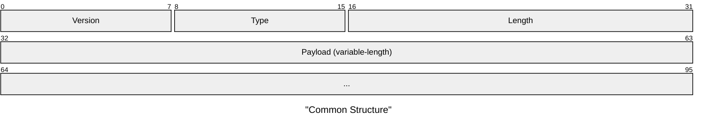

| Field       | Size     | Description               | Value                          |
| ----------- | -------- | ------------------------- | ------------------------------ |
| **Version** | 1 byte   | Protocol version          | MUST be `0x01` for version 1   |
| **Type**    | 1 byte   | Message type discriminant | See Message Types table below  |
| **Length**  | 2 bytes  | Payload length in bytes   | Maximum is `C - 4`             |
| **Payload** | Variable | Message-specific data     | Format depends on message type |

#### 4.2.1 Message Types

| Type Code | Name                   | Description                       |
| --------- | ---------------------- | --------------------------------- |
| `0x00`    | Segment                | Carries actual data fragments     |
| `0x01`    | Retransmission Request | Requests missing segments         |
| `0x02`    | Frame Acknowledgement  | Confirms successful frame receipt |

#### 4.2.2 Byte Order

All multi-byte integer fields and values in the Session Data Protocol MUST be encoded and interpreted in network byte order (big-endian). This applies to:

**Protocol Message Fields:**

- **Length** field (2 bytes) in the common message format
- **Frame ID** field (4 bytes) in Segment, Retransmission Request, and Frame Acknowledgement messages
- Any future numeric fields added to the protocol

This requirement ensures consistent interpretation across different architectures and prevents interoperability issues between implementations.

### 4.3 Segment Message

#### 4.3.1 Segment Structure

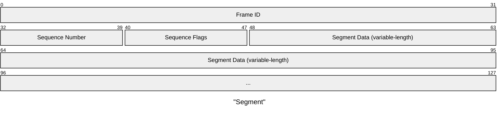

| Field               | Size     | Description                             | Valid Range                    |
| ------------------- | -------- | --------------------------------------- | ------------------------------ |
| **Frame ID**        | 4 bytes  | Frame identifier                        | 1 to 4,294,967,295             |
| **Sequence Number** | 1 byte   | Segment position within frame (0-based) | 0-63                           |
| **Sequence Flags**  | 1 byte   | Segment metadata flags                  | See Sequence Flags table below |
| **Segment Data**    | Variable | Payload data                            | 0 to (`C - 10`) bytes          |

#### 4.3.2 Sequence Flags Bitmap

| Bit | Flag Name            | Description                     | Values                          |
| --- | -------------------- | ------------------------------- | ------------------------------- |
| 7   | **Termination Flag** | Indicates terminating segment   | `0` = Normal, `1` = Terminating |
| 6   | **Reserved**         | Reserved for future use         | MUST be `0`                     |
| 5-0 | **Segment Count**    | Total segments in frame minus 1 | `0`-`63` (1-64 segments)        |

#### 4.3.3 Segmentation Rules

| Rule                       | Requirement | Description                                                       |
| -------------------------- | ----------- | ----------------------------------------------------------------- |
| **Segmentation Threshold** | MUST        | Frames MUST be segmented when larger than `(C - 10)` bytes        |
| **Maximum Segments**       | MUST        | Maximum 64 segments per frame (6-bit sequence length field limit) |
| **Segment Sizing**         | SHOULD      | Each segment except the last SHOULD be of equal size              |
| **Empty Segments**         | MUST        | Empty segments MUST be valid (used for terminating segments)      |
| **Frame ID Ordering**      | MUST        | Frame IDs MUST be monotonically increasing within a session       |

#### 4.3.4 Protocol Constants

| Constant                   | Value         | Description                                        |
| -------------------------- | ------------- | -------------------------------------------------- |
| **Protocol Version**       | `0x01`        | Current protocol version                           |
| **Segment Overhead**       | 10 bytes      | Header overhead per segment (4 common + 6 segment) |
| **Maximum Frame ID**       | 4,294,967,295 | Maximum 32-bit frame identifier                    |
| **Maximum Segments**       | 64            | Maximum segments per frame                         |
| **Maximum Payload Length** | `C - 4` bytes | Maximum message payload size                       |

### 4.4 Retransmission Request Message

#### 4.4.1 Request Structure

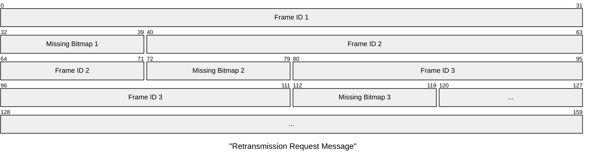

The message contains a sequence of 5-byte entries:

| Field              | Size    | Description                | Format                         |
| ------------------ | ------- | -------------------------- | ------------------------------ |
| **Frame ID**       | 4 bytes | Frame identifier           | 1 to 4,294,967,295             |
| **Missing Bitmap** | 1 byte  | Bitmap of missing segments | See Missing Bitmap table below |

#### 4.4.2 Missing Bitmap Format

| Bit | Sequence Number | Description                   |
| --- | --------------- | ----------------------------- |
| 0   | Segment 0       | `1` = Missing, `0` = Received |
| 1   | Segment 1       | `1` = Missing, `0` = Received |
| 2   | Segment 2       | `1` = Missing, `0` = Received |
| 3   | Segment 3       | `1` = Missing, `0` = Received |
| 4   | Segment 4       | `1` = Missing, `0` = Received |
| 5   | Segment 5       | `1` = Missing, `0` = Received |
| 6   | Segment 6       | `1` = Missing, `0` = Received |
| 7   | Segment 7       | `1` = Missing, `0` = Received |

**Note:** This message MUST be used only for frames with up to 8 segments (due to bitmap size limitation). Reliable sessions are limited to 7 segments per frame. Unreliable sessions SHOULD not have this limitation.

#### 4.4.3 Request Rules

| Rule              | Requirement | Description                                          |
| ----------------- | ----------- | ---------------------------------------------------- |
| **Ordering**      | MUST        | Entries MUST be ordered by Frame ID (ascending)      |
| **Padding**       | MAY         | Frame ID of `0` indicates padding (ignored)          |
| **Entry Limit**   | MUST        | Maximum entries per message: `(C - 4) / 5`           |
| **Segment Limit** | MUST        | Only the first 8 segments per frame can be requested |

### 4.5 Frame Acknowledgement Message

#### 4.5.1 Acknowledgement Structure

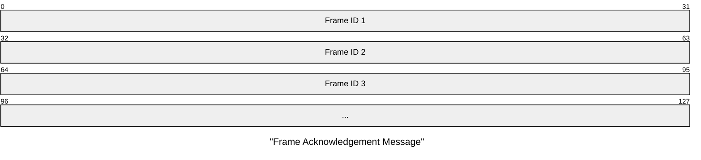

| Field             | Size         | Description                              | Rules                                 |
| ----------------- | ------------ | ---------------------------------------- | ------------------------------------- |
| **Frame ID List** | 4 bytes each | List of fully received frame identifiers | See Acknowledgement Rules table below |

#### 4.5.2 Acknowledgement Rules

| Rule             | Requirement | Description                                     |
| ---------------- | ----------- | ----------------------------------------------- |
| **Ordering**     | MUST        | Frame IDs MUST be in ascending order            |
| **Padding**      | MAY         | Frame ID of `0` indicates padding (ignored)     |
| **Entry Limit**  | MUST        | Maximum frame IDs per message: `(C - 4) / 4`    |
| **Completeness** | MUST        | Only acknowledge frames that are fully received |

### 4.6 Protocol State Machines

#### 4.6.1 Unreliable Socket State Machine

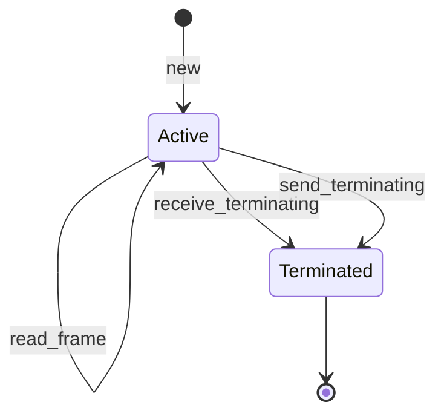

#### 4.6.2 Reliable Socket State Machine

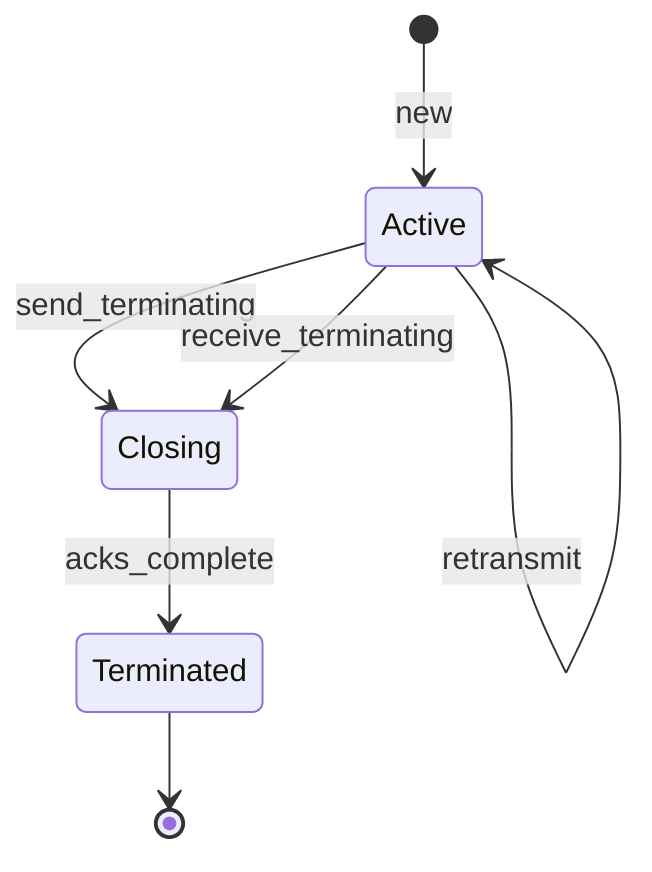

### 4.7 Timing and Reliability Parameters

#### 4.7.1 Unreliable Mode

- No acknowledgements or retransmissions
- Frames may be delivered out-of-order
- No delivery guarantees
- Suitable for real-time or loss-tolerant applications

#### 4.7.2 Reliable Mode Parameters

| Parameter                    | Default Value | Description                           | Requirement            |
| ---------------------------- | ------------- | ------------------------------------- | ---------------------- |
| **Frame Timeout**            | 800ms         | Time before requesting retransmission | SHOULD be configurable |
| **Acknowledgement Window**   | 255 frames    | Maximum unacknowledged frames         | MUST NOT exceed 255    |
| **Retransmission Limit**     | 3 attempts    | Maximum retransmission attempts       | Implementation-defined |
| **Acknowledgement Batching** | 100ms         | Maximum delay for batching ACKs       | SHOULD be configurable |

### 4.8 Session Termination

1. Either party MAY send a terminating segment (empty segment with termination flag set)
2. Upon receiving a terminating segment:
   - Unreliable sockets SHOULD close immediately
   - Reliable sockets MUST complete pending acknowledgements before closing
3. No data frames MUST be sent after a terminating segment

### 4.9 Example Message Exchanges

All numeric values in the examples below are shown in their logical representation. Frame IDs and other multi-byte integers are encoded in big-endian format on the wire.

#### 4.9.1 Simple Frame Transmission (Unreliable Mode)

Sending a 300-byte frame with MTU=256 (246 bytes available per segment after 10-byte overhead):

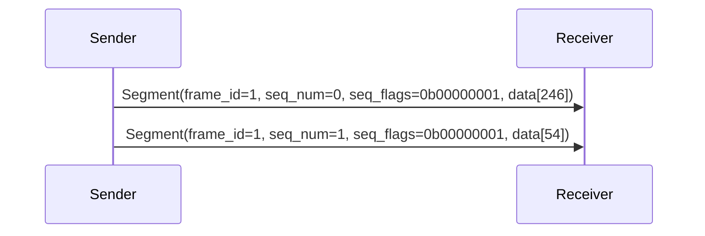

#### 4.9.2 Frame with Retransmission (Reliable Mode)

Reliable transmission where the middle segment is lost and retransmitted:

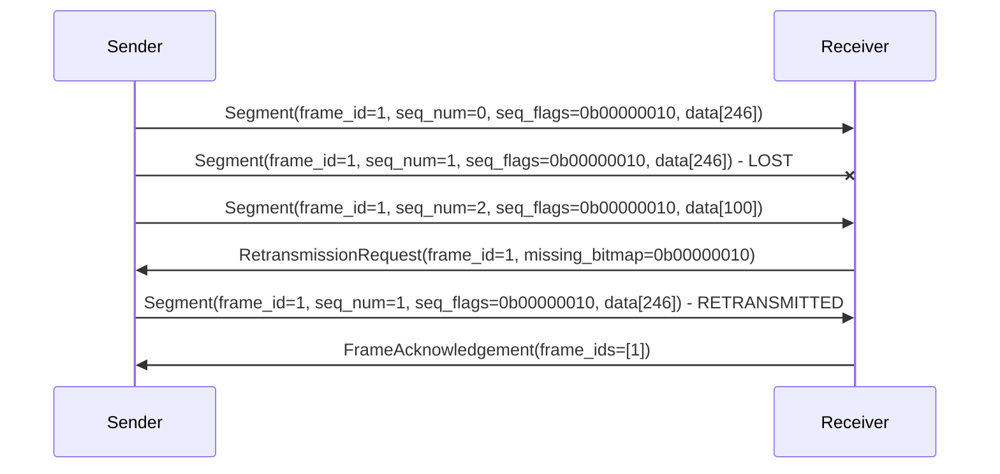

#### 4.9.3 Multiple Frame Acknowledgement (Reliable Mode)

Efficiently acknowledging multiple received frames in a batch:

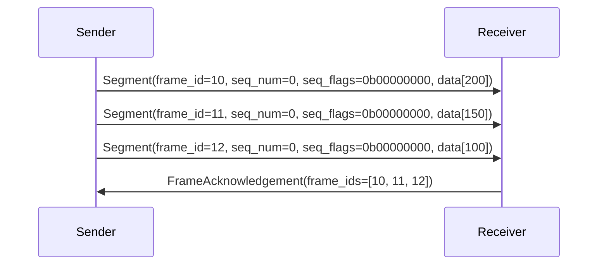

#### 4.9.4 Session Termination (Reliable Mode)

Graceful session termination with acknowledgement:

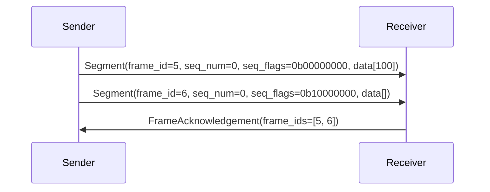

#### 4.9.5 Session Termination (Unreliable Mode)

Immediate session termination without acknowledgement:

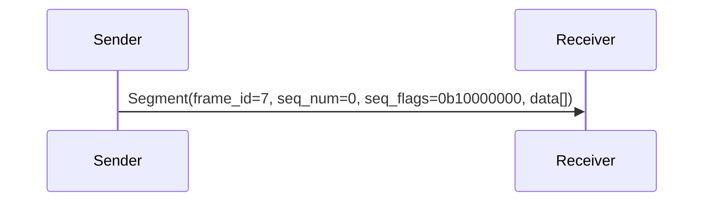

## 5. Design Considerations

### 5.1 Maximum Segments Limitation

The protocol limits frames to 64 segments due to the 6-bit sequence length field. This provides a good balance between:

- Frame size flexibility (up to 64 × MTU)
- Protocol overhead (1 byte for sequence information)
- Implementation complexity (simple bitmap for retransmissions)

### 5.2 Frame ID Space

The 32-bit Frame ID space allows for over 4 billion frames per session. Frame IDs MUST be monotonically increasing to enable:

- Duplicate detection
- Out-of-order delivery handling
- Simple state management

The Session MUST terminate when Frame ID of 0 is encountered by the receiving side, indicating an overflow.

### 5.3 Retransmission Request Design

Limiting retransmission requests to the first 8 segments per frame:

- Keeps message format simple (1-byte bitmap)
- Covers the common case (most frames have ≤8 segments)
- Frames requiring >8 segments can use smaller frame sizes

### 5.4 Protocol Overhead

- Minimum overhead per segment: 10 bytes (4 header + 6 segment header)
- Maximum protocol efficiency: (C - 10) / C
- For C = 1024: ~99% efficiency
- For C = 256: ~96% efficiency

## 6. Compatibility

### 6.1 Version Compatibility

- Version 1 is the initial Session Data protocol version
- Future versions MUST use different version numbers
- Implementations MUST reject messages with unknown versions
- Version negotiation is out of scope for this specification

### 6.2 Transport Requirements

- Requires bidirectional communication channel
- No assumptions about ordering or reliability

## 7. Security Considerations

### 7.1 Protocol Security

- The protocol provides NO encryption or authentication
- Security MUST be provided by the underlying transport
- Frame IDs are predictable and MUST NOT be used for security

## 8. Future Work

- Enhanced acknowledgement schemes for better efficiency
- Forward error correction for high-loss environments

## 9. Implementation Notes

### 9.1 Testing Recommendations

- Test with various MTU sizes (256, 512, 1024, 1500, 9000)
- Simulate packet loss, reordering, and duplication
- Verify termination handling under all conditions
- Stress test with maximum frame sizes and counts

## 10. References

[01] Postel, J. (1981). [Transmission Control Protocol](https://datatracker.ietf.org/doc/html/rfc793). _IETF RFC 793_.

[02] Bormann, C. & Hoffman, P. (2013). [Concise Binary Object Representation (CBOR)](https://datatracker.ietf.org/doc/html/rfc7049). _IETF RFC 7049_.

[03] Postel, J. (1980). [User Datagram Protocol](https://datatracker.ietf.org/doc/html/rfc768). _IETF RFC 768_.
