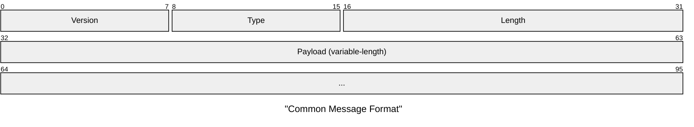
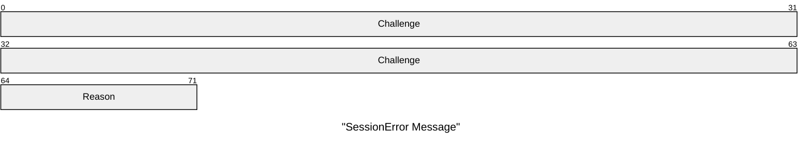
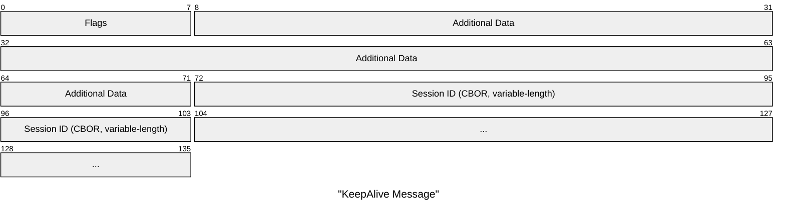
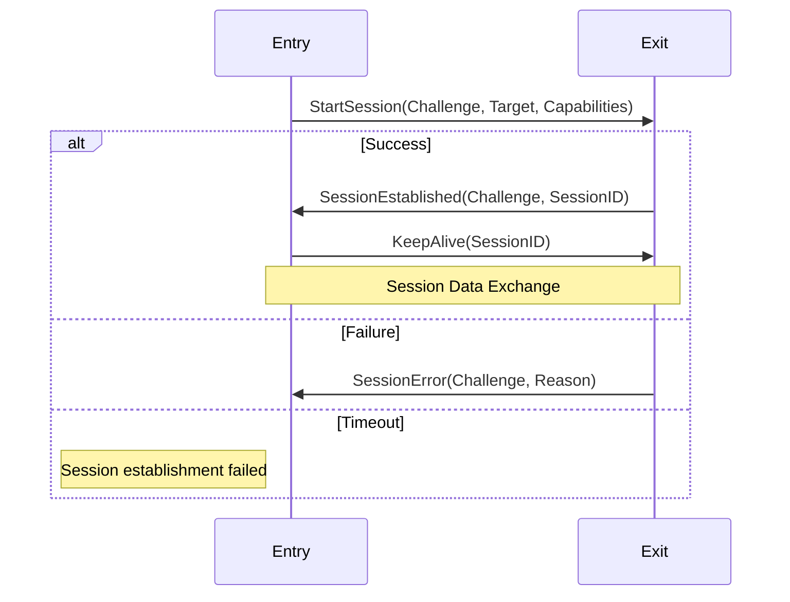
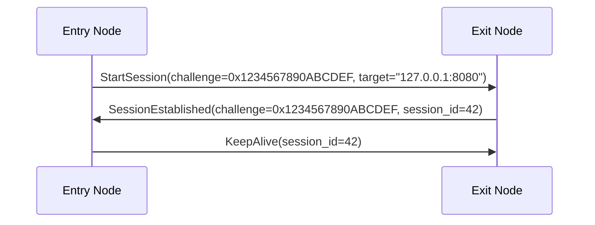
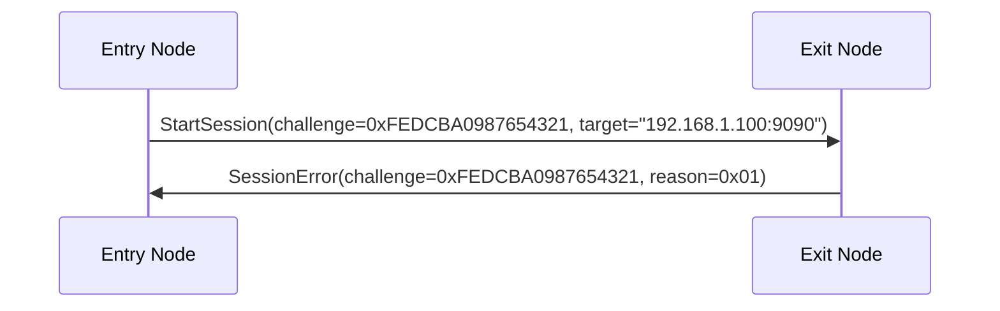
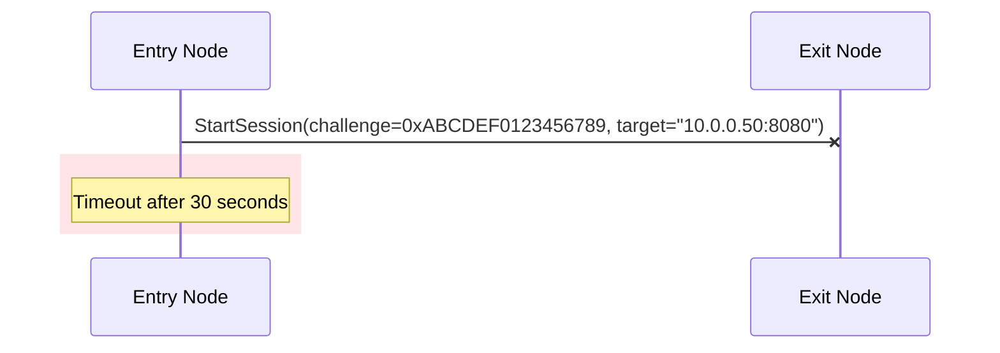
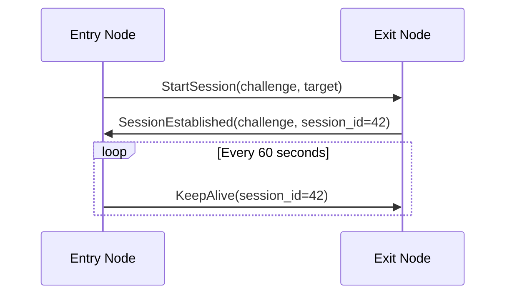

# RFC-0009: Session Start Protocol

- **RFC Number:** 0009
- **Title:** Session Start Protocol
- **Status:** Finalized
- **Author(s):** Tino Breddin (@tolbrino), Lukas Pohanka (@NumberFour8)
- **Created:** 2025-08-20
- **Updated:** 2025-09-05
- **Version:** v1.0.0 (Finalized)
- **Supersedes:** none
- **Related Links:** [RFC-0002](../RFC-0002-mixnet-keywords/0002-mixnet-keywords.md),
  [RFC-0004](../RFC-0004-hopr-packet-protocol/0004-hopr-packet-protocol.md), [RFC-0008](../RFC-0008-session-protocol/0008-session-protocol.md),
  [RFC-0011](../RFC-0011-application-protocol/0011-application-protocol.md)

## 1. Abstract

This RFC specifies the HOPR session start protocol, which provides a handshake mechanism for establishing communication sessions between peers in the HOPR mixnet. The protocol manages session establishment, lifecycle management, and capability negotiation, using HOPR packets as the underlying transport layer. It defines a standardised method for initiating sessions, exchanging session parameters (identifiers, targets, and capabilities), and maintaining session state through periodic keep-alive messages.

The session start protocol operates independently of the session data protocol ([RFC-0008](../RFC-0008-session-protocol/0008-session-protocol.md)), which handles actual data transmission once a session has been established. This separation allows the handshake mechanism to evolve independently from data transfer protocols.

## 2. Motivation

The HOPR mixnet requires a standardised mechanism for establishing communication sessions between nodes. While the session data protocol ([RFC-0008](../RFC-0008-session-protocol/0008-session-protocol.md)) handles reliable and unreliable data transmission, a complementary protocol is needed for session initialisation. The session start protocol addresses the following requirements:

1. **Session establishment**: Provide a handshake mechanism to initiate sessions with capability negotiation, allowing peers to agree on session parameters before data exchange begins.

2. **Session identification**: Enable exchange of unique session identifiers and target endpoints, ensuring both peers can correctly route subsequent messages.

3. **Lifecycle management**: Define clear state transitions for session establishment, including timeout handling and graceful error reporting.

4. **Error handling**: Provide structured error reporting for common failure scenarios (e.g., resource exhaustion, busy nodes), enabling intelligent retry logic.

5. **Liveness maintenance**: Support keep-alive mechanisms to maintain long-lived sessions and detect peer failures.

The session start protocol is intentionally lightweight and transport-agnostic, making it suitable for use over various packet-based transports while being optimised for the HOPR mixnet.

## 3. Terminology

Terms defined in [RFC-0002](../RFC-0002-mixnet-keywords/0002-mixnet-keywords.md) are used throughout this specification. Additionally, this document defines the following session start protocol-specific terms:

- **challenge**: A 64-bit random value used to correlate requests and responses in the handshake process. Challenge values MUST be generated using a cryptographically secure pseudo-random number generator (CSPRNG) and are interpreted as big-endian unsigned integers.

- **session target**: The destination or purpose of a session, typically representing an address or service identifier. Session targets are encoded using CBOR format [01] to allow flexible representation of various endpoint types (e.g., IPv4/IPv6 addresses with ports, service URIs).

- **session capabilities**: A bitmap of session features and options negotiated during session establishment. The capabilities field enables peers to agree on optional protocol features, with unrecognised bits being safely ignored to support backward compatibility.

- **session ID**: A unique identifier assigned by the responder to identify an established session. Session IDs are encoded using CBOR format and MUST be unique within the responder's session namespace. Within HOPR, session IDs follow a specific format (see Appendix 1).

- **entry node**: The node that initiates a session establishment request. The entry node generates the initial challenge and specifies the desired session target and capabilities.

- **exit node**: The node that receives and responds to a session establishment request. The exit node validates the request, assigns a unique session ID upon success, and returns either a `SessionEstablished` or `SessionError` message.

## 4. Specification

### 4.1 Protocol Overview

The session start protocol operates at version 2 and defines four message types that manage the complete lifecycle of session establishment and maintenance:

1. **StartSession**: Initiates a new session, carrying the challenge, target endpoint, and capability flags.
2. **SessionEstablished**: Confirms successful session establishment, returning the original challenge and newly assigned session ID.
3. **SessionError**: Reports session establishment failure with a specific error code and the original challenge for correlation.
4. **KeepAlive**: Maintains session liveness by periodically signalling that the session is still active.

The protocol uses HOPR packets as the underlying transport mechanism and supports both successful and failed session establishment scenarios. All multi-byte integer fields use network byte order (big-endian) encoding to ensure consistent interpretation across different architectures and implementations.

### 4.2 Message Format

All session start protocol messages share a common header structure that enables protocol versioning, message type discrimination, and variable-length payloads:

| Field       | Size     | Description               | Value                         |
| ----------- | -------- | ------------------------- | ----------------------------- |
| **Version** | 1 byte   | Protocol version          | MUST be `0x02` for version 2  |
| **Type**    | 1 byte   | Message type discriminant | See Message Types table below |
| **Length**  | 2 bytes  | Payload length in bytes   | 0-65535                       |
| **Payload** | Variable | Message-specific data     | CBOR-encoded where applicable |

#### 4.2.1 Message Types

| Type Code | Name               | Description                           |
| --------- | ------------------ | ------------------------------------- |
| `0x00`    | StartSession       | Initiates a new session               |
| `0x01`    | SessionEstablished | Confirms session establishment        |
| `0x02`    | SessionError       | Reports session establishment failure |
| `0x03`    | KeepAlive          | Maintains session liveness            |

#### 4.2.2 Byte Order

All multi-byte integer fields and values in the session start protocol MUST be encoded and interpreted in network byte order (big-endian). This applies to the following fields:

**Protocol message fields:**

- **Length** field (2 bytes) in the common message format
- **Challenge** field (8 bytes) in `StartSession`, `SessionEstablished`, and `SessionError` messages
- **Additional Data** field (4 bytes) in `StartSession` messages
- **Additional Data** field (8 bytes) in `KeepAlive` messages
- **Session ID suffix** (64-bit) in HOPR session ID format (see Appendix 1)
- Any future numeric fields added to the protocol

This requirement ensures consistent interpretation across different architectures (e.g., x86, ARM, RISC-V) and prevents interoperability issues between implementations.

### 4.3 StartSession Message

The `StartSession` message initiates a new session with a remote peer. The entry node sends this message to request session establishment, specifying the desired target endpoint and capability flags.

| Field               | Size     | Description                                          | Notes                                                                  |
| ------------------- | -------- | ---------------------------------------------------- | ---------------------------------------------------------------------- |
| **Challenge**       | 8 bytes  | Random challenge for correlating responses           | MUST be generated using CSPRNG to prevent prediction                   |
| **Capabilities**    | 1 byte   | Session capabilities bitmap                          | See Capability Flags table; unrecognised bits SHOULD be ignored        |
| **Additional Data** | 4 bytes  | Capability-dependent options                         | Set to `0x00000000` if unused; interpretation depends on capabilities  |
| **Target**          | Variable | CBOR-encoded session target                          | Examples: `"127.0.0.1:1234"`, `"wss://relay.example.com:443"`          |

#### 4.3.1 Capability Flags

| Bit | Flag Name | Description             |
| --- | --------- | ----------------------- |
| 0   | Reserved  | Reserved for future use |
| 1   | Reserved  | Reserved for future use |
| 2   | Reserved  | Reserved for future use |
| 3   | Reserved  | Reserved for future use |
| 4   | Reserved  | Reserved for future use |
| 5   | Reserved  | Reserved for future use |
| 6   | Reserved  | Reserved for future use |
| 7   | Reserved  | Reserved for future use |

### 4.4 SessionEstablished Message

The `SessionEstablished` message confirms successful session establishment. The exit node sends this message in response to a valid `StartSession` request, assigning a unique session ID that will be used for all subsequent communication in this session.

| Field                  | Size     | Description                              | Notes                                                                       |
| ---------------------- | -------- | ---------------------------------------- | --------------------------------------------------------------------------- |
| **Original Challenge** | 8 bytes  | Challenge from `StartSession` message    | MUST exactly match the challenge from the initiating `StartSession` request |
| **Session ID**         | Variable | CBOR-encoded session identifier          | Assigned by exit node; MUST be unique within exit node's session namespace |

### 4.5 SessionError Message

The `SessionError` message reports session establishment failure. The exit node sends this message when it cannot establish a session, providing a specific error code to indicate the reason for failure. This enables the entry node to implement intelligent retry logic or select alternative exit nodes.

| Field         | Size    | Description                              | Notes                                                                       |
| ------------- | ------- | ---------------------------------------- | --------------------------------------------------------------------------- |
| **Challenge** | 8 bytes | Challenge from `StartSession` message    | MUST exactly match the challenge from the initiating `StartSession` request |
| **Reason**    | 1 byte  | Error reason code                        | See Error Codes table below                                                 |

#### 4.5.1 Error Codes

| Code   | Name               | Description                                          | Recommended Action                                                |
| ------ | ------------------ | ---------------------------------------------------- | ----------------------------------------------------------------- |
| `0x00` | Unknown Error      | Unspecified error condition                          | Retry with different parameters or select alternative exit node   |
| `0x01` | No Slots Available | Exit node has no available session slots             | Retry after delay or select alternative exit node                 |
| `0x02` | Busy               | Exit node is temporarily busy processing requests    | Retry after brief exponential backoff delay                       |

### 4.6 KeepAlive Message

The `KeepAlive` message maintains session liveness. Either peer can send this message periodically to signal that the session is still active and prevent session timeout. The frequency of keep-alive messages depends on the session timeout policy of the peers.

| Field               | Size     | Description                              | Notes                                                                            |
| ------------------- | -------- | ---------------------------------------- | -------------------------------------------------------------------------------- |
| **Flags**           | 1 byte   | Reserved for future use                  | MUST be set to `0x00` by senders; SHOULD be ignored by receivers                |
| **Additional Data** | 8 bytes  | Flag-dependent options                   | Set to `0x0000000000000000` if unused; interpretation may depend on future flags |
| **Session ID**      | Variable | CBOR-encoded session identifier          | MUST match an established session ID                                             |

### 4.7 Protocol Flow

### 4.8 Protocol Constants

| Constant               | Value       | Description                                              |
| ---------------------- | ----------- | -------------------------------------------------------- |
| **Protocol Version**   | `0x02`      | Current protocol version                                 |
| **Default Timeout**    | 30 seconds  | Default session establishment timeout (SHOULD be configurable) |
| **Challenge Size**     | 8 bytes     | Fixed size for challenge field                           |
| **Max Payload Length** | 65535 bytes | Maximum message payload size (limited by Length field)   |

### 4.9 Protocol Rules

| Rule                      | Requirement Level | Description                                                                                     |
| ------------------------- | ----------------- | ----------------------------------------------------------------------------------------------- |
| **Challenge Generation**  | MUST              | Challenge values MUST be randomly generated using a cryptographically secure PRNG               |
| **Session ID Uniqueness** | MUST              | Session IDs MUST be unique within the exit node's session namespace                             |
| **Byte Order**            | MUST              | All multi-byte integer fields MUST use network byte order (big-endian)                          |
| **CBOR Encoding**         | MUST              | Session targets and session IDs MUST use CBOR encoding [01]                                     |
| **Payload Limits**        | MUST              | Messages MUST fit within HOPR packet payload limits (see [RFC-0004](../RFC-0004-hopr-packet-protocol/0004-hopr-packet-protocol.md)) |
| **Keep-Alive Frequency**  | SHOULD            | `KeepAlive` messages SHOULD be sent periodically to maintain long-lived sessions                |
| **Error Handling**        | MUST              | Implementations MUST handle all defined error conditions gracefully                             |
| **Timeout Configuration** | SHOULD            | Session establishment timeouts SHOULD be configurable (default: 30s)                            |

### 4.10 Example Message Exchanges

#### 4.10.1 Successful Session Establishment

Complete successful session establishment with immediate keep-alive:

#### 4.10.2 Session Establishment Failure

Session establishment failing due to resource exhaustion:

#### 4.10.3 Session Establishment Timeout

Session establishment with no response from exit node, resulting in timeout:

#### 4.10.4 Long-Running Session with Periodic Keep-Alives

Maintaining an established session over time:

## 5. Design Considerations

### 5.1 CBOR Encoding

The use of CBOR (Concise Binary Object Representation) [01] for session IDs and session targets provides several advantages:

- **Flexible data types**: Supports various data types without fixed-size constraints, enabling session IDs and targets to be represented as integers, strings, byte arrays, or structured data.
- **Compact binary encoding**: More efficient than text-based formats like JSON, reducing packet overhead in the constrained HOPR packet payload.
- **Language-agnostic serialisation**: Standardised format with implementations available in multiple programming languages, facilitating interoperability.
- **Support for complex identifiers**: Enables session identifiers to encode additional metadata when needed (e.g., node identifiers, timestamps, or routing hints).

### 5.2 Challenge-Response Design

The 64-bit challenge field serves multiple purposes in the session start protocol:

- **Request-response correlation**: Enables the entry node to match `SessionEstablished` or `SessionError` responses to the corresponding `StartSession` request, even when multiple requests are pending simultaneously.
- **Protection against replay attacks**: When combined with transport-level security, the unpredictable challenge prevents an attacker from replaying a captured `StartSession` message to establish unauthorised sessions.
- **Simple state tracking**: The challenge allows implementations to maintain minimal state for pending session establishment requests, using the challenge as a key in a hash table or similar data structure.
- **Low collision probability**: With 2^64 possible values and cryptographically secure random generation, the probability of challenge collisions is negligible even with many concurrent requests.

### 5.3 Capability Negotiation

The single-byte capability field provides a compact mechanism for protocol negotiation:

- **Up to 8 independent flags**: Each bit can represent a distinct capability, allowing peers to negotiate multiple features simultaneously.
- **Future protocol extensions**: As new session features are developed, capability bits can be assigned without changing the message format or breaking existing implementations.
- **Backward compatibility**: Implementations can safely ignore unrecognised capability bits, allowing newer implementations to interoperate with older ones that don't support new features.
- **Minimal overhead**: A single byte adds negligible overhead while providing sufficient flexibility for anticipated protocol evolution.

### 5.4 Transport Independence

The session start protocol is intentionally transport-agnostic, making it suitable for various network environments:

- **Packet-based transport**: Works over any packet-based transport layer that provides bidirectional communication.
- **Designed for HOPR, not limited to it**: While optimised for HOPR packets ([RFC-0004](../RFC-0004-hopr-packet-protocol/0004-hopr-packet-protocol.md)), the protocol can be used over other transports such as raw UDP, WebSockets, or QUIC.
- **No ordering assumptions**: The protocol does not require ordered message delivery, making it suitable for unreliable transports.
- **No reliability assumptions**: The protocol does not depend on reliable delivery; implementations can add timeouts and retransmission logic as needed for their specific transport.

### 5.5 Error Handling

The protocol provides structured error reporting to enable intelligent failure handling:

- **Specific error codes**: Well-defined error codes (Unknown Error, No Slots Available, Busy) enable entry nodes to distinguish between different failure scenarios and adjust their behaviour accordingly.
- **Challenge correlation**: Including the original challenge in error messages ensures that entry nodes can correctly attribute errors to specific requests.
- **Graceful resource exhaustion**: The "No Slots Available" error allows exit nodes to signal capacity limits without dropping requests silently, enabling entry nodes to try alternative exit nodes.
- **Temporary vs. permanent failures**: The error code taxonomy distinguishes between temporary failures (Busy) that warrant retry and semi-permanent failures (No Slots Available) that suggest trying a different node.

## 6. Compatibility

### 6.1 Version Compatibility

- Version 2 (`0x02`) is the initial version of the session start protocol specified in this document.
- Future versions MUST use different version numbers to distinguish themselves from version 2.
- Implementations MUST reject messages with unknown or unsupported version numbers.
- Version negotiation mechanisms are out of scope for this specification; if needed, they should be addressed in future RFCs.

### 6.2 Transport Requirements

- The protocol requires a bidirectional communication channel between entry and exit nodes.
- No assumptions are made about message ordering; messages may arrive out of order.
- No assumptions are made about reliability; implementations should add timeout and retransmission logic as appropriate.
- Compatible with any transport that provides packet delivery (e.g., UDP, HOPR packets, QUIC, WebSockets).
- Designed for the HOPR mixnet but not limited to it; the protocol can be deployed over other privacy-preserving or traditional networks.

### 6.3 Integration with HOPR Session Data Protocol

- The session start protocol establishes sessions that are subsequently used by the session data protocol ([RFC-0008](../RFC-0008-session-protocol/0008-session-protocol.md)) for reliable and unreliable data transmission.
- Session IDs assigned by this protocol are used to identify data sessions in the session data protocol.
- The two protocols operate independently: session start handles handshake and lifecycle, while session data handles message transmission.
- Session establishment MUST complete successfully before data transmission can begin.

## 7. Security Considerations

### 7.1 Protocol Security

- The session start protocol provides NO encryption or authentication by itself.
- Security properties (confidentiality, integrity, authenticity) MUST be provided by the underlying transport layer.
- Session IDs SHOULD be unpredictable to prevent session hijacking and enumeration attacks.
- Challenges MUST be generated using cryptographically secure random number generation to prevent prediction and replay attacks.

### 7.2 Attack Vectors

The following attack vectors exist when the protocol is used without adequate transport-level security:

- **Replay attacks**: Captured `StartSession` messages can be replayed without additional timestamp or nonce mechanisms. Mitigation requires transport-level encryption and authentication.
- **Man-in-the-middle attacks**: The protocol alone does not prevent an active attacker from intercepting and modifying messages. Transport-level security is required.
- **Information disclosure**: Session targets may expose service information (e.g., destination addresses) if not encrypted at the transport layer.
- **Resource exhaustion**: Attackers can flood exit nodes with excessive session establishment requests, potentially exhausting available session slots. Rate limiting is essential.
- **Session hijacking**: Predictable session IDs enable attackers to guess valid session identifiers and hijack established sessions. Session IDs MUST be generated unpredictably.

### 7.3 Mitigation Strategies

Implementations SHOULD employ the following strategies to mitigate security risks:

- **Transport-level security**: Use HOPR packet encryption ([RFC-0004](../RFC-0004-hopr-packet-protocol/0004-hopr-packet-protocol.md)) or other transport-level encryption and authentication mechanisms to protect against replay, man-in-the-middle, and information disclosure attacks.
- **Rate limiting**: Implement rate limiting for incoming session establishment requests to prevent resource exhaustion attacks. Limits can be per-peer or global.
- **Unpredictable session identifiers**: Generate session IDs using cryptographically secure random number generators to prevent session hijacking and enumeration.
- **Session timeout mechanisms**: Implement session timeouts to automatically clean up stale sessions and free resources. Keep-alive messages can be used to maintain active sessions.
- **Challenge expiration**: Optionally expire challenges after a configurable timeout to limit the window for replay attacks.

## 8. Future Work

Potential areas for future protocol enhancements include:

- **Session parameter renegotiation**: Mechanisms to renegotiate session parameters (capabilities, targets) without tearing down and re-establishing the session.
- **Performance optimisations**: Techniques to reduce session establishment latency for high-frequency session creation scenarios, such as session pooling or 0-RTT establishment.
- **Enhanced capability negotiation**: More sophisticated capability negotiation mechanisms, including capability versioning and feature discovery.
- **Heartbeat and health monitoring**: Enhanced keep-alive mechanisms that can carry health status information or quality-of-service metrics.

## 9. Implementation Notes

### 9.1 Testing Recommendations

Implementations SHOULD include comprehensive tests covering:

- **Session target format variations**: Test with various session target formats (IPv4, IPv6, service URIs, edge cases) to ensure correct CBOR encoding and decoding.
- **Network failure simulation**: Simulate packet loss, delays, and timeouts to verify correct timeout handling and retransmission logic.
- **Challenge uniqueness and correlation**: Verify that challenges are generated uniquely and that responses are correctly correlated with requests, including handling of duplicate challenges.
- **Capability negotiation edge cases**: Test capability negotiation with various combinations of set and unset capability bits, including forward and backward compatibility scenarios.
- **CBOR encoding correctness**: Validate that CBOR encoding and decoding of session IDs and targets is correct and handles all expected data types.
- **Error handling**: Test all error codes and verify that error messages are correctly generated and handled.

## 10. References

[01] Bormann, C. & Hoffman, P. (2013). [Concise Binary Object Representation (CBOR)](https://datatracker.ietf.org/doc/html/rfc7049). _IETF RFC 7049_.

## 11. Appendix 1

Within the HOPR protocol, a session is identified uniquely via the HOPR session ID. This consists of 10 pseudo-random bytes as a prefix and a 64-bit unsigned integer as a suffix. The 64-bit suffix is encoded and interpreted as a big-endian unsigned integer.

In human-readable format, a HOPR session ID has the following syntax:

`0xabcdefabcdefabcdefab:123456`

The prefix (`0xabcdefabcdefabcdefab`) represents a fixed pseudonym prefix in the HOPR packet protocol (as specified in [RFC-0004](../RFC-0004-hopr-packet-protocol/0004-hopr-packet-protocol.md)). The suffix (`123456`) represents an application tag that identifies sessions within the reserved range in the application protocol ([RFC-0011](../RFC-0011-application-protocol/0011-application-protocol.md)).
