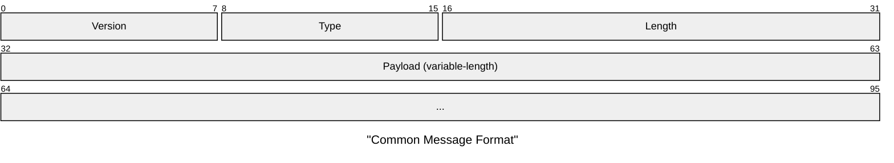
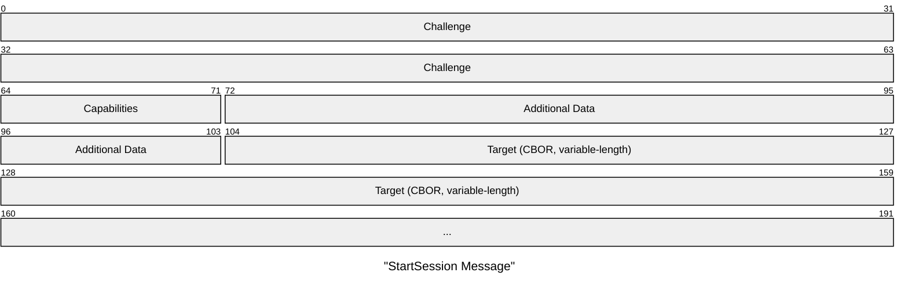
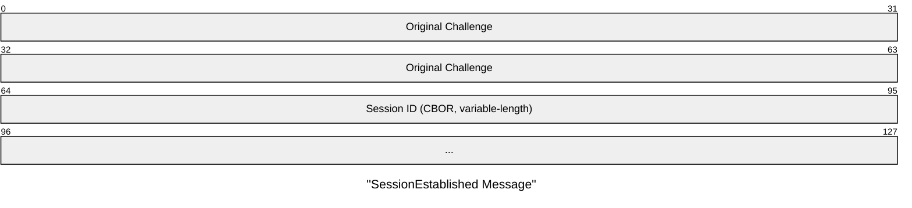
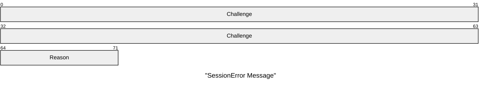
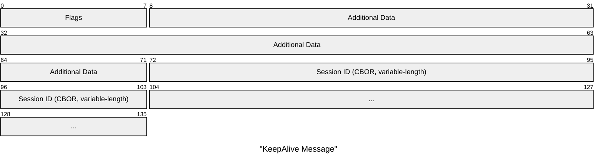
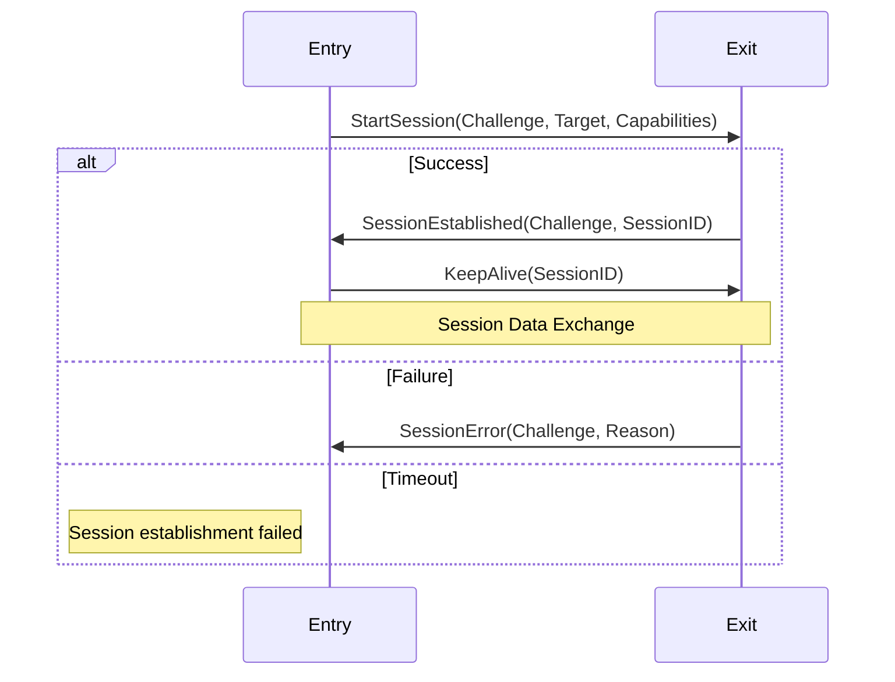
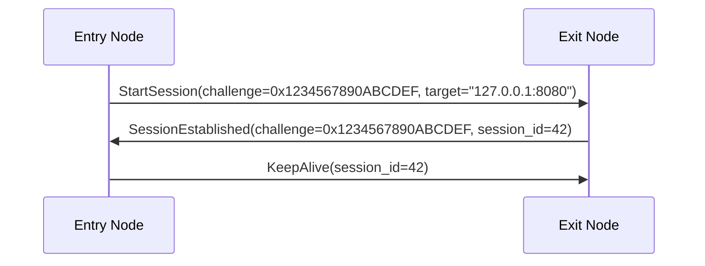
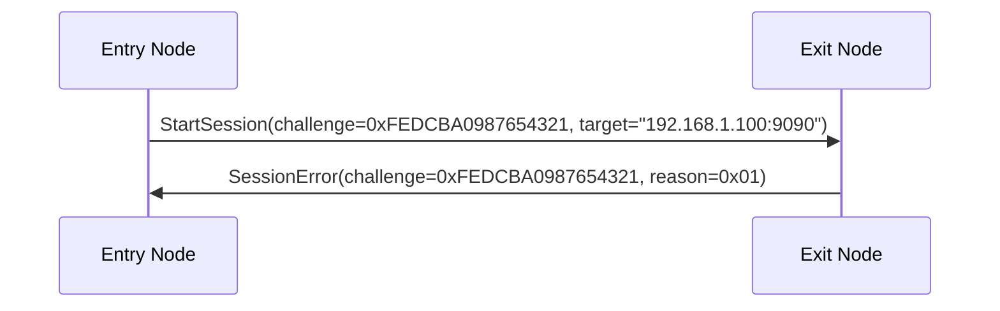
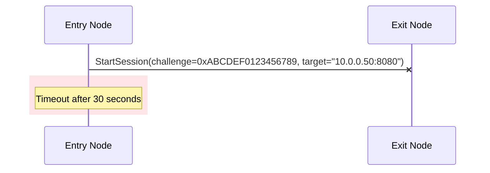
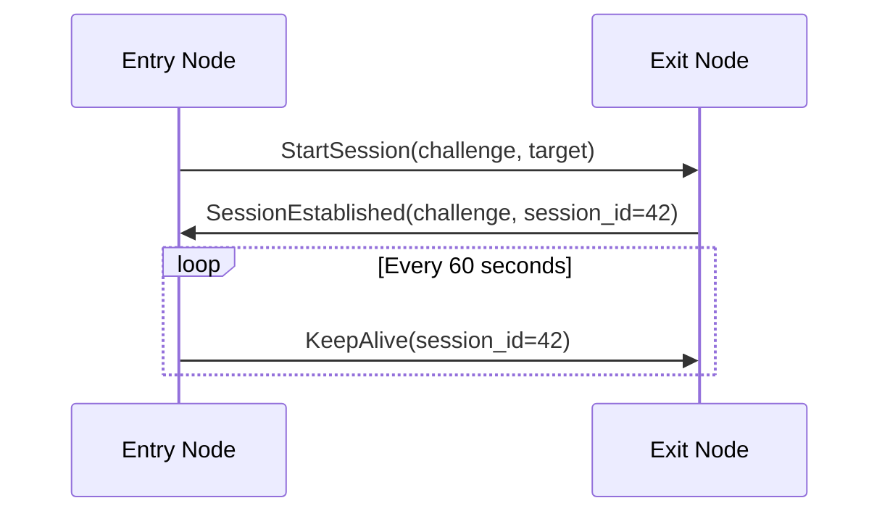

# RFC-0009: Session Start Protocol

- **RFC Number:** 0009
- **Title:** Session Start Protocol
- **Status:** Implementation
- **Author(s):** Tino Breddin (@tolbrino), Lukas Pohanka (@NumberFour8)
- **Created:** 2025-08-20
- **Updated:** 2025-09-05
- **Version:** v0.1.0 (Draft)
- **Supersedes:** none
- **Related Links:** [RFC-0002](../RFC-0002-mixnet-keywords/0002-mixnet-keywords.md),
  [RFC-0004](../RFC-0004-hopr-packet-protocol/0004-hopr-packet-protocol.md), [RFC-0008](../RFC-0008-session-protocol/0008-session-protocol.md),
  [RFC-0011](../RFC-0011-application-protocol/0011-application-protocol.md)

## 1. Abstract

This RFC specifies the HOPR Session Start Protocol, a handshake protocol for establishing sessions between peers in the HOPR mixnet. The protocol
manages session establishment, lifecycle, and capability negotiation using HOPR packets as transport. It provides a standardized method for initiating
communication sessions, exchanging session parameters, and maintaining session state through keep-alive mechanisms.

## 2. Motivation

The HOPR mixnet requires a standardized mechanism for establishing communication sessions between nodes. While the Session Data Protocol (see
[RFC-0008](../RFC-0008-session-protocol/0008-session-protocol.md)) handles data transmission, there needs to be a separate protocol for:

- Establishing sessions with capability negotiation
- Exchanging session identifiers and targets
- Managing session lifecycle and state
- Providing error handling for session establishment failures
- Maintaining session liveness through keep-alive mechanisms

The Session Start Protocol fills this gap by providing a lightweight, transport-agnostic handshake mechanism specifically designed for the HOPR
ecosystem.

## 3. Terminology

Terms defined in [RFC-0002](../RFC-0002-mixnet-keywords/0002-mixnet-keywords.md) are used. Additionally, this document defines the following session
start protocol-specific terms:

- **Challenge**: A 64-bit random value used to correlate requests and responses in the handshake process. Challenge values are interpreted as
  big-endian unsigned integers.

- **Session Target**: The destination or purpose of a session, typically an address or service identifier, encoded in CBOR format.

- **Session Capabilities**: A bitmap of session features and options negotiated during session establishment.

- **Session ID**: A unique identifier assigned by the responder to identify the established session.

- **Entry Node**: The node that initiates a session establishment request.

- **Exit Node**: The node that receives and responds to a session establishment request.

- **CBOR (Concise Binary Object Representation)**: A binary data serialization format defined in RFC 7049 [01], used for encoding session identifiers
  and targets.

## 4. Specification

### 4.1 Protocol Overview

The Session Start Protocol operates at version 2 and consists of four message types that manage the complete lifecycle of session establishment:

1. **StartSession**: Initiates a new session
2. **SessionEstablished**: Confirms session establishment
3. **SessionError**: Reports session establishment failure
4. **KeepAlive**: Maintains session liveness

The protocol uses HOPR packets as the underlying transport mechanism and supports both successful and failed session establishment scenarios. All
multi-byte integer fields use network byte order (big-endian) encoding to ensure consistent interpretation across different architectures.

### 4.2 Message Format

All Session Start Protocol messages follow a common structure:

| Field       | Size     | Description               | Value                         |
| ----------- | -------- | ------------------------- | ----------------------------- |
| **Version** | 1 byte   | Protocol version          | MUST be `0x02` for version 2  |
| **Type**    | 1 byte   | Message type discriminant | See Message Types table below |
| **Length**  | 2 bytes  | Payload length in bytes   | 0-65535                       |
| **Payload** | Variable | Message-specific data     | CBOR-encoded where applicable |

#### 4.2.1 Message Types

| Type Code | Name               | Description                           |
| --------- | ------------------ | ------------------------------------- |
| `0x00`    | StartSession       | Initiates a new session               |
| `0x01`    | SessionEstablished | Confirms session establishment        |
| `0x02`    | SessionError       | Reports session establishment failure |
| `0x03`    | KeepAlive          | Maintains session liveness            |

#### 4.2.2 Byte Order

All multi-byte integer fields and values in the Session Start Protocol MUST be encoded and interpreted in network byte order (big-endian). This
applies to:

**Protocol Message Fields:**

- **Length** field (2 bytes) in the common message format
- **Challenge** field (8 bytes) in StartSession, SessionEstablished, and SessionError messages
- **Additional Data** field (4 bytes) in StartSession messages
- **Additional Data** field (8 bytes) in KeepAlive messages
- **Session ID suffix** (64-bit) in HOPR Session ID format
- Any future numeric fields added to the protocol

This requirement ensures consistent interpretation across different architectures and prevents interoperability issues between implementations.

### 4.3 StartSession Message

Initiates a new session with the remote peer.

| Field               | Size     | Description                                | Notes                         |
| ------------------- | -------- | ------------------------------------------ | ----------------------------- |
| **Challenge**       | 8 bytes  | Random challenge for correlating responses | MUST use CSPRNG               |
| **Capabilities**    | 1 byte   | Session capabilities bitmap                | See Capability Flags table    |
| **Additional Data** | 4 bytes  | Capability-dependent options               | Set to `0x00000000` to ignore |
| **Target**          | Variable | CBOR-encoded session target                | e.g., "127.0.0.1:1234"        |

#### 4.3.1 Capability Flags

| Bit | Flag Name | Description             |
| --- | --------- | ----------------------- |
| 0   | Reserved  | Reserved for future use |
| 1   | Reserved  | Reserved for future use |
| 2   | Reserved  | Reserved for future use |
| 3   | Reserved  | Reserved for future use |
| 4   | Reserved  | Reserved for future use |
| 5   | Reserved  | Reserved for future use |
| 6   | Reserved  | Reserved for future use |
| 7   | Reserved  | Reserved for future use |

### 4.4 SessionEstablished Message

Confirms successful session establishment.

| Field                  | Size     | Description                         | Notes                                 |
| ---------------------- | -------- | ----------------------------------- | ------------------------------------- |
| **Original Challenge** | 8 bytes  | Challenge from StartSession message | MUST match original challenge         |
| **Session ID**         | Variable | CBOR-encoded session identifier     | Assigned by responder, MUST be unique |

### 4.5 SessionError Message

Reports session establishment failure.

| Field         | Size    | Description                         | Notes                         |
| ------------- | ------- | ----------------------------------- | ----------------------------- |
| **Challenge** | 8 bytes | Challenge from StartSession message | MUST match original challenge |
| **Reason**    | 1 byte  | Error reason code                   | See Error Codes table below   |

#### 4.5.1 Error Codes

| Code   | Name               | Description                              | Recommended Action                      |
| ------ | ------------------ | ---------------------------------------- | --------------------------------------- |
| `0x00` | Unknown Error      | Unspecified error condition              | Retry with different parameters or node |
| `0x01` | No Slots Available | Exit node has no available session slots | Retry later or try different node       |
| `0x02` | Busy               | Exit node is temporarily busy            | Retry after brief delay                 |

### 4.6 KeepAlive Message

Maintains session liveness.

| Field               | Size     | Description                     | Notes                                 |
| ------------------- | -------- | ------------------------------- | ------------------------------------- |
| **Flags**           | 1 byte   | Reserved for future use         | MUST be `0x00`                        |
| **Additional Data** | 8 bytes  | Flag-dependent options          | Set to `0x0000000000000000` to ignore |
| **Session ID**      | Variable | CBOR-encoded session identifier | MUST match established session        |

### 4.7 Protocol Flow

### 4.8 Protocol Constants

| Constant               | Value       | Description                           |
| ---------------------- | ----------- | ------------------------------------- |
| **Protocol Version**   | `0x02`      | Current protocol version              |
| **Default Timeout**    | 30 seconds  | Default session establishment timeout |
| **Challenge Size**     | 8 bytes     | Fixed size for challenge field        |
| **Max Payload Length** | 65535 bytes | Maximum message payload size          |

### 4.9 Protocol Rules

| Rule                      | Requirement Level | Description                                                          |
| ------------------------- | ----------------- | -------------------------------------------------------------------- |
| **Challenge Generation**  | MUST              | Challenge values MUST be randomly generated using CSPRNG             |
| **Session ID Uniqueness** | MUST              | Session IDs MUST be unique per responder                             |
| **Byte Order**            | MUST              | All multi-byte integer fields MUST use network byte order            |
| **CBOR Encoding**         | MUST              | Targets and Session IDs use CBOR encoding [01]                       |
| **Payload Limits**        | MUST              | Messages MUST fit within HOPR packet payload limits                  |
| **Keep-Alive Frequency**  | SHOULD            | KeepAlive messages SHOULD be sent periodically                       |
| **Error Handling**        | MUST              | Implementations MUST handle all defined error conditions gracefully  |
| **Timeout Configuration** | SHOULD            | Session establishment timeouts SHOULD be configurable (default: 30s) |

### 4.10 Example Message Exchanges

#### 4.10.1 Successful Session Establishment

Complete session establishment with immediate keep-alive:

#### 4.10.2 Session Establishment with Error

Session establishment failing due to resource exhaustion:

#### 4.10.3 Session Establishment Timeout

Session establishment with no response from Exit Node:

#### 4.10.4 Long-Running Session with Periodic Keep-Alives

Maintaining an established session over time:

## 5. Design Considerations

### 5.1 CBOR Encoding

The use of CBOR (Concise Binary Object Representation) for Session IDs and Targets provides:

- Flexible data types without fixed-size constraints
- Compact binary encoding
- Language-agnostic serialization
- Support for complex session identifiers

### 5.2 Challenge-Response Design

The 64-bit challenge provides:

- Correlation between requests and responses
- Protection against replay attacks (when combined with transport security)
- Simple state tracking for pending sessions

### 5.3 Capability Negotiation

The single-byte capability field allows:

- Up to 8 independent capability flags
- Future protocol extensions
- Backward compatibility through ignored bits

### 5.4 Transport Independence

The Session Start protocol is transport-agnostic:

- Works over any packet-based transport
- Designed for HOPR packets but not limited to them
- No assumptions about ordering or reliability

### 5.5 Error Handling

The protocol provides structured error reporting:

- Specific error codes for common failure scenarios
- Challenge correlation for error attribution
- Graceful handling of resource exhaustion

## 6. Compatibility

### 6.1 Version Compatibility

- Version 2 is the initial protocol version
- Future versions MUST use different version numbers
- Implementations MUST reject messages with unknown versions
- Version negotiation is out of scope for this specification

### 6.2 Transport Requirements

- Requires bidirectional communication channel
- No assumptions about ordering or reliability
- Compatible with any transport providing packet delivery
- Designed for HOPR mixnet but not limited to it

### 6.3 Integration with HOPR Session Data Protocol

- HOPR Session Start Protocol establishes sessions for use by HOPR Session Data Protocol (see
  [RFC-0008](../RFC-0008-session-protocol/0008-session-protocol.md))
- Session IDs from this protocol are used to identify data sessions
- Protocol operates independently but provides foundation for data exchange

## 7. Security Considerations

### 7.1 Protocol Security

- The protocol provides NO encryption or authentication
- Security MUST be provided by the underlying transport
- Session IDs SHOULD be unpredictable to prevent session hijacking
- Challenges MUST use cryptographically secure random number generation

### 7.2 Attack Vectors

- Replay attacks possible without additional timestamp or nonce mechanisms
- Man-in-the-middle attacks not prevented by protocol alone
- Session targets may expose service information if not encrypted at transport
- Resource exhaustion through excessive session establishment requests

### 7.3 Mitigation Strategies

- Use transport-level security (e.g., HOPR packet encryption)
- Implement rate limiting for session establishment requests
- Use unpredictable session identifiers
- Consider implementing session timeout mechanisms

## 8. Future Work

- Session parameter renegotiation mechanisms
- Performance optimizations for high-frequency session establishment

## 9. Implementation Notes

### 9.1 Testing Recommendations

- Test with various session target formats
- Simulate network failures and timeouts
- Verify challenge uniqueness and correlation
- Test capability negotiation edge cases
- Validate CBOR encoding/decoding correctness

## 10. References

[01] Bormann, C. & Hoffman, P. (2013). [Concise Binary Object Representation (CBOR)](https://datatracker.ietf.org/doc/html/rfc7049). _IETF RFC 7049_.

## 11. Related Links

- [RFC-0011 Application Layer protocol](../RFC-0011-application-protocol/0011-application-protocol.md)

## 12. Appendix 1

Within HOPR protocol a Session is identified uniquely via HOPR Session ID, this consists of a 10-byte pseudorandom bytes as prefix and 64-bit unsigned
integer as suffix. The 64-bit suffix is encoded and interpreted as a big-endian unsigned integer.

In human readable format, a HOPR Session ID has the following syntax:

`0xabcdefabcdefabcdefab:123456`

The prefix represents a fixed pseudonym prefix of in the HOPR Packet protocol (as in
[RFC-0004](../RFC-0004-hopr-packet-protocol/0004-hopr-packet-protocol.md)). The suffix represents an application tag that identifies Sessions within
the reserved range in the Application protocol [RFC-0011](../RFC-0011-application-protocol/0011-application-protocol.md).
