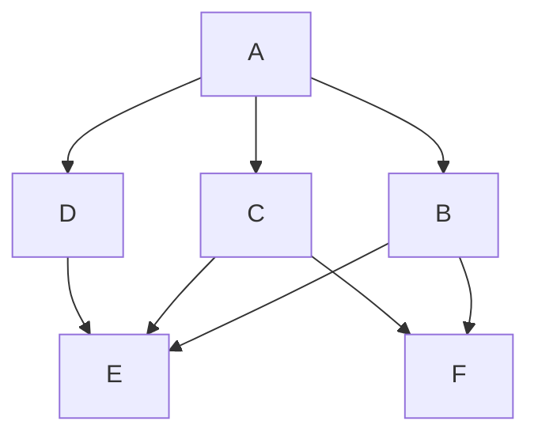
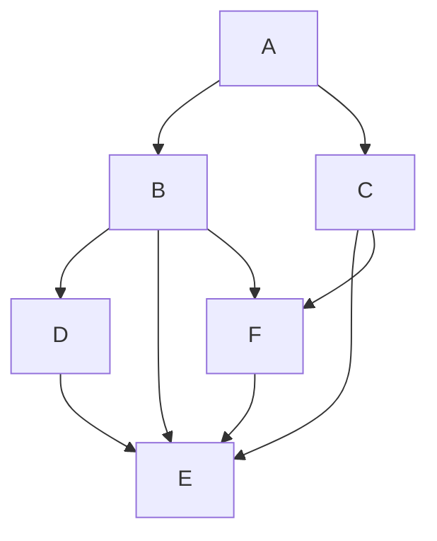

# RFC-0010: Automatic path discovery

- **RFC Number:** 0010
- **Title:** Automatic path discovery
- **Status:** Raw
- **Author(s):** @Teebor-Choka
- **Created:** 2025-02-25
- **Updated:** 2025-07-21
- **Version:** v0.0.1 (Raw)
- **Supersedes:** none
- **Related Links:** [RFC-0002](../RFC-0002-mixnet-keywords/0002-mixnet-keywords.md),
  [RFC-0004](../RFC-0004-hopr-packet-protocol/0004-hopr-packet-protocol.md), [RFC-0005](../RFC-0005-proof-of-relay/0005-proof-of-relay.md),
  [RFC-0008](../RFC-0008-session-protocol/0008-session-protocol.md), [RFC-0009](../RFC-0009-session-start-protocol/0009-session-start-protocol.md)

## 1. Abstract

This RFC specifies an automatic path discovery mechanism for the HOPR protocol, enabling it to function effectively within dynamic ad hoc peer-to-peer
networks. The mechanism allows message senders to remain anonymous while ensuring optimal message delivery by actively probing network nodes to assess
compliance with HOPR protocol functionality and detect non-adversarial behaviour. The specification defines complementary breadth-first and
depth-first graph traversal algorithms for topology discovery, along with telemetry collection methods to support path selection and
quality-of-service (QoS) assessment.

## 2. Motivation

Effective end-to-end communication over the HOPR protocol requires the sender to select viable paths across the network:

1. **Forward path**: From sender to destination for unidirectional communication.
2. **Return path**: From destination back to sender for bidirectional communication, established using Single-Use Reply Blocks (SURBs) as defined in
   [RFC-0004](../RFC-0004-hopr-packet-protocol/0004-hopr-packet-protocol.md).

The HOPR protocol does not define flow control at the network layer, as this responsibility is delegated to upper protocol layers (see
[RFC-0008](../RFC-0008-session-protocol/0008-session-protocol.md)). This design places the responsibility on each network node to track peer status
and network conditions to establish stable propagation paths with consistent transport link properties.

In the mixnet architecture, both forward and return paths MUST be constructed by the sender to preserve sender anonymity. Consequently, the sender
MUST maintain an accurate and current view of the network topology to create effective forward and return path pools. Without topology knowledge, the
sender cannot select paths that:

- Have adequate channel capacity and funding
- Provide acceptable latency and throughput
- Avoid unreliable or malicious relay nodes
- Maintain sufficient diversity for anonymity

Relay nodes and destinations also benefit from network discovery to ensure alignment between the incentivisation layer (payment channels) and the
network transport layer (physical connectivity).

## 3. Terminology

Terms defined in [RFC-0002](../RFC-0002-mixnet-keywords/0002-mixnet-keywords.md) are used.

## 4. Specification

### 4.1 Overview

This specification defines multiple complementary graph search algorithms for topology discovery. Implementations MUST support both breadth-first and
depth-first algorithms and employ them in concert, as exhaustive topology discovery becomes computationally prohibitive as network size increases. The
combination of these algorithms enables efficient discovery of immediate peers (breadth-first) and deeper paths (depth-first) while managing resource
consumption.

### 4.2 Network probing

The network discovery algorithms operate under the following assumptions about the network environment:

1. **Dynamic topology**: The network topology is not static and can change as individual nodes modify peer preferences, open or close payment
   channels, or go offline. For peers that require a relay for connectivity, the disappearance of the relay can cause topology reconfiguration.

2. **Unreliable nodes**: Any node in the network can be unreliable due to physical network infrastructure performance limitations, intermittent
   connectivity, or resource constraints.

3. **Malicious nodes**: Any node in the network can behave maliciously. Any behaviour resembling malicious activity SHOULD be considered malicious and
   appropriately flagged for exclusion from path selection.

Given these assumptions, the network probing algorithms for topology discovery employ multiple complementary mechanisms: a breadth-first algorithm
(BFA) and a depth-first algorithm (DFA).

Initially, implementations SHALL perform general network discovery using primarily the breadth-first approach to identify immediate peers and build an
initial topology view.

Once a statistically sufficient topology is identified to support path randomisation (typically when sufficient peer diversity exists for meaningful
path construction), the depth-first approach SHOULD be employed to probe specific topology paths of interest, such as paths through particular relay
nodes or to specific exit nodes.

The advantage of combining these approaches is that their results can be used together to identify potentially unreliable or malicious peers more
efficiently, while allowing focus on specific peers in the path as static anchors (for QoS requirements, exit node functionality, etc.).

The network topology is modelled as a directed graph structure where nodes perform data relay functionality. Each directed edge in the graph
represents a viable connection between two nodes and corresponds to a combination of properties defined by both the physical transport and the HOPR
protocol. For an edge to be considered valid, the following properties MUST be present:

1. **Payment channel existence**: A HOPR payment channel (see [RFC-0005](../RFC-0005-proof-of-relay/0005-proof-of-relay.md)) MUST exist from the
   source node to the destination node of the edge. This channel enables the proof of relay mechanism and provides economic incentives for packet
   forwarding.

2. **Physical connectivity**: A physical transport connection MUST exist allowing data transfer between the two nodes. This includes network
   reachability, NAT traversal (if applicable), and transport protocol compatibility.

While property 1 can be determined from on-chain data in the incentive mechanism (see
[RFC-0007](../RFC-0007-economic-reward-system/0007-economic-reward-system.md)), property 2 MUST be discovered through active probing on the physical
network.

The only exception to property 1 in the HOPR protocol is the final hop (i.e., the connection from the last relay node to the destination), where a
payment channel is not required for data delivery since no further relaying occurs.

The network probing mechanism abstracts transport interactions and consists of three core components:

1. **Path-generating probing algorithm**: Generates paths to probe based on breadth-first or depth-first strategies.
2. **Evaluation mechanism**: Assesses probe results to determine path viability and node reliability.
3. **Retention and slashing mechanism**: Maintains path quality information and removes unreliable paths from consideration.

#### 4.2.1 Path-generating probing algorithm

The primary responsibility of the path-generating component is to apply different graph traversal algorithms to generate probe paths that offer
insights into selected sections of the network, with the goal of collecting path viability information.

The algorithm MUST use a loopback form of communication to conceal the probing nature of the traffic from relay nodes. Loopback communication means
that the probing node functions as both sender and receiver, with packets traversing a multi-hop path before returning to the origin. Loopback MAY be
realized via the session protocol ([RFC-0008](../RFC-0008-session-protocol/0008-session-protocol.md)) or via an equivalent ephemeral mechanism; formal
sessions are OPTIONAL for probing traffic.

In this approach, each node in the path is treated as a probed relay node, and each edge between consecutive relays is treated as a probed connection.
While a single probing attempt does not guarantee extraction of all relevant information, when combined with results from multiple probing attempts
across different paths, it enables construction of a comprehensive view of network topology and dynamics.

A combination of breadth-first and depth-first algorithms SHALL be employed to ensure the probing process neither converges too slowly to a usable
network topology nor focuses exclusively on small sub-topologies due to computational constraints.

**Loopback probing methods:**

The following loopback probing methods are defined in terms of hop count:

1. **Immediate 0-hop**: Directly observe whether an acknowledgement was received from the peer and measure response latency. Probes use
   indistinguishable payloads (data indistinguishable from application data via padding and AEAD encryption). Acknowledgements are produced by the
   destination and authenticated before acceptance. This method is suitable for next-hop telemetry (see Section 4.3.1).

2. **1-hop to self**: Perform first-order checks of immediate peer connections by sending a packet through a single peer and back to self.
   Functionally equivalent to 0-hop but executed in a manner that conceals probing activity from the peer (since the peer cannot distinguish loopback
   traffic from regular forwarding).

3. **2-hop to self**: Check second-order communication paths by traversing two hops before returning. This method MAY replace some 3-hop paths to
   reduce total probing overhead.

4. **3-hop to self**: Perform full bidirectional path probing for 1-hop connections, traversing three hops (out, relay, and back). This represents a
   complete anonymising path in the HOPR network.

**Discovery algorithm operations:**

The discovery algorithm SHALL operate in complementary modes: breadth-first and depth-first. The basic operational steps are:

1. **Discover immediate peers**: Use 0-hop or 1-hop probes to identify directly connected peers and assess their basic connectivity.

2. **Generate n-hop paths**: Generate paths for multi-hop connections using referential probing with low frequency to explore deeper network topology.

3. **Prepopulate path cache**: For sessions ([RFC-0008](../RFC-0008-session-protocol/0008-session-protocol.md)), prepopulate the path cache from
   sufficiently recent historical knowledge of successful paths to reduce session establishment latency.

4. **Perform high-frequency probing**: Execute higher frequency probing checks on paths of interest to maintain up-to-date viability information.

##### 4.2.1.1 Breadth-first algorithm (BFA)

Breadth-first search (BFS) is a graph traversal algorithm used to systematically explore nodes and edges in a graph. In the context of network
probing, BFS MUST start at the probing node and explore neighbouring nodes at the current depth level before moving on to nodes at the next depth
level.

The breadth-first algorithm (BFA) SHOULD primarily be used for initial network topology discovery with the goal of identifying a statistically
significant minimum number of peers with desired QoS and connectivity properties. This approach provides rapid discovery of the immediate network
neighbourhood before exploring deeper paths.

This algorithm SHOULD be primarily implemented using **1-hop to self** probes to efficiently discover immediate peers while concealing probing
activity.

Given a network topology around node A (Fig. 1):



_Fig. 1: Network topology for BFA-inspired network probing_

The probing traffic from node A would follow the BFA pattern of establishing telemetry from the immediate vicinity of A using 1-hop probing traffic:

```ascii
A -> B -> A
A -> C -> A
A -> D -> A
```

Once the immediate vicinity is probed and a basic topology map is established, a larger share of the probing traffic SHOULD transition to using the
depth-first algorithm, phasing the BFA into a smaller proportion of overall probing activity.

##### 4.2.1.2 Depth-first algorithm (DFA)

Depth-first search (DFS) is a graph traversal algorithm that explores as far as possible along each branch before backtracking. In the context of
network probing, DFS MUST start at the probing node and explore each branch of the graph deeply before moving to another branch.

DFS is particularly useful for pathfinding and exploring specific routes through the network to assess end-to-end path viability.

This algorithm SHOULD be primarily implemented using **n-hop to self** probes, where `n > 1` and `n ≤ MAX_HOPR_SUPPORTED_PATH_LENGTH` (a network
parameter defined in [RFC-0004](../RFC-0004-hopr-packet-protocol/0004-hopr-packet-protocol.md)). Each edge SHOULD be probed as soon as feasible, but
not at the expense of other edges in the topology (i.e., probing should be distributed across the topology). The value of `n` SHOULD be chosen
randomly to prevent predictable probing patterns, but MUST conform with the minimum requirement for edge traversal (typically n ≥ 2 for meaningful
path diversity assessment).

Given a network topology around node A (Fig. 2):



_Fig. 2: Network topology for DFA-inspired network probing_

The probing traffic from node A would follow the DFA pattern of establishing telemetry to the furthest interesting point in the network using n-hop
probing traffic with `n` generated randomly within the allowed range:

```ascii
A -> B -> F -> A
A -> C -> F -> E -> A
A -> B -> D -> A
```

These deep probes explore specific paths through the network and collect end-to-end path metrics.

##### 4.2.1.3 BFA and DFA interactions

Average values calculated over the differences of various observations can be used to establish individual per-node properties. By combining telemetry
from breadth-first and depth-first probes, it is possible to derive statistical information about individual nodes and edges in the topology.

**Example**: Assume the following average path latencies are observed:

```ascii
A -> B -> A = 421ms
A -> B -> F -> A = 545ms
```

From these measurements, it is possible to estimate the average latency contribution of node F (and the edges involving F) as:

```ascii
(A -> B -> F -> A) - (A -> B -> A) = 545ms - 421ms = 124ms
```

This difference represents the additional latency introduced by traversing through node F. Accounting for artificial mixer delays that introduce
additional anonymity, repeated observations of this value averaged over longer time windows would provide an expected latency contribution for node F.
By aggregating such measurements across multiple paths, implementations can build a statistical model of individual node performance characteristics.

#### 4.2.2 Evaluation mechanism

The evaluation mechanism processes probe results to assess path and node viability. The mechanism SHOULD maintain short-term memory of recent probe
results and apply balanced scoring that equally rewards probe successes and penalises probe failures. This approach ensures that recent network
conditions are given appropriate weight while preventing both overly optimistic and overly pessimistic assessments.

Implementations MAY use various evaluation strategies, such as exponentially weighted moving averages, sliding time windows, or Bayesian estimation,
provided they meet the requirement of balanced success/failure treatment.

#### 4.2.3 Retention and slashing mechanism

Nodes MAY implement a slashing mechanism based on failed probes to prevent using unreliable relay nodes in non-probing (production) communication,
thereby avoiding dropped messages and improving overall communication reliability.

The slashing mechanism operates by temporarily or permanently removing nodes or paths from the usable path pool based on probe failure patterns.
Implementations SHOULD consider:

- **Failure threshold**: The number or percentage of consecutive or recent failed probes that trigger slashing.
- **Slashing duration**: Whether nodes are removed permanently or temporarily (with exponential backoff for repeated failures).
- **Recovery mechanism**: Conditions under which previously slashed nodes can be re-evaluated and restored to the usable pool.

Slashing decisions SHOULD be made locally by each node based on its own probe observations, without coordination with other nodes.

#### 4.2.4 Throughput considerations

Paths SHOULD be selected and used by the discovery mechanism in a manner that supports sustained throughput (i.e., the maximum achievable packet
rate). Path selection SHOULD consider:

- **Load balancing over paths**: Distribute traffic across multiple paths based on the minimum stake (channel balance) on each path, ensuring paths
  with higher capacity receive proportionally more traffic.
- **Measured throughput**: Use actual throughput as observed in real traffic (not just probes) to refine path selection and avoid paths that perform
  poorly under load.

These considerations ensure that path discovery supports not only path viability assessment but also efficient utilisation of available network
capacity.

### 4.3 Telemetry

Telemetry refers to the data and metadata collected by the probing mechanism about traversed transport paths. Telemetry enables nodes to assess path
quality, detect failures, and make informed path selection decisions. This section defines the types of telemetry collected and their purposes.

#### 4.3.1 Next-hop telemetry

Next-hop telemetry, also referred to as per-path telemetry (PPT), MUST be collected for each direct peer connection. This telemetry SHOULD be used to
inform channel opening and closing strategies that optimise first-hop connections from the current node.

The PPT SHOULD provide basic evaluation of the transport channel, both in the presence and absence of an open on-chain payment channel. At a minimum,
the PPT MUST provide the following observations for each 0-hop connection (as specified in
[RFC-0004](../RFC-0004-hopr-packet-protocol/0004-hopr-packet-protocol.md)):

1. **Latency**: Duration between sending a message and receiving the corresponding acknowledgement. This measures round-trip time to the immediate
   peer.

2. **Packet drop rate**: Track the ratio of missing acknowledgements to expected acknowledgements for messages sent on the channel. This indicates the
   reliability of the transport connection.

The PPT MAY be utilised by other mechanisms as an information source, such as channel management strategies that optimise the outgoing network
topology by opening channels to high-performance peers and closing channels to unreliable peers.

#### 4.3.2 Non-probing telemetry

Non-probing telemetry refers to telemetry collected from production (non-probe) traffic. This telemetry MAY track the same metrics as next-hop
telemetry with the goal of adding more relevant channel information for 0-hop connections.

Each outgoing message SHOULD be tracked for the same set of telemetry as the PPT (latency, packet drop rate) on a per-message basis. This provides
real-world performance data that complements probe-based observations and can reveal issues that only appear under actual traffic load.

#### 4.3.3 Probing telemetry

Probing telemetry refers to structured data embedded within probe messages to facilitate path identification and performance measurement. All
multi-byte integer fields MUST be transmitted in network byte order (big-endian) to ensure consistent interpretation across different architectures.

The probing message payload contains the following fields:

- **Counter** (8 bytes, `uint64`): An iterating counter used to verify the mixing property over a path and detect packet reordering or duplication.
  The counter increments for each probe sent.
- **Path ID** (8 bytes, `uint64`): A unique identifier for a single specific path in the graph, enabling attribution of probe results to the correct
  path.
- **Timestamp** (8 bytes, 64-bit `UNIX time in nanoseconds`): The timestamp of packet creation, used for end-to-end latency observations. The
  timestamp is recorded when the probe is generated and compared against the received timestamp upon loopback completion.

**Wire format:**

```ascii
+-------------+------------+------------+
|   Counter   |   PathId   |  Timestamp |
|     8B      |     8B     |     8B     |
+-------------+------------+------------+
```

The total probing message payload size is 24 bytes.

### 4.4 Component placement

The network probing functionality, with the exception of the next-hop telemetry (PPT) mechanism, MUST be implemented using HOPR loopback communication
to preserve anonymity and prevent relay nodes from distinguishing probe traffic from production traffic.

**Implementation requirements:**

- **Remove channel graph quality**: The concept of channel graph quality based on network observations SHALL be removed from implementations. Only
  on-chain channel information (stake, balance, status) SHALL be retained for path viability determination.

- **Continuous probe generation**: Implementations MUST provide processes to generate a low-rate continuous stream of network path probes to maintain
  up-to-date topology information.

- **Session-specific paths**: Implementations MUST generate session-specific paths for session path selection to provide cover traffic and obfuscate
  the real communication patterns (see [RFC-0008](../RFC-0008-session-protocol/0008-session-protocol.md)).

- **Path graph system**: A new path graph system SHALL be derived from probe results, representing discovered topology and path quality metrics.

- **Path caching**: Paths SHALL be cached for a configurable minimum time window to amortise the cost of path discovery and reduce probe frequency.

- **Session metrics incorporation**: Session-level telemetry SHALL incorporate:
  - Session-level performance metrics (throughput, latency, packet loss)
  - Session-specific path probing data to refine path selection during active sessions
  - Session-derived cover traffic for exploratory network traversal without dedicated probe overhead

## 5. Design considerations

The automatic path discovery mechanism is designed to enable each sender to:

1. **Identify sufficient network nodes**: Discover a sufficiently large number of network nodes to ensure privacy through path pool diversity. A
   larger discovered topology enables greater path randomisation and reduces the risk of traffic analysis.

2. **Detect problematic nodes**: Identify unstable, malicious, or adversarial nodes through probe failure patterns and exclude them from path
   selection.

3. **Estimate QoS metrics**: Establish basic propagation metrics for quality-of-service (QoS) estimation, including latency, throughput, and
   reliability.

With these capabilities, the sender can construct a functional representation of the network topology, state, and constraints, enabling optimal
selection and exclusion of message propagation paths.

**Key design principles:**

- **Indistinguishability**: Multi-hop probing traffic and measurement packets MUST be indistinguishable from ordinary traffic to ensure accurate
  recording of network node propagation characteristics. If relay nodes could distinguish probes from production traffic, they might handle them
  differently (e.g., prioritise or deprioritise probes), leading to inaccurate measurements.

- **Adaptive mechanisms**: Due to the dynamic nature of decentralised peer-to-peer networks, senders SHOULD employ adaptive mechanisms for
  establishing and maintaining topological awareness. Static path selection would quickly become outdated as nodes join, leave, or change behaviour.

- **Continuous probing**: For both unidirectional and bidirectional communication to adapt to changing network conditions, senders MUST actively probe
  the network in a continuous manner, with probe frequency balanced against economic feasibility.

- **Economic feasibility**: Measurement traffic SHOULD adhere to economic feasibility constraints, i.e., it SHOULD be proportional to actual message
  traffic. Excessive probing wastes network resources and incurs unnecessary costs. Probe traffic MAY be incorporated as part of cover traffic (see
  [RFC-0008](../RFC-0008-session-protocol/0008-session-protocol.md)) to serve dual purposes.

- **No telemetry sharing**: Any measurements obtained from probing traffic SHOULD be node-specific and MUST NOT be subject to data or topology
  exchange with other nodes. Sharing telemetry could compromise anonymity by revealing which nodes are being probed and what paths are being
  considered.

**Telemetry requirements:**

The collected telemetry for measured paths:

- MUST contain path passability data indicating whether paths are traversable by single or multiple messages.
- MAY include additional information such as latency, packet loss rate, and throughput, transmitted as message content in the probing payload.

**Direct peer probing:**

By designing probing traffic to be indistinguishable from actual message propagation in the mixnet, direct verification of immediate peer properties
becomes infeasible. For this purpose, a separate mechanism (next-hop telemetry, Section 4.3.1) exists that operates outside the anonymity requirement.

The 0-hop and 1-hop probing mechanisms MAY NOT fully comply with the anonymity requirement, since they:

1. Mimic the 0-hop session ([RFC-0008](../RFC-0008-session-protocol/0008-session-protocol.md)), which does not benefit from multi-hop relaying
   mechanisms and may reveal the probing node to the immediate peer.
2. Could be used as a first layer for relay nodes to discover viable candidates for future channel openings, which is acceptable as it does not
   compromise sender anonymity in multi-hop paths.

The network probing mechanism SHALL utilise graph-based algorithms (breadth-first and depth-first) to efficiently discover and maintain network
topology information while managing computational and economic costs.

## 6. Compatibility

The automatic path discovery mechanism is a local node feature that affects only the implementing node. Changes to path discovery algorithms or
telemetry collection MAY be modified without impacting overall network operation, as long as the node continues to generate valid HOPR packets and
respects protocol semantics.

The network probing mechanism is compatible with the loopback session mechanism defined in
[RFC-0008](../RFC-0008-session-protocol/0008-session-protocol.md), allowing probes to leverage session infrastructure when available.

## 7. Security considerations

The probing traffic consumes both physical resources (bandwidth, compute) and economic value (payment channel balances) at various levels of the HOPR
protocol stack. This resource consumption introduces several security considerations:

1. **Resource depletion attacks**: In highly volatile networks, adversarial behaviour may cause excessive resource expenditure through probe failures
   or artificial network instability. Attackers could deliberately fail probes to force nodes to increase probe frequency, potentially enabling
   resource depletion attacks. Implementations SHOULD implement rate limiting and adaptive probe frequency to mitigate this risk.

2. **Denial-of-service via PPT**: The next-hop telemetry (PPT) mechanism, which operates at 0-hop without full anonymity protection, MAY serve as an
   attack vector for denial-of-service (DoS) attempts. Attackers could flood a node with 0-hop telemetry requests to exhaust resources.
   Implementations SHOULD apply rate limiting to PPT requests.

3. **Traffic analysis**: Although probes are designed to be indistinguishable from production traffic, statistical analysis of traffic patterns might
   reveal probing behaviour if probe generation follows predictable patterns. Implementations SHOULD randomise probe timing and path selection to
   prevent traffic analysis.

4. **Mitigation strategies**: Nodes MAY implement any reasonable security risk mitigation strategy, including but not limited to:
   - Rate limiting probe generation and reception
   - Adaptive probe frequency based on network conditions
   - Slashing mechanisms to exclude misbehaving nodes
   - Resource quotas for probe traffic

## 8. Drawbacks

The network probing mechanism has several inherent limitations:

1. **Resource consumption**: Probing activity consumes network bandwidth, computational resources, and payment channel balances. Implementations MUST
   carefully balance probing and data transmission activities to maintain reasonable resource utilisation ratios. Excessive probing wastes resources;
   insufficient probing leads to outdated topology information.

2. **Scalability limitations**: Complete real-time probing of large networks is computationally prohibitive. As network size increases, the number of
   possible paths grows combinatorially, making exhaustive probing infeasible. Algorithms SHOULD operate within bounded subnetworks where they can
   provide reasonable network visibility guarantees within acceptable resource constraints.

3. **Bootstrap requirements**: Prior knowledge of target nodes (e.g., through external discovery mechanisms or bootstrap node lists) is advantageous
   to minimise initialisation time before establishing a sufficient network view for informed path selection. Nodes joining a network without any peer
   knowledge face a cold-start problem.

## 9. Alternatives

No known alternative mechanisms exist that simultaneously:

- Preserve sender anonymity by preventing relay nodes from distinguishing probes
- Maintain trustless properties without requiring nodes to share topology information
- Consolidate probing control under the communication source to enable informed path selection

Alternative approaches such as centralised topology databases or distributed topology sharing protocols would compromise either anonymity or
trustlessness, making them unsuitable for the HOPR protocol's threat model.

## 10. Unresolved questions

None.

## 11. Future work

Future development of the automatic path discovery mechanism SHOULD focus on the following areas:

1. **Extended telemetry collection**: Improve the ability to collect additional network metrics by extending the data payload transmitted along the
   loopback path. Additional metrics might include jitter, packet reordering, or relay node load indicators.

2. **Advanced path generation strategies**: Develop new path-generating strategies that enable statistical inference of information from path section
   overlaps. For example, using matrix completion techniques or Bayesian inference to estimate properties of un-probed edges from probed path
   combinations.

3. **Enhanced evaluation mechanisms**: Improve metric evaluation mechanisms with more sophisticated scoring functions, machine learning-based anomaly
   detection, or adaptive weighting schemes that respond to network conditions.

4. **Formal slashing logic**: Define a formal slashing mechanism with equation-based logic that specifies precise conditions for node removal,
   recovery, and reputation scoring.

## 12. References

None.
