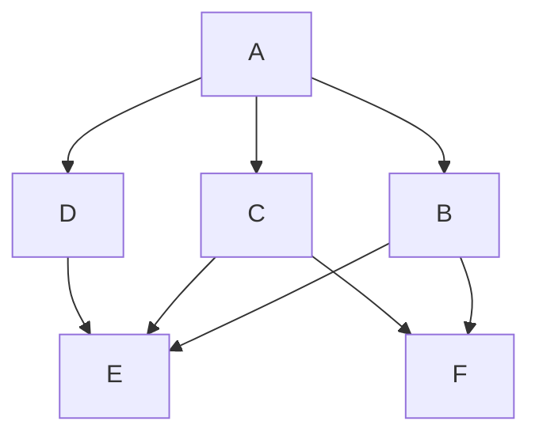
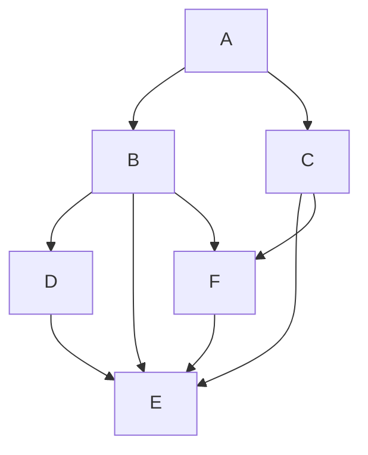

# RFC-0010: Automatic path discovery

- **RFC Number:** 0010
- **Title:** Automatic path discovery
- **Status:** Raw
- **Author(s):** @Teebor-Choka
- **Created:** 2025-02-25
- **Updated:** 2025-07-21
- **Version:** v0.0.1 (Raw)
- **Supersedes:** None
- **Related Links:** [RFC-0002](../RFC-0002-mixnet-keywords/0002-mixnet-keywords.md), [RFC-0004](../RFC-0004-hopr-packet-protocol/0004-hopr-packet-protocol.md), [RFC-0005](../RFC-0005-proof-of-relay/0005-proof-of-relay.md), [RFC-0008](../RFC-0008-session-protocol/0008-session-protocol.md), [RFC-0009](../RFC-0009-session-start-protocol/0009-session-start-protocol.md)

## 1. Abstract

This RFC provides a description of an automatic path discovery mechanism necessary for the HOPR protocol to be usable
inside a dynamic ad-hoc peer-to-peer network. The outlined solutions aim to allow the HOPR protocol message sender
to remain anonymous, while ensuring optimal message delivery through the network by actively probing various network
nodes with the goal of establishing compliance with the HOPR protocol specified functionality and non-adversarial behavior.

## 2. Motivation

Effective end-to-end communication over the HOPR protocol requires the communication sender to select
viable paths across the network:

- From sender to destination for unidirectional communication
- Additionally, from destination to sender using the Return Path mechanism for bidirectional communication

The HOPR protocol does not define communication flow control, as this is handled by upper protocol layers. This design
decision places responsibility of every network element to keep track of peer and network status to allow establishing
stable propagation paths with consistent transport link properties.

In the mixnet architecture, both forward and return paths MUST be constructed by the sender to preserve anonymity .
Consequently, the sender MUST maintain an accurate and current view of the network topology to create effective forward
and return path pools.

Relayers and destinations must also discover the network in order to make sure the incentivized layer and
network transport are aligned.

## 3. Terminology

Terms defined in [RFC-0002](../RFC-0002-mixnet-keywords/0002-mixnet-keywords.md) are used.

## 4. Specification

### 4.1 Overview

This specification defines multiple complementary graph search algorithms for topology discovery. Implementations MUST support
both algorithms and employ them in concert, as complete topology discovery becomes computationally prohibitive as network
size increases.

### 4.2 Network probing

The network discovery algorithms SHOULD make the following assumptions about the network:

1. the network topology is not static
   - the network topology can change as individual nodes peer preferences or open/close channels
   - for peers that require a relay the disappearance of the relay can cause topology reconfiguration
2. every other node can be unreliable
   - rooted deeply in the physical network infrastructure performance
3. every other node can be malicious
   - any behavior resembling malicious behavior should be considered malicious and appropriately flagged

Given these assumptions, the network probing algorithms for topology discovery SHOULD use
multiple complementary mechanisms: a breadth-first and a depth-first algorithm.

Initially, implementers SHALL perform a general network discovery using primarily the breadth-first approach.

Once a statistically sufficient topology is identified to support path randomization, the depth-first approach SHOULD
be employed to probe specific topology paths of interest (e.g., exit node peers).

The advantage of the depth-first approach is that its results can be combined with the breadth-first approach to identify
potentially unreliable or malicious peers more efficiently, while allowing focus on specific peers in the path as static
anchors (for QoS, exit behavior functionality, etc.).

The network topology is an oriented graph structure consisting of nodes performing the probing data relay functionality.
Each edge corresponds to a combination of properties defined by the physical transport and the HOPR protocol that MUST
be present:

1. Existence of a HOPR staking channel [RFC-0005](../RFC-0005-proof-of-relay/0005-proof-of-relay.md) from the node in the path in the direction of the relayer
2. Presence of a physical transport connection allowing data transfer

While property 1 is known from the incentive mechanism [RFC-0007](../RFC-0007-economic-reward-system/0007-economic-reward-system.md), property 2 MUST be discovered on the physical network and is subject to network probing. The only exception to property 1 in the HOPR protocol is the last hop (i.e., the last relayer to the destination), where a staking channel is not required for data delivery.
The network probing mechanism, abstracting transport interactions completely, consists of 3 components:

1. Path generating probing algorithm
2. Evaluation mechanism
3. Retention and slashing mechanism

#### 4.2.1 Path generating probing algorithm

The primary responsibility of the path generating component is to apply different algorithms to prepare pre-generated paths
that would offer insights in algorithm selected sections of the network with the goal of collecting path viability information.

The algorithm MUST use a loopback form of communication to conceal the nature of the probing traffic from relayers.
Loopback MAY be realized via the Session protocol [RFC-0008](../RFC-0008-session-protocol/0008-session-protocol.md) or via an equivalent ephemeral mechanism; Sessions are OPTIONAL.
In this approach, the probing node functions as both sender and receiver of the probing traffic, effectively designating each node
in the path as a probed relayer and each edge between consecutive relayers as a probed connection. While this approach
does not guarantee extraction of all relevant information from a single probing attempt, when combined with results from
multiple probing attempts, it enables construction of a comprehensive view of network topology and dynamics.

A combination of breadth-first and depth-first algorithms SHALL be employed to ensure the probing process neither anneals
too slowly to a usable network topology nor focuses exclusively on small sub-topologies due to network size constraints.
Loopback probing methods with respect to the sender:

1. Immediate 0-hop: Observe only whether acknowledgment was received from the counterparty and measure response latency,
   using indistinguishable payloads (“junk” data indistinguishable from application data via padding and AEAD) with acknowledgements produced by the destination and authenticated before acceptance
2. 1-hop to self: First-order checks of immediate peer connections - functionally equivalent to option 1 but executed
   in a manner that conceals probing activity
3. 2-hop to self: Checks second-order communication paths, MAY replace some 3-hop paths to reduce total probing paths
4. 3-hop to self: Full path bidirectional channel probing for 1-hop connections

Algorithm:

- Discovery algorithm SHALL operate in complementary modes: breadth-first and depth-first
- Basic operations:
  1. Discover immediate peers
  2. Generate paths for n-hop connections (referential probing with low frequency)
  3. for sessions [RFC-0008](../RFC-0008-session-protocol/0008-session-protocol.md), prepopulate the cache from sufficiently recent historical knowledge of successful paths
  4. perform higher frequency probing checks

##### 4.2.1.1 Breadth-first algorithm (BFA)

Breadth-First Search (BFS) is a graph traversal algorithm used to systematically explore nodes and edges in a graph. It MUST
start at the sender and explores the neighboring nodes at the current depth level before moving on to nodes at the next
depth level.

BFA SHOULD primarily be used for the initial network topology discovery with the goal of identifying a statistically
significant minimum number of peers with the desired QoS and connectability properties.

This algorithm SHOULD be primarily implemented in terms of the **1-hop to self**.

Given a network topology around the node A (Fig. 1):



Fig. 1: Network topology for BFA inspired network probing

The probing traffic from node `A` would follow the BFA pattern of establishing the telemetry from the immediate
vicinity of `A` using a 1-hop probing traffic:

```ascii
A -> B -> A
A -> C -> A
A -> D -> A
```

Once the immediate vicinity is probed, a larger share of the probing traffic SHOULD use the depth-first algorithm
phasing the BFA into smaller proportion.

##### 4.2.1.2 Depth-first algorithm (DFA)

Depth-First Search (DFS) is a graph traversal algorithm that explores as far as possible along each branch before
backtracking. It MUST start at the current node to explore each branch of the graph deeply before moving to another branch.

DFS is particularly useful for solving problems related to maze exploration and pathfinding.

This algorithm SHOULD be primarily implemented in terms of the **n-hop to self**, where `n > 1` and `n < MAX_HOPR_SUPPORTED_PATH_LENGTH` (a network parameter defined in [RFC-0004](../RFC-0004-hopr-packet-protocol/0004-hopr-packet-protocol.md)), with each edge probed as soon as feasible, but at the same time not at the expense
of other edges in the topology. `n` SHOULD be chosen randomly, but MUST conform with the minimum requirement for edge traversal.

Given a network topology around the node A (Fig. 2):



Fig. 2: Network topology for DFA inspired network probing

The probing traffic from node `A` would follow the DFA pattern of establishing the telemetry to the furthest
interesting point in the network using an `n`-hop probing traffic with `n` generated randomly:

```ascii
A -> B -> F -> A
A -> C -> F -> E -> A
A -> B -> D -> A
```

##### 4.2.1.3 BFA and DFA interactions

Average values calculated over the differences of various observations can be used to establish individual per node properties.
From the previous example, given multiple averaged telemetry values over the path it is possible to establish ensemble
information about the topology.

Example:
With average path latencies observed over these paths as:

```ascii
A -> B -> A = 421ms
A -> B -> F -> A = 545ms
```

It is possible to establish the average latency of introducing the node `F` into the path as
`A -> B -> F -> A` - `A -> B -> A`= 545 - 421 = 124ms.

Assuming artificial mixer delays introducing additional anonymity, repeated observations of this value averaged over longer
windows would provide an average expected latency introduced by element `F`.

#### 4.2.2 Evaluation mechanism

Evaluation mechanism SHOULD have short-term memory and equally reward and penalize probe success and failures.

#### 4.2.3 Retention and slashing mechanism

Nodes MAY implement a slashing mechanism based on failed probes to avoid using the relay nodes in non-probing communication and avoid dropped messages.

#### 4.2.4 Throughput considerations

Paths SHOULD be used by the discovery mechanism in a way that would allow sustained throughput, i.e. the maximum
achievable packet rate:

- Calculate load balancing over paths based on the min stake on the path
- Actual throughput as measured by the real traffic

### 4.3. Telemetry

Refers to data and metadata collected by the probing mechanism about the traversed transport path.

#### 4.3.1 Next-hop telemetry

Supplemental per path telemetry (PPT) MUST be used as a source of information for a possibly channel opening and
closing strategy responsible for reorganizing the first hop connections from the current node.

The PPT SHOULD provide the basic evaluation of the transport channel in the absence of an open onchain channel and MUST
provide at least these transport channel observations using 0-hop as specified in the HOPR protocol [RFC-0004](../RFC-0004-hopr-packet-protocol/0004-hopr-packet-protocol.md):

1. latency
   - duration between a send-message and a corresponding acknowledgement
2. packet drop
   - track ratio of missing/all expected acknowledgements for each message on the channel

The PPT MAY be utilized as an information source by other mechanisms, e.g. the channel manipulation strategy optimizing
the outgoing network topology.

#### 4.3.2 Non-probing telemetry

The non-probing telemetry MAY track the next-hop telemetry targets with the goal of adding more relevant channel
information for the nearest 0-hop.

Each outgoing message should be tracked for the same set of telemetry as the PPT on the per message basis.

#### 4.3.3 Probing telemetry

Telemetry data pertains to the content of the probing message sent over the network. All multi-byte integer fields MUST
be transmitted in network byte order (big endian).

The content of the probing message:

- Iterating counter to verify the mixing property over a path
  - an iterated `uint64` equivalent value
- Path identification for attribution
  - a unique value identifying a single specific path in the graph using a `uint64` equivalent value
- Timestamp of packet creation for channel latency observations
  - formatted as an 8-byte (64-bit) `UNIX time in nanoseconds`

```ascii
+-------------+------------+------------+
|   Counter   |   PathId   |  Timestamp |
|     8B      |     8B     |     8B     |
+-------------+------------+------------+
```

The total packet size is 32 bytes.

### 4.4 Component placement

The network probing functionality, with the exception of the PPT mechanism, MUST be implemented using HOPR loopback communication.

Implementation requirements:

- The concept of channel graph quality based on network observations SHALL be removed
  - Only the onchain channel information SHALL be retained
- Implementations MUST provide processes to:
  - Generate a low-rate continuous stream of network path probes
  - Generate session-specific paths for session path selection obfuscation [RFC-0008](../RFC-0008-session-protocol/0008-session-protocol.md)
- A new path graph system SHALL be derived from these processes
- Paths SHALL be cached for a configurable minimum time window
- Session metrics SHALL incorporate:
  - Session-level performance metrics
  - Session-specific path probing data
  - Session-derived cover traffic for exploratory network traversal

## 5. Design considerations

Each sender SHOULD:

- Be able to identify a sufficiently large number of network nodes to ensure privacy through path pool diversity
- Be capable of detecting unstable, malicious, or adversarial nodes
- Be able to establish basic propagation metrics for Quality of Service (QoS) estimation

Given the capabilities described above, the message sender SHOULD be able to construct a functional representation of the
network topology, state, and constraints, enabling optimal selection and exclusion of message propagation paths.

The multihop probing traffic and measurement packets MUST be indistinguishable from ordinary traffic to ensure accurate
recording of network node propagation characteristics.
Due to the dynamic nature of decentralized peer-to-peer networks,
the message sender SHOULD employ adaptive mechanisms for establishing and
maintaining topological awareness.

For both unidirectional and bidirectional communication to adapt to changing network conditions,
the sender MUST actively probe the network in a continuous manner.

The measurement traffic itself SHOULD adhere to economic feasibility constraints, i.e., it SHOULD be
proportional to actual message traffic and MAY be incorporated as part of the Cover Traffic (CT)
[RFC-0008](../RFC-0008-session-protocol/0008-session-protocol.md).

Any measurements obtained from the probing traffic SHOULD be node-specific and MUST NOT be subject to
data or topology exchange with other nodes.

The collected telemetry for measured paths:

- MUST contain path passability data
  - Path traversability by single or multiple messages
- MAY include additional information
  - Telemetry transferred as message content

By designing probing traffic to be indistinguishable from actual message propagation in the mixnet, direct verification
of immediate peer properties becomes infeasible. For this purpose, a separate mechanism not described in this document
SHOULD exist.

The nearest one-hop probing mechanism MAY NOT comply with the anonymity requirement, since it:

1. mimics the 0-hop session [RFC-0008](../RFC-0008-session-protocol/0008-session-protocol.md) which does not fully benefit from relaying mechanisms
2. could be used as a first layer for relayers to discover viable candidates for future channel openings

The network probing mechanism SHALL utilize graph-based algorithms to efficiently discover and maintain network topology
information.

## 6. Compatibility

This feature affects only a single node in the network and MAY be modified without impacting overall network operation.

The network probing mechanism MAY be compatible with the loopback session mechanism

## 7. Security Considerations

The probing traffic consumes both physical resources and value at various levels of the HOPR protocol stack.

Security considerations related to resource utilization include:

1. In highly volatile networks, adversarial behavior may cause excessive resource expenditure, potentially enabling
   resource depletion attacks.
2. The PPT mechanism MAY serve as an attack vector for Denial of Service (DoS) attempts.
3. Nodes MAY implement any security risk mitigation strategy

## 8. Drawbacks

The network probing mechanism has several inherent limitations:

1. Probing activity consumes resources; implementations MUST carefully balance probing and data transmission activities
   to maintain reasonable resource utilization ratios.
2. Complete real-time probing of large networks is computationally prohibitive; algorithms SHOULD operate within
   bounded subnetworks where they can provide reasonable network visibility guarantees.
3. Prior knowledge of target nodes is advantageous to minimize initialization time before establishing a sufficient
   network view for informed path selection.

## 9. Alternatives

No alternative mechanisms exist that simultaneously preserve anonymity, maintain trustless properties, and consolidate
probing control under the communication source.

## 10. Unresolved Questions

None

## 11. Future Work

Future development SHOULD focus on:

1. Improving the ability to collect additional network metrics primarily by extending the data payload transmitted along
   the loopback path
2. Developing new path generating strategies allowing statistical inference of information from the path section overlaps
3. Improve metric evaluation mechanism
4. Add proper slashing mechanism with equation based logic

## 12. References

- [RFC-0002](../RFC-0002-mixnet-keywords/0002-mixnet-keywords.md) – Mixnet terminology
- [RFC-0004](../RFC-0004-hopr-packet-protocol/0004-hopr-packet-protocol.md) – HOPR packet protocol
- [RFC-0005](../RFC-0005-proof-of-relay/0005-proof-of-relay.md) – Proof of Relay
- [RFC-0007](../RFC-0007-economic-reward-system/0007-economic-reward-system.md) – Economic Reward System
- [RFC-0008](../RFC-0008-session-protocol/0008-session-protocol.md) - Session Data Protocol
