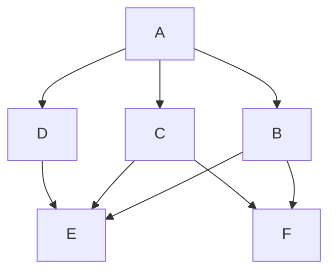
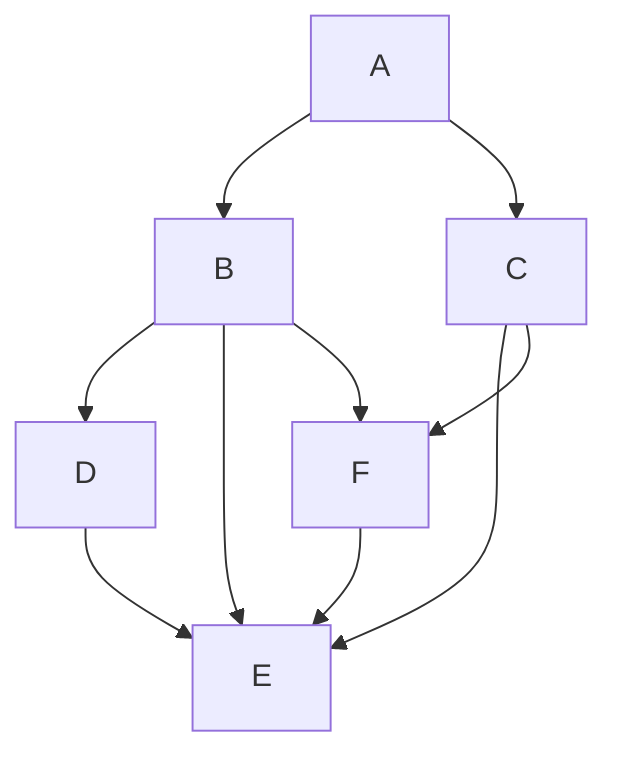
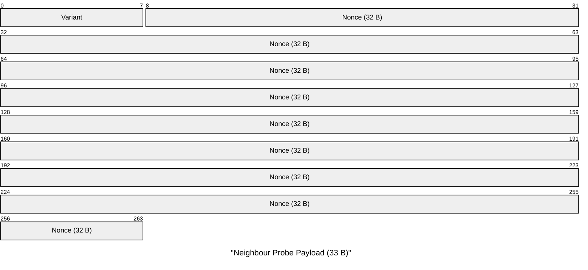
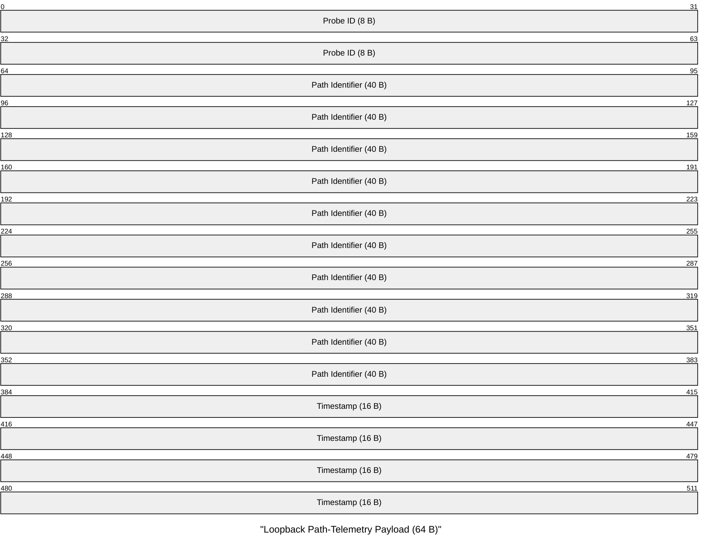

# RFC-0010: Automatic path discovery

- **RFC Number:** 0010
- **Title:** Automatic path discovery
- **Status:** Finalised
- **Author(s):** @Teebor-Choka
- **Created:** 2025-02-25
- **Updated:** 2026-05-18
- **Version:** v1.1.0 (Finalised)
- **Supersedes:** none
- **Related Links:** [RFC-0002](../RFC-0002-mixnet-keywords/0002-mixnet-keywords.md),
  [RFC-0004](../RFC-0004-hopr-packet-protocol/0004-hopr-packet-protocol.md), [RFC-0005](../RFC-0005-proof-of-relay/0005-proof-of-relay.md),
  [RFC-0008](../RFC-0008-session-protocol/0008-session-protocol.md), [RFC-0009](../RFC-0009-session-start-protocol/0009-session-start-protocol.md)

## 1. Abstract

This RFC specifies an automatic path discovery mechanism for the HOPR protocol, enabling it to function effectively within dynamic ad hoc peer-to-peer networks. The mechanism allows message senders to remain anonymous while ensuring optimal message delivery by actively probing network nodes to assess compliance with HOPR protocol functionality and detect non-adversarial behaviour. The specification defines two complementary probing modes — immediate-neighbour probing for direct peers, and loopback path probing for multi-hop paths — along with telemetry collection methods to support path selection and quality-of-service (QoS) assessment.

## 2. Motivation

Effective end-to-end communication over the HOPR protocol requires the sender to select viable paths across the network:

1. **Forward path**: From sender to destination for unidirectional communication.
2. **Return path**: From destination back to sender for bidirectional communication, established using Single-Use Reply Blocks (SURBs) as defined in [RFC-0004](../RFC-0004-hopr-packet-protocol/0004-hopr-packet-protocol.md).

The HOPR protocol does not define flow control at the network layer, as this responsibility is delegated to upper protocol layers (see [RFC-0008](../RFC-0008-session-protocol/0008-session-protocol.md)). This design places the responsibility on each network node to track peer status and network conditions to establish stable propagation paths with consistent transport link properties.

In the mixnet architecture, both forward and return paths MUST be constructed by the sender to preserve sender anonymity. Consequently, the sender MUST maintain an accurate and current view of the network topology to create effective forward and return path pools. Without topology knowledge, the sender cannot select paths that:

- Have adequate channel capacity and funding
- Provide acceptable latency and throughput
- Avoid unreliable or malicious relay nodes
- Maintain sufficient diversity for anonymity

Relay nodes and destinations also benefit from network discovery to ensure alignment between the incentivisation layer (payment channels) and the network transport layer (physical connectivity).

## 3. Terminology

The keywords "MUST", "MUST NOT", "REQUIRED", "SHALL", "SHALL NOT", "SHOULD", "SHOULD NOT", "RECOMMENDED", "MAY", and "OPTIONAL" in this document are
to be interpreted as described in [01] when, and only when, they appear in all capitals, as shown here.

All terminology used in this document, including general mix network concepts and HOPR-specific definitions, is provided in [RFC-0002](../RFC-0002-mixnet-keywords/0002-mixnet-keywords.md). That document serves as the authoritative reference for the terminology and conventions adopted
across the HOPR RFC series.

The following additional terms are defined for use within this document:

**Probing node**: The node that originates probe traffic and consumes the resulting observations to build its topology view.

**Immediate-neighbour probe**: A probe that targets a directly-connected peer, using a request–response exchange to confirm reachability and measure round-trip latency.

**Loopback path probe**: A probe that traverses a sequence of intermediate relay nodes and returns to the originating probing node, carrying a path identifier and timestamp to enable end-to-end latency and path-success observations.

## 4. Specification

### 4.1 Overview

This specification defines two complementary probing modes for topology discovery. Implementations MUST be capable of supporting both immediate-neighbour probing and loopback path probing. Deployments SHOULD employ them in concert, as exhaustive topology discovery becomes computationally prohibitive as network size increases. Immediate-neighbour probing provides rapid discovery of the direct network neighbourhood; loopback path probing extends that view to deeper multi-hop paths. Combining both modes enables efficient topology coverage while managing resource consumption.

### 4.2 Network probing

The network discovery algorithms operate under the following assumptions about the network environment:

1. **Dynamic topology**: The network topology is not static and can change as individual nodes modify peer preferences, open or close payment channels, or go offline. For peers that require a relay for connectivity, the disappearance of the relay can cause topology reconfiguration.

2. **Unreliable nodes**: Any node in the network can be unreliable due to physical network infrastructure performance limitations, intermittent connectivity, or resource constraints.

3. **Malicious nodes**: Any node in the network can behave maliciously. Any behaviour resembling malicious activity SHOULD be considered malicious and appropriately flagged for exclusion from path selection.

Given these assumptions, the network probing mechanism employs two complementary modes as described in §4.2.1.

The network topology is modelled as a directed graph structure where nodes perform data relay functionality. Each directed edge in the graph represents a viable connection between two nodes and corresponds to a combination of properties defined by both the physical transport and the HOPR protocol. For an edge to be considered valid, the following properties MUST be present:

1. **Payment channel existence**: A HOPR payment channel (see [RFC-0005](../RFC-0005-proof-of-relay/0005-proof-of-relay.md)) MUST exist from the source node to the destination node of the edge. This channel enables the proof of relay mechanism and provides economic incentives for packet forwarding.

2. **Physical connectivity**: A physical transport connection MUST exist allowing data transfer between the two nodes. This includes network reachability, NAT traversal (if applicable), and transport protocol compatibility.

While property 1 can be determined from on-chain data in the incentive mechanism (see [RFC-0007](../RFC-0007-economic-reward-system/0007-economic-reward-system.md)), property 2 MUST be discovered through active probing on the physical network.

The only exception to property 1 in the HOPR protocol is the final hop (i.e., the connection from the last relay node to the destination), where a payment channel is not required for data delivery since no further relaying occurs.

The network probing mechanism abstracts transport interactions and consists of three core components:

1. **Path-generating probing modes**: Produces probes based on immediate-neighbour and loopback path strategies (§4.2.1).
2. **Evaluation mechanism**: Assesses probe results to determine path viability and node reliability (§4.2.2).
3. **Retention and exclusion mechanism**: Maintains path quality information and reduces the selection probability of unreliable paths (§4.2.3).

#### 4.2.1 Path-generating probing modes

The primary responsibility of the path-generating component is to apply the two complementary probing modes to collect path viability information across selected sections of the network.

When performing full topology discovery, a combination of immediate-neighbour and loopback path probing SHALL be employed to ensure the probing process neither converges too slowly to a usable network topology nor focuses exclusively on small sub-topologies due to computational constraints. Deployments targeting only immediate-neighbour discovery MAY use the minimal prober profile (see §4.2.1.5) and MAY disable loopback path probing.

**Operational steps:**

The probing modes operate in the following sequence:

1. **Discover immediate peers**: Use immediate-neighbour probes to identify directly-connected peers and assess their basic connectivity.
2. **Generate loopback paths**: Generate paths for multi-hop connections using loopback probing to explore deeper network topology.
3. **Maintain path cache**: Cache successfully observed paths for a configurable time window to amortise discovery cost and reduce session establishment latency (see §4.4).
4. **Distribute probing continuously**: Maintain a configurable-cadence probe stream that distributes coverage across all known edges, weighted by observation staleness and current edge score (see §4.2.1.4).

##### 4.2.1.1 Immediate-neighbour probing

Immediate-neighbour probing targets each directly-connected peer via a nonce-challenge / response exchange. The probing node sends a request carrying a random nonce; a correctly functioning peer responds with a pong echoing the same nonce. Receipt of the matching response within the configured timeout constitutes a successful observation; absence constitutes a failed one.

This mode SHOULD be used as the primary mechanism for initial topology discovery, with the goal of identifying a statistically significant set of peers with desired QoS and connectivity properties. Once the immediate neighbourhood is mapped, a greater share of probing activity SHOULD transition to loopback path probing.

The following properties apply to immediate-neighbour probing:

- The probe is sent as a 0-hop forward path with a 0-hop return path, meaning it is delivered directly to the peer without traversing any intermediate relay.
- The probe MAY be observable as a probe at the destination (i.e., the peer can identify the traffic as a probe). Anonymity at 0-hop is intentionally not required, because no relay is involved and sender identity is not at risk.
- The probe MUST carry a single-use reply block (SURB) to enable the pong to be delivered back to the originator without revealing the originator's address to the peer.
- This mode provides the next-hop telemetry (PPT) defined in §4.3.1.

Given a network topology around node A (Fig. 1):


```mermaid
graph TD;
    A --> B;
    A --> C;
    A --> D;
    B --> E;
    B --> F;
    C --> E;
    C --> F;
    D --> E;
```

_Fig. 1: Network topology for immediate-neighbour probing_

The probing traffic from node A would follow the immediate-neighbour probing pattern:

```ascii
A -> B -> A
A -> C -> A
A -> D -> A
```

##### 4.2.1.2 Loopback path probing

Loopback path probing traverses a sequence of intermediate relay nodes before returning to the originating probing node. The probing node functions as both sender and receiver; the probe payload traverses a multi-hop path before returning to the origin.

In this approach, each intermediate node in the path is treated as a probed relay node, and each edge between consecutive nodes is treated as a probed connection. While a single probe attempt does not guarantee extraction of all relevant information, when combined with results from multiple probing attempts across different paths, it enables construction of a comprehensive view of network topology and dynamics.

The following properties apply to loopback path probing:

- The number of intermediate relay nodes `n` SHOULD be selected randomly within the range `1 ≤ n ≤` the maximum number of intermediate relay nodes supported by the HOPR packet format defined in [RFC-0004](../RFC-0004-hopr-packet-protocol/0004-hopr-packet-protocol.md). The value of `n` SHOULD vary across probes to prevent predictable probing patterns.
- Each probe MUST carry a path identifier and a timestamp so that observations can be attributed to specific edges upon loopback completion (see §4.3.3).
- The originator MUST verify that the loopback probe returns to itself before recording any observations from it.
- The probe payload MUST be indistinguishable in shape from cover traffic at each relay node (same transport tag, same payload size class). Loopback probes carry no SURB, since the path already terminates at the originating node.
- Loopback probing MAY be realised via the session protocol ([RFC-0008](../RFC-0008-session-protocol/0008-session-protocol.md)) or via an equivalent ephemeral mechanism. Formal session establishment is OPTIONAL for probing traffic.

Each edge SHOULD be probed as soon as feasible, but not at the expense of other edges in the topology (i.e., probing SHOULD be distributed across the topology).

Given a network topology around node A (Fig. 2):


```mermaid
graph TD;
    A --> B;
    A --> C;
    B --> D;
    B --> E;
    B --> F;
    C --> E;
    C --> F;
    D --> E;
    F --> E;
```

_Fig. 2: Network topology for loopback path probing_

The probing traffic from node A would follow the loopback path probing pattern, with `n` selected randomly:

```ascii
A -> B -> F -> A
A -> C -> F -> E -> A
A -> B -> D -> A
```

These deep probes explore specific paths through the network and collect end-to-end path metrics.

##### 4.2.1.3 Probing mode interactions

Average values calculated over the differences of various observations can be used to establish individual per-node properties. By combining telemetry from immediate-neighbour and loopback path probes, it is possible to derive statistical information about individual nodes and edges in the topology.

**Example**: Assume the following average path latencies are observed:

```ascii
A -> B -> A = 421ms
A -> B -> F -> A = 545ms
```

From these measurements, it is possible to estimate the average latency contribution of node F (and the edges involving F) as:

```ascii
(A -> B -> F -> A) - (A -> B -> A) = 545ms - 421ms = 124ms
```

This difference represents the additional latency introduced by traversing through node F. Accounting for artificial mixer delays that introduce additional anonymity, repeated observations of this value averaged over longer time windows would provide an expected latency contribution for node F. By aggregating such measurements across multiple paths, implementations can build a statistical model of individual node performance characteristics.

When a loopback probe returns, the latency contribution of each intermediate edge that is not yet independently known can be estimated by subtracting the known latencies of the remaining edges from the total observed round-trip time.

##### 4.2.1.4 Probe scheduling and prioritisation

Implementations SHOULD order pending probes by a priority that combines at least two factors:

1. **Staleness**: how long ago the most recent observation was recorded for a candidate edge or path. Edges with older observations SHOULD be probed sooner than recently-observed ones.
2. **Current edge score**: edges with lower quality scores (as defined in §4.2.2) SHOULD be probed more urgently to confirm whether the poor score reflects persistent degradation or a transient event.

The exact weighting formula is left to implementations. The requirement is only that both staleness and current score participate in prioritisation decisions.

##### 4.2.1.5 Prober deployment profiles (informative)

A node MAY operate one of two deployment profiles:

- **Minimal prober**: emits only immediate-neighbour probes (§4.2.1.1). Deployments MAY disable loopback path probing via node profile or policy configuration. Suitable for nodes that primarily require next-hop telemetry without full topology discovery.
- **Full prober**: emits both immediate-neighbour probes and loopback path probes (§4.2.1.2). Suitable for nodes that require a comprehensive topology view for multi-hop path selection.

Whichever probes a node emits MUST conform to §4.2.1.1 and §4.2.1.2 respectively.

#### 4.2.2 Evaluation mechanism

The evaluation mechanism processes probe results to assess path and node viability. Implementations SHOULD compute per-edge scores by maintaining short-window moving averages over recent probe observations of both latency and probe success rate, combined into a single per-edge score. This approach ensures that recent network conditions are given appropriate weight while preventing both overly optimistic and overly pessimistic assessments.

Implementations MAY use alternative statistical estimators (such as Bayesian estimation, Kalman filtering, or sliding time windows) provided that the chosen mechanism treats probe successes and failures in a balanced manner — neither exclusively penalising failures nor exclusively rewarding successes.

#### 4.2.3 Retention and exclusion mechanism

The retention and exclusion mechanism limits the use of unreliable relay nodes in non-probing (production) communication, thereby avoiding dropped messages and improving overall communication reliability. Implementations MUST realise at minimum a passive exclusion tier, and MAY additionally implement an active slashing tier.

**Passive exclusion (MUST)**: Implementations MUST weight path selection by per-edge score so that edges with lower scores receive proportionally less traffic. This ensures that unreliable edges are progressively starved rather than suddenly eliminated, and that their score is continuously updated by the ongoing probe stream.

**Active slashing (MAY)**: Implementations MAY additionally implement an explicit slashing mechanism that temporarily or permanently removes nodes or paths from the usable path pool based on probe failure patterns. When implemented, the following SHOULD be considered:

- **Failure threshold**: The number or percentage of consecutive or recent failed probes that trigger slashing.
- **Slashing duration**: Whether nodes are removed permanently or temporarily, with exponential backoff for repeated failures.
- **Recovery mechanism**: Conditions under which previously slashed nodes can be re-evaluated and restored to the usable pool.

Slashing decisions MUST be made locally by each node based on its own probe observations, without coordination with other nodes.

#### 4.2.4 Throughput considerations

Paths SHOULD be selected and used by the discovery mechanism in a manner that supports sustained throughput (i.e., the maximum achievable packet rate). Path selection SHOULD consider:

- **Score-weighted load balancing over paths**: Distribute traffic across multiple paths according to per-edge scores derived from probe observations, ensuring that edges with better quality receive proportionally more traffic. Implementations MAY additionally incorporate channel stake as a weighting factor to account for channel capacity.
- **Measured throughput**: Use actual throughput as observed in real traffic (not just probes) to refine path selection and avoid paths that perform poorly under load.

These considerations ensure that path discovery supports not only path viability assessment but also efficient utilisation of available network capacity.

### 4.3 Telemetry

Telemetry refers to the data and metadata collected by the probing mechanism about traversed transport paths. Telemetry enables nodes to assess path quality, detect failures, and make informed path selection decisions. This section defines the types of telemetry collected and their purposes.

#### 4.3.1 Next-hop telemetry

Next-hop telemetry, also referred to as per-path telemetry (PPT), MUST be collected for each direct peer connection. This telemetry SHOULD be used to inform channel opening and closing strategies that optimise first-hop connections from the current node.

The PPT is produced by immediate-neighbour probing (§4.2.1.1) and SHOULD provide basic evaluation of the transport channel, both in the presence and absence of an open on-chain payment channel. At a minimum, the PPT MUST provide the following observations for each 0-hop connection (as specified in [RFC-0004](../RFC-0004-hopr-packet-protocol/0004-hopr-packet-protocol.md)):

1. **Latency**: Duration between sending a request probe and receiving the corresponding response. This measures round-trip time to the immediate peer.

2. **Packet drop rate**: Track the ratio of missing responses to expected responses for probes sent on the channel. This indicates the reliability of the transport connection.

3. **Acknowledgement rate**: Track the ratio of acknowledged messages to sent messages on the channel, including production traffic as well as probes.

The PPT MAY be utilised by other mechanisms as an information source, such as channel management strategies that optimise the outgoing network topology by opening channels to high-performance peers and closing channels to unreliable peers.

#### 4.3.2 Non-probing telemetry

Non-probing telemetry refers to telemetry collected from production (non-probe) traffic. This telemetry MAY track the same metrics as next-hop telemetry with the goal of adding more relevant channel information for 0-hop connections.

Each outgoing message SHOULD be tracked for the same set of telemetry as the PPT (latency, packet drop rate) on a per-message basis. This provides real-world performance data that complements probe-based observations and can reveal issues that only appear under actual traffic load.

#### 4.3.3 Probing telemetry

Probing telemetry refers to structured data embedded within probe messages to facilitate path identification and performance measurement. The two probing modes defined in §4.2.1 produce two distinct message types, both carried under a common outer envelope.

All multi-byte integer fields MUST be transmitted in the byte order documented below to ensure consistent interpretation across different architectures.

##### Outer message envelope

All probe messages share a two-byte outer envelope:


```mermaid
packet
title "Outer Message Envelope"
+8: "Version"
+8: "Discriminant"
```

| Field | Size | Description |
| ----- | ---- | ----------- |
| **Version** | 1 byte | Protocol version. Current value: `0x01`. |
| **Discriminant** | 1 byte | Selects the payload type: `0x00` = Loopback path telemetry, `0x01` = Neighbour probe. |

##### Neighbour-probe message

Produced by immediate-neighbour probing (§4.2.1.1). Total message size: 35 bytes (2-byte envelope + 33-byte payload).


```mermaid
packet
title "Neighbour Probe Payload (33 B)"
+8: "Variant"
+256: "Nonce (32 B)"
```

| Field | Size | Byte order | Description |
| ----- | ---- | ---------- | ----------- |
| **Variant** | 1 byte | — | `0x00` = Ping (request), `0x01` = Pong (response). |
| **Nonce** | 32 bytes | N/A (byte string) | Random nonce included in a Ping; copied verbatim into the corresponding Pong. Receipt of a Pong whose nonce matches the sent Ping nonce constitutes a successful observation. |

##### Loopback path-telemetry message

Produced by loopback path probing (§4.2.1.2). Total message size: 66 bytes (2-byte envelope + 64-byte payload).


```mermaid
packet
title "Loopback Path-Telemetry Payload (64 B)"
+64: "Probe ID (8 B)"
+320: "Path Identifier (40 B)"
+128: "Timestamp (16 B)"
```

| Field | Size | Byte order | Description |
| ----- | ---- | ---------- | ----------- |
| **Probe ID** | 8 bytes | N/A (byte string) | An opaque identifier assigned by the probing node at emission time. Used to correlate the returned telemetry with the original probe record. |
| **Path Identifier** | 40 bytes | Per-slot little-endian | Five consecutive 8-byte slots, each encoding one node index along the probed path (including the originating and terminating node). Each slot is serialised in little-endian byte order. |
| **Timestamp** | 16 bytes | Big-endian | Nanoseconds since the UNIX epoch at the time the probe was emitted, serialised as a 128-bit unsigned integer in big-endian byte order. Compared against the wall clock upon loopback return to derive end-to-end path latency. |

**Note on byte order**: The path identifier uses little-endian per-slot encoding, while the timestamp uses big-endian encoding. This mixed convention is a known limitation; see §10.

### 4.4 Component placement

The network probing functionality, with the exception of the next-hop telemetry (PPT) mechanism, MUST be implemented using HOPR loopback communication to preserve anonymity and prevent relay nodes from distinguishing probe traffic from production traffic.

**Implementation requirements:**

- **Channel graph as topology store**: The channel graph data structure SHALL serve as the canonical topology store. Each directed edge in the graph MUST carry quality observations derived from probe results (latency, success rate). Implementations MAY replace any prior network-quality heuristic with edge weights derived solely from probe observations.

- **Continuous probe generation**: Implementations MUST provide a configurable-cadence probing stream for each probing mode to maintain up-to-date topology information.

- **Path generation and caching**: Path generation SHOULD be decoupled from session establishment so that the path cache can serve session creation without per-session probing latency (see [RFC-0008](../RFC-0008-session-protocol/0008-session-protocol.md)). Paths SHALL be cached for a configurable minimum time window to amortise the cost of path discovery and reduce probe frequency.

- **Edge-quality observations**: Edge-quality observations MUST be associated with the topology graph and MUST be derived from probe outcomes. Stale observations SHOULD be weighted less than recent ones.

- **Session-derived cover traffic**: Probe traffic MAY be incorporated as cover traffic for active sessions (see [RFC-0008](../RFC-0008-session-protocol/0008-session-protocol.md)) to serve dual purposes and reduce the per-session probing overhead.

## 5. Design considerations

The automatic path discovery mechanism is designed to enable each sender to:

1. **Identify sufficient network nodes**: Discover a sufficiently large number of network nodes to ensure privacy through path pool diversity. A larger discovered topology enables greater path randomisation and reduces the risk of traffic analysis.

2. **Detect problematic nodes**: Identify unstable, malicious, or adversarial nodes through probe failure patterns and exclude them from path selection.

3. **Estimate QoS metrics**: Establish basic propagation metrics for quality-of-service (QoS) estimation, including latency, throughput, and reliability.

With these capabilities, the sender can construct a functional representation of the network topology, state, and constraints, enabling optimal selection and exclusion of message propagation paths.

**Key design principles:**

- **Selective indistinguishability**: Multi-hop loopback probe traffic MUST be indistinguishable from ordinary traffic at relay nodes to ensure accurate recording of network node propagation characteristics. If relay nodes could distinguish probes from production traffic, they might handle them differently (e.g., prioritise or deprioritise probes), leading to inaccurate measurements. Immediate-neighbour probes are intentionally distinguishable, since no relay is involved and sender anonymity is not at risk at 0-hop.

- **Adaptive mechanisms**: Due to the dynamic nature of decentralised peer-to-peer networks, senders SHOULD employ adaptive mechanisms for establishing and maintaining topological awareness. Static path selection would quickly become outdated as nodes join, leave, or change behaviour.

- **Continuous probing**: For both unidirectional and bidirectional communication to adapt to changing network conditions, senders MUST actively probe the network in a continuous manner, with probe frequency balanced against economic feasibility.

- **Economic feasibility**: Measurement traffic SHOULD adhere to economic feasibility constraints, i.e., it SHOULD be proportional to actual message traffic. Excessive probing wastes network resources and incurs unnecessary costs. Probe traffic MAY be incorporated as part of cover traffic (see [RFC-0008](../RFC-0008-session-protocol/0008-session-protocol.md)) to serve dual purposes.

- **No telemetry sharing**: Any measurements obtained from probing traffic SHOULD be node-specific and MUST NOT be subject to data or topology exchange with other nodes. Sharing telemetry could compromise anonymity by revealing which nodes are being probed and what paths are being considered.

**Telemetry requirements:**

The collected telemetry for measured paths:

- MUST contain path passability data indicating whether paths are traversable by single or multiple messages.
- MAY include additional information such as latency, packet loss rate, and throughput, transmitted as message content in the probing payload.

**Direct peer probing:**

By designing multi-hop probing traffic to be indistinguishable from actual message propagation in the mixnet, direct verification of immediate peer properties via loopback becomes infeasible. For this purpose, a separate mechanism (next-hop telemetry, Section 4.3.1) exists that operates at 0-hop outside the multi-hop anonymity requirement.

The immediate-neighbour probing mechanism MAY NOT fully comply with the multi-hop anonymity requirement, since it:

1. Mimics the 0-hop session ([RFC-0008](../RFC-0008-session-protocol/0008-session-protocol.md)), which does not benefit from multi-hop relaying mechanisms and may reveal the probing node to the immediate peer.
2. Could be used as a first layer for relay nodes to discover viable candidates for future channel openings, which is acceptable because it does not compromise sender anonymity in multi-hop paths.

The network probing mechanism SHALL utilise the two probing modes (immediate-neighbour and loopback path) to efficiently discover and maintain network topology information while managing computational and economic costs.

## 6. Compatibility

The automatic path discovery mechanism is a local node feature that affects only the implementing node. Changes to path discovery algorithms or telemetry collection MAY be modified without impacting overall network operation, as long as the node continues to generate valid HOPR packets and respects protocol semantics.

The network probing mechanism is compatible with the loopback session mechanism defined in [RFC-0008](../RFC-0008-session-protocol/0008-session-protocol.md), allowing probes to leverage session infrastructure when available.

## 7. Security considerations

The probing traffic consumes both physical resources (bandwidth, compute) and economic value (payment channel balances) at various levels of the HOPR protocol stack. This resource consumption introduces several security considerations:

1. **Resource depletion attacks**: In highly volatile networks, adversarial behaviour may cause excessive resource expenditure through probe failures or artificial network instability. Attackers could deliberately fail probes to force nodes to increase probe frequency, potentially enabling resource depletion attacks. Implementations SHOULD implement rate limiting and adaptive probe frequency to mitigate this risk.

2. **Denial-of-service via PPT**: The next-hop telemetry (PPT) mechanism, which operates at 0-hop without full anonymity protection, MAY serve as an attack vector for denial-of-service (DoS) attempts. Attackers could flood a node with 0-hop telemetry requests to exhaust resources. Implementations SHOULD apply rate limiting to PPT requests.

3. **Traffic analysis**: Although loopback probes are designed to be indistinguishable from production traffic at relay nodes, statistical analysis of traffic patterns might reveal probing behaviour if probe generation follows predictable patterns. Implementations SHOULD randomise probe timing and path selection to prevent traffic analysis.

4. **SURB asymmetry**: Immediate-neighbour probes require a single-use reply block (SURB) so that the pong can be delivered back without revealing the originator's address. Loopback path probes require no SURB, since the probe path already terminates at the originating node. This asymmetry is intentional and does not affect the security properties of either mode.

5. **Mitigation strategies**: Nodes MAY implement any reasonable security risk mitigation strategy, including but not limited to:
   - Rate limiting probe generation and reception
   - Adaptive probe frequency based on network conditions
   - Slashing mechanisms to exclude misbehaving nodes
   - Resource quotas for probe traffic

## 8. Drawbacks

The network probing mechanism has several inherent limitations:

1. **Resource consumption**: Probing activity consumes network bandwidth, computational resources, and payment channel balances. Implementations MUST carefully balance probing and data transmission activities to maintain reasonable resource utilisation ratios. Excessive probing wastes resources; insufficient probing leads to outdated topology information.

2. **Scalability limitations**: Complete real-time probing of large networks is computationally prohibitive. As network size increases, the number of possible paths grows combinatorially, making exhaustive probing infeasible. Algorithms SHOULD operate within bounded subnetworks where they can provide reasonable network visibility guarantees within acceptable resource constraints.

3. **Bootstrap requirements**: Prior knowledge of target nodes (e.g., through external discovery mechanisms or bootstrap node lists) is advantageous to minimise initialisation time before establishing a sufficient network view for informed path selection. Nodes joining a network without any peer knowledge face a cold-start problem.

## 9. Alternatives

No known alternative mechanisms exist that simultaneously:
- Preserve sender anonymity by preventing relay nodes from distinguishing probes
- Maintain trustless properties without requiring nodes to share topology information
- Consolidate probing control under the communication source to enable informed path selection

Alternative approaches such as centralised topology databases or distributed topology sharing protocols would compromise either anonymity or trustlessness, making them unsuitable for the HOPR protocol's threat model.

## 10. Unresolved questions

1. **Mixed byte order in probing telemetry**: The loopback path-telemetry payload (§4.3.3) uses little-endian encoding for the path-identifier slots and big-endian encoding for the timestamp. A future revision SHOULD normalise to a single byte order across all multi-byte fields.

2. **Active slashing boundary**: The boundary between passive score-based exclusion (§4.2.3) and an explicit active slashing mechanism with defined thresholds and recovery conditions is left to implementations. A future revision MAY formalise this boundary.

## 11. Future work

Future development of the automatic path discovery mechanism SHOULD focus on the following areas:

1. **Extended telemetry collection**: Improve the ability to collect additional network metrics by extending the data payload transmitted along the loopback path. Additional metrics might include jitter, packet reordering, or relay node load indicators.

2. **Advanced path generation strategies**: Develop new path-generating strategies that enable statistical inference of information from path section overlaps. For example, using matrix completion techniques or Bayesian inference to estimate properties of un-probed edges from probed path combinations.

3. **Enhanced evaluation mechanisms**: Improve metric evaluation mechanisms with more sophisticated scoring functions, machine learning-based anomaly detection, or adaptive weighting schemes that respond to network conditions.

4. **Formal slashing logic**: Define a formal slashing mechanism with equation-based logic that specifies precise conditions for node removal, recovery, and reputation scoring.

5. **Stake-aware load balancing**: Incorporate channel stake into path-selection weighting in addition to probe-derived edge scores, to account for channel capacity constraints alongside quality.

6. **Adaptive probing cadence**: Implement a closed-loop adjustment of probe frequency in response to observed network quality and economic budget, replacing the current fixed-cadence approach.

7. **Session-level telemetry incorporation**: Feed session-level performance metrics (throughput, latency, packet loss) back into path-selection scoring so that active sessions contribute to the topology quality model.

8. **Active adversary detection**: Develop heuristics for distinguishing benign packet loss from deliberately adversarial behaviour, building on the passive exclusion mechanism of §4.2.3.

## 12. References

[01] Bradner, S. (1997). [Key words for use in RFCs to Indicate Requirement Levels](https://datatracker.ietf.org/doc/html/rfc2119). _IETF RFC 2119_.
