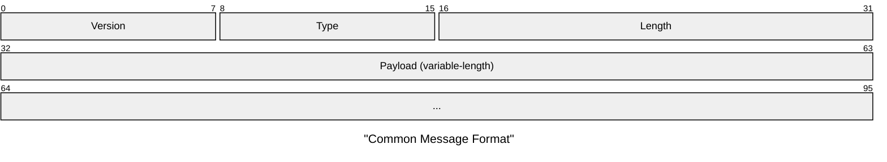
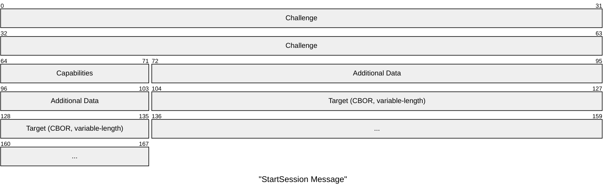
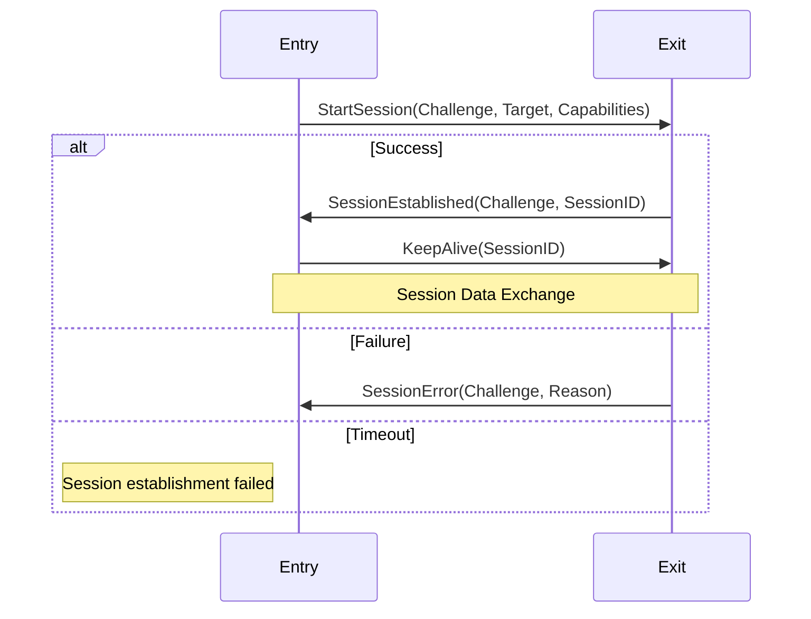

# RFC-0012: Session Start Protocol

- **RFC Number:** 0012
- **Title:** Session Start Protocol
- **Status:** Draft
- **Author(s):** Tino Breddin (@tolbrino)
- **Created:** 2025-08-20
- **Updated:** 2025-08-20
- **Version:** v0.1.0 (Draft)
- **Supersedes:** N/A
- **Related Links:** [RFC-0002](../RFC-0002-mixnet-keywords/0002-mixnet-keywords.md), [RFC-0003](../RFC-0003-hopr-packet-protocol/0003-hopr-packet-protocol.md), [RFC-0007](../RFC-0007-session-protocol/0007-session-protocol.md)

## 1. Abstract

This RFC specifies the HOPR Session Start Protocol, a handshake protocol for establishing sessions between peers in the HOPR mixnet. The protocol manages session establishment, lifecycle, and capability negotiation using HOPR packets as transport. It provides a standardized method for initiating communication sessions, exchanging session parameters, and maintaining session state through keep-alive mechanisms.

## 2. Motivation

The HOPR mixnet requires a standardized mechanism for establishing communication sessions between nodes. While the Session Data Protocol (see RFC-0007) handles data transmission, there needs to be a separate protocol for:

- Establishing sessions with capability negotiation
- Exchanging session identifiers and targets
- Managing session lifecycle and state
- Providing error handling for session establishment failures
- Maintaining session liveness through keep-alive mechanisms

The Session Start Protocol fills this gap by providing a lightweight, transport-agnostic handshake mechanism specifically designed for the HOPR ecosystem.

## 3. Terminology

- **Challenge**: A 64-bit random value used to correlate requests and responses in the handshake process.

- **Session Target**: The destination or purpose of a session, typically an address or service identifier, encoded in CBOR format.

- **Session Capabilities**: A bitmap of session features and options negotiated during session establishment.

- **Session ID**: A unique identifier assigned by the responder to identify the established session.

- **Entry Node**: The node that initiates a session establishment request.

- **Exit Node**: The node that receives and responds to a session establishment request.

- **CBOR (Concise Binary Object Representation)**: A binary data serialization format defined in RFC 7049 [01], used for encoding session identifiers and targets.

## 4. Specification

### 4.1 Protocol Overview

The Session Start Protocol operates at version 2 and consists of four message types that manage the complete lifecycle of session establishment:

1. **StartSession**: Initiates a new session
2. **SessionEstablished**: Confirms session establishment
3. **SessionError**: Reports session establishment failure
4. **KeepAlive**: Maintains session liveness

The protocol uses HOPR packets as the underlying transport mechanism and supports both successful and failed session establishment scenarios.

### 4.2 Message Format

All Session Start Protocol messages follow a common structure:



- **Version** (1 byte): Protocol version, MUST be 0x02 for version 2
- **Type** (1 byte): Message type discriminant
  - 0x00: StartSession
  - 0x01: SessionEstablished
  - 0x02: SessionError
  - 0x03: KeepAlive
- **Length** (2 bytes): Big-endian payload length in bytes
- **Payload** (variable): Message-specific data (CBOR-encoded where applicable)

### 4.3 StartSession Message

Initiates a new session with the remote peer.



- **Challenge** (8 bytes): Random challenge for correlating responses
- **Capabilities** (1 byte): Session capabilities bitmap
- **Additional Data** (4 bytes): Capability-dependent options (0x00000000 to ignore)
- **Target** (variable): CBOR-encoded session target (e.g., "127.0.0.1:1234")

### 4.4 SessionEstablished Message

Confirms successful session establishment.


- **Original Challenge** (8 bytes): Challenge from StartSession message
- **Session ID** (variable): CBOR-encoded session identifier assigned by responder

### 4.5 SessionError Message

Reports session establishment failure.


- **Challenge** (8 bytes): Challenge from StartSession message
- **Reason** (1 byte): Error reason code
  - 0x00: Unknown error
  - 0x01: No slots available
  - 0x02: Busy

### 4.6 KeepAlive Message

Maintains session liveness.


- **Flags** (1 byte): Reserved for future use (MUST be 0x00)
- **Additional Data** (8 bytes): Flag-dependent options (0x0000000000000000 to ignore)
- **Session ID** (variable): CBOR-encoded session identifier

### 4.7 Protocol Flow



### 4.8 Protocol Rules

1. Challenge values MUST be randomly generated using cryptographically secure random number generation
2. Session IDs MUST be unique per responder
3. Targets and Session IDs use CBOR encoding [01]
4. Messages MUST fit within HOPR packet payload limits
5. KeepAlive messages SHOULD be sent periodically to maintain session state
6. Implementations MUST handle all defined error conditions gracefully
7. Session establishment timeouts SHOULD be configurable but default to 30 seconds

### 4.9 Example Message Exchange

Complete session establishment and maintenance:

```
Entry → Exit:
  StartSession(challenge=0x1234567890ABCDEF,
               target="127.0.0.1:8080",
               capabilities=0x00,
               additional_data=0x00000000)

Exit → Entry:
  SessionEstablished(orig_challenge=0x1234567890ABCDEF,
                     session_id=42)

Entry → Exit:
  KeepAlive(session_id=42, flags=0x00, additional_data=0x00000000)

// Session is now established and ready for data exchange
```

## 5. Design Considerations

### 5.1 CBOR Encoding

The use of CBOR (Concise Binary Object Representation) for Session IDs and Targets provides:

- Flexible data types without fixed-size constraints
- Compact binary encoding
- Language-agnostic serialization
- Support for complex session identifiers

### 5.2 Challenge-Response Design

The 64-bit challenge provides:

- Correlation between requests and responses
- Protection against replay attacks (when combined with transport security)
- Simple state tracking for pending sessions

### 5.3 Capability Negotiation

The single-byte capability field allows:

- Up to 8 independent capability flags
- Future protocol extensions
- Backward compatibility through ignored bits

### 5.4 Transport Independence

The Session Start protocol is transport-agnostic:

- Works over any packet-based transport
- Designed for HOPR packets but not limited to them
- No assumptions about ordering or reliability

### 5.5 Error Handling

The protocol provides structured error reporting:

- Specific error codes for common failure scenarios
- Challenge correlation for error attribution
- Graceful handling of resource exhaustion

## 6. Compatibility

### 6.1 Version Compatibility

- Version 2 is the initial protocol version
- Future versions MUST use different version numbers
- Implementations MUST reject messages with unknown versions
- Version negotiation is out of scope for this specification

### 6.2 Transport Requirements

- Requires bidirectional communication channel
- No assumptions about ordering or reliability
- Compatible with any transport providing packet delivery
- Designed for HOPR mixnet but not limited to it

### 6.3 Integration with HOPR Session Data Protocol

- HOPR Session Start Protocol establishes sessions for use by HOPR Session Data Protocol (see RFC-0007)
- Session IDs from this protocol are used to identify data sessions
- Protocol operates independently but provides foundation for data exchange

## 7. Security Considerations

### 7.1 Protocol Security

- The protocol provides NO encryption or authentication
- Security MUST be provided by the underlying transport
- Session IDs SHOULD be unpredictable to prevent session hijacking
- Challenges MUST use cryptographically secure random number generation

### 7.2 Attack Vectors

- Replay attacks possible without additional timestamp or nonce mechanisms
- Man-in-the-middle attacks not prevented by protocol alone
- Session targets may expose service information if not encrypted at transport
- Resource exhaustion through excessive session establishment requests

### 7.3 Mitigation Strategies

- Use transport-level security (e.g., HOPR packet encryption)
- Implement rate limiting for session establishment requests
- Use unpredictable session identifiers
- Consider implementing session timeout mechanisms

## 8. Future Work

- Session parameter renegotiation mechanisms
- Performance optimizations for high-frequency session establishment

## 9. Implementation Notes

### 9.1 Testing Recommendations

- Test with various session target formats
- Simulate network failures and timeouts
- Verify challenge uniqueness and correlation
- Test capability negotiation edge cases
- Validate CBOR encoding/decoding correctness

## Appendix 1

Within HOPR protocol a Session is identified uniquely via HOPR Session ID,
this consists of a 10-byte pseudorandom bytes as prefix and 64-bit unsigned integer as suffix.

In human readable format, a HOPR Session ID has the following syntax:

`0xabcdefabcdefabcdefab:123456`

The prefix represents a fixed pseudonym prefix of in the HOPR Packet protocol (as in RFC-0003).
The suffix represents an application tag that identifies Sessions within the reserved range in the Application protocol (as in RFC-0014).

## 10. References

[01] Bormann, C. & Hoffman, P. (2013). [Concise Binary Object Representation (CBOR)](https://datatracker.ietf.org/doc/html/rfc7049). _IETF RFC 7049_.
