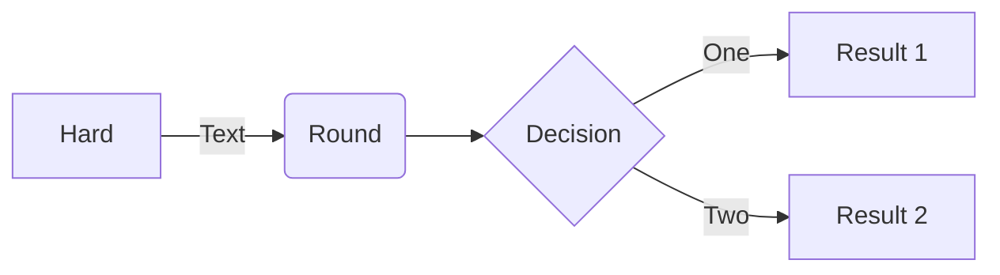

# RFC-0013: Return path incentivization

- **RFC Number:** 0013
- **Title:** Return path incentivization
- **Status:** Raw
- **Author(s):** [Name (@GitHubHandle)]
- **Created:** YYYY-MM-DD
- **Updated:** YYYY-MM-DD
- **Version:** v0.1.0 (Raw)
- **Supersedes:** none
- **Related Links:** none

## 1. Abstract

This RFC is a placeholder for future work on return path incentivization in the HOPR protocol. The specification is currently in development and will define mechanisms to incentivize relay nodes on return paths for bidirectional communication.

## 2. Motivation

_[This section to be completed during development]_

## 3. Terminology

_[This section to be completed during development]_

## 4. Specification

Comprehensive description of the proposed solution, including:

- Protocol overview
- Technical details (data formats, APIs, endpoints)
- Supported use cases
- Diagrams (stored in `assets/` and referenced as ``)

## 5. Design Considerations

Discuss critical design decisions, trade-offs, and justification for chosen approaches over alternatives.

## 6. Compatibility

Address backward compatibility, migration paths, and impact on existing systems.

## 7. Security Considerations

Identify potential security risks, threat models, and mitigation strategies.

## 8. Drawbacks

Discuss potential downsides, risks, or limitations associated with the proposed solution.

## 9. Alternatives

Outline alternative approaches that were considered and reasons for their rejection.

## 10. Unresolved Questions

Highlight questions or issues that remain open for discussion.

## 11. Future Work

Suggest potential areas for future exploration, enhancements, or iterations.

## 12. References

None.
