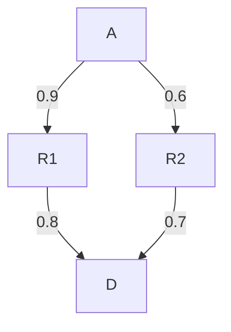

# RFC-0014: Path-finding

- **RFC Number:** 0014
- **Title:** Path-finding
- **Status:** Finalised
- **Author(s):** Tibor Csóka (@Teebor-Choka)
- **Created:** 2026-06-05
- **Updated:** 2026-06-09
- **Version:** v1.0.0
- **Supersedes:** none
- **Related Links:** [RFC-0002](../RFC-0002-mixnet-keywords/0002-mixnet-keywords.md),
  [RFC-0004](../RFC-0004-hopr-packet-protocol/0004-hopr-packet-protocol.md),
  [RFC-0005](../RFC-0005-proof-of-relay/0005-proof-of-relay.md),
  [RFC-0008](../RFC-0008-session-protocol/0008-session-protocol.md),
  [RFC-0009](../RFC-0009-session-start-protocol/0009-session-start-protocol.md),
  [RFC-0010](../RFC-0010-automatic-path-discovery/0010-automatic-path-discovery.md)

## 1. Abstract

This RFC specifies the multi-hop path-finding mechanism for the HOPR protocol. Given a directed channel graph whose edges carry quality observations produced by the probing mechanism defined in [RFC-0010](../RFC-0010-automatic-path-discovery/0010-automatic-path-discovery.md), a path-finding node enumerates simple paths of a requested length, scores each candidate as the product of per-edge quality values, validates every candidate against on-chain channel state, and selects one path by weighted-random sampling. Accepted candidates are cached with periodic background refresh to amortise discovery cost.

## 2. Motivation

[RFC-0010](../RFC-0010-automatic-path-discovery/0010-automatic-path-discovery.md) defines how the local node collects telemetry about its neighbourhood and populates a directed channel graph with per-edge quality observations. That RFC explicitly leaves path selection out of scope. This document closes that gap.

Path selection in an anonymous mixnet cannot rely on shortest-path or least-latency heuristics alone. Three competing requirements shape the design:

1. **Anonymity**: Deterministic best-path selection would allow a passive adversary to predict which relay nodes will carry a given flow, breaking sender anonymity. Path selection MUST introduce randomness.

2. **Reliability**: Paths that traverse low-quality or disconnected edges increase packet loss. Candidates with very low quality MUST be down-weighted or pruned so that the sender is unlikely to select them.

3. **Incentivisation**: Every hop except the last MUST be backed by an open payment channel, ensuring relay nodes receive economic compensation for forwarding.

These requirements motivate a quality-weighted random selection over a candidate pool of validated simple paths, as specified in §4.

## 3. Terminology

The keywords "MUST", "MUST NOT", "REQUIRED", "SHALL", "SHALL NOT", "SHOULD", "SHOULD NOT", "RECOMMENDED", "MAY", and "OPTIONAL" in this document are to be interpreted as described in [01] when, and only when, they appear in all capitals, as shown here.

All terminology used in this document, including general mix network concepts and HOPR-specific definitions, is provided in [RFC-0002](../RFC-0002-mixnet-keywords/0002-mixnet-keywords.md). That document serves as the authoritative reference for the terminology and conventions adopted across the HOPR RFC series.

The following additional terms are defined for use within this document:

**Channel graph**: The directed graph maintained by each node whose vertices are HOPR nodes (identified by their offchain public key) and whose directed edges represent physical or logical connections, each carrying quality observations as defined in [RFC-0010](../RFC-0010-automatic-path-discovery/0010-automatic-path-discovery.md) §4.2.

**Edge score**: A real number in `[0, 1]` derived from the probe observations on a directed edge. An edge with a score of `0` is unusable for path selection; a score of `1` represents optimal quality. The formula is defined in §4.2.

**Path value**: The multiplicative product of edge scores along a candidate path, in `(0, 1]`. A zero path value means the path is unusable.

**Candidate pool**: The set of simple paths of a requested length enumerated from the channel graph, each paired with its path value. Candidates with a zero or negative path value are discarded before further processing.

**Validated path**: A candidate path that has been confirmed against the on-chain channel resolver — every consecutive pair of nodes is backed by an open payment channel, and every node identity resolves correctly on-chain.

**Path planner**: The component that owns the cache of validated paths, drives the selector, and resolves incoming routing requests into a concrete `ValidatedPath`.

**Path selector**: The stateless component that performs graph traversal and returns a candidate pool for a given `(source, destination, hops)` query.

**Hop count** (`hops`): The number of intermediate relay nodes on a path (excluding source and destination). A path with `hops = 1` traverses a single relay between sender and receiver.

## 4. Specification

### 4.1 Network graph inputs

Path-finding operates over the channel graph described in [RFC-0010](../RFC-0010-automatic-path-discovery/0010-automatic-path-discovery.md) §4.2. This section summarises the properties consumed by path-finding; the full graph construction and probing protocol are defined in [RFC-0010](../RFC-0010-automatic-path-discovery/0010-automatic-path-discovery.md) and are out of scope here.

Each directed edge `(u → v)` in the graph stores an observation record with up to two independent measurement streams:

- **Immediate observations** (from immediate-neighbour probes, RFC-0010 §4.2.1.1): round-trip latency samples and connectivity status for the direct `u → v` link.
- **Intermediate observations** (from loopback path probes, RFC-0010 §4.2.1.2): attributed latency for the `u → v` segment within a longer path, plus on-chain channel capacity.

Each measurement stream maintains an exponential moving average (EMA) of observed latency (window depth `N >= 3`) and an EMA of probe success rate (window depth `N >= 5`). These EMAs MAY be configurable.

### 4.2 Edge score

The edge score for a directed edge `(u → v)` is derived from the probe observation record as follows.

**Link score** — for each measurement stream (immediate or intermediate), the link score is:

```text
link_score = probe_success_rate × latency_score(avg_latency)
```

where `latency_score` is a step function:

| Average latency | Latency score |
|---|---|
| ≤ 75 ms | 1.00 |
| 76 – 125 ms | 0.70 |
| 126 – 200 ms | 0.30 |
| > 200 ms | 0.15 |
| no data | 0.05 |

**Combined edge score** — the edge score combines the two measurement streams:

```text
edge_score =
  (imm_score + inter_score) / 2   if both streams are present
  inter_score                      if only intermediate is present
  imm_score                        if only immediate is present
  0                                if neither stream is present
```

An edge with no observations at all has a score of `0` and MUST be treated as unusable.

### 4.3 Path-value function

Path-finding uses three variants of an edge value function, supplied as an opaque parameter to the graph traversal algorithm. Each variant enforces a set of edge admission criteria and computes a per-edge cost in `(0, 1]` for admissible edges, or a non-positive sentinel for inadmissible ones. The traversal algorithm prunes any path containing a non-positive edge cost.

The three variants are:

**`forward(length, edge_penalty, min_ack_rate)`** — used for forward paths (`source = local node`). Applied to every edge in the path.

**`forward_without_self_loopback(edge_penalty, min_ack_rate)`** — used in Phase-2 extended forward search (§4.4.1). Applied to every edge except the appended final hop.

**`returning(length, edge_penalty, min_ack_rate)`** — used for return paths (`source ≠ local node`). Applied to every edge in the path.

The admission and cost rules applied by all variants are:

1. **Last-edge connectivity**: the last edge on the path MUST satisfy `is_connected = true`. An edge that is not physically connected receives a non-positive cost and is pruned.

2. **Intermediate-edge capacity**: every edge that is not the last MUST have a positive on-chain channel capacity. An edge with zero or absent capacity is pruned.

3. **Minimum acknowledgement rate**: an edge whose immediate-probe acknowledgement rate is below `min_ack_rate` (default `0.1`) receives a non-positive cost and is pruned.

4. **Unprobed-edge penalty**: an edge that lacks probe observations is assigned a cost of `edge_penalty` (default `0.5`) rather than `0`. This allows unprobed edges to be selected but makes them less likely than well-observed edges.

5. **Path value accumulation**: the path value is the product of all per-edge costs along the path:

```text
path_value = ∏ edge_cost(e)   for each edge e in path
```

Because all costs are in `(0, 1]`, the path value decreases monotonically with path length and with the number of low-quality edges.

### 4.4 Candidate generation

The path selector enumerates simple paths through the channel graph using bounded depth-first search (DFS). The algorithm tracks a visited-node set to prevent cycles; all returned paths are acyclic (no node is visited twice).

The hop bound is `MAX_INTERMEDIATE_HOPS = 3`, which limits the maximum path length to `MAX_INTERMEDIATE_HOPS + 1 = 4` directed edges. This limit is enforced by the path identifier encoding, which reserves space for exactly five node slots.

Candidate enumeration is capped at `max_paths` (default `8`) paths per query to bound the cost of the DFS.

#### 4.4.1 Two-phase forward candidate generation

When the source of a path query is the local node (a forward path), candidate generation proceeds in two phases:

```mermaid
flowchart TD
    A[Query: source=me, dest, hops] --> B["Phase 1: simple_paths(me, dest, hops+1)\nEdgeValueFn::forward"]
    B --> C{|candidates| >= max_paths?}
    C -- yes --> G[Return candidate pool]
    C -- no --> D["Phase 2: simple_paths_from(me, hops)\nEdgeValueFn::forward_without_self_loopback\nAppend dest to each result\nSkip if dest already in path\nSkip if already found in Phase 1"]
    D --> E[Merge Phase 1 + Phase 2 results]
    E --> G
```

_Fig. 1: Two-phase forward candidate generation_

**Phase 1** enumerates simple paths of exactly `hops + 1` edges from `source` to `dest` using `EdgeValueFn::forward`. Paths with a zero or negative path value are discarded. Up to `max_paths` candidates are collected.

**Phase 2** is only triggered when Phase 1 produces fewer than `max_paths` candidates. It enumerates simple paths of exactly `hops` edges from `source` to any reachable node using `EdgeValueFn::forward_without_self_loopback`, then appends `dest` to each result. The motivation is that the final edge `(relay → dest)` may lack a payment channel (it is not required per RFC-0010 §4.2), so it would be pruned by Phase 1's capacity check. Phase 2 allows that final hop to be appended with a neutral cost of `1.0`.

Before accepting a Phase-2 candidate, the selector MUST:
- discard any path where `dest` already appears as an intermediate node, as appending it would produce a node duplicate; and
- discard any path already found in Phase 1 (matched by path content).

The remaining Phase-2 slots are filled up to `max_paths − |Phase 1 results|`.

#### 4.4.2 Return path candidate generation

When the source of a path query is a remote node (a return path), candidate generation uses a single phase: `simple_paths(source, dest, hops+1)` with `EdgeValueFn::returning`. No Phase-2 extension is performed.

### 4.5 Weighted random selection

The path planner holds a validated candidate pool as a `WeightedCollection<ValidatedPath>` where each entry's weight equals its path value (§4.3). Path selection draws one path by probability proportional to weight.

The selection algorithm is:

1. Compute `W = Σ weight_i` for all entries with `weight_i > 0`.
2. If `W ≤ 0`, return an error — no selectable path exists.
3. Draw a uniform random sample `r ∈ [0, W)`.
4. Walk the collection in insertion order, accumulating `S += max(weight_i, 0)`.
5. Return the first entry where `S > r`.

A floating-point edge case (when `r` rounds to exactly `W`): return the last entry with a positive weight.

This scheme ensures that a path with twice the path value of another is selected with twice the probability, while all paths with positive cost retain a non-zero selection chance. Paths with zero or negative cost MUST NOT be inserted into the collection.

### 4.6 Path validation

Before a candidate path from the selector is stored in the cache, it MUST be validated against the on-chain channel state. Validation MUST check:

1. **Node resolution**: every `OffchainPublicKey` in the path MUST resolve to a chain account address via the local key store.
2. **Open payment channel**: every consecutive pair `(u, v)` in `[source] ++ path` MUST have an open payment channel from `u` to `v` in the on-chain channel registry. The only exception is the final hop `(relay → destination)`, consistent with RFC-0010 §4.2.
3. **No duplicate nodes**: the full node sequence (including source) MUST contain no repeated node.

Candidates that fail any validation check MUST be silently skipped (failure MAY be logged at debug level). If no candidate in the pool validates, the planner MUST return a `PathNotFound` error for that `(source, destination, hops)` triple.

### 4.7 Cache and background refresh

The path planner maintains a cache of `WeightedCollection<ValidatedPath>` objects, keyed by `(source: NodeId, destination: NodeId, hops: u32)`.

**Cache parameters** (SHOULD match implementation defaults):

| Parameter | Default | Description |
|---|---|---|
| `max_cache_capacity` | 10,000 | Maximum number of `(source, dest, hops)` entries |
| `cache_ttl` | 60 s | Time-to-live for each entry after insertion |
| `refresh_period` | 30 s | Period between background refresh sweeps |
| `max_cached_paths` | 8 | Maximum candidates per cache entry |
| `edge_penalty` | 0.5 | Penalty multiplier for unprobed edges |
| `min_ack_rate` | 0.1 | Minimum acknowledgement rate for edge admission |

**Cache miss behaviour**: when a routing request is not satisfied from cache, the planner MUST invoke the selector, validate all candidates, and insert the resulting `WeightedCollection` before returning a selected path. Subsequent calls for the same key are served from cache until the TTL expires.

**Routing variants that bypass the cache**: explicit intermediate-path requests (`RoutingOptions::IntermediatePath`) and zero-hop direct requests (`hops = 0`) MUST bypass the cache entirely. These are validated on every invocation.

**Background refresh**: the path planner SHOULD run a background task that periodically iterates all live cache keys and re-inserts a fresh `WeightedCollection` for each key where the selector succeeds. This proactive sweep ensures that traffic bursts are served from cache rather than triggering concurrent cache misses.

The background task MUST NOT block request handling. A key whose refresh attempt fails (selector returns no candidates or no candidates validate) MUST be left with its current (possibly stale) cache entry until the TTL expires naturally.

### 4.8 Output

A successful path-planning operation produces a `ResolvedTransportRouting` comprising:

- A **forward path** (`ValidatedPath`) from the local node to the destination, selected per §4.5.
- Zero or more **return paths** (`ValidatedPath` each), from the destination back to the local node, used to construct SURBs for the reverse channel (see [RFC-0004](../RFC-0004-hopr-packet-protocol/0004-hopr-packet-protocol.md) and [RFC-0009](../RFC-0009-session-start-protocol/0009-session-start-protocol.md)).
- A **pseudonym** (`HoprPseudonym`) identifying the session, generated randomly if not supplied by the caller.

Return paths use `RoutingOptions` from the forward request; they are sourced from `destination → local_node` and selected via return-path candidate generation (§4.4.2). Multiple return paths MAY be resolved concurrently; the number is bounded by the packet format constraint on SURB count (see [RFC-0004](../RFC-0004-hopr-packet-protocol/0004-hopr-packet-protocol.md)).

### 4.9 Worked example

Consider a node `A` seeking a 1-hop forward path to destination `D` through a diamond topology:



_Fig. 2: Diamond topology with per-edge costs (example values)_

Phase 1 discovers two candidates:

| Path | Edge costs | Path value |
|---|---|---|
| A → R1 → D | 0.9 × 0.8 | **0.72** |
| A → R2 → D | 0.6 × 0.7 | **0.42** |

Both validate. The `WeightedCollection` stores them with total weight `W = 0.72 + 0.42 = 1.14`. A uniform draw `r ∈ [0, 1.14)`:

- `r < 0.72` → path `A → R1 → D` selected (probability ≈ 63 %)
- `0.72 ≤ r < 1.14` → path `A → R2 → D` selected (probability ≈ 37 %)

The lower-value path via R2 is still selected with significant probability, ensuring relay diversity.

## 5. Design considerations

**Multiplicative path value composition**: path value is the product of edge costs rather than their sum or minimum. This ensures that one very low-quality edge can substantially reduce the probability of a path being selected, without completely preventing selection — a property useful for graceful degradation when part of the network is degraded but still usable.

**DFS simple-paths over Yen's K-shortest-paths**: the HOPR hop bound (`MAX_INTERMEDIATE_HOPS = 3`) constrains the graph diameter to at most 4 edges per path. Within this regime, DFS-based enumeration of simple paths is tractable even for dense topologies. Yen's algorithm adds pre-computation overhead for maintaining auxiliary graphs, which is not justified when only 8 candidates are required at current network scale.

**Weighted random selection over greedy best-path**: always selecting the highest-value path would quickly concentrate traffic on a small number of relay nodes, reducing anonymity-set size and creating a predictable relay fingerprint. Weighted-random selection ensures that a passive adversary cannot trivially predict which relays carry a given flow.

**Two-phase forward search**: the final edge `(relay → destination)` may not have an open payment channel if the destination is a pure end-user rather than an infrastructure node. Phase 1 would prune all paths through such relays because the capacity check on the last edge would fail. Phase 2 extends the search to find shorter forward paths and appends the destination as a final hop with a neutral cost, avoiding the exclusion of otherwise high-quality routes.

**Cache TTL and refresh period**: with a TTL of 60 s and a refresh period of 30 s, the worst-case staleness of a cached path is approximately `cache_ttl + refresh_period = 90 s`. A channel that closes during this window could be selected for a brief period. This trade-off is acceptable because the validation step at cache-miss time provides a safety net, and the background refresh reduces the probability of serving stale entries under steady-state traffic.

**Cache bypass for zero-hop and explicit paths**: zero-hop direct messages and caller-supplied intermediate paths are not suitable for caching. Zero-hop paths depend only on key resolution, which is lightweight. Explicit paths are caller-controlled and may not be reusable across invocations.

## 6. Compatibility

Path-finding is a purely local mechanism; it reads the channel graph and the on-chain channel state but does not modify either. No wire-protocol changes are introduced by this specification.

The configuration parameters (`max_cache_capacity`, `cache_ttl`, `refresh_period`, `max_cached_paths`, `edge_penalty`, `min_ack_rate`) MAY be tuned per deployment without affecting protocol correctness or interoperability. Changes to these parameters affect only performance and selection probabilities.

The `EdgeValueFn` interface abstracts the cost function used during graph traversal. Deployments MAY substitute alternative cost functions (see §9) without changing the candidate generation or weighted-selection mechanisms, provided the substituted function satisfies the admissibility contract in §4.3.

## 7. Security considerations

**Deanonymisation via deterministic selection**: if the path selector were deterministic (always returning the highest-value path), a passive adversary observing two flows with the same optimal path could link them to the same sender. Weighted-random selection (§4.5) ensures that flows across the same source–destination pair will, over time, use different relay sets, reducing this linkage.

**Resource exhaustion**: the DFS enumeration is bounded by `max_paths` and the hop limit (`MAX_INTERMEDIATE_HOPS = 3`). The cache is bounded by `max_cache_capacity`. Together these prevent a malicious or misbehaving caller from exhausting memory or CPU through path-finding requests.

## 8. Drawbacks

**Exponential enumeration cost**: DFS enumeration of simple paths is exponential in hop count. The hop bound of 3 intermediates keeps this tractable in practice, but raising the bound would require either a different algorithm (§9) or a stricter `max_paths` cap.

**Staleness window**: a freshly broken channel may be selected during the window between the last cache refresh and TTL expiry (at most `cache_ttl + refresh_period ≈ 90 s` in the default configuration). Applications that require immediate response to topology changes must accept either higher cache churn or a lower TTL.

**No stake or capacity weighting**: the current implementation weights paths purely by their quality score derived from probe latency and success rate. Channel balance or stake is not a factor in path value. This means a low-capacity but well-probed edge may score identically to a high-capacity one, potentially causing ticket failures if a channel becomes underfunded.

**No path diversity constraint**: the candidate pool may contain paths that share relay nodes (e.g. two paths both traversing node R). Repeated selection from such a pool could concentrate traffic on shared nodes, reducing anonymity over time. There is currently no minimum-diversity constraint on the pool.

## 9. Alternatives

**Stake-aware path weighting**: adding channel balance or node stake to the path-value function would reduce the probability of selecting underfunded channels, decreasing ticket failure rates. This was considered but deferred because it introduces a dependency on the settlement layer (which may be observed with latency) and requires careful normalisation to avoid suppressing otherwise good-quality low-capacity edges. See §11 for future work.

**Anonymity-set constrained selection**: a selection constraint that enforces a minimum number of distinct relay nodes across the active path pool (Dingledine et al. [02]) would limit re-identification risk from repeated selections. This was not adopted because it requires tracking path history across requests and introduces stateful selection policy, adding complexity without a clear threat model for 4.0.x.

## 10. Unresolved questions

None at this time.

## 11. Future work

- **Stake-aware path weighting**: incorporate channel balance or node stake into the path-value function to reduce ticket failure on underfunded channels. Also listed in [RFC-0010](../RFC-0010-automatic-path-discovery/0010-automatic-path-discovery.md) §11.

- **Adaptive cache TTL**: reduce the TTL during periods of high graph churn (many channel open/close events observed on-chain) to decrease the staleness window at the cost of higher cache-miss rates.

- **Path-pool warming on session start**: pre-populate the cache for expected `(destination, hops)` pairs when a session is established, amortising path-finding latency across the first few message exchanges.

- **Anonymity-set diversity metric**: export an aggregate measure of relay diversity across active sessions as an observability signal, enabling operators to detect when path selection is converging onto a small relay set.

- **Yen's K-shortest-paths**: investigate using Yen's algorithm for candidate generation in configurations with higher hop bounds or larger network scale, where DFS enumeration may become intractable.

- **Bayesian edge scoring**: explore a Bayesian posterior model over edge reliability as an alternative to EMA-based scoring, to improve cold-start behaviour (few observations) and provide confidence intervals for path-value estimates.

- **Reactive path repair**: investigate triggering immediate cache eviction and re-selection on detected relay failure, reducing the dependence on background refresh for recovery from broken paths.

- **Path-selection telemetry**: export a metric (e.g., a histogram of chosen path values over time) to aid in tuning `edge_penalty` and `min_ack_rate`.

## 12. References

[01] Bradner, S. (1997). [Key words for use in RFCs to Indicate Requirement Levels](https://www.ietf.org/rfc/rfc2119.txt). _IETF RFC 2119_.

[02] Dingledine, R., Mathewson, N., & Syverson, P. (2004). [Tor: The Second-Generation Onion Router](https://svn.torproject.org/svn/projects/design-paper/tor-design.pdf). _USENIX Security Symposium_.

[03] Efraimidis, P. S., & Spirakis, P. G. (2006). [Weighted random sampling with a reservoir](https://doi.org/10.1016/j.ipl.2005.11.003). _Information Processing Letters_, 97(5), 181–185.
