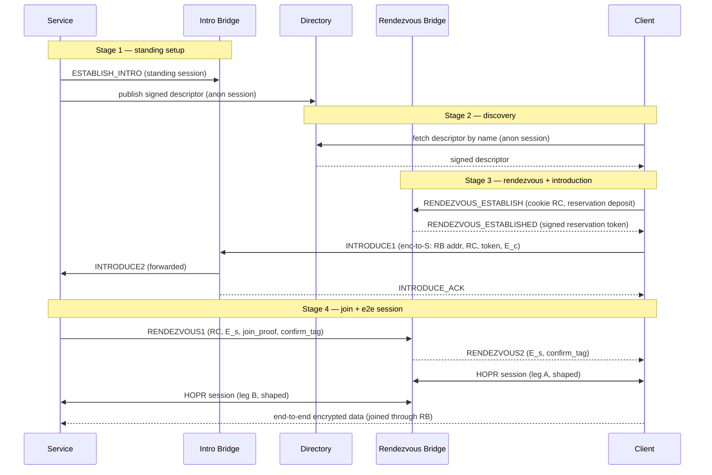

# RFC-0015: Onion Services over HOPR

- **RFC Number:** 0015
- **Title:** Onion Services over HOPR
- **Status:** Raw
- **Author(s):** Tibor Csóka (@Teebor-Choka)
- **Created:** 2026-07-05
- **Updated:** 2026-07-05
- **Version:** v0.6.1 (Raw)
- **Supersedes:** none
- **Related Links:** [RFC-0002](../RFC-0002-mixnet-keywords/0002-mixnet-keywords.md),
  [RFC-0003](../RFC-0003-hopr-overview/0003-hopr-overview.md),
  [RFC-0004](../RFC-0004-hopr-packet-protocol/0004-hopr-packet-protocol.md),
  [RFC-0005](../RFC-0005-proof-of-relay/0005-proof-of-relay.md),
  [RFC-0006](../RFC-0006-hopr-mixer/0006-hopr-mixer.md),
  [RFC-0007](../RFC-0007-economic-reward-system/0007-economic-reward-system.md),
  [RFC-0008](../RFC-0008-session-protocol/0008-session-protocol.md),
  [RFC-0009](../RFC-0009-session-start-protocol/0009-session-start-protocol.md),
  [RFC-0010](../RFC-0010-automatic-path-discovery/0010-automatic-path-discovery.md),
  [RFC-0011](../RFC-0011-application-protocol/0011-application-protocol.md),
  [RFC-0012](../RFC-0012-protocol-for-incentivization-of-exits/0012-protocol-for-incentivization-of-exits.md),
  [RFC-0014](../RFC-0014-path-finding/0014-path-finding.md)

## 1. Abstract

This RFC specifies **HOPR Onion Services**: a scheme for offering a network
service whose provider and consumers remain mutually anonymous. No relaying node
learns both endpoints' network identities, and neither endpoint learns the
other's location or node identity. It is the HOPR-native counterpart of Tor
onion services [06], built on the HOPR mixnet rather than on circuit-switched
onion routing.

The design adopts a two-phase **introduction and rendezvous** architecture. A
service maintains inexpensive standing control sessions to a set of announced
**introduction bridges** and publishes a signed **service descriptor** to a
distributed directory. To connect, a client selects a fresh **rendezvous
bridge**, asks the service to meet it there through an introduction bridge, and
the two parties then exchange data end-to-end encrypted across the rendezvous
bridge, which joins two independent HOPR sessions and observes only ciphertext.
The rendezvous bridge does learn that the two sessions it joins belong to one
connection — this is its function — but it learns neither endpoint's identity,
and mandatory traffic shaping bounds what its vantage yields; the residual risk
is analysed in Section 7. Services are named by self-certifying `.hopr`
addresses derived from an Ed25519 identity key, with an optional ENS-based
human-readable alias layer, and MAY be served by multiple hosts through signed
delegation.

Incentivisation reuses HOPR Proof of Relay
([RFC-0005](../RFC-0005-proof-of-relay/0005-proof-of-relay.md)) for the two
transport legs and the PIX privacy-pool settlement construction
([RFC-0012](../RFC-0012-protocol-for-incentivization-of-exits/0012-protocol-for-incentivization-of-exits.md),
a draft dependency) for the bridge role, so every participant is paid **only
against verifiable service** and without any party learning who paid it. This
document normatively defines service identity and naming, the descriptor format
and directory interface, the bridge announcement and selection rules, the
introduction and rendezvous protocol, the end-to-end handshake, the incentive
and denial-of-service model, and the associated security properties. The
mechanics of the distributed directory are delegated to a companion RFC.

## 2. Motivation

HOPR ([RFC-0003](../RFC-0003-hopr-overview/0003-hopr-overview.md)) provides
sender anonymity toward relays and the destination, a recipient-initiated reply
channel through pseudonyms and single-use reply blocks (SURBs), per-hop
incentivisation via Proof of Relay
([RFC-0005](../RFC-0005-proof-of-relay/0005-proof-of-relay.md)), and session
semantics ([RFC-0008](../RFC-0008-session-protocol/0008-session-protocol.md),
[RFC-0009](../RFC-0009-session-start-protocol/0009-session-start-protocol.md))
over the mixnet. What it does not provide is a way for **two mutually anonymous
parties** to communicate: in every existing HOPR session one endpoint (the exit
node) is addressable and its node identity is known to the initiator. A service
that wants to be reachable without revealing where it runs has no in-protocol
mechanism today.

Tor solves the analogous problem for circuit onion routing with introduction
points, rendezvous points, and a hidden-service directory [06]. HOPR needs an
equivalent faithful to its own primitives — fixed-size Sphinx packets [03],
SURB-based replies, probabilistic ticket payments, and on-chain node
announcement — rather than a port of a circuit-switched design. The broader
lineage is the mix-network line of work beginning with Chaum [02].

This RFC defines that mechanism. It closes five concrete gaps left open by the
existing stack:

1. **Mutual anonymity.** A rendezvous role lets neither endpoint learn the
   other, while a client-chosen rendezvous point per connection keeps announced
   infrastructure out of the bulk-traffic path.
2. **Naming and discovery.** Self-certifying addresses plus a signed-descriptor
   directory give services a stable, verifiable identity and a way to be found.
3. **Multi-host serving.** Signed delegation lets several hosts serve one
   service identity without sharing the long-term key.
4. **Bridge incentives.** The splice/availability role is not covered by Proof
   of Relay or PIX as-is; this RFC adds a negotiated, service-conditional,
   anonymity-preserving bridge fee.
5. **Abuse resistance.** A mutually anonymous inbound channel invites spam;
   payment-gated introduction and descriptor-level access control price and gate
   it.

## 3. Terminology

The keywords "MUST", "MUST NOT", "REQUIRED", "SHALL", "SHALL NOT", "SHOULD",
"SHOULD NOT", "RECOMMENDED", "MAY", and "OPTIONAL" in this document are to be
interpreted as described in [01] when, and only when, they appear in all
capitals, as shown here.

General mixnet and HOPR glossary terms (mixnet, node, path, hop, relay node,
onion routing, cover traffic, unlinkability, Proof of Relay, channel, mixer,
session) are defined in
[RFC-0002](../RFC-0002-mixnet-keywords/0002-mixnet-keywords.md). The packet-layer
terms **SURB**, **sender pseudonym**, and **ReplyOpener** are defined in
[RFC-0004](../RFC-0004-hopr-packet-protocol/0004-hopr-packet-protocol.md). This
document additionally defines:

- **Onion service** (also **service**): a service reachable over HOPR whose host
  location and node identity are hidden from its clients and from relaying
  nodes.
- **Service identity key**: the long-term Ed25519 key pair `id_S` that names and
  authenticates a service. Its public part yields the self-certifying address.
- **Self-certifying address**: the `.hopr` string derived from the `id_S` public
  key (Section 4.2.1). Authenticity of any signed material is checkable against
  it without external trust.
- **Service descriptor**: the signed document that maps a service to its current
  introduction bridges and connection parameters (Section 4.3).
- **Bridge relayer** (also **bridge**): a HOPR node that has announced the
  capability to act as an introduction bridge and/or a rendezvous bridge.
- **Introduction bridge** (**IB**): a bridge that holds a standing control
  session with a service and forwards introduction requests to it.
- **Rendezvous bridge** (**RB**): a bridge, chosen freshly by a client per
  connection, that joins the client's and the service's HOPR sessions and relays
  the end-to-end-encrypted payload between them.
- **Session join**: the generic operation by which a bridge binds two HOPR
  sessions bearing a shared join token and relays opaque payload between them.
  Onion-service rendezvous is one use of this operation; a bridge performing a
  join is not told what higher-level purpose it serves.
- **Rendezvous cookie** (**RC**): a single-use random join token that binds a
  client's and a service's sessions at a rendezvous bridge.
- **Introduction request**: the client-produced, service-encrypted message that
  names the rendezvous bridge and carries the client's end-to-end handshake
  half.
- **End-to-end (e2e) session**: the session established directly between client
  and service, encrypted under a key the bridge does not possess, carried over
  the two joined HOPR sessions.
- **Directory**: the distributed store from which descriptors are published and
  fetched (interface in Section 4.3; mechanics in a companion RFC).
- `||` denotes byte-string concatenation. `|x|` denotes the size of `x` in
  bytes. Multi-byte integers are big-endian unless stated otherwise. Character
  strings in double quotes use ASCII single-byte encoding. `CSPRNG` is a
  cryptographically secure pseudorandom number generator. `H`, `KDF`, and the
  symmetric and curve primitives are fixed in Appendix 1.

## 4. Specification

### 4.1 Overview

An onion service connection involves five roles, all HOPR nodes except the
directory abstraction and the privacy pool:

- **Service** `S` — the provider, running on or behind a HOPR node with funded
  payment channels (Section 4.9 discusses a gateway variant).
- **Client** `C` — the consumer.
- **Introduction bridge** `IB` — announced in the descriptor; holds a standing
  control session with `S`.
- **Rendezvous bridge** `RB` — chosen fresh by `C`; performs the session join.
- **Directory** and **privacy pool** `W` — supporting infrastructure
  (Sections 4.3 and 4.7).

The lifecycle has four stages: (1) the service publishes a descriptor and opens
standing sessions to its introduction bridges; (2) the client fetches and
verifies the descriptor; (3) the client establishes a rendezvous reservation and
introduces itself to the service through an introduction bridge; (4) the service
joins the rendezvous and the parties run an end-to-end session across the join.



Every arrow between two HOPR nodes is itself a multi-hop HOPR path (0–3
intermediate hops each way, per
[RFC-0004](../RFC-0004-hopr-packet-protocol/0004-hopr-packet-protocol.md)),
subject to mixing
([RFC-0006](../RFC-0006-hopr-mixer/0006-hopr-mixer.md)) and paid via Proof of
Relay ([RFC-0005](../RFC-0005-proof-of-relay/0005-proof-of-relay.md)). The
diagram shows the logical overlay, not the packet path.

The onion-service control messages defined in this RFC are carried in the HOPR
application protocol
([RFC-0011](../RFC-0011-application-protocol/0011-application-protocol.md)) under
the **Onion Service Control Protocol (OSCP)** application tag
`0x0000000000000002`, the first of the user-defined tags `0x2`–`0xd`. That range
has no global registry, so a deployment MUST treat tag selection as a
coordination concern (Section 6). The end-to-end data session uses the
session-data protocol
([RFC-0008](../RFC-0008-session-protocol/0008-session-protocol.md)) inside the
e2e-encrypted channel.

### 4.2 Service identity, naming and delegation

#### 4.2.1 Identity key and self-certifying address

A service is identified by an Ed25519 [07] key pair `id_S = (sk_S, pk_S)`. The
service's canonical **self-certifying address** is:

```
address = base32( version || pk_S || checksum ) || ".hopr"
version  : u8         (current value 0x01)
pk_S     : [u8; 32]   Ed25519 public key (canonical encoding)
checksum : [u8; 2]    truncated H(".hopr-checksum" || version || pk_S)
```

`base32` uses the RFC 4648 [12] lowercase alphabet without padding. The trust
anchor is the full 32-byte `pk_S`; the checksum protects only against
transcription errors and confers no security (a 16-bit checksum is trivially
matched by a brute-forced lookalike key, so users MUST compare full addresses,
not rely on visual similarity). The address is self-certifying: any descriptor
or delegation presented for it MUST verify under `pk_S` (directly or through a
delegation chain rooted at `pk_S`), so a malicious host cannot serve a different
key under the same name. A client MUST reject any `version` below its configured
minimum, so a future hardened format cannot be silently downgraded.

#### 4.2.2 Human-readable aliases (ENS, optional)

Human-readable names are OPTIONAL and layered on top of the self-certifying
address, which remains authoritative. A service MAY register an ENS [08] name
(or subdomain) whose `hopr` text record contains its `.hopr` address. A client
resolving an alias MUST fetch the descriptor for the `.hopr` address the record
points to and MUST verify it against that address. ENS resolution is a discovery
convenience only; it confers no authority and MUST NOT override the
self-certifying check. No bespoke registry contract is introduced by this RFC.

#### 4.2.3 Multi-host serving via delegation

A service MAY be served by more than one host without sharing `sk_S`. The
identity key signs a **delegation certificate** authorising a per-host
signing/operating key for a bounded window:

```
DelegationCert {
  version         : u8,           // 0x01
  service_pubkey  : [u8; 32],     // pk_S this cert is bound to (MUST match address)
  serial          : u64,          // unique per (service, delegate); monotonic
  delegate_pubkey : [u8; 32],     // Ed25519 per-host key
  not_before      : u64,          // UNIX seconds
  not_after       : u64,          // UNIX seconds; MUST NOT exceed not_before + MAX_DELEGATION
  capabilities    : u16,          // bit 0 = publish descriptor, bit 1 = run intro point,
                                  // bit 2 = terminate e2e session; other bits reserved
  signature       : [u8; 64]      // Ed25519 by sk_S over all preceding fields
}
```

A host holding a valid `DelegationCert` MAY perform exactly the actions whose
capability bit is set, during `[not_before, not_after)`. Verifiers MUST reject a
delegated action whose corresponding bit is unset and MUST treat any unknown
capability bit as unauthorised (deny by default). `service_pubkey` MUST equal
the `pk_S` of the dialed address, preventing cross-identity cert reuse.

Capability bit 2 (terminate e2e session) additionally requires the delegate to
hold the per-period handshake static private key. Because `S_s` is derived from
`sk_S` (Section 4.3.1), a delegate cannot recompute it; therefore a service
authorising bit 2 MUST provision the delegate with the **current period's** `S_s`
private half over a secure channel, re-provisioning each period. Provisioning
only the per-period key (never `sk_S`) bounds the exposure of a compromised
delegate to that period and to the actions its bits permit.
Descriptors served by a delegate MUST embed the certificate so clients verify
the chain to `pk_S`. Revocation before `not_after` is by descriptor rotation (a
fresh, higher-`revision` descriptor omitting the revoked delegate) combined with
short windows: `not_after − not_before` MUST NOT exceed `MAX_DELEGATION`
(default 7 days). Because there is no online revocation list, `sk_S` compromise
recovery relies on short windows; long-lived certificates are NOT RECOMMENDED.

### 4.3 Service descriptor and directory interface

#### 4.3.1 Descriptor content

A service descriptor is a signed document. Its signed fields are:

```
Descriptor {
  version          : u8,               // 0x01
  address          : self-certifying address (Section 4.2.1)
  revision         : u64,              // monotonic; higher supersedes lower
  published_at     : u64,              // UNIX seconds, absolute publication time
  lifetime         : u32,              // validity in seconds from published_at
  handshake_static : [u8; 32],         // per-period service X25519 static key S_s (below)
  intro_points     : IntroSection,     // see below (public: plain list; private: encrypted+padded)
  session_caps     : CapabilityFlags,  // session modes, traffic classes
  min_dos_level    : u8,               // monotonic floor a client MUST enforce
  dos_policy       : DosPolicy,        // Section 4.8
  delegation       : DelegationCert?,  // present iff signed by a delegate
  signature        : [u8; 64]          // Ed25519 over all preceding fields
}

IntroPoint {
  node_id       : [u8; 32],   // IB HOPR off-chain public key (routing target)
  intro_enc_key : [u8; 32],   // X25519 public key; PRIVATE HALF HELD ONLY BY THE SERVICE
  expiry        : u64         // UNIX seconds
}
```

`signature` is by `sk_S`, or by `delegation.delegate_pubkey` (capability bit 0
set) when `delegation` is present. `revision` and `published_at` together resist
rollback: a client MUST prefer the highest valid `revision`, MUST reject a
descriptor whose `published_at + lifetime` has elapsed, and MUST reject a
descriptor whose `published_at` is not consistent with the current directory
period (Section 4.3.2).

The `IntroSection` has two forms selected by a one-byte discriminant:

- **Public service**: a plain `[IntroPoint; c]` where `c` is the real count.
  Since a public service's introduction bridges are usable by anyone, their
  identities are not secret and no padding is applied; the client reads the list
  directly.
- **Private service**: the real `[IntroPoint; c]` list is AEAD-encrypted to the
  authorised-client key set (Section 4.8.2) and then padded to a fixed
  `INTRO_SLOTS` (default 8) ciphertext-sized slots, so an outsider who cannot
  decrypt learns neither the intro points nor their count. An authorised client
  decrypts to obtain the real list. Padding is meaningful only here, because only
  here are the entries hidden.

`intro_enc_key` is the X25519 public key used to encrypt the introduction blob
(Section 4.5.3). **Its private half is held only by the service (or a delegate
with capability bit 1); the introduction bridge stores only the public value and
cannot decrypt the blob.** `ESTABLISH_INTRO` (Section 4.5.1) proves the service
possesses this private half.

`handshake_static` (`S_s`) is rotated **every period** together with the
publication key (Section 4.3.2), derived deterministically as
`S_s = X25519_clamp(H("hopr-onion-hsk" || sk_S || period))`. Rotation prevents a
party who reads two periods' descriptor bodies from linking them by a static
handshake key.

#### 4.3.2 Blinded publication keying

To prevent the directory from enumerating services or linking a descriptor to
its long-term identity, the descriptor is published under a **blinded key**
derived from `pk_S` and the current time period, following the Tor v3 key
blinding approach [06]:

```
period          = floor(now / PERIOD_LENGTH)             // PERIOD_LENGTH default 86400 s
blinding_scalar = H("hopr-blind" || pk_S || period) reduced mod L, then clamped
pk_blind        = scalar_mult_add(pk_S, blinding_scalar) // Ed25519 blinding, canonicalised sign bit
slot            = H(pk_blind || period)                  // directory address
```

The descriptor stored at `slot` is signed by the correspondingly blinded private
key. The exact Ed25519 blinding construction (scalar reduction modulo the group
order `L`, clamping, cofactor and sign-bit handling) is normatively pinned in
the companion directory RFC; implementations MUST follow it exactly, as an
unreduced or unclamped scalar yields either linkable slots or unverifiable
signatures.

Enumeration guarantee, stated precisely: because `blinding_scalar` derives from
`pk_S`, only a party that already knows the `.hopr` address can compute `slot`.
This makes the directory **crawl-resistant** — it cannot be swept for service
identities. It does **not** hide a service from an adversary who already guesses
or knows the address and can therefore compute the slot and confirm activity;
that residual confirmation channel is discussed in Section 7.

#### 4.3.3 Directory interface

This RFC defines the interface any directory layer MUST provide; the concrete
distributed hash table (replication, retention, storage incentives, and the
blinding construction of Section 4.3.2) is specified in a companion RFC (proposed
**RFC-0016, HOPR Distributed Directory**; not yet allocated). The directory holds
two kinds of record over the same substrate: **service descriptors** (Section
4.3.1), stored at *blinded* slots so services cannot be enumerated, and **bridge
liveness records** (Section 4.4.1), stored *unblinded* at a slot derived from the
bridge's `packet_pubkey` because a bridge wants to be found. Both are short-lived
and self-expiring; the difference is only whether the slot key is blinded. The
interface is:

- `STORE(slot, record)` and `LOAD(slot) -> record?` — a single request format
  serves both. Publication and fetch MUST be **indistinguishable on the wire**:
  a publisher writes using the same request shape as a reader, authorising the
  write with a signature inside the blinded-signed record body rather than a
  distinct opcode, so a directory node cannot tell a service's re-publish from a
  client's fetch.
- Both operations MUST be performed over **anonymous HOPR sessions** (a forward
  path with SURBs for the reply, per
  [RFC-0004](../RFC-0004-hopr-packet-protocol/0004-hopr-packet-protocol.md)), so
  directory nodes learn neither party's location.

The directory layer MUST provide `k`-fold replication across the nodes
responsible for a `slot`, with the responsible set rotating per `period`. Taking
the highest `revision`/`sequence` across at least two replicas defeats a **single**
lying replica, but not an adversary that controls the whole responsible set. Two
properties are therefore REQUIRED of RFC-0016 and this RFC's guarantees are
conditional on them:

- **Ungrindable responsible-set assignment.** Because a slot is a public function
  of a known key, an adversary could otherwise grind Sybil node IDs to land
  adjacent to a target slot and eclipse it. RFC-0016 MUST make responsible-set
  membership non-grindable toward a chosen slot (e.g. VRF-based assignment or IDs
  bound to a bonded on-chain identity) and MUST state a minimum `k`, an explicit
  honest-fraction assumption, and a client fetch quorum of at least the assumed
  dishonest bound plus one — not the bare "two" above, which is a floor.
- **Replica-side monotonicity.** `sequence`/`revision` monotonicity is *not*
  enforced by the record format; a validly-signed old record can be re-stored to
  a forgetful replica. Replicas MUST retain the latest per-key value, MUST reject
  a STORE whose `sequence`/`revision` is not greater than what they hold, and MUST
  run anti-entropy so a fresh write (including a tombstone) propagates to the
  responsible set before stale replicas can serve a superseded record.

STORE/LOAD wire indistinguishability (above) is **shape-only**: a replica that
inspects a request body can tell a validly-signed higher-`sequence` write (a
heartbeat) from a read, so it does not hide *that* a given slot is being
refreshed — only the account, and only for blinded (descriptor) slots. Do not
rely on it to hide bridge heartbeats.

To bound the per-slot demand time-series any single replica observes, clients
SHOULD spread queries across the replica set. The directory interface MUST expose
an anti-abuse hook (fetch payment or proof-of-work) that RFC-0016 MUST specify;
without it, an adversary who knows an address can flood its slot — and because
bridge slots are *enumerable* (unblinded), the bridge-record path is the more
exposed case and the hook is a blocking dependency there. Services MUST jitter
publication time within the period and MUST NOT derive `published_at` from a
high-resolution wall clock, so re-publication does not become a liveness or clock
fingerprint.

### 4.4 Bridge relayers: announcement, eligibility and selection

#### 4.4.1 Announcement

Onion services themselves are **never** announced on-chain — that would reveal
their existence and location. Announcement applies only to the relay and bridge
infrastructure. A bridge announcement is an extension of the **base node
announcement**, the on-chain record every routable HOPR node publishes.
[RFC-0010](../RFC-0010-automatic-path-discovery/0010-automatic-path-discovery.md)
assumes this record exists (it binds a node's off-chain key, chain account and
transport address) and uses it as a discovery input, but no RFC has specified its
contents. This RFC specifies both the base record and the bridge extension
normatively; the base record is general HOPR infrastructure and SHOULD be
migrated to a dedicated announcement RFC when one is written, with this section
becoming a reference.

##### Base node announcement

```
NodeAnnouncement {
  version       : u8,            // 0x01
  chain_account : [u8; 20],      // secp256k1-derived address; owns Safe, channels, tickets, bond
  packet_pubkey : [u8; 32],      // Ed25519 off-chain key; routing identity (path-finding target,
                                //   and the node_id referenced by descriptors)
  multiaddrs    : [Multiaddr; a],// one or more libp2p transport addresses (IP/DNS, port, transport)
  sequence      : u64,           // monotonic per chain_account; higher supersedes; anti-replay
  key_binding   : KeyBinding     // proves packet_pubkey and chain_account are co-owned
}

KeyBinding {
  packet_sig : [u8; 64],   // Ed25519 by the packet key over H("hopr-bind-chain"  || chain_account || sequence)
  chain_sig  : [u8; 65]    // secp256k1 by the chain key  over H("hopr-bind-packet" || packet_pubkey || sequence)
}
```

The `key_binding` is the security-critical part: the two cross-signatures prove
the same operator controls both keys, so no node can announce a `packet_pubkey`
it does not own (which would let it impersonate a routing identity) or attach one
to another party's `chain_account` (which would misdirect settlement). Verifiers
MUST check both signatures and MUST reject an announcement whose `sequence` does
not exceed the last accepted `sequence` for that `chain_account`. The
`packet_pubkey` is exactly the `OffchainPublicKey` used by path-finding
([RFC-0014](../RFC-0014-path-finding/0014-path-finding.md)) and is what a
descriptor's `IntroPoint.node_id` and a reservation token's `rb_node_id`
reference.

A bridge is always a HOPR node in the protocol sense — it must process Sphinx
packets, hold a `packet_pubkey`, be transport-reachable, and run the session and
SURB machinery, because bridging *is* terminating two HOPR sessions (Section
4.9). It need **not** be a fully provisioned economic node, however: as a session
*endpoint* (not a mid-path relay) it opens no payment channels of its own — the
client and the service each fund both directions of their own leg (forward via
their channels, return via the SURBs they created). A bridge MAY therefore be a
**lightweight, channel-less endpoint**; what it needs on-chain is only a bond
(below) and an address to receive its fee.

Bridge advertisement is split so that only the one **consensus-critical** fact —
the bond — is on-chain, and everything else is soft-state in the directory.
On-chain state cannot reflect fast-changing liveness without going stale and
costing gas per update; but a bond's defining properties (locked value, no
double-spend, slashing) are exactly what only consensus can provide. Authenticity
of everything else (roles, directory locator, addresses, fees) is carried by the
bridge's own signature and needs no chain.

##### On-chain — the bond (the only consensus-critical anchor)

The single on-chain requirement to be a bridge is a **bond** of at least
`MIN_BRIDGE_BOND`, **bound one-to-one to the bridge's `packet_pubkey` by the bond
object itself** and slashable with a withdrawal cooldown (Section 4.4.2). There
is no separate on-chain "bridge registration" record: the bond, plus the base
`NodeAnnouncement` key-binding that already exists for every node, is the whole
on-chain footprint. A bond MUST record the `packet_pubkey` it backs, established
at lock time by a signature from that key, so that a consumer verifies the bond's
*own* bound key rather than trusting a self-asserted pointer; one bond backs
exactly one bridge identity, and slashing burns it. `roles` and the directory
locator move into the signed liveness record below.

A bridge therefore performs an on-chain operation in exactly **two** moments of
its lifetime: **locking** the bond and **withdrawing** it. It MUST NOT put any
dynamic or operational state on-chain — not roles, addresses, fees, capacity,
load, nor availability — because every on-chain write costs throughput and would
go stale between updates. All of that is soft-state in the DHT (below), refreshed
by cheap off-chain heartbeats. The bond is deliberately static: a lock does not
go stale, and nothing that *can* go stale is on-chain.

##### Off-chain — the bridge liveness record (soft-state, short TTL)

Everything that changes fast — availability, addresses, roles offered, fees, load
— plus the directory locator lives in a short-lived signed record the bridge
publishes to the directory (Section 4.3.3), the **same substrate as service
descriptors** but *unblinded*, because a bridge wants to be found. It is keyed by
`packet_pubkey`:

```
BridgeLiveness {
  packet_pubkey  : [u8; 32],  // identifies the bridge
  bond_anchor    : u256,      // on-chain bond id whose OWN bound key MUST equal packet_pubkey
  roles          : u8,        // bit 0 = intro-capable, bit 1 = rendezvous-capable
  directory_id   : u32,       // directory namespace of this record (0 = network default)
  multiaddrs     : [Multiaddr; a],  // current transport addresses
  traffic_classes: u8,        // classes offered now (interactive, stream, bulk; Section 4.7)
  fee_schedule   : FeeSchedule,
  schedule_ver   : u32,       // monotonic; the value a client binds at reservation (Section 4.5.2)
  capacity       : u32,       // concurrent-join capacity (bucketed, see below)
  load_bucket    : u8,        // coarse load band, not an exact count (see below)
  published_at   : u64,       // UNIX seconds
  ttl            : u32,       // seconds this record is valid; short (default 300 s)
  sequence       : u64,       // monotonic per packet_pubkey; MSB set = tombstone (Section 4.4.4)
  signature      : [u8; 64]   // Ed25519 by packet_pubkey over all preceding fields
}

FeeSchedule {
  reservation_fee : u128,  // small, non-refundable anti-DoS admission (Section 4.7)
  service_rate    : u128,  // per leg-A-capacity unit, unlocked via PIX (Sections 4.5.5, 4.7)
  currency        : u8     // settlement asset selector
}
```

`capacity` and `load_bucket` are **self-reported and unverifiable**, so they are
coarse (a load *band*, not an exact count) and, per Section 4.4.3, may only be a
small weak prior in selection — precise values would mainly help an adversary
(load-correlation and load-faked selective service; Section 7).

A consumer of a `BridgeLiveness` record MUST:

1. verify `signature` under `packet_pubkey`;
2. resolve `bond_anchor` on-chain and confirm it is a valid, **non-withdrawing**
   bond of at least `MIN_BRIDGE_BOND` **whose own on-chain bound key equals this
   record's `packet_pubkey`** (not a self-asserted pointer). A liveness record
   whose bond does not itself name this key, or has none, MUST be ignored. This
   is what stops directory flooding: freshness is cheap and off-chain, but
   *usability* costs a bond, and one bond backs exactly one key;
3. reject the record if `published_at + ttl` has elapsed, if `published_at` is in
   the future beyond a small skew tolerance, or if a higher `sequence` record for
   the same `packet_pubkey` exists; for security-sensitive use (rendezvous
   selection) the record MUST also retain a meaningful remaining TTL margin, so a
   just-before-expiry record is not treated as fresh;
4. resolve `directory_id` strictly from step 2's on-chain-anchored view, never by
   trusting the record's own `directory_id` alone as a redirect;
5. bind the agreed fee to `schedule_ver` at reservation (Section 4.5.2).

The bridge re-publishes its `BridgeLiveness` before each `ttl` elapses (a fixed,
non-amplifiable heartbeat rate); the directory (RFC-0016) gives it the same
anonymous publish/fetch and `k`-replication as descriptors. Because only the bond
is on-chain and all operational state is soft-state behind a short TTL, the
on-chain footprint does not go stale and the directory record self-expires if the
bridge stops refreshing — the ordinary "I am no longer a bridge" path (Section
4.4.4).

Services and clients discover eligible bridges by enumerating bonded keys on-chain
(filterable from the channel graph they already maintain,
[RFC-0010](../RFC-0010-automatic-path-discovery/0010-automatic-path-discovery.md),
[RFC-0014](../RFC-0014-path-finding/0014-path-finding.md)) and fetching each
candidate's current `BridgeLiveness` from the directory before selecting (Section
4.4.3). No discovery overlay beyond the directory already required for descriptors
is introduced.

#### 4.4.2 The bond: eligibility, vehicle and limits

A node offering any bridge role MUST hold a bond of at least `MIN_BRIDGE_BOND`,
bound one-to-one to its `packet_pubkey` (Section 4.4.1), illiquid for a
withdrawal cooldown (`BOND_COOLDOWN`, default 14 days), and slashable.

**Vehicle.** Because a bridge is already a HOPR node, the bond SHOULD reuse the
node's **existing on-chain Gnosis Safe stake** as its vehicle — an *earmark*
(a lock + slashing authorisation over stake that already exists), not a fresh
deposit — so the *new* on-chain interaction is a single lock call. A
lightweight, channel-less endpoint bridge (Section 4.4.1) that holds no such
stake MAY instead post a small **dedicated bond**. Both resolve to the identical
consumer check (Section 4.4.1 step 2). Earmarked stake **MUST NOT be
double-counted** against any other stake-gated eligibility (e.g. cover-traffic
eligibility,
[RFC-0007](../RFC-0007-economic-reward-system/0007-economic-reward-system.md)):
one unit of value MUST NOT simultaneously back two Sybil-resistance guarantees.

**What the bond does and does not do.** The bond raises the *Sybil* cost of
running bridge identities and, via the cooldown, the *whitewashing* cost of
churning an identity to reclaim capital. It does **not**, on its own, price the
rendezvous **correlation vantage**: a recoverable bond is a rental, whereas the
payoff from correlating one target pair is a one-shot, non-decaying information
gain, and an adversary can split capital across many bonded identities at only
*linear* cost while its correlation odds scale with identity count. Correlation
resistance therefore rests primarily on **mandatory per-leg traffic shaping**
(Section 4.9) and on **capped, sub-linear, fresh selection** (Section 4.4.3),
with the bond contributing Sybil/whitewashing cost, not correlation pricing.
Deployments that want correlation *priced* SHOULD add a non-recoverable
(burned) admission component; this RFC does not mandate one.

**Slashing is not yet operative.** The concrete challenge/proof formats (fee
theft, join non-performance, cookie equivocation) are deferred to the companion
economic work (Section 6). Until they exist, the bond is effectively an entry
deposit and slashing deters nothing; deployments MUST treat bridge security as
resting on shaping and capped fresh selection **alone**, not on slashing. When
slashing is specified, it MUST provide that (a) initiating withdrawal does not
stop accrual of challengeable liability, (b) a submitted challenge **freezes** the
bond return until adjudication, and (c) the challenge-submission deadline is
generous enough for *statistical* proofs such as join non-performance, which
accrue evidence only over many joins.

**Withdrawal is hard revocation.** Initiating bond withdrawal enters
`BOND_COOLDOWN` (Section 4.4.4): the node is immediately ineligible and consumers
MUST NOT select it even if a fresh `BridgeLiveness` lingers, because on-chain bond
state is authoritative. The node stays slashable throughout the cooldown for
prior misbehaviour, and the bond return MUST additionally be blocked while the
node still holds any live join it is bonded for (Section 4.4.4), so no join
outlives the bond that backs it.

#### 4.4.3 Selection

- The **service** selects its introduction bridges from intro-capable nodes and
  lists them (padded to `INTRO_SLOTS`) in the descriptor. It SHOULD prefer
  high-bond, high-quality, churn-resistant nodes and SHOULD maintain redundancy
  (at least 3 live intro points RECOMMENDED); for a private service the list is
  padded to `INTRO_SLOTS` (Section 4.3.1). Because the set of chosen IBs is a
  cross-period linkage signal (Section 7), a service SHOULD rotate its IB set
  across periods.
- The **client** selects a rendezvous bridge per connection, freshly and
  unpredictably, from candidates that are on-chain bonded and whose current
  `BridgeLiveness` is fresh, online, and offers the needed `traffic_classes`.
  Selection is dominated by a **fresh random draw**. Bond MAY weight selection but
  the weight function MUST be **strictly sub-linear and capped per identity**
  (e.g. concave, with a per-identity ceiling), so additional bond buys
  *eligibility* but not proportional selection mass — otherwise a well-capitalised
  adversary simply *buys* the correlation vantage by bonding heavily. The
  self-reported `capacity`/`load_bucket` MAY be only a **small weak prior** with
  strictly bounded influence, because they are unverifiable: a bridge can fake low
  load to attract target joins, or fake high load to shed generic traffic while
  still accepting targets (selective service, which the deliberately coarse
  `JOIN_UNAVAILABLE` error, Section 4.5.4, makes undetectable — a documented
  limitation). The client MUST use a fresh cookie per connection and SHOULD avoid
  reusing a rendezvous bridge in a way that lets it link two connections. Section
  7 discusses the freshness-vs-intersection tension.

Both roles MUST re-verify at use time, not just at selection: a bridge whose
`BridgeLiveness` has expired, been superseded, or been tombstoned (Section 4.4.4)
MUST be dropped. Consumers MUST also re-read the on-chain **bond state within a
bounded staleness** of committing (`RENDEZVOUS_ESTABLISH`), checking the
*withdrawing* flag and not merely that a bond exists, because a bond that resolved
as valid at selection may enter withdrawal before commit. Because a service's
introduction bridges are long-lived, the service keeps their `BridgeLiveness`
fresh in its own view and re-publishes its descriptor if an intro bridge
disappears.

#### 4.4.4 Revocation and staleness

A node that announced itself as a bridge is not obliged to remain one. Revocation
has three modes, matched to how urgent and how durable the change is:

1. **Soft revocation (stop bridging / go offline) — the common case.**
   `BridgeLiveness` is a lease: to stop being a bridge, a node simply **stops
   refreshing** its record, which expires within `ttl` (default 300 s). No
   transaction, no gas, no message. Consumers already reject expired records
   (Section 4.4.1), so a silently-departed bridge disappears from selection
   within one TTL. This is why fast-changing state is soft-state: staleness is
   self-correcting.
2. **Fast explicit revocation (disappear before the TTL).** The bridge publishes
   a **tombstone** — a `BridgeLiveness` with a higher `sequence` and the
   `sequence` MSB set and empty operational fields — so consumers drop it
   immediately rather than waiting out the remaining TTL. Useful for graceful
   shutdown or emergency withdrawal of an address.
3. **Hard revocation (leave the role, reclaim the bond).** The node initiates
   on-chain **bond withdrawal**, entering `BOND_COOLDOWN` (Section 4.4.2). From
   that moment it is ineligible and MUST NOT be selected even if a fresh
   `BridgeLiveness` still exists, because the on-chain bond state is
   authoritative. After the cooldown the bond is returned; throughout it the node
   stays slashable for prior misbehaviour.

Soft and fast revocation are **directory-only** signals, so they are only as
robust as the directory: an adversary controlling or eclipsing a slot's
responsible replicas (Section 4.3.3) can keep serving a pre-tombstone record
until its TTL, or suppress a fresh one. For that reason **security-relevant**
revocation (a compromised address or key) MUST use the on-chain path, which is
authoritative and eclipse-resistant, rather than relying on a directory
tombstone; and a consumer that cannot fetch a fresh liveness record MUST
fail-closed (not fall back to a cached older record) for selection.

The tiers interlock so that neither staleness nor Sybil flooding wins: the
**on-chain bond** gates *usability* (a fresh-but-unbonded record is ignored, and
one bond backs one key), while the **short-TTL directory record** keeps
*availability* current (a departed bridge self-expires). Mid-session, an
established join is unaffected by its bridge de-advertising — revocation only
removes it from *future* selection. Critically, however, bond return is blocked
while the node holds any live join it is bonded for (Section 4.4.2): otherwise a
join could outlive `BOND_COOLDOWN` and the bridge would end up splicing it with
its bond already returned — a consequence-free window for correlation or
equivocation on exactly the long-lived joins that matter most. A bond may be
returned only once the node holds no live bonded join and the cooldown has
elapsed with no pending challenge.

Same-identity flapping (tombstone then immediately re-publish a higher-`sequence`
live record) is free and only soft-state; consumers SHOULD rate-limit accepted
`sequence` advances per TTL so a bridge cannot use rapid flap cycles to time its
appearance around a target's selection window. Note the RFC defines no bridge
*reputation/history*, so the bond's whitewashing resistance protects only against
capital-reclaiming churn, not against reputation escape (there is none to
escape).

### 4.5 Introduction and rendezvous protocol

All messages in this section are OSCP messages (application tag
`0x0000000000000002`) with the common header:

```
OSCPHeader {
  version : u8,    // 0x01
  type    : u8,    // message type below
  length  : u16    // payload length, big-endian
}
```

| Code | Type                     | Sender → Receiver     |
| ---- | ------------------------ | --------------------- |
| 0x01 | `ESTABLISH_INTRO`        | Service → IB          |
| 0x02 | `ESTABLISH_INTRO_ACK`    | IB → Service          |
| 0x03 | `INTRODUCE1`             | Client → IB           |
| 0x04 | `INTRODUCE2`             | IB → Service          |
| 0x05 | `INTRODUCE_ACK`          | IB → Client           |
| 0x06 | `RENDEZVOUS_ESTABLISH`   | Client → RB           |
| 0x07 | `RENDEZVOUS_ESTABLISHED` | RB → Client           |
| 0x08 | `RENDEZVOUS1`            | Service → RB          |
| 0x09 | `RENDEZVOUS2`            | RB → Client           |
| 0x0a | `JOIN_UNAVAILABLE`       | RB/IB → either        |
| 0x0b | `PIX_COMMIT_REQUEST`     | RB → Client           |
| 0x0c | `PIX_COMMIT`             | Client → RB           |

The rendezvous messages (`RENDEZVOUS_ESTABLISH`, `RENDEZVOUS1`, `RENDEZVOUS2`)
are framed as the generic **session-join** primitive (Section 3): to the RB, `RC`
is an opaque join token and the two legs are two ordinary sessions to be joined.
The RB is not told it is servicing an onion connection. `PIX_COMMIT_REQUEST` and
`PIX_COMMIT` (Section 4.5.5) carry the PIX agreement commitment on leg A and are
likewise purpose-agnostic to the RB — they set up payment for a session join,
not specifically an onion service.

Message bodies not given an explicit struct are trivial: `ESTABLISH_INTRO_ACK`,
`INTRODUCE_ACK`, and `RENDEZVOUS2` carry only the fields named in prose where
they are introduced, and `JOIN_UNAVAILABLE` carries a single reserved reason byte
(kept coarse per Section 4.5.4).

#### 4.5.1 Establishing an introduction point

The service opens a HOPR session to each `IB` in its descriptor and sends
`ESTABLISH_INTRO`, proving possession of the intro point's `intro_enc_key`
private half and binding the proof to a fresh IB-supplied challenge:

```
ESTABLISH_INTRO {
  intro_enc_pubkey : [u8; 32],   // matches IntroPoint.intro_enc_key
  ib_challenge     : [u8; 16],   // supplied by the IB at session start
  proof            : [u8; 64]    // signature over (ib_challenge || HOPR session id || intro_enc_pubkey)
}
```

The IB verifies `proof` against `intro_enc_pubkey`, records the mapping from
`intro_enc_pubkey` to this standing session, and replies
`ESTABLISH_INTRO_ACK`. The session is kept alive per
[RFC-0009](../RFC-0009-session-start-protocol/0009-session-start-protocol.md)
`KeepAlive`. To avoid the standing session becoming a service fingerprint
(Section 7), the keep-alive cadence MUST use a single network-wide jittered value
(not a service-chosen cadence), the service MUST rotate the standing session's
pseudonym on a `PSEUDONYM_ROTATION` schedule (default 1 hour) without disturbing
the intro-point mapping, and the standing session SHOULD be padded so that
`INTRODUCE2` forwarding is not distinguishable from keep-alive traffic. Because
the service reaches the IB over a multi-hop path, the IB does not learn the
service's node identity.

#### 4.5.2 Rendezvous establishment

The client opens a HOPR session to its chosen `RB` and registers a cookie:

```
RENDEZVOUS_ESTABLISH {
  cookie          : [u8; 20],    // RC, CSPRNG
  join_commitment : [u8; 32],    // H("hopr-join" || RC || S_s), binds the join to the expected service
  schedule_ver    : u32,         // fee schedule the client agrees to
  reservation_ref : PixDepositRef,  // non-refundable reservation_fee (Section 4.7)
  expiry          : u32          // seconds the RB holds the reservation
}
```

Here `S_s` is the `handshake_static` value from the descriptor the client fetched
in Stage 2 (Section 4.3.1), so the client can compute `join_commitment` before
any contact with the service.

The RB verifies the `reservation_ref` covers `reservation_fee` for the referenced
`schedule_ver`, reserves join state keyed by `RC`, and replies with a **signed
reservation token**:

```
RENDEZVOUS_ESTABLISHED {
  cookie         : [u8; 20],
  rb_node_id     : [u8; 32],
  valid_until    : u64,
  rb_signature   : [u8; 64]      // RB signs (cookie || rb_node_id || valid_until || join_commitment)
}
```

The RB translates the client's `expiry` (seconds to hold the reservation, which
the RB MAY cap to bound how long cheap reservations tie up state) into the
absolute `valid_until` it signs into the token. To close the fee bait-and-switch
race, an RB MUST honour a reservation that cites any `schedule_ver` the RB itself
published within the last `ttl` window, even if it has since published a newer
one; it MUST NOT reject an in-flight reservation merely because its advertised
schedule advanced between the client's fetch and its reservation. `RC` is
single-use; the RB MUST reject a second registration for a live `RC`. The
reservation is bounded: an RB MUST cap concurrent reservations per payer epoch,
and the `reservation_fee` is non-refundable so reserve-and-abandon costs the
client — it SHOULD be sized against the RB's held-state cost until expiry, not
merely "small", so that a Sybil-payer flood cannot cheaply exhaust an RB's
`capacity` against a targeted victim. The bulk of the bridge's compensation is
**not** paid here; it is unlocked only against delivered service (Sections 4.5.5
and 4.7).

#### 4.5.3 Introduction

The client sends `INTRODUCE1` to an introduction bridge from the descriptor. Its
core is a blob encrypted to the service so the IB (and any relay) learns neither
the rendezvous bridge nor the handshake material:

```
INTRODUCE1 {
  intro_enc_pubkey  : [u8; 32],   // selects the intro point at the IB
  client_eph_pubkey : [u8; 32],   // E_c^intro, ephemeral X25519 for blob encryption
  enc_blob          : [u8; m]     // AEAD, key from DH(E_c^intro, intro_enc_key),
                                  // AD = intro_enc_pubkey || target IB node_id
}

// plaintext of enc_blob:
IntroPayload {
  rendezvous_token   : RENDEZVOUS_ESTABLISHED,   // RB-signed reservation (Section 4.5.2)
  client_eph_e2e     : [u8; 32],  // E_c, a SEPARATE ephemeral for the e2e handshake (Section 4.6)
  auth_data          : [u8; a],   // client-authorisation proof (Section 4.8), 0 if none
  intro_payment      : PixAllocationRef,  // bound to this IB node_id + replay_nonce
  replay_nonce       : [u8; 16],  // CSPRNG
  timestamp          : u64        // UNIX seconds, freshness bound
}
```

The blob is encrypted with a dedicated ephemeral `E_c^intro` distinct from the
e2e ephemeral `E_c`, under a key `KDF("hopr-onion-intro", DH(E_c^intro,
intro_enc_key))`, with the target IB `node_id` and `intro_enc_pubkey` in the AEAD
associated data so a blob minted for one IB is invalid at another. The IB looks
up the standing session for `intro_enc_pubkey` and forwards the client's
`client_eph_pubkey` and `enc_blob` to the service as `INTRODUCE2`. Because
`INTRODUCE2` arrives over the specific standing session the IB holds, the service
attributes it to that IB for the per-introduction micro-payment (Section 4.7);
the service MUST check that the forwarding IB matches the `node_id` bound in the
blob's AEAD associated data, so a malicious IB cannot claim payment for another
IB's forward. The IB then returns `INTRODUCE_ACK` to the client, which confirms
**receipt** of `INTRODUCE1` (best-effort) and is not by itself proof of
forwarding; the client's assurance of forwarding is the connection ultimately
succeeding. The IB cannot decrypt `enc_blob`.

The service MUST maintain a **service-global** replay cache (all `INTRODUCE2`
funnel to one place) keyed by `replay_nonce`, MUST reject an `IntroPayload` whose
`timestamp` is outside `±INTRO_WINDOW` (default 60 s), and MUST retain each nonce
for at least `INTRO_WINDOW`. Crucially, before doing any expensive work the
service MUST verify `rendezvous_token.rb_signature` and that
`join_commitment == H("hopr-join" || RC || S_s)`: this proves a real,
client-funded reservation exists at the named RB, so the service will not open a
costly leg to an unreserved or black-hole rendezvous bridge (Section 7,
amplification).

#### 4.5.4 Rendezvous join

The service decrypts `enc_blob`, validates the reservation token, completes the
handshake (Section 4.6) to obtain the e2e key `k` and its ephemeral `E_s`, opens
a HOPR session to `RB`, and sends:

```
RENDEZVOUS1 {
  cookie             : [u8; 20],   // RC
  service_eph_pubkey : [u8; 32],   // E_s
  join_proof         : [u8; 32],   // H("hopr-join" || RC || S_s), matches join_commitment
  confirm_tag        : [u8; 32]    // MAC over transcript_hash (Section 4.6) under the confirmation key
}
```

The RB accepts only the **first** `RENDEZVOUS1` per `RC`, checks `join_proof`
against the `join_commitment` it stored, binds the two sessions into a join, and
forwards `service_eph_pubkey` and `confirm_tag` to the client as `RENDEZVOUS2`.
Because the join is bound to `H("hopr-join" || RC || S_s)`, a party who merely
learns `RC` (e.g. by observing the RB) cannot squat the join without knowing
`S_s`. The client verifies `confirm_tag` (Section 4.6). An unknown/expired `RC`,
a `join_proof` mismatch, a saturated capacity, or a failed reservation check
yields a uniform `JOIN_UNAVAILABLE` (client-visible error granularity is
deliberately coarse so the RB's live-`RC` set and load are not probeable).

#### 4.5.5 Rendezvous payment agreement (leg-A PIX commitment)

Immediately after leg A is established (on receipt of `RENDEZVOUS2`), the client
and the rendezvous bridge run a PIX agreement on leg A so that the bridge's
service stream (Section 4.7) is redeemable. The bridge is the PIX Exit (payee)
and the client is the PIX Entry (payer); this is the full PIX construction
([RFC-0012](../RFC-0012-protocol-for-incentivization-of-exits/0012-protocol-for-incentivization-of-exits.md)),
carried under the OSCP tag rather than the PIX Session-Start discriminants:

1. The bridge sends `PIX_COMMIT_REQUEST` carrying its `ExitCommitment = b·BP`,
   the packed `params = (m << 16) | (t + 1)`, `chunk_price`, and `chunk_size =
   m·(t+1)`, for a new agreement index `i` (starting at 1, incrementing per
   agreement within the join; a fresh agreement is opened before the previous
   one's shares are exhausted). The client MUST verify that `chunk_price` implies
   a rate no greater than the `service_rate` of the `schedule_ver` it bound at
   reservation (Section 4.5.2) and MUST abort the agreement (forfeiting only the
   non-refundable reservation) if it exceeds that bound, closing the
   commit-time fee-inflation gap.
2. The client validates the parameters, builds `m` random degree-`t` polynomials
   `P_r`, and sends the coefficient commitments `C_{r,j} = a_{r,j}·BP` in
   `PIX_COMMIT`.
3. Both compute the session stealth address `SSA_i = ExitCommitment + Σ_r C_{r,0}`
   and the client allocates `chunk_price` to `SSA_i` in the privacy pool `W`.

Thereafter the client attaches one encrypted PIX share to each leg-A SURB it
supplies (in the SURB `recipient_data` extension), including SURBs that will
carry constant-rate padding — see Section 4.7 for why billing is on leg-A
capacity held, not payload. When the bridge spends a leg-A SURB to deliver a
frame (data or padding) to the client, the first return-path relayer's
acknowledgement discloses the `ack_secret` that unlocks that share. After `t+1`
valid shares per row the bridge recovers `SSA_Priv_i` and withdraws. Because each
replenished SURB must carry a fresh share, the client mints additional shares by
sampling the **same** polynomials `P_r` at fresh points `x` (derived from each
SURB's `SenderKey`, per PIX), so no new commitment round is needed until the
per-row share budget is renewed by a new agreement `i`.

### 4.6 End-to-end handshake and session

Each HOPR leg is encrypted only to that leg's endpoints, so without an
additional layer the rendezvous bridge would see plaintext. An end-to-end
handshake keyed to the service identity is therefore MANDATORY; the bridge only
ever relays ciphertext.

This layer is not redundant with HOPR's own encryption. The bridge *terminates*
both legs (it is each side's Sphinx endpoint), and client and service never share
a path — that is the whole reason they meet at a bridge — so there is no
Sphinx-level shared secret between them to reuse. A dedicated end-to-end key
agreement is the only way to keep the junction blind.

Given that, the handshake must provide three things: **confidentiality** from the
bridge, **service authentication** (the client must reach the real service, not a
man-in-the-middle bridge — which requires mixing in the service's static key,
which the client already holds from the descriptor), and **client anonymity** (no
client static key). Noise-IK [09] is the minimal pattern that yields exactly
these — an initiator who knows the responder's static key — plus forward secrecy
from an ephemeral-ephemeral term. It costs **no extra round trips**: both
ephemerals ride inside messages already being sent (`E_c` in the introduction,
`E_s` in the rendezvous). The only lighter option is to drop forward secrecy
(a plain ephemeral-to-static ECIES), which saves one curve operation and no
latency while exposing all past sessions to a later static-key compromise; this
RFC keeps forward secrecy.

The handshake is a Noise-IK-style [09] exchange over X25519 [10]. The service's
per-period static key `S_s = handshake_static` is published (signed) in the
descriptor (Section 4.3.1). The client generates an e2e ephemeral `E_c` (carried
inside `enc_blob` as `client_eph_e2e`, distinct from the blob ephemeral); the
service generates an ephemeral `E_s` (sent in `RENDEZVOUS1`). Define:

```
transcript_hash = H( "hopr-onion-e2e/v1" || pk_S || S_s || E_c || E_s
                     || RC || descriptor.revision )
es = DH(E_c, S_s)      // authenticates the service (only the S_s holder computes it)
ee = DH(E_c, E_s)      // ephemeral-ephemeral, forward secrecy
k  = KDF("hopr-onion-e2e", ee || es, transcript_hash)
k_c2s, k_s2c, k_confirm = HKDF-Expand(k, {"c2s","s2c","confirm"})
```

`transcript_hash` binds the identity `pk_S`, the published `S_s`, **both
ephemerals exactly as transmitted**, the cookie, and the descriptor `revision`.
The service computes `confirm_tag = MAC(k_confirm, transcript_hash)` over its own
view; the client recomputes `transcript_hash` with the `E_s` it actually received
and the `E_c` it sent, so any substitution of `E_s` by a malicious RB (a MitM
attempt) changes `transcript_hash`, fails the MAC, and MUST cause the client to
abort. Binding `pk_S` means a valid `confirm_tag` proves the responder holds an
`S_s` cryptographically tied to the exact address dialed, closing the gap
between the descriptor signature chain and the key-agreement layer.

Forward secrecy: a passive recorder holding `E_c` and `E_s` public values and a
later-compromised `S_s` can compute `es` but **not** `ee` (which needs a private
ephemeral, destroyed after use); provided endpoints destroy `E_c`/`E_s` private
keys promptly, past sessions remain confidential under static-key compromise.
The service is authenticated to the client (via `es` and `pk_S` binding); the
client is intentionally unauthenticated at the transport layer (application-level
authorisation is Section 4.8).

The e2e session runs the session-data protocol
([RFC-0008](../RFC-0008-session-protocol/0008-session-protocol.md)) with frames
AEAD-encrypted under `k_c2s`/`k_s2c`. This RFC mandates **reliable session mode**
for onion services (RFC-0008 leaves the default to the application). All AEAD
uses (the intro blob, and each e2e direction) MUST use independent keys and
independent 96-bit nonce counters beginning at zero and never reused, per
Appendix 1.

The e2e keys are fixed at handshake time and bound to the descriptor `revision`
and period-specific `S_s` in force then. A live session therefore **continues
unaffected across a period boundary**, even though `S_s`, the blinding key, and
the descriptor rotate (Section 4.3); only *new* connections use the new period's
descriptor. An endpoint MUST NOT tear down an established join merely because the
descriptor it was opened under has since expired.

### 4.7 Incentivisation

Onion-service traffic is paid on three counts, all reusing existing HOPR
machinery. The central principle, corrected from a naive prepaid model, is that
**a bridge is paid only against verifiable service** — mirroring PIX, whose
essential property is that settlement unlocks only after a proven packet
handover.

1. **Transport legs (Proof of Relay).** Each side pays the relays on its own leg
   via standard tickets
   ([RFC-0005](../RFC-0005-proof-of-relay/0005-proof-of-relay.md)): the client
   funds the client→RB path and the SURBs for return traffic on it; the service
   funds the service→RB path and its return SURBs. This is ordinary HOPR packet
   economics and needs no extension.

2. **Rendezvous bridge — reservation plus service-conditional stream.** The
   bridge earns in two parts. A small **non-refundable reservation fee**
   (Section 4.5.2) prices the reservation slot and deters reserve-and-abandon
   griefing. The **bulk** is a service-conditional stream settled by the leg-A
   PIX agreement of Section 4.5.5: the rendezvous bridge is the PIX *exit* and
   the client the PIX *entry*. When the bridge spends a client leg-A SURB to
   deliver a frame to the client, the first return-path relayer's acknowledgement
   discloses the `ack_secret` that unlocks the PIX share attached to that SURB;
   after the per-row threshold the bridge withdraws. Because the bridge can spend
   a SURB only by actually creating and handing off a reply packet, it is paid
   only for joins it performs; if it stops delivering, the stream stops. This is a
   genuine PIX agreement, not a bare transfer.

   **Billing basis is leg-A capacity held, not payload.** Section 4.9 mandates
   constant-rate shaping, so the bridge delivers frames to the client at the
   negotiated rate whether or not the service has payload (padding fills the
   gaps). Every leg-A SURB — data-bearing or padding — carries a share, so the
   unlocked value tracks **the shaped rate × the time the join is held open**,
   which is the correct basis for an availability/splice role and, crucially,
   does not underpay an upload-heavy (asymmetric) session where little
   service→client payload flows. To prevent a bridge inflating padding to
   overcharge, `chunk_price` and the delivery rate are bounded by the agreed
   `schedule_ver` (enforced by the client at commit, Section 4.5.5), and the
   client funds the agreement for the negotiated shaped rate × expected duration
   up front; renewal opens a new agreement index `i`. To bound the client's
   exposure on early bridge exit — the bridge keeps only shares it unlocked by
   actually delivering frames, but the client's *unspent* allocation to `SSA_i`
   must not be stranded — the prepay look-ahead per agreement MUST be small and
   each pool allocation MUST carry an expiry after which the client reclaims the
   unspent remainder; a long session is funded as a sequence of short agreements,
   not one large prepayment.

3. **Introduction bridge — per-introduction micro-payment.** The service pays
   each IB a micro-payment **per `INTRODUCE2` it receives**, since receipt at the
   service is itself proof the IB forwarded. An IB that drops introductions
   simply earns nothing, aligning incentives without needing an undetectable
   "did it forward?" oracle. A small availability retainer MAY supplement this
   but MUST NOT dominate it, so the marginal incentive is to forward. All IB
   payments settle PIX-style, hiding the paying service.

By default the **client** funds the rendezvous stream and the **service** funds
intro micro-payments. Two alternatives are permitted but not required
(Section 9): a **service-subsidised** model (the service funds the rendezvous
stream so clients connect free) and a **client-pays-all** model. Because PIX is
a draft dependency, a deployment MUST NOT enable onion-service settlement before
the PIX construction it relies on is finalised.

### 4.8 Denial-of-service resistance and access control

A mutually anonymous inbound channel is intrinsically abusable. Spam pricing and
capacity provisioning are treated as **separate** problems: pricing raises the
per-request cost, provisioning ensures a funded flood cannot exhaust a finite
resource. Both, plus access control, are independently deployable; the service
states its choice in `dos_policy` (floored by `min_dos_level`, Section 4.3.1, so
an old descriptor cannot advertise a weaker policy).

#### 4.8.1 Payment-gated and rate-limited introduction (public services)

The service MAY require every `INTRODUCE1` to carry a verifiable payment
(`intro_payment`, a PIX-style allocation bound to the target IB `node_id` and
`replay_nonce` so it cannot be replayed across bridges). The payment SHOULD be
sized to cover the service's expected cost of opening the rendezvous leg, not
merely the introduction, so the cheap action does not induce an expensive one.
The RECOMMENDED verifier is the **service** (`verifier = service`), because a
bridge-side verifier can correlate payment artifacts with a target service
(Section 7); when a bridge must verify, the artifact MUST be one-time and
unlinkable. Independently of payment, each IB MUST rate-limit per client session
pseudonym, and the service MUST be able to rotate and scale its IB set under
attack. A proof-of-work fallback for free-tier access MUST be advertised (via
`pow_difficulty`) and MUST be enforced when the service signals load; its
concrete puzzle is deferred (Section 11) but its presence is not optional for a
free-tier service.

```
DosPolicy {
  intro_payment_min : u128,   // 0 = no payment required
  verifier          : u8,     // 0 = service (RECOMMENDED), 1 = bridge, 2 = both
  auth_required     : bool,   // Section 4.8.2
  pow_difficulty    : u8      // 0 = disabled; enforced under load
}
```

#### 4.8.2 Descriptor-level access control (private services)

For a private service, authority to connect is gated at discovery: the
descriptor's `intro_points` are encrypted to a set of authorised client public
keys, so only those clients obtain usable introduction data (Tor's "client
authorisation" analogue [06]). When `auth_required` is set, the client MUST
include an `auth_data` proof in `IntroPayload` that the service verifies before
serving. Access control and payment gating are orthogonal and MAY be combined.

### 4.9 Bridge session management (join, shaping and SURB handling)

The rendezvous bridge is a **stateful two-session join**, not a stateless
ciphertext relay. It terminates two HOPR sessions — leg A to the client, leg B
to the service — bound by the rendezvous cookie, and relays the opaque e2e
payload between them. Because the payload is end-to-end encrypted (Section 4.6),
the bridge reads only ciphertext; it nonetheless operates the full transport of
each leg.

**Traffic shaping is mandatory.** To deny the bridge (and any observer at it) a
timing/volume correlation oracle across the two legs, each leg MUST be shaped to
a constant or cover-padded rate independently of the other, so the byte and
timing profile of leg A does not reveal that of leg B. The two legs MUST run
independent SURB and padding schedules. Shaping parameters follow the traffic
class negotiated in `capabilities`; the baseline is constant-rate padding in the
spirit of Loopix cover traffic [04]. Without shaping, the "mixing on every leg"
property is insufficient against an adversary positioned at the join, which is
why shaping is normative here rather than advisory.

The bridge MUST manage each leg's SURB budget and starvation independently, using
the flow-control signals of the packet and application protocols
([RFC-0004](../RFC-0004-hopr-packet-protocol/0004-hopr-packet-protocol.md) SURB
signals, surfaced through
[RFC-0011](../RFC-0011-application-protocol/0011-application-protocol.md) flags
`0x01` SURB distress and `0x03` out-of-SURBs):

- The bridge replies to each counterparty over SURBs that counterparty supplied,
  maintaining a rolling reserve per leg.
- On a SURB-distress signal or on schedule, the bridge MUST prompt that
  counterparty to replenish before the reserve is exhausted. Each replenished
  leg-A SURB MUST carry a fresh PIX share (Section 4.5.5), so the bridge's
  redeemable share supply keeps pace with the SURBs it will spend; a leg-A SURB
  without a valid share MUST NOT be counted toward the bridge's stream.
- If a leg's SURBs are exhausted and cannot be replenished, the bridge MUST apply
  backpressure to the opposite leg rather than dropping e2e frames silently. A
  counterparty that persistently fails to replenish (a starvation-griefing
  vector) bears the teardown: after `STARVE_GRACE` (default 30 s) the bridge MAY
  tear the join down, and the service MAY cheaply abandon a starved join.
- The bridge MUST bound per-join state and total concurrent joins to its
  advertised `capacity`, rejecting new reservations with `JOIN_UNAVAILABLE` when
  saturated.

The normative host model is that the service runs on or behind a HOPR node with
funded channels. A **paid-gateway** deployment — a non-node service renting a
HOPR node to inject and receive its traffic, the gateway paid PIX-style — is an
OPTIONAL pattern (Section 11); it broadens who can host services at the cost of a
gateway trust and metadata surface.

## 5. Design Considerations

**Why two phases rather than a single bridge.** A single announced bridge that
also carries data would be a bottleneck, a denial-of-service magnet, and a fixed
correlation point. Splitting a long-lived, low-traffic introduction role from a
fresh, per-connection rendezvous role keeps announced infrastructure out of the
bulk path and makes connections unlinkable across rendezvous points, matching
Tor v3 [06] while running over HOPR sessions.

**Why self-certifying names with an optional alias layer.** Self-certification
removes naming trust: the address is the key. ENS is reused only so
human-memorable names need no new registry contract; because the self-certifying
address stays authoritative, a hostile alias cannot redirect a client.

**Why payment must be service-conditional.** An earlier design paid the bridge a
flat fee prepaid at reservation. That is a fee-theft primitive: nothing binds the
payment to performing the join, and it discards exactly the property that makes
PIX safe — settlement conditional on a proven handover. Modelling the rendezvous
bridge as a PIX exit whose stream unlocks per delivered frame restores
incentive-compatibility (a non-performing bridge earns only the small
non-refundable reservation) and keeps payments unlinkable. Because mandatory
shaping means the bridge delivers at a constant rate, every leg-A SURB — data or
padding — carries a share, so the bill tracks capacity-held-open rather than
payload; this both matches the availability nature of the role and avoids
underpaying upload-heavy sessions. The introduction micro-payment applies the
same principle: pay per proof-of-forwarding (`INTRODUCE2` receipt), not for
unverifiable availability.

**What the bond is for (and what it is not).** The bond raises the Sybil cost of
running many bridge identities and, via the cooldown, the cost of churning an
identity to reclaim capital. It does *not* price the rendezvous correlation
vantage: being recoverable it is a rental, while the payoff from correlating one
target pair is a one-shot information gain, and capital splits across identities
at only linear cost. So correlation resistance is carried by shaping and capped
fresh selection, and the bond is deliberately kept to its irreducible,
consensus-critical role. That role is why it stays on-chain even as everything
else moves to the DHT: only consensus prevents one unit of value from backing
many identities and enables slashing. The thinnest vehicle is to earmark the
bridge's *existing* HOPR Safe stake (one lock call) rather than a new deposit,
with a dedicated bond as the fallback for lightweight channel-less bridges.

**Why shaping is normative.** The rendezvous bridge holds both matched flows; it
does not need to be global to correlate them. End-to-end encryption hides content
but not shape. Constant-rate/cover shaping per leg is the load-bearing defence,
so it is a requirement, not a recommendation.

**Parameter defaults.** `PERIOD_LENGTH` 86400 s, at least 3 live intro points,
and `MAX_DELEGATION` 7 days mirror proven Tor v3 choices; `MIN_BRIDGE_BOND`,
`BOND_COOLDOWN`, fee units, `INTRO_SLOTS`, and window/grace timers are
network-economic parameters left to governance.

## 6. Compatibility

This RFC is additive. It introduces the OSCP application tag
`0x0000000000000002` (from the user-defined range `0x2`–`0xd` of
[RFC-0011](../RFC-0011-application-protocol/0011-application-protocol.md)) and new
OSCP message types; nodes that do not implement onion services do not register
the tag and are unaffected as relayers. Because that range has no global
registry, two independent user protocols could both claim `0x2`; interoperating
deployments MUST coordinate tag assignment out of band until a registry exists.

Dependencies that are **not yet part of the finalised repository** and gate an
interoperable implementation:

- The **PIX construction**
  ([RFC-0012](../RFC-0012-protocol-for-incentivization-of-exits/0012-protocol-for-incentivization-of-exits.md),
  currently a draft on an unmerged branch): its full agreement (commitment
  handshake, coefficient commitments, share generation and verification,
  stealth-address recovery), its privacy-pool operations
  (`Deposit`/`Allocate`/`Withdraw`), and its SURB recipient-data extension. That
  extension is *proposed alongside PIX* and would bump
  [RFC-0004](../RFC-0004-hopr-packet-protocol/0004-hopr-packet-protocol.md) (today
  v1.0.1, with no such field) to a new minor version. OSCP carries the PIX
  commitment payloads under its own message types `0x0b`/`0x0c` (Section 4.5.5)
  rather than the PIX Session-Start discriminants `0x04`/`0x05`; the cryptographic
  agreement is PIX's, only the transport framing differs.
- The **on-chain bond** (Section 4.4.2): a contract that locks value (or earmarks
  existing Safe stake), binds it one-to-one to a `packet_pubkey`, enforces the
  withdrawal cooldown, and — critically — the **slashing challenge/proof formats**
  (fee theft, join non-performance, cookie equivocation) with the
  challenge-freezes-return semantics of Section 4.4.2. Until those exist, bridge
  security rests on shaping and capped fresh selection alone; this is a blocking
  dependency for the security the bond is meant to provide.
- The **directory RFC** (Section 4.3.3), which carries both blinded service
  descriptors and unblinded bridge liveness records and MUST provide the
  ungrindable responsible-set assignment, minimum-`k`/honest-fraction assumption,
  replica-side monotonicity, and fetch anti-abuse hook that Sections 4.3.3/4.4.1
  depend on.
- The base `NodeAnnouncement` key-binding already exists on-chain for every node;
  it SHOULD later migrate to a dedicated announcement RFC.

Peers negotiate the OSCP version via the announcement and descriptor; a peer that
does not recognise an OSCP message type MUST respond `JOIN_UNAVAILABLE` or drop
per its normal unknown-message handling.

## 7. Security Considerations

**Rendezvous bridge as a correlation vantage.** The RB terminates both legs of
one connection and therefore knows they are linked — a stronger position than a
Tor rendezvous point. Framing rendezvous as a generic session-join (Section 4.5)
denies the RB knowledge that it serves an onion service, and each leg is a
multi-hop HOPR path so the RB sees two pseudonymous endpoints, not identities.
The load-bearing defence against timing/volume correlation across the join is the
**mandatory per-leg constant-rate shaping** of Section 4.9; end-to-end encryption
hides only content. Residual risk is bounded by the mixnet's own limits
(low-volume windows, global passive adversaries;
[RFC-0006](../RFC-0006-hopr-mixer/0006-hopr-mixer.md)) and by the bond/fresh-
selection economics (Section 4.4).

**Intersection and clustering across connections.** An adversary running many
rendezvous bridges (bounded by `MIN_BRIDGE_BOND` and bond-weighted, fee-capped
selection) collects leg fingerprints across connections; a service's leg B is the
more stable side. Constant-rate shaping is what denies clustering by making legs
uniform. The tension is explicit: client per-connection RB freshness spreads
samples across more bridges (aiding an adversary's sampling) while reducing
per-bridge linkage; services SHOULD additionally constrain their leg entry
relays to a stable guard set to bound long-run deanonymisation (a normative guard
mechanism is deferred, Section 11).

**Standing introduction session fingerprint.** A naive standing session is a
durable liveness signal to a chosen, paid IB. Section 4.5.1 mitigates this with a
network-wide jittered keep-alive cadence (so cadence is not a selector),
`PSEUDONYM_ROTATION` of the standing session, and padding so `INTRODUCE2`
forwarding is not distinguishable from keep-alive. The IB still learns an intro
point exists for an `intro_enc_pubkey`; it does not learn the service's node
identity (multi-hop path) and cannot decrypt introductions.

**Directory leakage.** Blinding makes the directory crawl-resistant but not
resistant to an adversary who already knows an address and can compute its slot
to run a **confirmation attack** on activity; this is stated precisely in
Section 4.3.2. Indistinguishable STORE/LOAD requests (Section 4.3.3), publication
jitter, replica query spreading, and per-period `S_s`/blinding rotation remove
the publish-vs-fetch, clock, and cross-period linkage channels. `revision`
monotonicity is public per slot; the fixed-size padded `intro_points` array hides
the true IB count.

**Bridge liveness integrity and staleness.** `BridgeLiveness` records are
self-signed by the bridge's `packet_pubkey` and usable only when the consumer can
resolve `bond_anchor` to a live on-chain bond **whose own bound key equals that
`packet_pubkey`** (Section 4.4.1) — so the directory cannot be Sybil-flooded with
fresh-but-fake bridges, and one bond cannot back many identities. Only the bridge
itself can tombstone its own record (higher `sequence`, same key), so a third
party cannot forge a revocation. The residual robustness of soft/fast revocation
is, however, **conditional on the directory**: taking the highest `sequence`
across replicas defeats only a *single* dishonest replica, not a controlled or
eclipsed responsible set, and record-format monotonicity is unenforced — hence
the replica-side monotonicity and ungrindable-assignment requirements of Section
4.3.3, and the rule that security-critical revocation uses the on-chain path
(Section 4.4.4), which alone is eclipse-resistant.

**Bridge directory enumeration and load correlation.** Distinct from the blinded
descriptor directory, bridge records are *unblinded and enumerable* (on-chain
bonds plus directory records). An adversary can continuously crawl every bridge
and build a longitudinal map: address churn linked across changes via the stable
`packet_pubkey`, heartbeat cadence, and load. This aids targeting (attack or
Sybil-adjoin the weakest bridges) and, more seriously, **load correlation** — a
bridge's advertised load moving in lockstep with a target service's activity is a
signal that per-leg shaping (Section 4.9) does not cover. For this reason
`capacity`/`load_bucket` are coarse and weakly weighted (Sections 4.4.1, 4.4.3);
deployments concerned with load correlation SHOULD minimise or omit advertised
load. This is an accepted, documented leak of the "a bridge wants to be found"
design, not a covert channel.

**Introduction integrity and amplification.** `INTRODUCE1` content is encrypted to
the service via `intro_enc_key` (private half service-only), with the target IB
bound into the AEAD associated data, so IBs and relays learn neither rendezvous
bridge nor handshake, and a blob is not transferable across IBs. The service
opens a rendezvous leg only after verifying the RB-signed reservation token and
`join_commitment` (Section 4.5.3), so a cheap introduction cannot amplify into an
expensive service-funded leg toward a black-hole RB. Replay is bounded by a
service-global `replay_nonce` cache and the `±INTRO_WINDOW` timestamp bound.

**Rendezvous cookie and MitM.** The join is bound to `H("hopr-join" || RC || S_s)`
(`join_commitment`/`join_proof`), so learning `RC` alone does not let an attacker
squat or hijack the join. `transcript_hash` binds `pk_S`, both ephemerals as
transmitted, `RC`, and `revision`; a MitM RB substituting `E_s` breaks
`confirm_tag` and the client aborts (Section 4.6).

**Rollback and downgrade.** `published_at` + `lifetime` + multi-replica
max-`revision` fetch resist stale-descriptor rollback; `min_dos_level` prevents
an old descriptor advertising a weaker DoS policy; the address `version` floor
prevents format downgrade; delegation certs carry `service_pubkey` + `serial`,
deny unknown capability bits, and are short-lived.

**Payment privacy and griefing.** All settlement is through the PIX privacy pool,
which MUST hide payer from payee; a pool that leaks this undermines the scheme.
Service-conditional streaming (Section 4.7) removes fee theft and lazy-bridge
free-riding: a bridge earns only for delivered frames. A bridge-side intro-
payment verifier can correlate a payment with a target service, so the service is
the recommended verifier (Section 4.8.1). Channel-graph funding constrains
anonymity sets — a client's funded-channel neighbourhood can grow into a
fingerprint — so clients SHOULD maintain a stable guard set of funded channels,
which is in tension with per-connection RB freshness and must be balanced.

**Cryptographic hygiene.** Ed25519 keys (`pk_S`, `delegate_pubkey`, blinded keys)
MUST use canonical encodings and verification that rejects small-order points
(or ristretto255 to remove cofactor concerns). X25519 MUST follow RFC 7748 [11]:
the DH result MUST be checked against the all-zero output rather than relying on
subgroup membership. The blob ephemeral is distinct from the e2e ephemeral and
their KDF contexts are domain-separated; every AEAD context uses an independent
key and a non-reused 96-bit nonce (Appendix 1).

## 8. Drawbacks

- **Latency.** Two multi-hop legs plus per-hop mixing plus constant-rate shaping
  make onion-service round trips substantially slower than a direct HOPR session.
- **Shaping cost.** Mandatory constant-rate/cover padding on both legs consumes
  bandwidth and relay-ticket budget even when idle.
- **Capital and complexity.** Bridge bonding locks capital; service-conditional
  PIX streaming and the reservation/token flow are more moving parts than a flat
  fee.
- **New subsystems.** A distributed directory, an on-chain announcement record,
  and a bridge-bond/slashing framework are prerequisites; only their interfaces
  are specified here.
- **Bridge as correlation vantage.** The RB knowingly links two legs; the scheme
  bounds — not eliminates — the vantage via shaping, bonding, and fresh
  selection.
- **Dependency on draft work.** Settlement depends on the still-draft PIX RFC and
  its RFC-0004 SURB extension.

## 9. Alternatives

- **Pure SURB/pseudonym contact (no bridge).** A service could publish SURB
  batches; clients consume one to reach the pseudonym directly. Rejected as the
  primary design because inbound throughput would be hard-capped by SURB supply,
  though the introduction leg is essentially this pattern in miniature.
- **Single bridge role.** Simpler and one round trip shorter, but announced
  bridges carry all volume, become DoS targets, and cannot be out-scaled.
- **On-chain descriptors.** Maximum availability and Sybil resistance, but per
  update gas cost, slow propagation, permanent public bridge lists, and
  read-time interest leakage; rejected for the mixnet-fetched directory.
- **Flat prepaid bridge fee.** Simpler, but a fee-theft primitive with no
  service conditionality; rejected per Section 5 in favour of PIX streaming.
- **Recoverable stake instead of a bond.** Cheaper for honest bridges but no
  deterrent against a correlation adversary or whitewashing; rejected.
- **Metered (per-byte) bridge fees.** Fairer across workloads but leak a volume
  signal and need streaming micro-settlement; the delivered-frame PIX stream is a
  middle ground. Full metering is future work.
- **Client-pays-all / service-subsidised economics.** Permitted extensions
  (Section 4.7), not the default.

## 10. Unresolved Questions

- Concrete values for `MIN_BRIDGE_BOND`, `BOND_COOLDOWN`, `intro_payment_min`,
  fee rates, `INTRO_SLOTS`, and their governance.
- The exact Ed25519 key-blinding construction and its proof obligations (to be
  pinned with the companion directory RFC).
- Concrete challenge/proof formats for bridge slashing (fee theft, join
  non-performance, cookie equivocation).
- Guard-set selection and rotation policy for service and client legs, and its
  interaction with per-connection RB freshness.
- Whether onion-service legs may double as cover traffic
  ([RFC-0007](../RFC-0007-economic-reward-system/0007-economic-reward-system.md),
  [RFC-0010](../RFC-0010-automatic-path-discovery/0010-automatic-path-discovery.md)),
  and whether that helps or harms anonymity.
- Congestion and fairness when many joins share one bridge near `capacity`.
- Whether to add a non-recoverable (burned) admission component to actually
  *price* the correlation vantage, versus relying on shaping + capped selection.
- Whether an operator↔identity linkage signal is needed so per-identity selection
  caps become per-adversary, since without it Sybil cost is only linear in
  identity count.
- The Safe-earmark bond vehicle's exact non-double-counting rule against
  [RFC-0007](../RFC-0007-economic-reward-system/0007-economic-reward-system.md)
  cover-traffic eligibility.

## 11. Future Work

- **Companion directory RFC (proposed RFC-0016).** Full DHT mechanics:
  replication, retention, storage incentives, responsible-set rotation, the
  blinding construction, the fetch anti-abuse hook, and the storage/retention
  policy for short-TTL bridge liveness records (Section 4.4.1) alongside blinded
  descriptors.
- **Bridge slashing framework.** Concrete on-chain challengeable misbehaviour
  proofs backing the bond of Section 4.4.2.
- **Guard mechanism.** A normative guard-relay scheme for both endpoints' legs.
- **Paid-gateway hosting.** A full specification of the non-node service model.
- **Metered and subsidised economics.** Per-byte bridge settlement and the
  service-subsidised / client-pays-all variants.
- **Proof-of-work introduction fallback.** A concrete client-puzzle scheme for
  free-tier DoS resistance under load.
- **End-to-end delivery proofs.** Optionally strengthening the incentive from
  proof-of-handover toward proof of accepted application delivery.

## 12. References

[01] Bradner, S. (1997). [Key words for use in RFCs to Indicate Requirement Levels](https://datatracker.ietf.org/doc/html/rfc2119). _IETF RFC 2119_.

[02] Chaum, D. (1981). [Untraceable Electronic Mail, Return Addresses, and Digital Pseudonyms](https://www.freehaven.net/anonbib/cache/chaum-mix.pdf). _Communications of the ACM, 24_(2), 84-90.

[03] Danezis, G., & Goldberg, I. (2009). [Sphinx: A Compact and Provably Secure Mix Format](https://cypherpunks.ca/~iang/pubs/Sphinx_Oakland09.pdf). _2009 30th IEEE Symposium on Security and Privacy_, 262-277.

[04] Piotrowska, A. M., Hayes, J., Elahi, T., Meiser, S., & Danezis, G. (2017). [The Loopix Anonymity System](https://arxiv.org/pdf/1703.00536.pdf). _26th USENIX Security Symposium_, 1199-1216.

[05] Standards for Efficient Cryptography Group. (2010). [SEC 2: Recommended Elliptic Curve Domain Parameters](https://www.secg.org/sec2-v2.pdf). _Standards for Efficient Cryptography_.

[06] Dingledine, R., Mathewson, N., & Syverson, P. (2004). [Tor: The Second-Generation Onion Router](https://svn.torproject.org/svn/projects/design-paper/tor-design.pdf). _13th USENIX Security Symposium_. See also the Tor Rendezvous Specification v3.

[07] Bernstein, D. J., Duif, N., Lange, T., Schwabe, P., & Yang, B.-Y. (2012). [High-speed high-security signatures](https://ed25519.cr.yp.to/ed25519-20110926.pdf). _Journal of Cryptographic Engineering, 2_(2), 77-89.

[08] Johnson, N., et al. (2017). [Ethereum Name Service](https://docs.ens.domains/). _ENS Documentation_.

[09] Perrin, T. (2018). [The Noise Protocol Framework](https://noiseprotocol.org/noise.pdf). _Revision 34_.

[10] Bernstein, D. J. (2006). [Curve25519: New Diffie-Hellman Speed Records](https://cr.yp.to/ecdh/curve25519-20060209.pdf). _Public Key Cryptography - PKC 2006_, 207-228.

[11] Langley, A., Hamburg, M., & Turner, S. (2016). [Elliptic Curves for Security](https://www.rfc-editor.org/rfc/rfc7748.html). _IETF RFC 7748_.

[12] Josefsson, S. (2006). [The Base16, Base32, and Base64 Data Encodings](https://www.rfc-editor.org/rfc/rfc4648.html). _IETF RFC 4648_.

## 13. Appendix 1: Cryptographic Instantiation

The current HOPR Onion Services instantiation uses:

- Service identity signatures: **Ed25519** [07], canonical encoding, small-order
  points rejected.
- End-to-end key agreement: **X25519** [10] [11], in a Noise-IK-style pattern
  [09]; DH outputs checked against the all-zero value.
- Hash `H`: **BLAKE3-256**, consistent with
  [RFC-0004](../RFC-0004-hopr-packet-protocol/0004-hopr-packet-protocol.md) and
  [RFC-0012](../RFC-0012-protocol-for-incentivization-of-exits/0012-protocol-for-incentivization-of-exits.md).
- KDF / HKDF: **BLAKE3** derive-key mode, `KDF(c, k, s) = blake3_kdf(c, s || k)`;
  directional subkeys via BLAKE3 keyed expansion with distinct context labels.
- Symmetric encryption for e2e frames and the intro blob:
  **ChaCha20-Poly1305**. Each AEAD context (intro blob, e2e c2s, e2e s2c) uses an
  independent key and an independent 96-bit nonce counter starting at zero;
  a (key, nonce) pair MUST NOT recur.
- Address encoding: **base32** (RFC 4648 [12], lowercase, unpadded).
- On-chain settlement (tickets, PIX, announcements, bonds): **secp256k1** [05],
  as in [RFC-0005](../RFC-0005-proof-of-relay/0005-proof-of-relay.md) and
  [RFC-0012](../RFC-0012-protocol-for-incentivization-of-exits/0012-protocol-for-incentivization-of-exits.md).

## 14. Appendix 2: HOPR Session Binding

Onion Service Control Protocol messages are carried in HOPR application-protocol
frames
([RFC-0011](../RFC-0011-application-protocol/0011-application-protocol.md)) under
application tag `0x0000000000000002`. Standing introduction sessions, rendezvous
sessions, and anonymous directory sessions are ordinary HOPR sessions
([RFC-0008](../RFC-0008-session-protocol/0008-session-protocol.md),
[RFC-0009](../RFC-0009-session-start-protocol/0009-session-start-protocol.md))
whose targets designate the relevant bridge or directory node. The end-to-end
data session is a session-data-protocol
([RFC-0008](../RFC-0008-session-protocol/0008-session-protocol.md)) instance
whose frames are encrypted under the e2e keys of Section 4.6 and joined between
the two HOPR sessions by the rendezvous bridge (Section 4.9).
