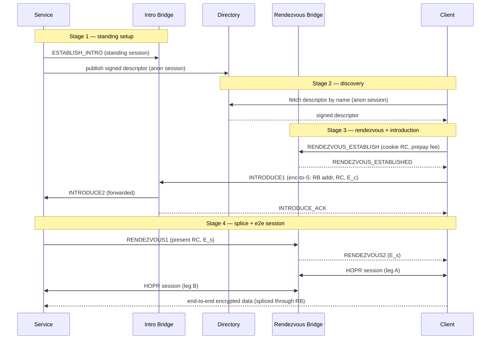

# RFC-0015: Onion Services over HOPR

- **RFC Number:** 0015
- **Title:** Onion Services over HOPR
- **Status:** Raw
- **Author(s):** Tibor Csóka (@Teebor-Choka)
- **Created:** 2026-07-05
- **Updated:** 2026-07-05
- **Version:** v0.1.0 (Raw)
- **Supersedes:** none
- **Related Links:** [RFC-0002](../RFC-0002-mixnet-keywords/0002-mixnet-keywords.md),
  [RFC-0003](../RFC-0003-hopr-overview/0003-hopr-overview.md),
  [RFC-0004](../RFC-0004-hopr-packet-protocol/0004-hopr-packet-protocol.md),
  [RFC-0005](../RFC-0005-proof-of-relay/0005-proof-of-relay.md),
  [RFC-0006](../RFC-0006-hopr-mixer/0006-hopr-mixer.md),
  [RFC-0008](../RFC-0008-session-protocol/0008-session-protocol.md),
  [RFC-0009](../RFC-0009-session-start-protocol/0009-session-start-protocol.md),
  [RFC-0010](../RFC-0010-automatic-path-discovery/0010-automatic-path-discovery.md),
  [RFC-0011](../RFC-0011-application-protocol/0011-application-protocol.md),
  [RFC-0012](../RFC-0012-protocol-for-incentivization-of-exits/0012-protocol-for-incentivization-of-exits.md),
  [RFC-0014](../RFC-0014-path-finding/0014-path-finding.md)

## 1. Abstract

This RFC specifies **HOPR Onion Services**: a scheme for offering a network
service whose provider and consumers remain mutually anonymous. Neither party
learns the other's network location or node identity, and no relaying node can
link the two. It is the HOPR-native counterpart of Tor onion services [06],
built on the HOPR mixnet rather than on circuit-switched onion routing.

The design adopts a two-phase **introduction and rendezvous** architecture. A
service maintains inexpensive standing control sessions to a set of announced
**introduction bridges** and publishes a signed **service descriptor** to a
distributed directory. To connect, a client selects a fresh **rendezvous
bridge**, asks the service to meet it there through an introduction bridge, and
the two parties then exchange data end-to-end encrypted across the rendezvous
bridge, which splices two independent HOPR sessions and observes only
ciphertext. Services are named by self-certifying `.hopr` addresses derived
from an Ed25519 identity key, with an optional ENS-based human-readable alias
layer, and MAY be served by multiple hosts through signed delegation.
Incentivisation reuses HOPR Proof of Relay [05] for the two transport legs and
the PIX privacy-pool settlement pattern
[RFC-0012](../RFC-0012-protocol-for-incentivization-of-exits/0012-protocol-for-incentivization-of-exits.md)
for the bridge role, so every participant is paid without any party learning
who paid it.

This document normatively defines service identity and naming, the descriptor
format and directory interface, the bridge announcement and selection rules,
the introduction and rendezvous protocol, the end-to-end handshake, the
incentive and denial-of-service model, and the associated security properties.
The mechanics of the distributed directory itself are delegated to a companion
RFC.

## 2. Motivation

HOPR [03] provides sender anonymity toward relays and the destination, a
recipient-initiated reply channel through pseudonyms and single-use reply
blocks (SURBs), per-hop incentivisation via Proof of Relay [05], and session
semantics [RFC-0008](../RFC-0008-session-protocol/0008-session-protocol.md),
[RFC-0009](../RFC-0009-session-start-protocol/0009-session-start-protocol.md)
over the mixnet. What it does not provide is a way for **two mutually anonymous
parties** to communicate: in every existing HOPR session one endpoint (the exit
node) is addressable and its node identity is known to the initiator. A service
that wants to be reachable without revealing where it runs has no in-protocol
mechanism today.

Tor solves the analogous problem for circuit onion routing with introduction
points, rendezvous points, and a hidden-service directory [06]. HOPR needs an
equivalent that is faithful to its own primitives — fixed-size Sphinx packets
[04], SURB-based replies, probabilistic ticket payments, and on-chain node
announcement — rather than a port of a circuit-switched design.

This RFC defines that mechanism. It closes five concrete gaps left open by the
existing stack:

1. **Mutual anonymity.** A rendezvous role lets neither endpoint learn the
   other, while a client-chosen rendezvous point per connection keeps announced
   infrastructure out of the bulk-traffic path.
2. **Naming and discovery.** Self-certifying addresses plus a signed-descriptor
   directory give services a stable, verifiable identity and a way to be found.
3. **Multi-host serving.** Signed delegation lets several hosts serve one
   service identity without sharing the long-term key.
4. **Bridge incentives.** The splice/availability role is not covered by Proof
   of Relay or PIX; this RFC adds a negotiated, anonymity-preserving bridge fee.
5. **Abuse resistance.** A mutually anonymous inbound channel invites spam;
   payment-gated introduction and descriptor-level access control price and gate
   it.

## 3. Terminology

The keywords "MUST", "MUST NOT", "REQUIRED", "SHALL", "SHALL NOT", "SHOULD",
"SHOULD NOT", "RECOMMENDED", "MAY", and "OPTIONAL" in this document are to be
interpreted as described in [01] when, and only when, they appear in all
capitals, as shown here.

All general mixnet and HOPR-specific terminology is defined in
[RFC-0002](../RFC-0002-mixnet-keywords/0002-mixnet-keywords.md). This document
additionally defines:

- **Onion service** (also **service**): a service reachable over HOPR whose host
  location and node identity are hidden from its clients and from relaying
  nodes.
- **Service identity key**: the long-term Ed25519 key pair `id_S` that names and
  authenticates a service. Its public part yields the self-certifying address.
- **Self-certifying address**: the `.hopr` string derived from `id_S` public key
  (Section 4.2). Authenticity of any signed material is checkable against it
  without external trust.
- **Service descriptor**: the signed document that maps a service to its current
  introduction bridges and connection parameters (Section 4.3).
- **Bridge relayer** (also **bridge**): a HOPR node that has announced the
  capability to act as an introduction bridge and/or a rendezvous bridge.
- **Introduction bridge** (**IB**): a bridge that holds a standing control
  session with a service and forwards introduction requests to it.
- **Rendezvous bridge** (**RB**): a bridge, chosen freshly by a client per
  connection, that splices the client's and the service's HOPR sessions and
  relays the end-to-end-encrypted payload between them.
- **Rendezvous cookie**: a single-use random token that binds a client's and a
  service's sessions at a rendezvous bridge.
- **Introduction request**: the client-produced, service-encrypted message that
  names the rendezvous bridge and carries the client's end-to-end handshake
  half.
- **End-to-end (e2e) session**: the session established directly between client
  and service, encrypted under a key the bridge does not possess, carried over
  the two spliced HOPR sessions.
- **Directory**: the distributed store from which descriptors are published and
  fetched (interface in Section 4.3; mechanics in a companion RFC).
- **Splice**: the act, performed by a rendezvous bridge, of joining two HOPR
  sessions and relaying opaque payload between them.
- `||` denotes byte-string concatenation. `|x|` denotes the size of `x` in
  bytes. Multi-byte integers are big-endian unless stated otherwise. Character
  strings in double quotes use ASCII single-byte encoding. `CSPRNG` is a
  cryptographically secure pseudorandom number generator.

## 4. Specification

### 4.1 Overview

An onion service connection involves five roles, all HOPR nodes except the
directory abstraction and the privacy pool:

- **Service** `S` — the provider, running on or behind a HOPR node with funded
  payment channels (Section 4.9 discusses a gateway variant).
- **Client** `C` — the consumer.
- **Introduction bridge** `IB` — announced in the descriptor; holds a standing
  control session with `S`.
- **Rendezvous bridge** `RB` — chosen fresh by `C`; performs the splice.
- **Directory** and **privacy pool** `W` — supporting infrastructure
  (Sections 4.3 and 4.7).

The lifecycle has four stages: (1) the service publishes a descriptor and opens
standing sessions to its introduction bridges; (2) the client fetches and
verifies the descriptor; (3) the client establishes a rendezvous and introduces
itself to the service through an introduction bridge; (4) the service joins the
rendezvous and the parties run an end-to-end session across the splice.



Every arrow between two HOPR nodes is itself a multi-hop HOPR path (0–3
intermediate hops each way, per
[RFC-0004](../RFC-0004-hopr-packet-protocol/0004-hopr-packet-protocol.md)),
subject to mixing
[RFC-0006](../RFC-0006-hopr-mixer/0006-hopr-mixer.md) and paid via Proof of
Relay [05]. The diagram shows the logical overlay, not the packet path.

The onion-service control messages defined in this RFC are carried in the HOPR
application protocol
[RFC-0011](../RFC-0011-application-protocol/0011-application-protocol.md) under
the **Onion Service Control Protocol (OSCP)** application tag
`0x0000000000000002` (the first user-defined tag). The end-to-end data session
uses the session-data protocol
[RFC-0008](../RFC-0008-session-protocol/0008-session-protocol.md) inside the
e2e-encrypted channel.

### 4.2 Service identity, naming and delegation

#### 4.2.1 Identity key and self-certifying address

A service is identified by an Ed25519 [07] key pair `id_S = (sk_S, pk_S)`. The
service's canonical **self-certifying address** is:

```
address = base32( version || pk_S || checksum ) || ".hopr"
version  : u8     (current value 0x01)
pk_S     : [u8; 32]   Ed25519 public key
checksum : [u8; 2]    truncated H(".hopr-checksum" || pk_S || version)
```

`base32` uses the RFC 4648 lowercase alphabet without padding. The address is
self-certifying: any descriptor or delegation presented for it MUST verify
under `pk_S` (directly or through a delegation chain rooted at `pk_S`), so a
malicious host cannot serve a different key under the same name.

`H` is the hash function fixed in Appendix 1.

#### 4.2.2 Human-readable aliases (ENS, optional)

Human-readable names are OPTIONAL and are layered on top of the self-certifying
address, which remains authoritative. A service MAY register an ENS [08] name
(or subdomain) whose `hopr` text record contains its `.hopr` address. A client
resolving an alias MUST fetch the descriptor for the `.hopr` address the record
points to and MUST verify it against that address. ENS resolution is a discovery
convenience only; it confers no additional authority and MUST NOT override the
self-certifying check. No bespoke registry contract is introduced by this RFC.

#### 4.2.3 Multi-host serving via delegation

A service MAY be served by more than one host without sharing `sk_S`. The
identity key signs a **delegation certificate** authorising a per-host
signing/operating key for a bounded validity window:

```
DelegationCert {
  version         : u8,           // 0x01
  delegate_pubkey : [u8; 32],     // Ed25519 per-host key
  not_before      : u64,          // UNIX seconds
  not_after       : u64,          // UNIX seconds
  capabilities    : u16,          // bitmap: publish descriptor, run intro, ...
  signature       : [u8; 64]      // Ed25519 by sk_S over the above fields
}
```

A host holding a valid `DelegationCert` MAY sign descriptors (Section 4.3) and
run introduction sessions on the service's behalf during
`[not_before, not_after)`. Descriptors served by a delegate MUST embed the
certificate so clients can verify the chain to `pk_S`. Delegation satisfies the
requirement that any number of servers may serve a service as long as they can
present the service originator's cryptographic authorisation. Revocation before
expiry is by descriptor rotation (the fresh descriptor omits the revoked
delegate) and by short validity windows; long-lived certificates are NOT
RECOMMENDED.

### 4.3 Service descriptor and directory interface

#### 4.3.1 Descriptor content

A service descriptor is a signed document. Its plaintext (signed) fields are:

```
Descriptor {
  version          : u8,               // 0x01
  address          : self-certifying address (Section 4.2.1)
  revision         : u64,              // monotonic; higher supersedes lower
  lifetime         : u32,              // validity in seconds from publication
  handshake_static : [u8; 32],         // service X25519 static key S_s (Section 4.6)
  intro_points     : [IntroPoint; n],  // 1 <= n <= 20
  capabilities     : CapabilityFlags,  // session modes, traffic classes
  dos_policy       : DosPolicy,        // Section 4.8
  delegation       : DelegationCert?,  // present iff signed by a delegate
  signature        : [u8; 64]          // Ed25519 over all preceding fields
}

IntroPoint {
  node_id       : [u8; 32],   // IB HOPR off-chain public key (routing target)
  auth_key      : [u8; 32],   // per-IB X25519 key for INTRODUCE1 encryption
  expiry        : u64         // UNIX seconds
}
```

The `signature` is by `sk_S`, or by `delegation.delegate_pubkey` when
`delegation` is present (then the certificate itself MUST verify under `pk_S`).
`revision` provides replay/rollback resistance: a client MUST prefer the highest
valid `revision` it has seen and MUST reject a descriptor whose `lifetime` has
elapsed.

For a **private** service (Section 4.8), the `intro_points` array MAY be
encrypted to an authorised-client key set; unauthorised fetchers obtain a
descriptor they cannot use.

#### 4.3.2 Blinded publication keying

To prevent the directory from enumerating services or linking a descriptor to
its long-term identity, the descriptor is published under a **blinded key**
derived from `pk_S` and the current time period, following the Tor v3 key
blinding approach [06]:

```
period        = floor(now / PERIOD_LENGTH)              // PERIOD_LENGTH default 86400 s
blinding_scalar = H("hopr-blind" || pk_S || period)
pk_blind      = blind(pk_S, blinding_scalar)            // Ed25519 key blinding
slot          = H(pk_blind || period)                   // directory address
```

The descriptor stored at `slot` is signed by the correspondingly blinded
private key, so directory nodes verify authenticity without learning `pk_S`.
Only a party that already knows the `.hopr` address (hence `pk_S`) can compute
`slot`, so the directory cannot be crawled for service identities.

#### 4.3.3 Directory interface

This RFC defines the interface any directory layer MUST provide; the concrete
distributed hash table (replication, retention, storage incentives) is
specified in a companion RFC (proposed **RFC-0016, HOPR Distributed
Directory**). The interface is:

- `PUBLISH(slot, descriptor)` — store a signed descriptor at `slot`. The layer
  MUST reject descriptors whose signature does not verify under the blinded key
  implied by `slot`, and SHOULD keep the highest `revision` on collision.
- `FETCH(slot) -> descriptor?` — return the stored descriptor for `slot`.

Both operations MUST be performed by the service and the client over **anonymous
HOPR sessions** (a forward path with SURBs for the reply, per
[RFC-0004](../RFC-0004-hopr-packet-protocol/0004-hopr-packet-protocol.md)), so
directory nodes learn neither the publisher's nor the fetcher's location, and
cannot tell publication from fetching apart from the operation code. The
directory layer MUST provide `k`-fold replication across the nodes responsible
for a `slot` so that a single node cannot censor a service; the responsible set
MUST rotate with `period`.

### 4.4 Bridge relayers: announcement, eligibility and selection

#### 4.4.1 Announcement

Bridge capability is advertised by extending the existing on-chain node
announcement (the mechanism nodes already use to bind their off-chain key, chain
account and transport address per
[RFC-0010](../RFC-0010-automatic-path-discovery/0010-automatic-path-discovery.md)).
A bridge-capable node announces:

```
BridgeAnnouncement {
  roles        : u8,     // bit 0 = intro-capable, bit 1 = rendezvous-capable
  fee_schedule : FeeSchedule,   // or an on-chain pointer to an off-chain record
  capacity     : u32,    // advertised concurrent-splice capacity
  min_version  : u8      // lowest OSCP version supported
}

FeeSchedule {
  session_fee  : u128,   // flat per-session fee (Section 4.7)
  currency     : u8,     // settlement asset selector
  topup_unit   : u128    // per keep-alive interval for long/bulk sessions
}
```

Because this rides on the existing announcement, services and clients discover
bridges by filtering the channel graph they already maintain
([RFC-0010](../RFC-0010-automatic-path-discovery/0010-automatic-path-discovery.md),
[RFC-0014](../RFC-0014-path-finding/0014-path-finding.md)); no new discovery
infrastructure is required. A bridge MAY publish a fresher fee/capacity/load
record off-chain and reference it from the announcement to avoid per-update gas
cost.

#### 4.4.2 Eligibility

A node announcing any bridge role MUST hold at least `MIN_BRIDGE_STAKE`
(a network parameter, analogous to the eligibility threshold of
[RFC-0007](../RFC-0007-economic-reward-system/0007-economic-reward-system.md)).
The requirement raises the Sybil cost for the role that sits closest to both
anonymity legs: an adversary operating many bridges disproportionately improves
its correlation odds (Section 7), so bridges are precisely where cheap identities
are most dangerous. Bonding with on-chain slashing for provable misbehaviour is
deferred to future work (Section 11); in this version, misbehaving bridges lose
fee income and are down-scored by probing
([RFC-0010](../RFC-0010-automatic-path-discovery/0010-automatic-path-discovery.md)).

#### 4.4.3 Selection

- The **service** selects its introduction bridges from intro-capable nodes and
  lists them in the descriptor. It SHOULD prefer high-stake, high-quality,
  churn-resistant nodes and SHOULD maintain redundancy (`n >= 3` intro points
  RECOMMENDED).
- The **client** selects a rendezvous bridge per connection from
  rendezvous-capable nodes, freshly and unpredictably, weighting by advertised
  capacity, fee and probe-derived quality. The client MUST NOT reuse a
  rendezvous bridge across connections in a way that would let the bridge link
  them (a fresh cookie and, where practical, a fresh bridge per connection).

### 4.5 Introduction and rendezvous protocol

All messages in this section are OSCP messages (application tag
`0x0000000000000002`) with the common header:

```
OSCPHeader {
  version : u8,    // 0x01
  type    : u8,    // message type below
  length  : u16    // payload length, big-endian
}
```

Message types:

| Code | Type                    | Sender → Receiver     |
| ---- | ----------------------- | --------------------- |
| 0x01 | `ESTABLISH_INTRO`       | Service → IB          |
| 0x02 | `ESTABLISH_INTRO_ACK`   | IB → Service          |
| 0x03 | `INTRODUCE1`            | Client → IB           |
| 0x04 | `INTRODUCE2`            | IB → Service          |
| 0x05 | `INTRODUCE_ACK`         | IB → Client           |
| 0x06 | `RENDEZVOUS_ESTABLISH`  | Client → RB           |
| 0x07 | `RENDEZVOUS_ESTABLISHED`| RB → Client           |
| 0x08 | `RENDEZVOUS1`           | Service → RB          |
| 0x09 | `RENDEZVOUS2`           | RB → Client           |
| 0x0a | `SPLICE_ERROR`          | RB/IB → either        |

#### 4.5.1 Establishing an introduction point

The service opens a HOPR session to each `IB` in its descriptor and sends
`ESTABLISH_INTRO`, proving control of the intro point's `auth_key`:

```
ESTABLISH_INTRO {
  intro_auth_pubkey : [u8; 32],   // matches IntroPoint.auth_key
  proof             : [u8; 64],   // signature over session binding + auth_key
  keepalive_hint    : u32         // seconds between KeepAlive on this session
}
```

The IB verifies `proof`, records the mapping from `intro_auth_pubkey` to this
standing session, and replies `ESTABLISH_INTRO_ACK`. The session is kept alive
per [RFC-0009](../RFC-0009-session-start-protocol/0009-session-start-protocol.md)
`KeepAlive`. The IB learns only that some pseudonymous peer maintains an intro
point for `intro_auth_pubkey`; because the service reaches the IB over a
multi-hop path, the IB does not learn the service's node identity.

#### 4.5.2 Rendezvous establishment

The client opens a HOPR session to its chosen `RB` and registers a cookie:

```
RENDEZVOUS_ESTABLISH {
  cookie        : [u8; 20],    // RC, CSPRNG
  fee_payment   : PixAllocationRef,   // prepaid splice fee (Section 4.7)
  expiry        : u32          // seconds the RB should hold the reservation
}
```

The RB verifies the fee allocation (Section 4.7), reserves splice state keyed by
`RC`, and replies `RENDEZVOUS_ESTABLISHED`. `RC` is single-use; the RB MUST
reject a second registration for a live `RC`.

#### 4.5.3 Introduction

The client sends `INTRODUCE1` to an introduction bridge from the descriptor. Its
core is a blob encrypted to the service so the IB (and any relay) learns
neither the rendezvous bridge nor the handshake material:

```
INTRODUCE1 {
  intro_auth_pubkey : [u8; 32],   // selects the intro point at the IB
  client_eph_pubkey : [u8; 32],   // E_c, ephemeral X25519 (also seeds enc key)
  enc_blob          : [u8; m]     // encrypted-to-service payload below
}

// plaintext of enc_blob (see Section 4.6 for the encryption key):
IntroPayload {
  rendezvous_node_id : [u8; 32],  // RB routing target
  rendezvous_cookie  : [u8; 20],  // RC
  auth_data          : [u8; a],   // client-authorisation proof (Section 4.8), 0 if none
  replay_nonce       : [u8; 16],  // CSPRNG
  timestamp          : u64        // UNIX seconds, freshness bound
}
```

The IB looks up the standing session for `intro_auth_pubkey` and forwards the
message as `INTRODUCE2` over it, then returns `INTRODUCE_ACK` to the client. The
IB cannot decrypt `enc_blob`. The service MUST reject an `IntroPayload` whose
`timestamp` is outside an acceptance window or whose `replay_nonce` it has
already seen within that window.

#### 4.5.4 Rendezvous join and splice

The service decrypts `enc_blob`, completes the handshake (Section 4.6) to obtain
the e2e key `k` and its ephemeral `E_s`, opens a HOPR session to `RB` and sends:

```
RENDEZVOUS1 {
  cookie            : [u8; 20],   // RC, matching the client reservation
  service_eph_pubkey: [u8; 32],   // E_s
  auth_tag          : [u8; 32]    // MAC over the handshake transcript under k
}
```

The RB matches `RC` to the client's reserved session, binds the two sessions
into a splice, and forwards `service_eph_pubkey` and `auth_tag` to the client as
`RENDEZVOUS2`. From this point the RB relays payload between the two sessions
(Section 4.9). The client verifies `auth_tag`, confirming it shares `k` with a
holder of the service static key, and the e2e session begins. A cookie
mismatch, an unknown or expired `RC`, or a failed fee check yields
`SPLICE_ERROR`.

### 4.6 End-to-end handshake and session

Each HOPR leg is encrypted only to that leg's endpoints, so without an
additional layer the rendezvous bridge would see plaintext. An end-to-end
handshake keyed to the service identity is therefore MANDATORY; the bridge only
ever splices ciphertext.

The handshake is a Noise-IK-style [09] exchange over X25519 [10]. The service's
static key `S_s = handshake_static` is published (signed) in the descriptor. The
client generates an ephemeral `E_c` (sent in `INTRODUCE1`); the service
generates an ephemeral `E_s` (sent in `RENDEZVOUS1`). Both derive:

```
es  = DH(E_c, S_s)       // authenticates the service (only S_s holder computes it)
ee  = DH(E_c, E_s)       // forward secrecy
k   = KDF("hopr-onion-e2e", ee || es, transcript_hash)
```

`k` is expanded into directional keys for the e2e session
(`k_c2s`, `k_s2c`) and a confirmation key used for `RENDEZVOUS1.auth_tag`. The
`enc_blob` of `INTRODUCE1` (Section 4.5.3) is encrypted under a key derived from
`DH(E_c, IntroPoint.auth_key)` so that only the intended service, via its intro
point, can read it, and forward secrecy holds for introduction content.

The e2e session runs the session-data protocol
[RFC-0008](../RFC-0008-session-protocol/0008-session-protocol.md) with its
frames encrypted under `k_c2s`/`k_s2c`. **Reliable mode is the default** for
onion services. The bridge, operating the outer HOPR sessions, cannot read or
tamper with e2e frames undetected (any tampering fails the e2e authenticator).

### 4.7 Incentivisation

Onion-service traffic is paid on three counts, all reusing existing HOPR
machinery so no new settlement primitive is introduced:

1. **Transport legs (Proof of Relay).** Each side pays the relays on its own
   leg via standard tickets [05]: the client funds the client→RB path and the
   SURBs for return traffic on it; the service funds the service→RB path and its
   return SURBs. This is ordinary HOPR packet economics and needs no extension.
2. **Bridge splice fee (PIX-style, flat per session).** The
   splice/availability role is covered by neither Proof of Relay (the bridge is
   an endpoint of two sessions, not a mid-path relayer earning tickets) nor PIX
   (which incentivises exits replying to forward traffic). This RFC adds a flat
   **per-session fee**, taken from the bridge's announced `FeeSchedule`
   (Section 4.4.1) and **prepaid before the splice begins**. Settlement uses the
   PIX privacy-pool pattern
   [RFC-0012](../RFC-0012-protocol-for-incentivization-of-exits/0012-protocol-for-incentivization-of-exits.md):
   the payer `Deposit`s and `Allocate`s to a session stealth address the bridge
   can later `Withdraw`, so the pool hides the payer from the bridge and the
   bridge from any observer. The `PixAllocationRef` in
   `RENDEZVOUS_ESTABLISH` (Section 4.5.2) points to this allocation; the bridge
   MAY refuse to splice until it observes the allocation. Long-lived or bulk
   sessions top up by `topup_unit` on a keep-alive schedule; if a required
   top-up is not observed within a grace window, the bridge MAY tear down the
   splice.
3. **Intro-bridge retainer.** The service pays each introduction bridge for the
   ongoing standing session, again PIX-style, on a per-period retainer taken
   from the bridge's schedule. Because the retainer is paid by the service, an
   introduction bridge is compensated even though it never carries bulk data.

By default the **client** pays the rendezvous fee and the **service** pays the
intro retainers. Two alternatives are explicitly permitted but not required in
this version (Section 9): a **service-subsidised** model where the service
pre-funds rendezvous fees so clients connect at no cost (a toll-free service),
and a **client-pays-all** model for maximum spam resistance.

### 4.8 Denial-of-service resistance and access control

A mutually anonymous inbound channel is intrinsically abusable: the introduction
path lets anyone spend the service's resources cheaply. Two complementary,
independently deployable defences are specified; the service states its choice
in `dos_policy`.

#### 4.8.1 Payment-gated introduction (public services)

The service MAY require every `INTRODUCE1` to carry a small verifiable payment
(a PIX-style stealth allocation or a redeemable ticket) checkable by the
introduction bridge and/or the service before either does work. The `dos_policy`
advertises the required amount and the verifying party. This turns introduction
spam into revenue while preserving client anonymity through the privacy pool. A
service MAY additionally advertise a client-puzzle (proof-of-work) fallback for
free-tier access under load (Section 9); this RFC does not mandate it.

```
DosPolicy {
  intro_payment_min : u128,   // 0 = no payment required
  verifier          : u8,     // 0 = bridge, 1 = service, 2 = both
  auth_required     : bool,   // Section 4.8.2
  pow_difficulty    : u8      // 0 = disabled
}
```

#### 4.8.2 Descriptor-level access control (private services)

For a private service, authority to connect is gated at discovery: the
descriptor's `intro_points` are encrypted to a set of authorised client public
keys, so only those clients can obtain usable introduction data (Tor's "client
authorisation" analogue [06]). When `auth_required` is set, the client MUST
include an `auth_data` proof in `IntroPayload` (Section 4.5.3) that the service
verifies before serving. Access control and payment gating are orthogonal and
MAY be combined.

### 4.9 Bridge session management (splice and SURB handling)

The rendezvous bridge is a **stateful two-session splice**, not a stateless
ciphertext relay. It terminates two HOPR sessions — leg A to the client, leg B
to the service — bound by the rendezvous cookie, and relays the opaque e2e
payload between them. Because the payload is end-to-end encrypted (Section 4.6),
the bridge reads only ciphertext frames; it nonetheless operates the full
transport of each leg.

The bridge MUST manage each leg's SURB budget and starvation independently,
using the flow-control signals already defined by the packet and application
protocols
([RFC-0004](../RFC-0004-hopr-packet-protocol/0004-hopr-packet-protocol.md)
SURB signals, surfaced through
[RFC-0011](../RFC-0011-application-protocol/0011-application-protocol.md) flags
`0x01` SURB distress and `0x03` out-of-SURBs):

- The bridge replies to each counterparty over SURBs that counterparty supplied,
  and maintains a rolling reserve per leg.
- On a SURB-distress signal from a leg, or on a keep-alive schedule, the bridge
  MUST prompt that counterparty to replenish its SURB reserve before the reserve
  is exhausted.
- If a leg's SURBs are exhausted and cannot be replenished, the bridge MUST
  apply backpressure to the opposite leg rather than dropping e2e frames
  silently, and MAY tear the splice down if starvation persists beyond a grace
  window.
- The bridge MUST bound its per-splice state and total concurrent splices to its
  advertised `capacity`, rejecting new rendezvous reservations with
  `SPLICE_ERROR` when saturated.

This design keeps reliability and SURB accounting local to each HOPR leg (normal
session semantics) while the inner e2e session provides end-to-end reliability
and integrity across the two legs.

The normative host model is that the service runs on or behind a HOPR node with
funded channels. A **paid-gateway** deployment — a non-node service renting a
HOPR node to inject and receive its traffic, the gateway paid out of band or
PIX-style — is an OPTIONAL pattern (Section 11); it broadens who can host
services at the cost of a gateway trust and metadata surface.

## 5. Design Considerations

**Why two phases rather than a single bridge.** A single announced bridge that
also carries data would be a bottleneck, a denial-of-service magnet, and a fixed
correlation point an adversary could target or impersonate. Splitting a
long-lived, low-traffic introduction role from a fresh, per-connection
rendezvous role keeps announced infrastructure out of the bulk path and makes
connections unlinkable across rendezvous points, matching the rationale of Tor
v3 [06] while running over HOPR sessions instead of circuits.

**Why self-certifying names with an optional alias layer.** Self-certification
removes naming trust entirely: the address is the key. ENS is reused only as a
convenience so that human-memorable names need no new registry contract and no
new consensus; because the self-certifying address stays authoritative, a
compromised or hostile alias cannot redirect a client to a different service.

**Why the bridge terminates two sessions.** Making the rendezvous bridge a
session endpoint (rather than a packet relay) lets each leg use ordinary HOPR
session semantics — SURB flow control, retransmission, keep-alive — while an
end-to-end layer the bridge cannot read carries the actual data. SURB starvation,
the main flow hazard for an inbound-heavy service, becomes a local per-leg
concern the bridge manages, instead of an end-to-end coupling.

**Why reuse PIX for the bridge fee.** The bridge role is an availability service,
not a relay, so Proof of Relay does not reward it and PIX does not cover it. PIX
already solves the hard part — paying an anonymous counterparty through a privacy
pool that hides payer from payee — so reusing its settlement pattern avoids a new
primitive and keeps payments unlinkable.

**Parameter defaults.** `PERIOD_LENGTH` 86400 s and `n >= 3` intro points mirror
proven Tor v3 choices; `MIN_BRIDGE_STAKE`, `intro_payment_min`, and fee units are
network-economic parameters left to deployment and governance.

## 6. Compatibility

This RFC is additive. It introduces a new application tag
(`0x0000000000000002`, previously in the user-defined range of
[RFC-0011](../RFC-0011-application-protocol/0011-application-protocol.md)) and
new OSCP message types; nodes that do not implement onion services simply do not
register the tag and are unaffected as relayers.

The design depends on the SURB recipient-data extension and Session Start
discriminants introduced with the PIX draft
([RFC-0012](../RFC-0012-protocol-for-incentivization-of-exits/0012-protocol-for-incentivization-of-exits.md),
requiring
[RFC-0004](../RFC-0004-hopr-packet-protocol/0004-hopr-packet-protocol.md) v1.1.0)
for its fee settlement, and on the on-chain announcement extension of
Section 4.4 for bridge discovery. The directory interface (Section 4.3.3) has a
normative contract here but requires the companion directory RFC before an
interoperable implementation is possible. Bridges, services and clients
negotiate the OSCP version in the announcement and descriptor; a peer that does
not recognise an OSCP message type MUST respond `SPLICE_ERROR` or drop per its
normal unknown-message handling.

## 7. Security Considerations

**Mutual anonymity and the rendezvous bridge.** No relay, introduction bridge,
or rendezvous bridge learns both endpoints' identities. Each leg is a multi-hop
HOPR path, so the rendezvous bridge sees two pseudonymous session endpoints, not
network identities. However, the rendezvous bridge does know that leg A and leg B
belong to the **same** connection — that is its function. Unlike a Tor
rendezvous point, it also knows it is servicing an onion connection. A malicious
rendezvous bridge is therefore a natural vantage point for timing/volume
correlation against a global observer. Mitigations: fresh per-connection bridge
selection, the `MIN_BRIDGE_STAKE` Sybil cost (Section 4.4.2), mixing on every
leg [06]-independent HOPR delays
([RFC-0006](../RFC-0006-hopr-mixer/0006-hopr-mixer.md)), and the end-to-end
encryption that denies the bridge payload content. Correlation resistance is
bounded by the mixnet's own limits (low-volume windows, global passive
adversaries; see
[RFC-0006](../RFC-0006-hopr-mixer/0006-hopr-mixer.md)).

**Guard-like exposure over time.** A service that keeps opening legs with freshly
random entry relays exposes itself to eventual path compromise. Services SHOULD
constrain their leg entry points to a stable, small guard set to bound long-run
deanonymisation risk; a normative guard mechanism is deferred (Section 11).

**Introduction and rendezvous integrity.** `INTRODUCE1` content is encrypted to
the service via the intro point's `auth_key`, so introduction bridges and relays
learn neither the rendezvous bridge nor the handshake. The rendezvous cookie
authorises only *joining* a rendezvous; because the e2e handshake still requires
the service static key, a stolen cookie cannot impersonate the service. Replay of
`INTRODUCE1` is bounded by `replay_nonce` and `timestamp`. Descriptor rollback is
resisted by `revision` and `lifetime`; blinded publication keys (Section 4.3.2)
stop the directory from enumerating or linking services.

**Denial of service.** Payment-gated introduction prices spam (Section 4.8.1);
descriptor-level access control removes it for private services (Section 4.8.2);
per-leg SURB management with backpressure and bounded splice state (Section 4.9)
contains resource-exhaustion attacks at the bridge. `MIN_BRIDGE_STAKE` raises the
cost of flooding the network with malicious bridges.

**Payment privacy and griefing.** All payments settle through the PIX privacy
pool, which MUST hide payer from payee for the anonymity goals to hold; a pool
that leaks this linkage undermines the scheme. As in PIX, a payer can grief by
allocating and then withholding usable value; bridges mitigate by verifying the
allocation before splicing and tearing down on non-payment, and deployments
SHOULD set allocation expiry/recovery policy accordingly.

**Key management.** Compromise of `sk_S` compromises the service identity;
delegation certificates (Section 4.2.3) limit blast radius to a host and a
window, and short validity windows plus descriptor rotation provide revocation.
X25519 ephemerals give per-connection forward secrecy for both introduction and
data.

**Endpoint validation.** All received curve points (`E_c`, `E_s`, `S_s`,
`auth_key`) MUST be validated (correct subgroup, non-identity) before use to
avoid invalid-curve and small-subgroup attacks, consistent with
[RFC-0012](../RFC-0012-protocol-for-incentivization-of-exits/0012-protocol-for-incentivization-of-exits.md).

## 8. Drawbacks

- **Latency.** Two multi-hop legs plus per-hop mixing make onion-service round
  trips substantially slower than a direct HOPR session; interactive workloads
  feel the mixing delay twice over.
- **New subsystems.** A distributed directory and an on-chain announcement
  extension are prerequisites; the directory is only interface-specified here and
  gates interoperable deployment on a companion RFC.
- **Bridge as correlation vantage.** The rendezvous bridge knowingly links two
  legs, a stronger position than a Tor rendezvous point; the scheme leans on
  Sybil cost, fresh selection and mixing rather than removing the vantage.
- **SURB and fee overhead.** Inbound-heavy services must sustain SURB reserves on
  both legs, and every connection carries a prepaid bridge fee plus ongoing intro
  retainers, adding economic and operational overhead beyond plain relaying.
- **Dependency on draft work.** Fee settlement depends on the still-draft PIX
  RFC-0012 and its RFC-0004 v1.1.0 extension.

## 9. Alternatives

- **Pure SURB/pseudonym contact (no bridge).** The service could publish batches
  of SURBs; clients consume one to reach the pseudonym directly. Rejected as the
  primary design because inbound throughput would be hard-capped by SURB supply
  and replenishment becomes the dominant problem, though the introduction leg
  here is essentially this pattern in miniature.
- **Single bridge role.** Simpler and one round trip shorter, but announced
  bridges carry all traffic volume, become DoS targets, and cannot be
  out-scaled; rejected per Section 5.
- **On-chain descriptors.** Maximum availability and Sybil resistance, but per
  update gas cost, slow propagation, permanent public bridge lists, and
  read-time interest leakage; rejected in favour of the mixnet-fetched directory.
- **Bespoke naming registry.** A dedicated ENS-like contract was considered;
  reusing ENS for aliases over self-certifying roots avoids new consensus and
  governance.
- **Metered (per-byte) bridge fees.** Fairer across workloads but require a
  streaming micro-settlement mechanism and leak a volume signal at the bridge;
  a flat prepaid fee with keep-alive top-ups was chosen for simplicity and lower
  metadata. Metering is possible future work.
- **Client-pays-all / service-subsidised economics.** Both are permitted
  extensions (Section 4.7) rather than the default; the per-side-plus-bridge-fee
  split is the least surprising mapping onto HOPR economics.

## 10. Unresolved Questions

- Concrete values for `MIN_BRIDGE_STAKE`, `intro_payment_min`, session fees and
  retainers, and their governance.
- The exact key-blinding construction for Ed25519 publication keys and its proof
  obligations (to be pinned with the companion directory RFC).
- Whether the intro-bridge retainer should be per-period or per-introduction, and
  how it interacts with intro-payment gating.
- Guard-set selection and rotation policy for service and client legs.
- Interaction of onion-service traffic with cover traffic and probing
  ([RFC-0007](../RFC-0007-economic-reward-system/0007-economic-reward-system.md),
  [RFC-0010](../RFC-0010-automatic-path-discovery/0010-automatic-path-discovery.md)):
  can onion legs double as cover traffic, and does that help or harm anonymity?
- Congestion and fairness when many splices share one bridge near its `capacity`.

## 11. Future Work

- **Companion directory RFC (RFC-0016).** Full DHT mechanics: replication,
  retention, storage incentives, and responsible-set rotation.
- **Bridge bonding and slashing.** On-chain challengeable misbehaviour proofs for
  bridges, strengthening Section 4.4.2 beyond stake-plus-reputation.
- **Guard mechanism.** A normative guard-relay scheme for both endpoints' legs.
- **Paid-gateway hosting.** A full specification of the non-node service model
  sketched in Section 4.9.
- **Metered and subsidised economics.** Per-byte bridge settlement and
  service-subsidised / client-pays-all variants.
- **Proof-of-work introduction fallback.** A concrete client-puzzle scheme for
  free-tier DoS resistance under load.
- **End-to-end delivery proofs.** Optionally binding the bridge fee or intro
  payment to evidence of actual e2e data exchange, extending PIX's handover proof
  toward true delivery proof.

## 12. References

[01] Bradner, S. (1997). [Key words for use in RFCs to Indicate Requirement Levels](https://datatracker.ietf.org/doc/html/rfc2119). _IETF RFC 2119_.

[02] Chaum, D. (1981). [Untraceable Electronic Mail, Return Addresses, and Digital Pseudonyms](https://www.freehaven.net/anonbib/cache/chaum-mix.pdf). _Communications of the ACM, 24_(2), 84-90.

[03] Danezis, G., & Goldberg, I. (2009). [Sphinx: A Compact and Provably Secure Mix Format](https://cypherpunks.ca/~iang/pubs/Sphinx_Oakland09.pdf). _2009 30th IEEE Symposium on Security and Privacy_, 262-277.

[04] Piotrowska, A. M., Hayes, J., Elahi, T., Meiser, S., & Danezis, G. (2017). [The Loopix Anonymity System](https://arxiv.org/pdf/1703.00536.pdf). _26th USENIX Security Symposium_, 1199-1216.

[05] Standards for Efficient Cryptography Group. (2010). [SEC 2: Recommended Elliptic Curve Domain Parameters](https://www.secg.org/sec2-v2.pdf). _Standards for Efficient Cryptography_.

[06] Dingledine, R., Mathewson, N., & Syverson, P. (2004). [Tor: The Second-Generation Onion Router](https://svn.torproject.org/svn/projects/design-paper/tor-design.pdf). _13th USENIX Security Symposium_. See also the Tor Rendezvous Specification v3.

[07] Bernstein, D. J., Duif, N., Lange, T., Schwabe, P., & Yang, B.-Y. (2012). [High-speed high-security signatures](https://ed25519.cr.yp.to/ed25519-20110926.pdf). _Journal of Cryptographic Engineering, 2_(2), 77-89.

[08] Johnson, N., et al. (2017). [Ethereum Name Service](https://docs.ens.domains/). _ENS Documentation_.

[09] Perrin, T. (2018). [The Noise Protocol Framework](https://noiseprotocol.org/noise.pdf). _Revision 34_.

[10] Bernstein, D. J. (2006). [Curve25519: New Diffie-Hellman Speed Records](https://cr.yp.to/ecdh/curve25519-20060209.pdf). _Public Key Cryptography - PKC 2006_, 207-228.

## 13. Appendix 1: Cryptographic Instantiation

The current HOPR Onion Services instantiation uses:

- Service identity signatures: **Ed25519** [07].
- End-to-end key agreement: **X25519** [10], in a Noise-IK-style pattern [09].
- Hash `H`: **BLAKE3-256**, consistent with
  [RFC-0004](../RFC-0004-hopr-packet-protocol/0004-hopr-packet-protocol.md) and
  [RFC-0012](../RFC-0012-protocol-for-incentivization-of-exits/0012-protocol-for-incentivization-of-exits.md).
- KDF: **BLAKE3** derive-key mode, `KDF(c, k, s) = blake3_kdf(c, s || k)`.
- Symmetric encryption for e2e frames and `enc_blob`: **ChaCha20-Poly1305**.
- Address encoding: **base32** (RFC 4648, lowercase, unpadded).
- On-chain settlement (tickets, PIX, announcements): **secp256k1** [05], as in
  [RFC-0005](../RFC-0005-proof-of-relay/0005-proof-of-relay.md) and
  [RFC-0012](../RFC-0012-protocol-for-incentivization-of-exits/0012-protocol-for-incentivization-of-exits.md).

## 14. Appendix 2: HOPR Session Binding

Onion Service Control Protocol messages are carried in HOPR application-protocol
frames
([RFC-0011](../RFC-0011-application-protocol/0011-application-protocol.md)) under
application tag `0x0000000000000002`. Standing introduction sessions, rendezvous
sessions, and the anonymous directory sessions are ordinary HOPR sessions
([RFC-0008](../RFC-0008-session-protocol/0008-session-protocol.md),
[RFC-0009](../RFC-0009-session-start-protocol/0009-session-start-protocol.md))
whose targets designate the relevant bridge or directory node. The end-to-end
data session is a session-data-protocol
([RFC-0008](../RFC-0008-session-protocol/0008-session-protocol.md)) instance
whose frames are encrypted under the e2e keys of Section 4.6 and spliced between
the two HOPR sessions by the rendezvous bridge (Section 4.9).
