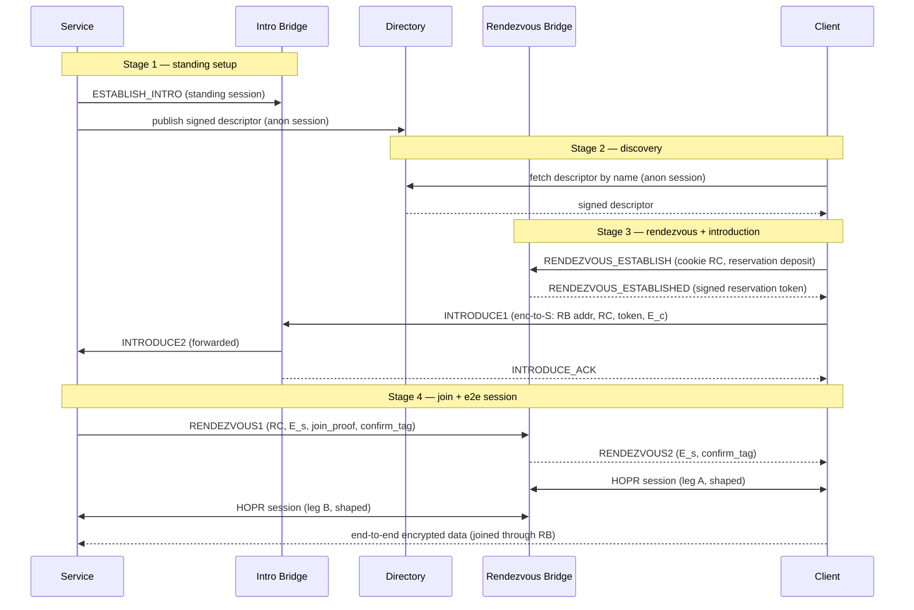

# RFC-0015: Onion Services over HOPR

- **RFC Number:** 0015
- **Title:** Onion Services over HOPR
- **Status:** Raw
- **Author(s):** Tibor Csóka (@Teebor-Choka)
- **Created:** 2026-07-05
- **Updated:** 2026-07-05
- **Version:** v0.8.6 (Raw)
- **Supersedes:** none
- **Related Links:** [RFC-0002](../RFC-0002-mixnet-keywords/0002-mixnet-keywords.md),
  [RFC-0003](../RFC-0003-hopr-overview/0003-hopr-overview.md),
  [RFC-0004](../RFC-0004-hopr-packet-protocol/0004-hopr-packet-protocol.md),
  [RFC-0005](../RFC-0005-proof-of-relay/0005-proof-of-relay.md),
  [RFC-0006](../RFC-0006-hopr-mixer/0006-hopr-mixer.md),
  [RFC-0007](../RFC-0007-economic-reward-system/0007-economic-reward-system.md),
  [RFC-0008](../RFC-0008-session-protocol/0008-session-protocol.md),
  [RFC-0009](../RFC-0009-session-start-protocol/0009-session-start-protocol.md),
  [RFC-0010](../RFC-0010-automatic-path-discovery/0010-automatic-path-discovery.md),
  [RFC-0011](../RFC-0011-application-protocol/0011-application-protocol.md),
  [RFC-0012](../RFC-0012-protocol-for-incentivization-of-exits/0012-protocol-for-incentivization-of-exits.md),
  [RFC-0014](../RFC-0014-path-finding/0014-path-finding.md)

## 1. Abstract

This RFC specifies **HOPR Onion Services**: a scheme for offering a network
service whose provider and consumers remain mutually anonymous. No relaying node
learns both endpoints' network identities, and neither endpoint learns the
other's location or node identity. It is the HOPR-native counterpart of Tor
onion services [06], built on the HOPR mixnet rather than on circuit-switched
onion routing.

The design adopts a two-phase **introduction and rendezvous** architecture. A
service maintains inexpensive standing control sessions to a set of announced
**introduction bridges** and publishes a signed **service descriptor** to a
distributed directory. To connect, a client selects a fresh **rendezvous
bridge**, asks the service to meet it there through an introduction bridge, and
the two parties then exchange data end-to-end encrypted across the rendezvous
bridge, which joins two independent HOPR sessions and observes only ciphertext.
The rendezvous bridge does learn that the two sessions it joins belong to one
connection — this is its function — but it learns neither endpoint's identity,
and mandatory traffic shaping bounds what its vantage yields; the residual risk
is analysed in Section 7. Services are named by self-certifying `.hopr`
addresses derived from an Ed25519 identity key, with an optional ENS-based
human-readable alias layer, and MAY be served by multiple hosts through signed
delegation.

Incentivisation reuses HOPR Proof of Relay
([RFC-0005](../RFC-0005-proof-of-relay/0005-proof-of-relay.md)) for the two
transport legs and the PIX privacy-pool settlement construction
([RFC-0012](../RFC-0012-protocol-for-incentivization-of-exits/0012-protocol-for-incentivization-of-exits.md),
a draft dependency) for the bridge role, so every participant is paid **only
against verifiable service** and without any party learning who paid it. This
document normatively defines service identity and naming, the descriptor format
and directory interface, the bridge announcement and selection rules, the
introduction and rendezvous protocol, the end-to-end handshake, the incentive
and denial-of-service model, and the associated security properties. The
mechanics of the distributed directory are delegated to a companion RFC.

## 2. Motivation

HOPR ([RFC-0003](../RFC-0003-hopr-overview/0003-hopr-overview.md)) provides
sender anonymity toward relays and the destination, a recipient-initiated reply
channel through pseudonyms and single-use reply blocks (SURBs), per-hop
incentivisation via Proof of Relay
([RFC-0005](../RFC-0005-proof-of-relay/0005-proof-of-relay.md)), and session
semantics ([RFC-0008](../RFC-0008-session-protocol/0008-session-protocol.md),
[RFC-0009](../RFC-0009-session-start-protocol/0009-session-start-protocol.md))
over the mixnet. What it does not provide is a way for **two mutually anonymous
parties** to communicate: in every existing HOPR session one endpoint (the exit
node) is addressable and its node identity is known to the initiator. A service
that wants to be reachable without revealing where it runs has no in-protocol
mechanism today.

Tor solves the analogous problem for circuit onion routing with introduction
points, rendezvous points, and a hidden-service directory [06]. HOPR needs an
equivalent faithful to its own primitives — fixed-size Sphinx packets [03],
SURB-based replies, probabilistic ticket payments, and on-chain node
announcement — rather than a port of a circuit-switched design. The broader
lineage is the mix-network line of work beginning with Chaum [02].

This RFC defines that mechanism. It closes five concrete gaps left open by the
existing stack:

1. **Mutual anonymity.** A rendezvous role lets neither endpoint learn the
   other, while a client-chosen rendezvous point per connection keeps announced
   infrastructure out of the bulk-traffic path.
2. **Naming and discovery.** Self-certifying addresses plus a signed-descriptor
   directory give services a stable, verifiable identity and a way to be found.
3. **Multi-host serving.** Signed delegation lets several hosts serve one
   service identity without sharing the long-term key.
4. **Bridge incentives.** The splice/availability role is not covered by Proof
   of Relay or PIX as-is; this RFC adds a negotiated, service-conditional,
   anonymity-preserving bridge fee.
5. **Abuse resistance.** A mutually anonymous inbound channel invites spam;
   payment-gated introduction and descriptor-level access control price and gate
   it.

## 3. Terminology

The keywords "MUST", "MUST NOT", "REQUIRED", "SHALL", "SHALL NOT", "SHOULD",
"SHOULD NOT", "RECOMMENDED", "MAY", and "OPTIONAL" in this document are to be
interpreted as described in [01] when, and only when, they appear in all
capitals, as shown here.

General mixnet and HOPR glossary terms (mixnet, node, path, hop, relay node,
onion routing, cover traffic, unlinkability, Proof of Relay, channel, mixer,
session) are defined in
[RFC-0002](../RFC-0002-mixnet-keywords/0002-mixnet-keywords.md). The packet-layer
terms **SURB**, **sender pseudonym**, and **ReplyOpener** are defined in
[RFC-0004](../RFC-0004-hopr-packet-protocol/0004-hopr-packet-protocol.md). This
document additionally defines:

- **Onion service** (also **service**): a service reachable over HOPR whose host
  location and node identity are hidden from its clients and from relaying
  nodes.
- **Service identity key**: the long-term Ed25519 key pair `id_S` that names and
  authenticates a service. Its public part yields the self-certifying address.
- **Self-certifying address**: the `.hopr` string derived from the `id_S` public
  key (Section 4.2.1). Authenticity of any signed material is checkable against
  it without external trust.
- **Service descriptor**: the signed document that maps a service to its current
  introduction bridges and connection parameters (Section 4.3).
- **Bridge relayer** (also **bridge**): a HOPR node that has announced the
  capability to act as an introduction bridge and/or a rendezvous bridge.
- **Introduction bridge** (**IB**): a bridge that holds a standing control
  session with a service and forwards introduction requests to it.
- **Rendezvous bridge** (**RB**): a bridge, chosen freshly by a client per
  connection, that joins the client's and the service's HOPR sessions and relays
  the end-to-end-encrypted payload between them.
- **Session join**: the generic operation by which a bridge binds two HOPR
  sessions bearing a shared join token and relays opaque payload between them.
  Onion-service rendezvous is one use of this operation; a bridge performing a
  join is not told what higher-level purpose it serves.
- **Rendezvous cookie** (**RC**): a single-use random join token that binds a
  client's and a service's sessions at a rendezvous bridge.
- **Introduction request**: the client-produced, service-encrypted message that
  names the rendezvous bridge and carries the client's end-to-end handshake
  half.
- **End-to-end (e2e) session**: the session established directly between client
  and service, encrypted under a key the bridge does not possess, carried over
  the two joined HOPR sessions.
- **Directory**: the distributed store from which descriptors are published and
  fetched (interface in Section 4.3; mechanics in a companion RFC).
- `||` denotes byte-string concatenation. `|x|` denotes the size of `x` in
  bytes. Multi-byte integers are big-endian unless stated otherwise. Character
  strings in double quotes use ASCII single-byte encoding. `CSPRNG` is a
  cryptographically secure pseudorandom number generator. `H`, `KDF`, and the
  symmetric and curve primitives are fixed in Appendix 1.

## 4. Specification

### 4.1 Overview

An onion service connection involves five roles, all HOPR nodes except the
directory abstraction and the privacy pool:

- **Service** `S` — the provider, running on or behind a HOPR node with funded
  payment channels (Section 4.9 discusses a gateway variant).
- **Client** `C` — the consumer.
- **Introduction bridge** `IB` — announced in the descriptor; holds a standing
  control session with `S`.
- **Rendezvous bridge** `RB` — chosen fresh by `C`; performs the session join.
- **Directory** and **privacy pool** `W` — supporting infrastructure
  (Sections 4.3 and 4.7).

The lifecycle has four stages: (1) the service publishes a descriptor and opens
standing sessions to its introduction bridges; (2) the client fetches and
verifies the descriptor; (3) the client establishes a rendezvous reservation and
introduces itself to the service through an introduction bridge; (4) the service
joins the rendezvous and the parties run an end-to-end session across the join.



Every arrow between two HOPR nodes is itself a multi-hop HOPR path (0–3
intermediate hops each way, per
[RFC-0004](../RFC-0004-hopr-packet-protocol/0004-hopr-packet-protocol.md)),
subject to mixing
([RFC-0006](../RFC-0006-hopr-mixer/0006-hopr-mixer.md)) and paid via Proof of
Relay ([RFC-0005](../RFC-0005-proof-of-relay/0005-proof-of-relay.md)). The
diagram shows the logical overlay, not the packet path.

The onion-service control messages defined in this RFC are carried in the HOPR
application protocol
([RFC-0011](../RFC-0011-application-protocol/0011-application-protocol.md)) under
the **Onion Service Control Protocol (OSCP)** application tag
`0x0000000000000002`, the first of the user-defined tags `0x2`–`0xd`. That range
has no global registry, so a deployment MUST treat tag selection as a
coordination concern (Section 6). The end-to-end data session uses the
session-data protocol
([RFC-0008](../RFC-0008-session-protocol/0008-session-protocol.md)) inside the
e2e-encrypted channel.

### 4.2 Service identity, naming and delegation

#### 4.2.1 Identity key and self-certifying address

A service is identified by an Ed25519 [07] key pair `id_S = (sk_S, pk_S)`. The
service's canonical **self-certifying address** is:

```
address = base32( version || pk_S || checksum ) || ".hopr"
version  : u8         (current value 0x01)
pk_S     : [u8; 32]   Ed25519 public key (canonical encoding)
checksum : [u8; 2]    truncated H(".hopr-checksum" || version || pk_S)
```

`base32` uses the RFC 4648 [12] lowercase alphabet without padding. The trust
anchor is the full 32-byte `pk_S`; the checksum protects only against
transcription errors and confers no security (a 16-bit checksum is trivially
matched by a brute-forced lookalike key, so users MUST compare full addresses,
not rely on visual similarity). The address is self-certifying: any descriptor
or delegation presented for it MUST verify under `pk_S` (directly or through a
delegation chain rooted at `pk_S`), so a malicious host cannot serve a different
key under the same name. A client MUST reject any `version` below its configured
minimum, so a future hardened format cannot be silently downgraded.

#### 4.2.2 Human-readable aliases (ENS, optional)

Human-readable names are OPTIONAL and layered on top of the self-certifying
address, which remains authoritative. A service MAY register an ENS [08] name
(or subdomain) whose `hopr` text record contains its `.hopr` address. A client
resolving an alias MUST fetch the descriptor for the `.hopr` address the record
points to and MUST verify it against that address. ENS resolution is a discovery
convenience only; it confers no authority and MUST NOT override the
self-certifying check. No bespoke registry contract is introduced by this RFC.

#### 4.2.3 Multi-host serving via delegation

A service MAY be served by more than one host without sharing `sk_S`. The
identity key signs a **delegation certificate** authorising a per-host
signing/operating key for a bounded window:

```
DelegationCert {
  version         : u8,           // 0x01
  service_pubkey  : [u8; 32],     // pk_S this cert is bound to (MUST match address)
  serial          : u64,          // unique per (service, delegate); monotonic
  delegate_pubkey : [u8; 32],     // Ed25519 per-host key
  not_before      : u64,          // UNIX seconds
  not_after       : u64,          // UNIX seconds; MUST NOT exceed not_before + MAX_DELEGATION
  capabilities    : u16,          // bit 0 = publish descriptor, bit 1 = run intro point,
                                  // bit 2 = terminate e2e session; other bits reserved
  signature       : [u8; 64]      // Ed25519 by sk_S over all preceding fields
}
```

A host holding a valid `DelegationCert` MAY perform exactly the actions whose
capability bit is set, during `[not_before, not_after)`. Verifiers MUST reject a
delegated action whose corresponding bit is unset and MUST treat any unknown
capability bit as unauthorised (deny by default). `service_pubkey` MUST equal
the `pk_S` of the dialed address, preventing cross-identity cert reuse.

Capability bit 2 (terminate e2e session) additionally requires the delegate to
hold the per-period handshake static private key. Because `S_s` is derived from
`sk_S` (Section 4.3.1), a delegate cannot recompute it; therefore a service
authorising bit 2 MUST provision the delegate with the **current period's** `S_s`
private half over a secure channel, re-provisioning each period. Provisioning
only the per-period key (never `sk_S`) bounds the exposure of a compromised
delegate to that period and to the actions its bits permit.
Descriptors served by a delegate MUST embed the certificate so clients verify
the chain to `pk_S`. Revocation before `not_after` is by descriptor rotation (a
fresh, higher-`revision` descriptor omitting the revoked delegate) combined with
short windows: `not_after − not_before` MUST NOT exceed `MAX_DELEGATION`
(default 7 days). Because there is no online revocation list, `sk_S` compromise
recovery relies on short windows; long-lived certificates are NOT RECOMMENDED.

### 4.3 Service descriptor and directory interface

#### 4.3.1 Descriptor content

A service descriptor is a signed document. Its signed fields are:

```
Descriptor {
  version          : u8,               // 0x01
  address          : self-certifying address (Section 4.2.1)
  revision         : u64,              // monotonic; higher supersedes lower
  published_at     : u64,              // UNIX seconds, absolute publication time
  lifetime         : u32,              // validity in seconds from published_at
  handshake_static : [u8; 32],         // per-period service X25519 static key S_s (below)
  intro_points     : IntroSection,     // see below (public: plain list; private: encrypted+padded)
  rendezvous_set   : [[u8; 32]; r],    // packet_pubkeys the service vouches for as rendezvous
                                      //   bridges (Section 4.4); rotated per period
  session_caps     : CapabilityFlags,  // session modes, traffic classes
  min_dos_level    : u8,               // monotonic floor a client MUST enforce
  dos_policy       : DosPolicy,        // Section 4.8
  delegation       : DelegationCert?,  // present iff signed by a delegate
  signature        : [u8; 64]          // Ed25519 over all preceding fields
}

IntroPoint {
  node_id       : [u8; 32],   // IB HOPR off-chain public key (routing target)
  intro_enc_key : [u8; 32],   // X25519 public key; PRIVATE HALF HELD ONLY BY THE SERVICE
  expiry        : u64         // UNIX seconds
}
```

`signature` is by `sk_S`, or by `delegation.delegate_pubkey` (capability bit 0
set) when `delegation` is present. `revision` and `published_at` together resist
rollback: a client MUST prefer the highest valid `revision`, MUST reject a
descriptor whose `published_at + lifetime` has elapsed, and MUST reject a
descriptor whose `published_at` is not consistent with the current directory
period (Section 4.3.2).

The `IntroSection` has two forms selected by a one-byte discriminant:

- **Public service**: a plain `[IntroPoint; c]` where `c` is the real count.
  Since a public service's introduction bridges are usable by anyone, their
  identities are not secret and no padding is applied; the client reads the list
  directly.
- **Private service**: the real `[IntroPoint; c]` list is AEAD-encrypted to the
  authorised-client key set (Section 4.8.2) and then padded to a fixed
  `INTRO_SLOTS` (default 8) ciphertext-sized slots, so an outsider who cannot
  decrypt learns neither the intro points nor their count. An authorised client
  decrypts to obtain the real list. Padding is meaningful only here, because only
  here are the entries hidden.

`rendezvous_set` lists the `packet_pubkey`s of the rendezvous bridges the service
vouches for (Section 4.4). A private service MAY carry it inside the same
encrypted `IntroSection` as the intro points so only authorised clients see it.
The set is rotated across periods to limit how much of the service's traffic any
one bridge sees, and a client MAY augment it with bridges of its own
(Section 4.4.3).

`intro_enc_key` is the X25519 public key used to encrypt the introduction blob
(Section 4.5.3). **Its private half is held only by the service (or a delegate
with capability bit 1); the introduction bridge stores only the public value and
cannot decrypt the blob.** `ESTABLISH_INTRO` (Section 4.5.1) proves the service
possesses this private half.

`handshake_static` (`S_s`) is rotated **every period** together with the
publication key (Section 4.3.2), derived deterministically as
`S_s = X25519_clamp(H("hopr-onion-hsk" || sk_S || period))`. Rotation prevents a
party who reads two periods' descriptor bodies from linking them by a static
handshake key.

#### 4.3.2 Blinded publication keying

To prevent the directory from enumerating services or linking a descriptor to
its long-term identity, the descriptor is published under a **blinded key**
derived from `pk_S` and the current time period, following the Tor v3 key
blinding approach [06]:

```
period   = floor(now / PERIOD_LENGTH)   // PERIOD_LENGTH default 86400 s
h        = clamp_and_reduce( H("hopr-blind" || pk_S || period) )   // per-period scalar
pk_blind = h · pk_S                      // Ed25519 POINT scalar-multiplication (not addition)
slot     = H(pk_blind || period)         // directory address
```

The descriptor stored at `slot` is signed by the correspondingly blinded private
key `a_blind = (h · a_S) mod L`, and verifies under `pk_blind` with standard
Ed25519. The **exact** construction — scalar clamping and reduction modulo the
group order `L`, point (not scalar) multiplication, and canonical `pk_blind`
encoding — is normatively pinned in
[RFC-0016](../RFC-0016-distributed-directory/0016-distributed-directory.md) §4.3;
implementations MUST follow it exactly (a scalar-addition or unreduced/unclamped
scalar yields either linkable slots or unverifiable signatures).

Enumeration guarantee, stated precisely: because `blinding_scalar` derives from
`pk_S`, only a party that already knows the `.hopr` address can compute `slot`.
This makes the directory **crawl-resistant** — it cannot be swept for service
identities. It does **not** hide a service from an adversary who already guesses
or knows the address and can therefore compute the slot and confirm activity;
that residual confirmation channel is discussed in Section 7.

#### 4.3.3 Directory interface

This RFC defines the interface any directory layer MUST provide; the concrete
distributed hash table (replication, retention, storage incentives, and the
blinding construction of Section 4.3.2) is specified in a companion RFC (proposed
**RFC-0016, HOPR Distributed Directory**; drafted alongside this RFC). The directory holds
**only service descriptors** (Section 4.3.1), stored at *blinded* slots so
services cannot be enumerated. Bridges are **not** in the directory — they are
discovered by direct capability negotiation and vouched for in service
descriptors (Section 4.4), so there is no unblinded bridge index to crawl. The
interface is:

- `STORE(slot, record)` and `LOAD(slot) -> record?` — a single request format
  serves both. Publication and fetch MUST be **indistinguishable on the wire**:
  a publisher writes using the same request shape as a reader, authorising the
  write with a signature inside the blinded-signed record body rather than a
  distinct opcode, so a directory node cannot tell a service's re-publish from a
  client's fetch.
- Both operations MUST be performed over **anonymous HOPR sessions** (a forward
  path with SURBs for the reply, per
  [RFC-0004](../RFC-0004-hopr-packet-protocol/0004-hopr-packet-protocol.md)), so
  directory nodes learn neither party's location.

The directory layer MUST provide `k`-fold replication across the nodes
responsible for a `slot`, with the responsible set rotating per `period`. Taking
the highest `revision`/`sequence` across at least two replicas defeats a **single**
lying replica, but not an adversary that controls the whole responsible set. Two
properties are therefore REQUIRED of RFC-0016 and this RFC's guarantees are
conditional on them:

- **Ungrindable responsible-set assignment.** Because a slot is a public function
  of a known key, an adversary could otherwise grind Sybil node IDs to land
  adjacent to a target slot and eclipse it. RFC-0016 MUST make responsible-set
  membership non-grindable toward a chosen slot (e.g. VRF-based assignment or IDs
  bound to an announced on-chain identity) and MUST state a minimum `k`, an explicit
  honest-fraction assumption, and a client fetch quorum of at least the assumed
  dishonest bound plus one — not the bare "two" above, which is a floor.
- **Replica-side monotonicity.** `sequence`/`revision` monotonicity is *not*
  enforced by the record format; a validly-signed old record can be re-stored to
  a forgetful replica. Replicas MUST retain the latest per-key value, MUST reject
  a STORE whose `sequence`/`revision` is not greater than what they hold, and MUST
  run anti-entropy so a fresh write (including a tombstone) propagates to the
  responsible set before stale replicas can serve a superseded record.

STORE/LOAD wire indistinguishability (above) is **shape-only**: a replica that
inspects a request body can tell a validly-signed higher-`sequence` write (a
heartbeat) from a read, so it does not hide *that* a given slot is being
refreshed — only the account, and only for blinded (descriptor) slots. Do not
rely on it to hide bridge heartbeats.

To bound the per-slot demand time-series any single replica observes, clients
SHOULD spread queries across the replica set. The directory interface MUST expose
an anti-abuse hook (fetch payment or proof-of-work) that RFC-0016 MUST specify;
without it, an adversary who knows an address can flood its slot. Because only
blinded descriptor slots exist (bridges are not in the directory), flooding is
targeted-only — an adversary must already know a service's address to compute its
slot. Services MUST jitter publication time within the period and MUST NOT derive
`published_at` from a high-resolution wall clock, so re-publication does not
become a liveness or clock fingerprint.

### 4.4 Bridge relayers: announcement, eligibility and selection

#### 4.4.1 Announcement

Onion services themselves are **never** announced on-chain — that would reveal
their existence and location. Announcement applies only to the relay and bridge
infrastructure. A bridge announcement is an extension of the **base node
announcement**, the on-chain record every routable HOPR node publishes.
[RFC-0010](../RFC-0010-automatic-path-discovery/0010-automatic-path-discovery.md)
assumes this record exists (it binds a node's off-chain key, chain account and
transport address) and uses it as a discovery input, but no RFC has specified its
contents. This RFC specifies both the base record and the bridge extension
normatively; the base record is general HOPR infrastructure and SHOULD be
migrated to a dedicated announcement RFC when one is written, with this section
becoming a reference.

##### Base node announcement

```
NodeAnnouncement {
  version       : u8,            // 0x01
  chain_account : [u8; 20],      // secp256k1-derived address; owns Safe, channels, tickets, receives fees
  packet_pubkey : [u8; 32],      // Ed25519 off-chain key; routing identity (path-finding target,
                                //   and the node_id referenced by descriptors)
  multiaddrs    : [Multiaddr; a],// one or more libp2p transport addresses (IP/DNS, port, transport)
  sequence      : u64,           // monotonic per chain_account; higher supersedes; anti-replay
  key_binding   : KeyBinding     // proves packet_pubkey and chain_account are co-owned
}

KeyBinding {
  packet_sig : [u8; 64],   // Ed25519 by the packet key over H("hopr-bind-chain"  || chain_account || sequence)
  chain_sig  : [u8; 65]    // secp256k1 by the chain key  over H("hopr-bind-packet" || packet_pubkey || sequence)
}
```

The `key_binding` is the security-critical part: the two cross-signatures prove
the same operator controls both keys, so no node can announce a `packet_pubkey`
it does not own (which would let it impersonate a routing identity) or attach one
to another party's `chain_account` (which would misdirect settlement). Verifiers
MUST check both signatures and MUST reject an announcement whose `sequence` does
not exceed the last accepted `sequence` for that `chain_account`. The
`packet_pubkey` is exactly the `OffchainPublicKey` used by path-finding
([RFC-0014](../RFC-0014-path-finding/0014-path-finding.md)) and is what a
descriptor's `IntroPoint.node_id` and a reservation token's `rb_node_id`
reference.

A bridge is always a HOPR node in the protocol sense — it must process Sphinx
packets, hold a `packet_pubkey`, be transport-reachable, and run the session and
SURB machinery, because bridging *is* terminating two HOPR sessions (Section
4.9). It need **not** be a fully provisioned economic node, however: as a session
*endpoint* (not a mid-path relay) it opens no payment channels of its own — the
client and the service each fund both directions of their own leg (forward via
their channels, return via the SURBs they created). A bridge MAY therefore be a
**lightweight, channel-less endpoint**; the only chain state it relies on is the
pre-existing `NodeAnnouncement` key-binding that every node already has. **There
is no bridge-specific on-chain state and no bond** (see Section 4.4.2 for why
accountability is off-chain instead).

##### Discovering and offering bridges — no directory, no on-chain record

There is **no global bridge directory** and no on-chain bridge record. A service
finds willing rendezvous bridges by **direct capability negotiation** over
anonymous HOPR sessions: it sends a `CAP_QUERY` (OSCP `0x0d`, Section 4.5;
carrying an optional role/traffic-class filter) to a candidate node and receives a
signed `CAP_RESPONSE` (OSCP `0x0e`) stating the node's offered roles, traffic
classes, and fee schedule:

```
CAP_RESPONSE {
  packet_pubkey  : [u8; 32],  // the responding node's key
  roles          : u8,        // bit 0 = intro-capable, bit 1 = rendezvous-capable
  traffic_classes: u8,        // interactive, stream, bulk (Section 4.7)
  fee_schedule   : FeeSchedule,
  schedule_ver   : u32,       // signed, monotonic; restated and honoured at reservation (Section 4.5.2)
  signature      : [u8; 64]   // Ed25519 by packet_pubkey over all preceding fields
}

FeeSchedule {
  reservation_fee : u128,  // small, non-refundable anti-DoS admission (Section 4.7)
  service_rate    : u128,  // per leg-A-capacity unit, unlocked via PIX (Sections 4.5.5, 4.7)
  currency        : u8     // settlement asset selector
}
```

The service vets responders by observation over time (Section 4.4.2) and lists
the ones it trusts as a **rendezvous candidate set in its descriptor** (Section
4.3.1), rotating the set across periods. A bridge's *current* availability and
fee are confirmed by **direct contact at reservation time**
(`RENDEZVOUS_ESTABLISH`, Section 4.5.2) — "is it online" is simply "does it
answer" — so no separately-published, separately-staleable liveness record
exists. Routing to a bridge uses its `packet_pubkey` through ordinary
path-finding
([RFC-0014](../RFC-0014-path-finding/0014-path-finding.md)); its transport
address comes from the base `NodeAnnouncement` the channel graph already tracks.

A `CAP_RESPONSE` proves only that a node *claims* a capability and fee; it is a
discovery aid, not a trust signal. Trust comes from reputation (Section 4.4.2).
Because discovery is by direct, addressed negotiation rather than a published
index, there is **no enumerable global list of bridges** to crawl, target, or
correlate — the only place a set of bridges appears is inside a specific
service's descriptor, visible only to a party that already knows that service's
address (Section 7).

To prevent `CAP_QUERY` from being an asymmetric-crypto denial-of-service (an
Ed25519 signature per query over anonymous sessions), a node MUST serve a
**pre-signed, cacheable** `CAP_RESPONSE` — the response has a monotonic
`schedule_ver` and does not depend on the query, so a node signs it once per
schedule change and replays it, and MUST rate-limit query handling. `capacity` is
**not advertised**; it is a node-local limit a bridge enforces by returning
`JOIN_UNAVAILABLE` when saturated (Section 4.5.4), so it cannot go stale.

#### 4.4.2 Accountability: off-chain reputation, not a bond

Earlier drafts required an on-chain slashable bond. It is removed. Two
observations make a bond the wrong tool:

1. **The one threat a bond was meant to price — the rendezvous correlation
   vantage — is not observable, so it was never slashable** on-chain or off. A
   bridge that splices perfectly but logs and correlates the two legs is
   byte-for-byte indistinguishable from an honest one; no proof can catch it.
   Correlation resistance has always rested on mandatory per-leg traffic shaping
   (Section 4.9) and on diverse, fresh selection (Section 4.4.3), never on a
   bond, whose recoverable-rental economics the design already conceded do not
   deter a one-shot correlation gain.
2. **The failures that *are* observable — non-performance, dropping, refusing to
   splice, fee games — are best judged locally by the counterparties**, exactly
   as [RFC-0010](../RFC-0010-automatic-path-discovery/0010-automatic-path-discovery.md)
   already scores relay edges (latency, drop rate, acknowledgement rate) and
   passively starves bad ones. This is *off-chain reputation*, and acting on it
   is the "slash": a service or client that observes a bridge misbehave simply
   **drops it from the set it will select** (Section 4.4.3).

Accountability is therefore **local and reputational**. Services curate the
bridges they offer from their own observation; clients maintain their own
per-bridge scores from probing and from past joins; both stop selecting a bridge
that misbehaves. The economic incentive to behave is the **PIX service-fee
stream** (Section 4.7): a bridge earns only for joins it actually performs, and a
bridge that is dropped from everyone's sets earns nothing — misbehaviour is
punished by loss of future income, not by burning a deposit. A brand-new bridge
with no reputation bootstraps exactly as an unprobed relay edge does in
[RFC-0010](../RFC-0010-automatic-path-discovery/0010-automatic-path-discovery.md):
it is tried opportunistically under a neutral prior and earns or loses standing
by how it performs.

Removing the bond eliminates the on-chain bond/slashing contract, the
`BOND_COOLDOWN`, and the on-chain hard-revocation path entirely: the bridge layer
now touches the chain **only** through the node identity that already exists.

**What this costs, stated plainly.** Removing the bond removes the *only*
per-identity cost of *being* a bridge. There is therefore **no Sybil-resistance
mechanism for bridge identity**: any HOPR node is bridge-capable at essentially
zero marginal cost, and an adversary can run an unbounded Sybil fleet. Local
reputation does **not** close this, for two reasons: (a) it scores *availability*
(delivery, latency), which is orthogonal to — if anything positively correlated
with — a good covert-correlation vantage, so a **long-con** bridge behaves
perfectly to earn trust and correlates the whole time, invisibly; and (b)
reputation is non-transferable, so the neutral-prior probation recurs
independently for every service and client, and the fleet gets a fresh free trial
against every new target. The design accepts this and does **not** rely on Sybil
cost or reputation to stop correlation. Correlation is instead bounded by
mechanisms that do not depend on bridge honesty: **leg-A multi-hop** prevents
deanonymisation regardless of who controls a bridge (Section 7); **shaping +
multipath with client-contributed bridges** (Sections 4.9, 4.6.1) bound what a
bridge vantage yields; and **rotation** caps the sample any one bridge collects.

To raise the cost of the long-con above literally zero without reintroducing a
bond, a service SHOULD bias cold-start vetting toward bridges with **pre-existing,
hard-to-fake network standing** — channel stake, node age, and relay reputation
from
[RFC-0010](../RFC-0010-automatic-path-discovery/0010-automatic-path-discovery.md)
probing — all of which a service reads from the channel graph it already
maintains and none of which a fresh Sybil fleet can cheaply manufacture. This is
a *selection heuristic over existing signals*, not new on-chain state. A service
SHOULD also cap the fraction of its traffic any single bridge carries per period,
independent of that bridge's score, so that even a fully-trusted bridge collects
a bounded sample. The scoring, the cold-start ranking, and this concentration cap
are specified concretely in Section 4.4.5.

#### 4.4.3 Selection

- **Introduction bridges** are chosen by the **service** and listed (padded to
  `INTRO_SLOTS` for a private service) in the descriptor. The service SHOULD
  prefer high-reputation, churn-resistant nodes, keep at least 3 live intro
  points, and rotate the set across periods (the chosen-IB set is a cross-period
  linkage signal, Section 7). Dropping a misbehaving IB is a descriptor
  re-publish omitting it.
- **Rendezvous bridges** are, by default, selected per connection by the
  **client from the service's descriptor-listed rendezvous candidate set**
  (Section 4.3.1) — the set the service has curated and vouches for. The client
  **MAY additionally** draw on rendezvous bridges it discovered by its own
  capability negotiation (Section 4.4.1), as an availability fallback and to
  dilute a hostile service's cross-client traffic analysis; this is OPTIONAL.
  The client picks **freshly and randomly** per connection, uses a **fresh cookie**
  each time, and SHOULD avoid reuse that would let a bridge link two connections.
  Letting the service provide the set is safe against *deanonymisation* because
  leg A is multi-hop: even a service-controlled rendezvous bridge sees only the
  adjacent relay, never the client (Section 7); the residual — a hostile service
  gaining a shaping-bounded timing vantage over its own clients — is what the
  optional client-provided bridges mitigate. The bridge's current fee and
  availability are learned by contacting it at reservation (Section 4.5.2), not
  from any published record.

Both roles MUST re-verify at use time: a rendezvous bridge that does not answer,
or fails or under-performs at connection time, MUST be dropped and another
selected. Reputation is continuously updated from these outcomes.

#### 4.4.4 Revocation and staleness

Because there is no bond and no bridge directory, revocation is entirely local
and has three forms:

1. **A bridge leaves** by simply **not answering** capability queries or
   reservations. It vanishes from use immediately — there is no record to expire
   or retract. Staleness cannot accumulate because nothing about a bridge is
   cached beyond a connection; liveness is re-established by contact each time.
2. **A service stops vouching** for a bridge by re-publishing its descriptor
   (higher `revision`) with that bridge removed from the rendezvous candidate set
   (and, for an introduction bridge, from `intro_points`). Clients pick up the
   change on the next descriptor fetch, bounded by descriptor `lifetime`.
3. **A counterparty de-selects (the "slash").** A service or client that judges a
   bridge to be misbehaving simply **stops selecting it** (Section 4.4.2). This
   needs no cooperation from the bridge, no directory, and no chain, and is the
   primary accountability lever; a distrusted bridge is never chosen again
   regardless of what it advertises.

For a **compromised** bridge key/address, removal is by the service's descriptor
re-publish (form 2) plus clients failing closed on an unreachable bridge; there
is no directory record an adversary could keep alive, so there is no eclipse
surface for bridge revocation.

Mid-session, an established join is unaffected by its bridge being de-selected —
revocation only removes it from *future* selection; existing joins run until torn
down normally (Section 4.9), and the bridge is paid only for what it actually
delivers (Section 4.7).

#### 4.4.5 Reputation scoring and cold-start vetting

Because there is no bond and no global reputation, each service and client
maintains its **own local per-bridge score** and bootstraps trust from signals it
can already see. This section specifies that scoring and the cold-start procedure;
it is the concrete answer to how a party assembles a trustworthy bridge set from
zero (Section 4.4.2).

**Local score.** For each bridge it has interacted with, a party maintains a score
combining the same observable quantities
[RFC-0010](../RFC-0010-automatic-path-discovery/0010-automatic-path-discovery.md)
already uses for relay edges — join-completion rate, round-trip latency, and
availability (does it answer `CAP_QUERY`/`RENDEZVOUS_ESTABLISH`) — as an
exponential moving average over recent joins so that recent behaviour dominates
and a bridge that degrades is down-weighted quickly. This score measures
**availability and honest splicing only**; it is explicitly *not* evidence of
non-correlation (Section 4.4.2), and MUST NOT be treated as such.

**Cold-start (no prior interaction).** A service (or client) with no history
selects initial candidates by ranking on **scarce, hard-to-fake signals it reads
from the channel graph it already maintains**, none of which a fresh Sybil fleet
can cheaply manufacture:

1. **Discover** rendezvous-capable nodes via `CAP_QUERY` to promising channel-graph
   peers, keeping those whose signed `CAP_RESPONSE` offers the needed role, traffic
   class, and an acceptable fee.
2. **Rank** the responders by a prior over (a) **channel stake / collateral**
   already locked on-chain by the node, (b) **node age** since first announcement,
   and (c) **relay reputation** from the party's own
   [RFC-0010](../RFC-0010-automatic-path-discovery/0010-automatic-path-discovery.md)
   probing. A brand-new Sybil ranks low on all three.
3. **Trial** the top candidates on real joins under a neutral score, and update the
   local score from the outcome.
4. **Promote** consistently-good bridges into the vouched `rendezvous_set` (a
   service) or the trusted client set; **demote and drop** underperformers.

**Concentration cap.** Independent of score, a service SHOULD cap the fraction of
its connections routed through any single bridge per period
(`max_bridge_share`), and rotate its `rendezvous_set` across periods (Section
4.3.1), so that even a maximally-trusted bridge — which could still be a
long-con correlator — collects only a bounded, rotating sample of the service's
traffic. This is the primary limiter on a single bridge's correlation vantage
that does not depend on detecting misbehaviour.

**Accepted limits.** The score is **local and non-transferable**: every party
re-runs cold-start independently, and a bridge's good standing with one service
confers none with another. This recurring neutral-prior phase is the long-con
surface (Section 4.4.2); the scarce-signal prior raises its cost above zero but
does not eliminate it, which is why the correlation defences (leg-A multi-hop,
shaping, multipath, this concentration cap) do not rely on reputation. A
network-wide or transferable reputation signal that would remove the per-relation
cold-start is deferred (Section 11).

### 4.5 Introduction and rendezvous protocol

All messages in this section are OSCP messages (application tag
`0x0000000000000002`) with the common header:

```
OSCPHeader {
  version : u8,    // 0x01
  type    : u8,    // message type below
  length  : u16    // payload length, big-endian
}
```

| Code | Type                     | Sender → Receiver     |
| ---- | ------------------------ | --------------------- |
| 0x01 | `ESTABLISH_INTRO`        | Service → IB          |
| 0x02 | `ESTABLISH_INTRO_ACK`    | IB → Service          |
| 0x03 | `INTRODUCE1`             | Client → IB           |
| 0x04 | `INTRODUCE2`             | IB → Service          |
| 0x05 | `INTRODUCE_ACK`          | IB → Client           |
| 0x06 | `RENDEZVOUS_ESTABLISH`   | Client → RB           |
| 0x07 | `RENDEZVOUS_ESTABLISHED` | RB → Client           |
| 0x08 | `RENDEZVOUS1`            | Service → RB          |
| 0x09 | `RENDEZVOUS2`            | RB → Client           |
| 0x0a | `JOIN_UNAVAILABLE`       | RB/IB → either        |
| 0x0b | `PIX_COMMIT_REQUEST`     | RB → Client           |
| 0x0c | `PIX_COMMIT`             | Client → RB           |
| 0x0d | `CAP_QUERY`             | Service/Client → node |
| 0x0e | `CAP_RESPONSE`          | node → Service/Client |

The rendezvous messages (`RENDEZVOUS_ESTABLISH`, `RENDEZVOUS1`, `RENDEZVOUS2`)
are framed as the generic **session-join** primitive (Section 3): to the RB, `RC`
is an opaque join token and the two legs are two ordinary sessions to be joined.
The RB is not told it is servicing an onion connection. `PIX_COMMIT_REQUEST` and
`PIX_COMMIT` (Section 4.5.5) carry the PIX agreement commitment on leg A and are
likewise purpose-agnostic to the RB — they set up payment for a session join,
not specifically an onion service.

Message bodies not given an explicit struct are trivial: `ESTABLISH_INTRO_ACK`,
`INTRODUCE_ACK`, and `RENDEZVOUS2` carry only the fields named in prose where
they are introduced; `JOIN_UNAVAILABLE` carries a single reserved reason byte
(kept coarse per Section 4.5.4); and `CAP_QUERY` carries only an optional
role/traffic-class filter (Section 4.4.1).

#### 4.5.1 Establishing an introduction point

The service opens a HOPR session to each `IB` in its descriptor and sends
`ESTABLISH_INTRO`, proving possession of the intro point's `intro_enc_key`
private half and binding the proof to a fresh IB-supplied challenge:

```
ESTABLISH_INTRO {
  intro_enc_pubkey : [u8; 32],   // matches IntroPoint.intro_enc_key
  ib_challenge     : [u8; 16],   // supplied by the IB at session start
  proof            : [u8; 64]    // signature over (ib_challenge || HOPR session id || intro_enc_pubkey)
}
```

The IB verifies `proof` against `intro_enc_pubkey`, records the mapping from
`intro_enc_pubkey` to this standing session, and replies
`ESTABLISH_INTRO_ACK`. The session is kept alive per
[RFC-0009](../RFC-0009-session-start-protocol/0009-session-start-protocol.md)
`KeepAlive`. To avoid the standing session becoming a service fingerprint
(Section 7), the keep-alive cadence MUST use a single network-wide jittered value
(not a service-chosen cadence), the service MUST rotate the standing session's
pseudonym on a `PSEUDONYM_ROTATION` schedule (default 1 hour) without disturbing
the intro-point mapping, and the standing session SHOULD be padded so that
`INTRODUCE2` forwarding is not distinguishable from keep-alive traffic. Because
the service reaches the IB over a multi-hop path, the IB does not learn the
service's node identity.

#### 4.5.2 Rendezvous establishment

The client opens a HOPR session to its chosen `RB` and registers a cookie:

```
RENDEZVOUS_ESTABLISH {
  cookie          : [u8; 20],    // RC, CSPRNG
  join_commitment : [u8; 32],    // H("hopr-join" || RC || S_s), binds the join to the expected service
  schedule_ver    : u32,         // fee schedule the client agrees to
  reservation_ref : PixDepositRef,  // non-refundable reservation_fee (Section 4.7)
  expiry          : u32          // seconds the RB holds the reservation
}
```

Here `S_s` is the `handshake_static` value from the descriptor the client fetched
in Stage 2 (Section 4.3.1), so the client can compute `join_commitment` before
any contact with the service.

The RB verifies the `reservation_ref` covers `reservation_fee` for the referenced
`schedule_ver`, reserves join state keyed by `RC`, and replies with a **signed
reservation token**:

```
RENDEZVOUS_ESTABLISHED {
  cookie         : [u8; 20],
  rb_node_id     : [u8; 32],
  valid_until    : u64,
  rb_signature   : [u8; 64]      // RB signs (cookie || rb_node_id || valid_until || join_commitment)
}
```

The RB translates the client's `expiry` (seconds to hold the reservation, which
the RB MAY cap to bound how long cheap reservations tie up state) into the
absolute `valid_until` it signs into the token. Because the client learns the
RB's fee by contacting it directly (from the `CAP_RESPONSE` the client or service
obtained, restated here), there is no published record to race: the RB states its
current `schedule_ver` and fee, and the client either accepts (proceeding to
introduce) or declines and picks another bridge. A bridge that quotes a fee
higher than it advertised is simply not used — the client aborts before paying
anything beyond nothing. `RC` is single-use; the RB MUST reject a second
registration for a live `RC`. The
reservation is bounded: an RB MUST cap concurrent reservations per payer epoch,
and the `reservation_fee` is non-refundable so reserve-and-abandon costs the
client. Because a per-payer cap is only as strong as the cost of minting a PIX
payer identity — which this RFC does not assume to be high — the `reservation_fee`
MUST be sized against *aggregate* attacker cost, not merely per-payer, so that a
Sybil-payer flood cannot cheaply exhaust an RB's local capacity against a targeted
victim (the strength of the per-payer cap is bounded by the PIX payer-identity
assumptions, a dependency). The bulk of the bridge's compensation is **not** paid
here; it is unlocked only against delivered service (Sections 4.5.5 and 4.7).

#### 4.5.3 Introduction

The client sends `INTRODUCE1` to an introduction bridge from the descriptor. Its
core is a blob encrypted to the service so the IB (and any relay) learns neither
the rendezvous bridge nor the handshake material:

```
INTRODUCE1 {
  intro_enc_pubkey  : [u8; 32],   // selects the intro point at the IB
  client_eph_pubkey : [u8; 32],   // E_c^intro, ephemeral X25519 for blob encryption
  enc_blob          : [u8; m]     // AEAD, key from DH(E_c^intro, intro_enc_key),
                                  // AD = intro_enc_pubkey || target IB node_id
}

// plaintext of enc_blob:
IntroPayload {
  rendezvous_tokens  : [RENDEZVOUS_ESTABLISHED; M],  // one RB-signed reservation per path (Section 4.5.2);
                                                    //   M = 1 for a single-path connection, M > 1 for multipath (Section 4.6.1)
  client_eph_e2e     : [u8; 32],  // E_c, a SEPARATE ephemeral for the ONE e2e handshake (Section 4.6)
  auth_data          : [u8; a],   // client-authorisation proof (Section 4.8), 0 if none
  intro_payment      : PixAllocationRef,  // bound to this IB node_id + replay_nonce
  replay_nonce       : [u8; 16],  // CSPRNG
  timestamp          : u64        // UNIX seconds, freshness bound
}
```

The blob is encrypted with a dedicated ephemeral `E_c^intro` distinct from the
e2e ephemeral `E_c`, under a key `KDF("hopr-onion-intro", DH(E_c^intro,
intro_enc_key))`, with the target IB `node_id` and `intro_enc_pubkey` in the AEAD
associated data so a blob minted for one IB is invalid at another. The IB looks
up the standing session for `intro_enc_pubkey` and forwards the client's
`client_eph_pubkey` and `enc_blob` to the service as `INTRODUCE2`. Because
`INTRODUCE2` arrives over the specific standing session the IB holds, the service
attributes it to that IB for the per-introduction micro-payment (Section 4.7);
the service MUST check that the forwarding IB matches the `node_id` bound in the
blob's AEAD associated data, so a malicious IB cannot claim payment for another
IB's forward. The IB then returns `INTRODUCE_ACK` to the client, which confirms
**receipt** of `INTRODUCE1` (best-effort) and is not by itself proof of
forwarding; the client's assurance of forwarding is the connection ultimately
succeeding. The IB cannot decrypt `enc_blob`.

The service MUST maintain a **service-global** replay cache (all `INTRODUCE2`
funnel to one place) keyed by `replay_nonce`, MUST reject an `IntroPayload` whose
`timestamp` is outside `±INTRO_WINDOW` (default 60 s), and MUST retain each nonce
for at least `INTRO_WINDOW`. Crucially, before doing any expensive work the
service MUST verify, **for each** of the `M` `rendezvous_tokens`, its
`rb_signature` and that `join_commitment == H("hopr-join" || RC || S_s)`: this
proves a real, client-funded reservation exists at each named RB, so the service
will not open a costly leg to an unreserved or black-hole rendezvous bridge
(Section 7, amplification).

#### 4.5.4 Rendezvous join

The service decrypts `enc_blob`, validates the `M` reservation tokens, completes
the **single** e2e handshake (Section 4.6) to obtain the e2e key `k` and its
ephemeral `E_s`, then opens a HOPR session to **each** of the `M` rendezvous
bridges, sending one `RENDEZVOUS1` per path (`M = 1` in the single-path case):

```
RENDEZVOUS1 {
  cookie             : [u8; 20],   // RC
  service_eph_pubkey : [u8; 32],   // E_s
  join_proof         : [u8; 32],   // H("hopr-join" || RC || S_s), matches join_commitment
  confirm_tag        : [u8; 32]    // MAC over transcript_hash (Section 4.6) under the confirmation key
}
```

Each RB accepts only the **first** `RENDEZVOUS1` per `RC`, checks `join_proof`
against the `join_commitment` it stored, binds its two sessions into a join, and
forwards `service_eph_pubkey` and `confirm_tag` to the client as `RENDEZVOUS2`.
Because each join is bound to `H("hopr-join" || RC || S_s)`, a party who merely
learns one `RC` (e.g. by observing that RB) cannot squat the join without knowing
`S_s`. The client verifies `confirm_tag` against the single e2e transcript
(Section 4.6), which binds the **set** of all `M` cookies so one `confirm_tag`
authenticates the whole multipath session. An unknown/expired `RC`, a `join_proof`
mismatch, a saturated local capacity, or a failed reservation check yields a
uniform `JOIN_UNAVAILABLE` (client-visible error granularity is deliberately
coarse so an RB's live-`RC` set and load are not probeable).

**Partial establishment when the service cannot use an offered bridge.** The
service is not obliged to join every bridge the client named: it may be unable to
reach a bridge, the bridge may refuse the service's leg, the service may distrust
that bridge from its own reputation (Section 4.4.5), or the class/capacity may not
fit. For each such path the service simply does not send `RENDEZVOUS1`; the client
detects the failure by the **absence of a `RENDEZVOUS2` for that cookie within
`JOIN_TIMEOUT`** (default a few seconds) — no separate failure channel is
required, and the service reveals no reason (which would leak its topology or
reputation). The connection then proceeds over the surviving paths **only if the
diversity invariant of Section 4.6.1 still holds**; the decision to accept the
surviving set is the **client's**, never the service's (see below). The client
forfeits the small non-refundable `reservation_fee` at each unused bridge, so it
SHOULD prefer client-contributed bridges with high measured reachability (from its
own [RFC-0010](../RFC-0010-automatic-path-discovery/0010-automatic-path-discovery.md)
observations) to minimise wasted reservations; an optional pre-introduction
reachability check is discussed in Section 4.6.1.

#### 4.5.5 Rendezvous payment agreement (leg-A PIX commitment)

Immediately after leg A is established (on receipt of `RENDEZVOUS2`), the client
and the rendezvous bridge run a PIX agreement on leg A so that the bridge's
service stream (Section 4.7) is redeemable. The bridge is the PIX Exit (payee)
and the client is the PIX Entry (payer); this is the full PIX construction
([RFC-0012](../RFC-0012-protocol-for-incentivization-of-exits/0012-protocol-for-incentivization-of-exits.md)),
carried under the OSCP tag rather than the PIX Session-Start discriminants:

1. The bridge sends `PIX_COMMIT_REQUEST` carrying its `ExitCommitment = b·BP`,
   the packed `params = (m << 16) | (t + 1)`, `chunk_price`, and `chunk_size =
   m·(t+1)`, for a new agreement index `i` (starting at 1, incrementing per
   agreement within the join; a fresh agreement is opened before the previous
   one's shares are exhausted). The client MUST verify that `chunk_price` implies
   a rate no greater than the `service_rate` of the `schedule_ver` it bound at
   reservation (Section 4.5.2) and MUST abort the agreement (forfeiting only the
   non-refundable reservation) if it exceeds that bound, closing the
   commit-time fee-inflation gap.
2. The client validates the parameters, builds `m` random degree-`t` polynomials
   `P_r`, and sends the coefficient commitments `C_{r,j} = a_{r,j}·BP` in
   `PIX_COMMIT`.
3. Both compute the session stealth address `SSA_i = ExitCommitment + Σ_r C_{r,0}`
   and the client allocates `chunk_price` to `SSA_i` in the privacy pool `W`.

Thereafter the client attaches one encrypted PIX share to each leg-A SURB it
supplies (in the SURB `recipient_data` extension), including SURBs that will
carry constant-rate padding — see Section 4.7 for why billing is on leg-A
capacity held, not payload. When the bridge spends a leg-A SURB to deliver a
frame (data or padding) to the client, the first return-path relayer's
acknowledgement discloses the `ack_secret` that unlocks that share. After `t+1`
valid shares per row the bridge recovers `SSA_Priv_i` and withdraws. Because each
replenished SURB must carry a fresh share, the client mints additional shares by
sampling the **same** polynomials `P_r` at fresh points `x` (derived from each
SURB's `SenderKey`, per PIX), so no new commitment round is needed until the
per-row share budget is renewed by a new agreement `i`.

### 4.6 End-to-end handshake and session

Each HOPR leg is encrypted only to that leg's endpoints, so without an
additional layer the rendezvous bridge would see plaintext. An end-to-end
handshake keyed to the service identity is therefore MANDATORY; the bridge only
ever relays ciphertext.

This layer is not redundant with HOPR's own encryption. The bridge *terminates*
both legs (it is each side's Sphinx endpoint), and client and service never share
a path — that is the whole reason they meet at a bridge — so there is no
Sphinx-level shared secret between them to reuse. A dedicated end-to-end key
agreement is the only way to keep the junction blind.

Given that, the handshake must provide three things: **confidentiality** from the
bridge, **service authentication** (the client must reach the real service, not a
man-in-the-middle bridge — which requires mixing in the service's static key,
which the client already holds from the descriptor), and **client anonymity** (no
client static key). Noise-IK [09] is the minimal pattern that yields exactly
these — an initiator who knows the responder's static key — plus forward secrecy
from an ephemeral-ephemeral term. It costs **no extra round trips**: both
ephemerals ride inside messages already being sent (`E_c` in the introduction,
`E_s` in the rendezvous). The only lighter option is to drop forward secrecy
(a plain ephemeral-to-static ECIES), which saves one curve operation and no
latency while exposing all past sessions to a later static-key compromise; this
RFC keeps forward secrecy.

The handshake is a Noise-IK-style [09] exchange over X25519 [10]. The service's
per-period static key `S_s = handshake_static` is published (signed) in the
descriptor (Section 4.3.1). The client generates an e2e ephemeral `E_c` (carried
inside `enc_blob` as `client_eph_e2e`, distinct from the blob ephemeral); the
service generates an ephemeral `E_s` (sent in `RENDEZVOUS1`). Define:

```
transcript_hash = H( "hopr-onion-e2e/v1" || pk_S || S_s || E_c || E_s
                     || RC_1 || ... || RC_M || descriptor.revision )
                     // the ordered set of all M rendezvous cookies; M = 1 for single-path
es = DH(E_c, S_s)      // authenticates the service (only the S_s holder computes it)
ee = DH(E_c, E_s)      // ephemeral-ephemeral, forward secrecy
k  = KDF("hopr-onion-e2e", ee || es, transcript_hash)
k_c2s, k_s2c, k_confirm = HKDF-Expand(k, {"c2s","s2c","confirm"})
```

`transcript_hash` binds the identity `pk_S`, the published `S_s`, **both
ephemerals exactly as transmitted**, the cookie, and the descriptor `revision`.
The service computes `confirm_tag = MAC(k_confirm, transcript_hash)` over its own
view; the client recomputes `transcript_hash` with the `E_s` it actually received
and the `E_c` it sent, so any substitution of `E_s` by a malicious RB (a MitM
attempt) changes `transcript_hash`, fails the MAC, and MUST cause the client to
abort. Binding `pk_S` means a valid `confirm_tag` proves the responder holds an
`S_s` cryptographically tied to the exact address dialed, closing the gap
between the descriptor signature chain and the key-agreement layer.

Forward secrecy: a passive recorder holding `E_c` and `E_s` public values and a
later-compromised `S_s` can compute `es` but **not** `ee` (which needs a private
ephemeral, destroyed after use); provided endpoints destroy `E_c`/`E_s` private
keys promptly, past sessions remain confidential under static-key compromise.
The service is authenticated to the client (via `es` and `pk_S` binding); the
client is intentionally unauthenticated at the transport layer (application-level
authorisation is Section 4.8).

The e2e session runs the session-data protocol
([RFC-0008](../RFC-0008-session-protocol/0008-session-protocol.md)) with frames
AEAD-encrypted under `k_c2s`/`k_s2c`. This RFC mandates **reliable session mode**
for onion services (RFC-0008 leaves the default to the application). All AEAD
uses (the intro blob, and each e2e direction) MUST use independent keys and
independent 96-bit nonce counters beginning at zero and never reused, per
Appendix 1.

The e2e keys are fixed at handshake time and bound to the descriptor `revision`
and period-specific `S_s` in force then. A live session therefore **continues
unaffected across a period boundary**, even though `S_s`, the blinding key, and
the descriptor rotate (Section 4.3); only *new* connections use the new period's
descriptor. An endpoint MUST NOT tear down an established join merely because the
descriptor it was opened under has since expired.

#### 4.6.1 Multipath and multi-session rendezvous (optional)

Two orthogonal, composable mechanisms let a client spread its exposure. This
subsection defines both; a client MAY use either, both, or neither (the default
is one single-path session).

##### Multipath — one session across many bridges

A client MAY establish the connection over **several rendezvous bridges in
parallel** rather than one, striping a single logical session across them so that
no individual bridge sees more than a fraction of the flow. Reconstructing the
connection from the bridges then requires **all** `M` to collude.

**Multipath defends only against bridge-side correlation, never against the
endpoint.** The service is one end of the single e2e session and reassembles the
whole flow regardless of `M`; multipath does nothing against a hostile *service*.
It follows that the guarantee is **conditional on selection diversity**: if all
`M` bridges are drawn from the service's `rendezvous_set` and the service is
hostile, "all `M` collude" is trivially satisfied and multipath provides **no**
protection — worse, it hands a hostile service `M` correlated vantages and costs
`M`× the fees, so it is *strictly worse than single-path*. Therefore, when
multipath is used as a correlation defence against a possibly-hostile service, at
least one — SHOULD be `⌈M/2⌉` — of the `M` bridges MUST be **client-selected from
bridges the client discovered itself** (Section 4.4.1), not from the descriptor
set. Stated precisely: multipath protects against a bridge adversary controlling
fewer than all `M` paths, **and assumes not all `M` are drawn from a single
vouching party**.

**Enforcing diversity across partial establishment (the negotiation outcome).**
A service that cannot or will not join some of the client's chosen bridges
(Section 4.5.4) leaves the client with a *surviving* set of `M′ ≤ M` established
paths. The client MUST evaluate the invariant on the survivors, not on what it
requested: it proceeds only if at least `⌈M′/2⌉` of the established paths are
**client-contributed**, and otherwise MUST abort or renegotiate. This makes the
diversity guarantee robust against a **hostile service that selectively fails the
client-contributed paths** to force a service-only set: such selective failure
breaks the invariant, the client detects it (by which `RENDEZVOUS2` arrived), and
refuses to proceed — so the hostile service gains no usable connection rather than
a fully-controlled one. The client's recourse on a broken invariant is to
renegotiate with alternative client-contributed bridges (fresh reservations), to
lower `M`, or to abandon the service; the *service* never gets to unilaterally
substitute or veto the client's contribution down to a set it controls. An
OPTIONAL pre-introduction step lets the client ask the service (over the
introduction path) which of its candidate bridges the service can reach *before*
committing reservations, trading one round trip and earlier disclosure of the
candidate set for avoided reservation-fee waste; it does not change the invariant
rule, which is always enforced on the finally-established set.

Mechanically:

- The client selects `M` distinct rendezvous bridges (`M = 1` is the ordinary
  single-path case), at least `⌈M/2⌉` client-discovered, and reserves at each
  (Section 4.5.2), obtaining `M` reservation tokens carried in `IntroPayload`
  (Section 4.5.3).
- There is **one** end-to-end handshake and **one** e2e key (Section 4.6), whose
  transcript binds the set of all `M` cookies; the session-data protocol
  ([RFC-0008](../RFC-0008-session-protocol/0008-session-protocol.md)) segments are
  striped across the `M` joined paths and reassembled at each end.
- Each path is provisioned at rate `R/M` of the target rate `R` and independently
  constant-rate shaped (Section 4.9), so a single bridge sees a genuine fraction
  (not the full rate). To stop the `M` legs being a co-onset fingerprint, path
  establishment and per-path reservation timing MUST be **staggered/jittered**,
  not simultaneous — otherwise `M` same-rate legs opened to one service within one
  round trip are themselves a linkage signal to a multi-bridge adversary.
- Each path is a separate HOPR leg pair, **paid independently** (Section 4.7):
  the client funds `M` client-side legs and `M` bridge fee streams. Multipath
  trades cost for correlation resistance and resilience (a failed bridge degrades
  rather than drops the connection).

The multipath degree `M` is chosen by the client per its threat model and the
number of *independently-trusted* bridges available; striping, reassembly, and
path-failure handling are specified below.

##### Multi-session — many independent sessions

Above the transport masking of a single (possibly multipath) session, a client
MAY run **several independent end-to-end sessions** to the same service, each
with its **own handshake, own e2e key, own pseudonym and cookie(s), and its own
single- or multi-path routing**. This serves application multiplexing (for
example separating control from bulk, or distinct requests) and adds
unlinkability **at the bridge and e2e-crypto layers**: independent sessions share
no e2e key and no pseudonym and traverse different bridges. This unlinkability is
**not absolute**: all N sessions' leg-A forward paths and return SURBs are funded
from the *same client's channel neighbourhood*, so an adversary observing several
bridges can still link them via the shared funded-channel fingerprint (Section
7) — and the stable guard set recommended in Section 7 *strengthens* that
linkage. So the sessions are unlinkable at the bridge/crypto layer, linkable at
the service only if the application correlates them, and partially linkable below
via channel-graph analysis; the two goals (session diversity vs a stable, small
guard set) are in tension and a client must choose its point on that spectrum.
Each session and each of its paths is established as in Section 4.5 and paid
independently (Section 4.7).

The two knobs are complementary: **multipath** ensures no single bridge sees a
whole session; **multi-session** ensures no single session — and no observer of
one — sees the whole client-service relationship. A cautious client can stack
them: N independent sessions, each striped across M bridges.

##### Striping, reassembly and path failure

Multipath reuses the session-data protocol
([RFC-0008](../RFC-0008-session-protocol/0008-session-protocol.md)) rather than
adding a new sequence space. That protocol already numbers every segment globally
within a session (`frame_id`, `seq_num`), and reliable mode already tolerates
out-of-order arrival and drives retransmission. Multipath therefore works as
follows:

- **Striping.** The sender assigns each outgoing segment to one of the `M` paths,
  weighting the assignment by each path's provisioned rate (`R/M`, equal by
  default). Because the constant-rate shaping (Section 4.9) drives each path
  regardless of real traffic, the sender fills real segments into the shaped slots
  of whichever path has capacity, emitting cover padding on any path whose real
  queue is empty; a bridge cannot tell a real segment from padding.
- **Reassembly is path-agnostic.** The receiver reassembles frames from
  `(frame_id, seq_num)` exactly as in
  [RFC-0008](../RFC-0008-session-protocol/0008-session-protocol.md), regardless of
  which path delivered each segment. No path identifier is needed in the frame; the
  M paths are simply M transports feeding one reorder buffer. The buffer MUST be
  sized to absorb the **maximum inter-path latency skew** so a segment arriving
  late on a slow path is not treated as lost.
- **Acknowledgements** may return on any path; frame ACKs and retransmission
  requests are session-global and not bound to the path that carried the original.
- **Path failure degrades, it does not drop.** If a path stalls (SURB starvation,
  Section 4.9, or an unresponsive bridge), the sender stops assigning new segments
  to it and redistributes across the survivors;
  [RFC-0008](../RFC-0008-session-protocol/0008-session-protocol.md) reliable-mode
  retransmission recovers any segments lost on the failed path. The session
  survives as long as at least one path remains; multipath is thus also a
  resilience mechanism. A client MAY re-establish a replacement path (a fresh
  reservation + `RENDEZVOUS1`, extending the existing e2e session's cookie set) to
  restore degree `M`.
- **Per-path accounting.** Each path carries its own SURB pool and its own PIX
  agreement (Section 4.5.5); a bridge is paid via its own leg's return
  acknowledgements for the segments (real or padding) it delivered, so accounting
  is naturally per-path and needs no cross-path settlement.

### 4.7 Incentivisation

Onion-service traffic is paid on three counts, all reusing existing HOPR
machinery. The central principle, corrected from a naive prepaid model, is that
**a bridge is paid only against verifiable service** — mirroring PIX, whose
essential property is that settlement unlocks only after a proven packet
handover.

1. **Transport legs (Proof of Relay).** Each side pays the relays on its own leg
   via standard tickets
   ([RFC-0005](../RFC-0005-proof-of-relay/0005-proof-of-relay.md)): the client
   funds the client→RB path and the SURBs for return traffic on it; the service
   funds the service→RB path and its return SURBs. This is ordinary HOPR packet
   economics and needs no extension.

2. **Rendezvous bridge — reservation plus service-conditional stream.** The
   bridge earns in two parts. A small **non-refundable reservation fee**
   (Section 4.5.2) prices the reservation slot and deters reserve-and-abandon
   griefing. The **bulk** is a service-conditional stream settled by the leg-A
   PIX agreement of Section 4.5.5: the rendezvous bridge is the PIX *exit* and
   the client the PIX *entry*. When the bridge spends a client leg-A SURB to
   deliver a frame to the client, the first return-path relayer's acknowledgement
   discloses the `ack_secret` that unlocks the PIX share attached to that SURB;
   after the per-row threshold the bridge withdraws. Because the bridge can spend
   a SURB only by actually creating and handing off a reply packet, it is paid
   only for joins it performs; if it stops delivering, the stream stops. This is a
   genuine PIX agreement, not a bare transfer.

   **Billing basis is leg-A capacity held, not payload.** Section 4.9 mandates
   constant-rate shaping, so the bridge delivers frames to the client at the
   negotiated rate whether or not the service has payload (padding fills the
   gaps). Every leg-A SURB — data-bearing or padding — carries a share, so the
   unlocked value tracks **the shaped rate × the time the join is held open**,
   which is the correct basis for an availability/splice role and, crucially,
   does not underpay an upload-heavy (asymmetric) session where little
   service→client payload flows. To prevent a bridge inflating padding to
   overcharge, `chunk_price` and the delivery rate are bounded by the agreed
   `schedule_ver` (enforced by the client at commit, Section 4.5.5), and the
   client funds the agreement for the negotiated shaped rate × expected duration
   up front; renewal opens a new agreement index `i`. To bound the client's
   exposure on early bridge exit — the bridge keeps only shares it unlocked by
   actually delivering frames, but the client's *unspent* allocation to `SSA_i`
   must not be stranded — the prepay look-ahead per agreement MUST be small and
   each pool allocation MUST carry an expiry after which the client reclaims the
   unspent remainder; a long session is funded as a sequence of short agreements,
   not one large prepayment.

3. **Introduction bridge — per-introduction micro-payment.** The service pays
   each IB a micro-payment **per `INTRODUCE2` it receives**, since receipt at the
   service is itself proof the IB forwarded. An IB that drops introductions
   simply earns nothing, aligning incentives without needing an undetectable
   "did it forward?" oracle. A small availability retainer MAY supplement this
   but MUST NOT dominate it, so the marginal incentive is to forward. All IB
   payments settle PIX-style, hiding the paying service. To stop an IB colluding
   with Sybil "clients" from farming these micro-payments off a targeted service,
   the per-`INTRODUCE2` payment MUST be gated behind the same `intro_payment`/PoW
   admission as introductions (Section 4.8): a service with a free tier
   (`intro_payment_min = 0`) that also pays IB micro-payments would fund such a
   farm, so it MUST require the introduction PoW under load before the IB payment
   accrues.

By default the **client** funds the rendezvous stream and the **service** funds
intro micro-payments. Two alternatives are permitted but not required
(Section 9): a **service-subsidised** model (the service funds the rendezvous
stream so clients connect free) and a **client-pays-all** model. Because PIX is
a draft dependency, a deployment MUST NOT enable onion-service settlement before
the PIX construction it relies on is finalised.

### 4.8 Denial-of-service resistance and access control

A mutually anonymous inbound channel is intrinsically abusable. Spam pricing and
capacity provisioning are treated as **separate** problems: pricing raises the
per-request cost, provisioning ensures a funded flood cannot exhaust a finite
resource. Both, plus access control, are independently deployable; the service
states its choice in `dos_policy` (floored by `min_dos_level`, Section 4.3.1, so
an old descriptor cannot advertise a weaker policy).

#### 4.8.1 Payment-gated and rate-limited introduction (public services)

The service MAY require every `INTRODUCE1` to carry a verifiable payment
(`intro_payment`, a PIX-style allocation bound to the target IB `node_id` and
`replay_nonce` so it cannot be replayed across bridges). The payment SHOULD be
sized to cover the service's expected cost of opening the rendezvous leg, not
merely the introduction, so the cheap action does not induce an expensive one.
The RECOMMENDED verifier is the **service** (`verifier = service`), because a
bridge-side verifier can correlate payment artifacts with a target service
(Section 7); when a bridge must verify, the artifact MUST be one-time and
unlinkable. Independently of payment, each IB MUST rate-limit per client session
pseudonym, and the service MUST be able to rotate and scale its IB set under
attack. A proof-of-work fallback for free-tier access MUST be advertised (via
`pow_difficulty`) and MUST be enforced when the service signals load; its
concrete puzzle is deferred (Section 11) but its presence is not optional for a
free-tier service.

```
DosPolicy {
  intro_payment_min : u128,   // 0 = no payment required
  verifier          : u8,     // 0 = service (RECOMMENDED), 1 = bridge, 2 = both
  auth_required     : bool,   // Section 4.8.2
  pow_difficulty    : u8      // 0 = disabled; enforced under load
}
```

#### 4.8.2 Descriptor-level access control (private services)

For a private service, authority to connect is gated at discovery: the
descriptor's `intro_points` are encrypted to a set of authorised client public
keys, so only those clients obtain usable introduction data (Tor's "client
authorisation" analogue [06]). When `auth_required` is set, the client MUST
include an `auth_data` proof in `IntroPayload` that the service verifies before
serving. Access control and payment gating are orthogonal and MAY be combined.

### 4.9 Bridge session management (join, shaping and SURB handling)

The rendezvous bridge is a **stateful two-session join**, not a stateless
ciphertext relay. It terminates two HOPR sessions — leg A to the client, leg B
to the service — bound by the rendezvous cookie, and relays the opaque e2e
payload between them. Because the payload is end-to-end encrypted (Section 4.6),
the bridge reads only ciphertext; it nonetheless operates the full transport of
each leg.

**Traffic shaping is mandatory.** To deny the bridge (and any observer at it) a
timing/volume correlation oracle across the two legs, each leg MUST be shaped to
a constant or cover-padded rate independently of the other, so the byte and
timing profile of leg A does not reveal that of leg B. The two legs MUST run
independent SURB and padding schedules. Shaping parameters follow the
`traffic_classes` the bridge offered in its `CAP_RESPONSE` (Section 4.4.1) and the
session's negotiated class; the baseline is constant-rate padding in the
spirit of Loopix cover traffic [04]. Without shaping, the "mixing on every leg"
property is insufficient against an adversary positioned at the join, which is
why shaping is normative here rather than advisory.

The bridge MUST manage each leg's SURB budget and starvation independently, using
the flow-control signals of the packet and application protocols
([RFC-0004](../RFC-0004-hopr-packet-protocol/0004-hopr-packet-protocol.md) SURB
signals, surfaced through
[RFC-0011](../RFC-0011-application-protocol/0011-application-protocol.md) flags
`0x01` SURB distress and `0x03` out-of-SURBs):

- The bridge replies to each counterparty over SURBs that counterparty supplied,
  maintaining a rolling reserve per leg.
- On a SURB-distress signal or on schedule, the bridge MUST prompt that
  counterparty to replenish before the reserve is exhausted. Each replenished
  leg-A SURB MUST carry a fresh PIX share (Section 4.5.5), so the bridge's
  redeemable share supply keeps pace with the SURBs it will spend; a leg-A SURB
  without a valid share MUST NOT be counted toward the bridge's stream.
- If a leg's SURBs are exhausted and cannot be replenished, the bridge MUST apply
  backpressure to the opposite leg rather than dropping e2e frames silently. A
  counterparty that persistently fails to replenish (a starvation-griefing
  vector) bears the teardown: after `STARVE_GRACE` (default 30 s) the bridge MAY
  tear the join down, and the service MAY cheaply abandon a starved join.
- The bridge MUST bound per-join state and total concurrent joins to its
  node-local capacity limit (not advertised; Section 4.4.1), rejecting new
  reservations with `JOIN_UNAVAILABLE` when saturated.

The normative host model is that the service runs on or behind a HOPR node with
funded channels. A **paid-gateway** deployment — a non-node service renting a
HOPR node to inject and receive its traffic, the gateway paid PIX-style — is an
OPTIONAL pattern (Section 11); it broadens who can host services at the cost of a
gateway trust and metadata surface.

### 4.10 Guard relays for endpoint legs

Every leg in this protocol is a HOPR path the endpoint itself constructs: a
client builds `client → … → RB`, a service builds `service → … → IB` and
`service → … → RB`. If an endpoint chose the **first hop** of each leg freshly
and independently every time, then over many connections it would eventually,
with near-certainty, route a leg through an adversary-controlled first hop — the
classic predecessor/statistical attack — and each such event is a chance to begin
tracing back toward the endpoint. Guard relays bound this: an endpoint pins the
first hop of its legs to a small, stable **guard set**, so it is either
consistently safe (its guards are honest) or consistently exposed (a bad initial
draw), rather than gradually certain to be caught.

- **Both endpoints use guards.** A client's `client → RB` legs and a service's
  `service → IB` / `service → RB` legs MUST take their first hop from the
  endpoint's own guard set. The `M` legs of a multipath session (Section 4.6.1)
  still enter through the guard set — multipath diversifies the *far* (bridge)
  end while guards stabilise the *near* (entry) end; the two are complementary.
- **Selection.** Guards are chosen from high-reputation, high-stake, aged, stable
  relays using the same scarce, hard-to-fake signals as bridge cold-start
  (Section 4.4.5): channel stake, node age, and
  [RFC-0010](../RFC-0010-automatic-path-discovery/0010-automatic-path-discovery.md)
  relay reputation. The guard set is small (`GUARD_COUNT`, default 2–3).
- **Rotation is slow and staggered.** Guards MUST NOT be rotated per connection.
  They rotate only on a long period (`GUARD_LIFETIME`, default weeks), on guard
  failure, or on demotion by reputation, and rotate one at a time so the entry
  fingerprint does not change wholesale at once.

**The tension is explicit and intentional.** A stable guard set is itself a
fingerprint (it is the concrete form of the "funded-channel neighbourhood"
linkage of Section 7), and it works *against* the multi-session unlinkability of
Section 4.6.1 — sessions sharing a guard set are linkable at the entry. This is
the same trade Tor makes: bounding the *worst-case* probability of endpoint
compromise matters more, for a location-hiding endpoint, than hiding a guard set
that was never secret. The default is therefore to **use guards**; a client whose
priority is unlinkability of distinct activities rather than location-hiding MAY
widen or diversify its guard set per session-group, accepting the raised long-run
compromise probability. The endpoint chooses its point on that spectrum.

## 5. Design Considerations

**Why two phases rather than a single bridge.** A single announced bridge that
also carries data would be a bottleneck, a denial-of-service magnet, and a fixed
correlation point. Splitting a long-lived, low-traffic introduction role from a
fresh, per-connection rendezvous role keeps announced infrastructure out of the
bulk path and makes connections unlinkable across rendezvous points, matching
Tor v3 [06] while running over HOPR sessions.

**Why self-certifying names with an optional alias layer.** Self-certification
removes naming trust: the address is the key. ENS is reused only so
human-memorable names need no new registry contract; because the self-certifying
address stays authoritative, a hostile alias cannot redirect a client.

**Why payment must be service-conditional.** An earlier design paid the bridge a
flat fee prepaid at reservation. That is a fee-theft primitive: nothing binds the
payment to performing the join, and it discards exactly the property that makes
PIX safe — settlement conditional on a proven handover. Modelling the rendezvous
bridge as a PIX exit whose stream unlocks per delivered frame restores
incentive-compatibility (a non-performing bridge earns only the small
non-refundable reservation) and keeps payments unlinkable. Because mandatory
shaping means the bridge delivers at a constant rate, every leg-A SURB — data or
padding — carries a share, so the bill tracks capacity-held-open rather than
payload; this both matches the availability nature of the role and avoids
underpaying upload-heavy sessions. The introduction micro-payment applies the
same principle: pay per proof-of-forwarding (`INTRODUCE2` receipt), not for
unverifiable availability.

**Why no bond.** An earlier design gated bridging on an on-chain slashable bond.
It was removed once two facts became clear: the only threat a bond was meant to
price — the rendezvous correlation vantage — is unobservable and so was never
slashable by any mechanism; and the observable failures are better judged locally
by the counterparties, which is off-chain reputation (Section 4.4.2). With
service-curated, client-augmentable, reputation-gated selection there is no global
bridge pool to Sybil-flood, so the bond's remaining purpose evaporated. The
result is a bridge layer with **no bridge-specific on-chain state at all** and no
slashing contract — a large reduction in both on-chain footprint and external
dependencies. Accountability is local de-selection; the incentive to behave —
*with respect to availability and honest splicing* — is the PIX fee stream
(Section 4.7), which provides **no** disincentive against covert correlation (a
correlating bridge maximises its fee by delivering diligently). Correlation is
resisted by shaping and multipath, and deanonymisation is prevented by leg-A
multi-hop — not by capital at stake. The trade is honest but real: there is no
Sybil cost on bridge identity (Section 4.4.2).

**Why shaping (and multipath) are the correlation defence.** A rendezvous bridge
holds both matched flows of the connection it joins; it does not need to be global
to correlate them, and end-to-end encryption hides content but not shape. Two
mechanisms bound this: mandatory constant-rate per-leg **shaping** (Section 4.9),
and optional **multipath rendezvous** (Section 4.6.1), in which the client stripes
one session across several bridges so that no single bridge sees more than a
fraction of the flow and reconstruction requires *all* of the client's chosen
bridges to collude. A client may additionally spread activity across
**independent sessions** (also Section 4.6.1) so no single session exposes the
whole relationship. Shaping is a requirement; multipath and multi-session are
composable options, not niceties.

**Parameter defaults.** `PERIOD_LENGTH` 86400 s, at least 3 live intro points, and
`MAX_DELEGATION` 7 days mirror proven Tor v3 choices; fee units, `INTRO_SLOTS`,
the multipath degree, `JOIN_TIMEOUT`, `GUARD_COUNT`/`GUARD_LIFETIME`, and window
timers are parameters left to the client's threat model and to governance.

## 6. Compatibility

This RFC is additive. It introduces the OSCP application tag
`0x0000000000000002` (from the user-defined range `0x2`–`0xd` of
[RFC-0011](../RFC-0011-application-protocol/0011-application-protocol.md)) and new
OSCP message types; nodes that do not implement onion services do not register
the tag and are unaffected as relayers. Because that range has no global
registry, two independent user protocols could both claim `0x2`; interoperating
deployments MUST coordinate tag assignment out of band until a registry exists.

Dependencies that are **not yet part of the finalised repository** and gate an
interoperable implementation:

- The **PIX construction**
  ([RFC-0012](../RFC-0012-protocol-for-incentivization-of-exits/0012-protocol-for-incentivization-of-exits.md),
  currently a draft on an unmerged branch): its full agreement (commitment
  handshake, coefficient commitments, share generation and verification,
  stealth-address recovery), its privacy-pool operations
  (`Deposit`/`Allocate`/`Withdraw`), and its SURB recipient-data extension. That
  extension is *proposed alongside PIX* and would bump
  [RFC-0004](../RFC-0004-hopr-packet-protocol/0004-hopr-packet-protocol.md) (today
  v1.0.1, with no such field) to a new minor version. OSCP carries the PIX
  commitment payloads under its own message types `0x0b`/`0x0c` (Section 4.5.5)
  rather than the PIX Session-Start discriminants `0x04`/`0x05`; the cryptographic
  agreement is PIX's, only the transport framing differs.
- The **directory RFC** (Section 4.3.3), carrying blinded service descriptors,
  which MUST provide the ungrindable responsible-set assignment,
  minimum-`k`/honest-fraction assumption, replica-side monotonicity, and fetch
  anti-abuse hook that Section 4.3.3 depends on.
- The base `NodeAnnouncement` key-binding already exists on-chain for every node;
  it SHOULD later migrate to a dedicated announcement RFC.

There is **no bridge bond or slashing contract** dependency: the bridge layer
introduces no bridge-specific on-chain state (Section 4.4). This removes what was
previously the heaviest external dependency.

Peers negotiate the OSCP version via the announcement and descriptor; a peer that
does not recognise an OSCP message type MUST respond `JOIN_UNAVAILABLE` or drop
per its normal unknown-message handling.

## 7. Security Considerations

**Rendezvous bridge as a correlation vantage.** The RB terminates both legs of
one connection and therefore knows they are linked — a stronger position than a
Tor rendezvous point. Framing rendezvous as a generic session-join (Section 4.5)
denies the RB knowledge that it serves an onion service, and each leg is a
multi-hop HOPR path so the RB sees two pseudonymous endpoints, not identities.
The load-bearing defences against timing/volume correlation across the join are
the **mandatory per-leg constant-rate shaping** of Section 4.9 and **optional
multipath rendezvous** (Section 4.6.1), which reduces any single bridge's view to
a fraction of the flow; a client may further split its activity across
**independent sessions** (Section 4.6.1) so that no single session — hence no
bridge serving one — reveals the whole client-service relationship. End-to-end
encryption hides only content. Residual risk is
bounded by the mixnet's own limits (low-volume windows, global passive
adversaries; [RFC-0006](../RFC-0006-hopr-mixer/0006-hopr-mixer.md)) and by diverse,
fresh, reputation-gated selection (Section 4.4).

**Hostile service and rendezvous choice.** Because the service offers the
rendezvous set (Section 4.4.3), a *hostile* service can steer a client onto a
bridge it controls with certainty. This does **not** deanonymise the client: leg
A is multi-hop, so a service-controlled rendezvous bridge sees only the adjacent
relay, never the client, as long as one leg-A hop is honest. What it grants is a
shaping-bounded timing vantage over the service's own clients. Critically,
**multipath does not by itself counter a hostile service**: the service is one
endpoint and reassembles the whole flow regardless of `M`, and if the client
draws all `M` bridges from the service's set they are all service-controlled, so
multipath then only *worsens* the vantage. The effective counter is that the
client MUST include client-discovered bridges in a multipath set (`⌈M/2⌉`,
Section 4.6.1) — only bridges the *hostile service does not control* dilute its
view. A client that cannot contribute its own bridges gains nothing from
multipath against a hostile service and SHOULD prefer single-path plus its own
independent rendezvous choice. A hostile service's remaining move — accepting only
its own bridges and **selectively failing the client-contributed paths** (Section
4.5.4) — is caught by the client enforcing the diversity invariant on the
*surviving* paths (Section 4.6.1): if too few client paths establish, the client
aborts, so selective failure yields the service no connection rather than a
controlled one.

**Intersection and clustering across connections.** An adversary running many
rendezvous bridges collects leg fingerprints across connections; a service's leg B
is the more stable side. Constant-rate shaping denies clustering by making legs
uniform, and multipath dilutes each bridge's sample. The tension is explicit:
per-connection RB freshness spreads samples across more bridges while reducing
per-bridge linkage; both endpoints additionally constrain their leg entry relays
to a stable guard set to bound long-run deanonymisation (Section 4.10).

**Standing introduction session fingerprint.** A naive standing session is a
durable liveness signal to a chosen, paid IB. Section 4.5.1 mitigates this with a
network-wide jittered keep-alive cadence (so cadence is not a selector),
`PSEUDONYM_ROTATION` of the standing session, and padding so `INTRODUCE2`
forwarding is not distinguishable from keep-alive. The IB still learns an intro
point exists for an `intro_enc_pubkey`; it does not learn the service's node
identity (multi-hop path) and cannot decrypt introductions.

**Directory leakage.** Blinding makes the directory crawl-resistant but not
resistant to an adversary who already knows an address and can compute its slot
to run a **confirmation attack** on activity; this is stated precisely in
Section 4.3.2. Indistinguishable STORE/LOAD requests (Section 4.3.3), publication
jitter, replica query spreading, and per-period `S_s`/blinding rotation remove
the publish-vs-fetch, clock, and cross-period linkage channels. `revision`
monotonicity is public per slot; the fixed-size padded `intro_points` array hides
the true IB count.

**No bridge directory to enumerate.** Bridges are discovered by direct capability
negotiation and vouched for inside service descriptors (Section 4.4.1); there is
no global, unblinded bridge index to crawl, so the enumeration, address-churn
linkage, and load-correlation vantages that a published bridge directory would
grant do not exist. The only place a set of bridges is visible is inside a
specific service's descriptor, seen only by a party that already knows that
service's address — a service-scoped disclosure of the same nature as the
intro-point list, not a global map. A `CAP_RESPONSE` is obtained by addressing a
specific node, so it reveals nothing to a passive crawler. Removing the directory
cuts both ways, however: it also removes the only vantage from which a defender
could notice **bridge concentration** — a cheap Sybil fleet (Section 4.4.2) can
get vouched into many services' `rendezvous_set`s over time and perform
cross-service intersection on the more-stable service-side (leg-B) fingerprints,
and no party has a global view to detect it. The mitigations are the same
non-reputational ones: services rotate their sets aggressively and cap per-bridge
traffic share (Section 4.4.2), and shaping/multipath bound each bridge's sample.

**Introduction integrity and amplification.** `INTRODUCE1` content is encrypted to
the service via `intro_enc_key` (private half service-only), with the target IB
bound into the AEAD associated data, so IBs and relays learn neither rendezvous
bridge nor handshake, and a blob is not transferable across IBs. The service
opens a rendezvous leg only after verifying the RB-signed reservation token and
`join_commitment` (Section 4.5.3), so a cheap introduction cannot amplify into an
expensive service-funded leg toward a black-hole RB. Replay is bounded by a
service-global `replay_nonce` cache and the `±INTRO_WINDOW` timestamp bound.

**Rendezvous cookie and MitM.** The join is bound to `H("hopr-join" || RC || S_s)`
(`join_commitment`/`join_proof`), so learning `RC` alone does not let an attacker
squat or hijack the join. `transcript_hash` binds `pk_S`, both ephemerals as
transmitted, `RC`, and `revision`; a MitM RB substituting `E_s` breaks
`confirm_tag` and the client aborts (Section 4.6).

**Rollback and downgrade.** `published_at` + `lifetime` + multi-replica
max-`revision` fetch resist stale-descriptor rollback; `min_dos_level` prevents
an old descriptor advertising a weaker DoS policy; the address `version` floor
prevents format downgrade; delegation certs carry `service_pubkey` + `serial`,
deny unknown capability bits, and are short-lived.

**Payment privacy and griefing.** All settlement is through the PIX privacy pool,
which MUST hide payer from payee; a pool that leaks this undermines the scheme.
Service-conditional streaming (Section 4.7) removes fee theft and lazy-bridge
free-riding: a bridge earns only for delivered frames. A bridge-side intro-
payment verifier can correlate a payment with a target service, so the service is
the recommended verifier (Section 4.8.1). Channel-graph funding constrains
anonymity sets — a client's funded-channel neighbourhood can grow into a
fingerprint — so clients maintain a stable guard set (Section 4.10), which is in
tension with per-connection RB freshness and multi-session unlinkability and must
be balanced per the endpoint's threat model.

**Interaction with mixing and cover traffic.** Onion-service legs are carried as
ordinary fixed-size Sphinx packets
([RFC-0004](../RFC-0004-hopr-packet-protocol/0004-hopr-packet-protocol.md))
through the same mixers
([RFC-0006](../RFC-0006-hopr-mixer/0006-hopr-mixer.md)) and paid by the same Proof
of Relay as all other traffic, and their mandatory constant-rate shaping (Section
4.9) already emits cover padding when idle. A relay therefore **cannot
distinguish** an onion leg's packets — real or padding — from any other HOPR
traffic, so onion legs introduce no new relay-level distinguisher and their
padding **doubles as legitimate cover traffic** that enlarges the mixer's
anonymity set for everyone. The relationship is symbiotic: onion legs benefit from
the network's baseline cover
([RFC-0007](../RFC-0007-economic-reward-system/0007-economic-reward-system.md))
and contribute to it, which directly mitigates the mixer's stated low-volume
weakness. The shaping cost noted in Drawbacks is thus partly a public good rather
than pure overhead. The one residual is the general low-volume limit of
[RFC-0006](../RFC-0006-hopr-mixer/0006-hopr-mixer.md): if the *whole* network is
near-idle, even shaped onion traffic sits in a small anonymity set — this is not
onion-specific and is mitigated by network cover traffic and by multipath
spreading a connection across relays. Relays MUST NOT special-case onion traffic
(they cannot, given fixed-size packets), and onion legs SHOULD be treated as
first-class mixnet traffic for mixing purposes.

**Cryptographic hygiene.** Ed25519 keys (`pk_S`, `delegate_pubkey`, blinded keys)
MUST use canonical encodings and verification that rejects small-order points
(or ristretto255 to remove cofactor concerns). X25519 MUST follow RFC 7748 [11]:
the DH result MUST be checked against the all-zero output rather than relying on
subgroup membership. The blob ephemeral is distinct from the e2e ephemeral and
their KDF contexts are domain-separated; every AEAD context uses an independent
key and a non-reused 96-bit nonce (Appendix 1).

## 8. Drawbacks

- **Latency.** Two multi-hop legs plus per-hop mixing plus constant-rate shaping
  make onion-service round trips substantially slower than a direct HOPR session.
- **Shaping cost.** Mandatory constant-rate/cover padding on both legs consumes
  bandwidth and relay-ticket budget even when idle.
- **Complexity.** Service-conditional PIX streaming, the reservation/token flow,
  and optional multipath striping are more moving parts than a naive relay.
- **New subsystems.** A distributed directory (descriptors) is a prerequisite;
  only its interface is specified here.
- **Bridge as correlation vantage.** The RB knowingly links the two legs of the
  connection it joins; the scheme bounds — not eliminates — the vantage via
  shaping, multipath diffusion, and diverse fresh selection.
- **No Sybil cost on bridge identity.** Removing the bond removed the only
  per-identity cost of being a bridge; an adversary can run unbounded bridges for
  free and play a long-con (behave well to earn trust, then correlate, invisibly).
  The design accepts this: deanonymisation is prevented by leg-A multi-hop
  regardless, correlation is bounded by shaping + multipath + rotation, and a
  cold-start vetting prior over existing signals (channel stake, node age,
  RFC-0010 reputation) raises the cost above zero without a bond (Section 4.4.2).
- **Weak accountability for covert misbehaviour.** Off-chain reputation catches
  observable failures but not covert correlation (unobservable by any mechanism);
  worse, it rewards availability, which is orthogonal to — if anything
  anti-correlated with — correlation risk. The defence there is shaping +
  multipath + rotation, not accountability.
- **Dependency on draft work.** Settlement depends on the still-draft PIX RFC and
  its RFC-0004 SURB extension, and on the PIX payer-identity cost assumption
  (Section 4.5.2).

## 9. Alternatives

- **Pure SURB/pseudonym contact (no bridge).** A service could publish SURB
  batches; clients consume one to reach the pseudonym directly. Rejected as the
  primary design because inbound throughput would be hard-capped by SURB supply,
  though the introduction leg is essentially this pattern in miniature.
- **Single bridge role.** Simpler and one round trip shorter, but announced
  bridges carry all volume, become DoS targets, and cannot be out-scaled.
- **On-chain descriptors.** Maximum availability and Sybil resistance, but per
  update gas cost, slow propagation, permanent public bridge lists, and
  read-time interest leakage; rejected for the mixnet-fetched directory.
- **Flat prepaid bridge fee.** Simpler, but a fee-theft primitive with no
  service conditionality; rejected per Section 5 in favour of PIX streaming.
- **On-chain slashable bond for bridges.** A prior version required one; removed
  because the correlation threat it aimed at is unobservable (so unslashable
  anyway) and service-curated, reputation-gated selection leaves no global pool to
  Sybil-flood — off-chain reputation covers the observable failures at zero
  on-chain cost (Section 4.4.2).
- **Global unblinded bridge directory.** A prior version published bridge liveness
  records; removed because it created an enumeration/load-correlation vantage and
  is unnecessary once services vouch for bridges and liveness is confirmed by
  direct contact (Section 4.4.1).
- **Metered (per-byte) bridge fees.** Fairer across workloads but leak a volume
  signal and need streaming micro-settlement; the delivered-frame PIX stream is a
  middle ground. Full metering is future work.
- **Client-pays-all / service-subsidised economics.** Permitted extensions
  (Section 4.7), not the default.

## 10. Unresolved Questions

- Concrete values for `intro_payment_min`, fee rates, `INTRO_SLOTS`, the
  rendezvous-set size, and the default multipath degree; and their governance.
- A formal unlinkability proof of the Ed25519 key-blinding construction (the
  construction is pinned in
  [RFC-0016](../RFC-0016-distributed-directory/0016-distributed-directory.md) §4.3;
  only the formal proof is open).
- Concrete `max_bridge_share`, EMA windows, and cold-start prior weights for the
  reputation scoring of Section 4.4.5 (the mechanism is specified; the constants
  are deployment/governance choices).
- Congestion-fairness of the striping weight across paths of unequal quality
  (the mechanism is specified in Section 4.6.1; the scheduler policy is open).
- Concrete `GUARD_COUNT`/`GUARD_LIFETIME` values and the guard-rotation trigger
  policy (the guard mechanism is specified in Section 4.10; the constants are open).
- Quantifying the anonymity-set benefit of treating onion-leg padding as network
  cover traffic (the qualitative answer — net positive, no new distinguisher — is
  in Section 7; the quantitative gain and any tuning of shaped rates against
  network cover levels are open).
- Concentration mitigation: rendezvous-set rotation cadence versus the client's
  reliance on the service-offered set.

## 11. Future Work

- **Companion directory RFC (proposed RFC-0016).** Full DHT mechanics for blinded
  descriptors: replication, retention, storage incentives, responsible-set
  rotation, the blinding construction, and the fetch anti-abuse hook.
- **Multipath scheduler.** An optimised striping scheduler over paths of unequal
  latency/quality (the correctness mechanics are in Section 4.6.1; this is the
  performance policy).
- **Transferable reputation.** An optional shared/attestable reputation signal
  that removes the per-relationship cold-start of Section 4.4.5 (the local scoring
  and scarce-signal prior are specified; a network-wide signal that shortens the
  long-con window is future work).
- **Guard-rotation hardening.** Formal analysis of guard-rotation timing and
  the unlinkability/compromise trade of Section 4.10 (the mechanism is specified;
  its parameterisation and formal guarantees are open).
- **Paid-gateway hosting.** A full specification of the non-node service model.
- **Metered and subsidised economics.** Per-byte bridge settlement and the
  service-subsidised / client-pays-all variants.
- **Proof-of-work introduction fallback.** A concrete client-puzzle scheme for
  free-tier DoS resistance under load.
- **End-to-end delivery proofs.** Optionally strengthening the incentive from
  proof-of-handover toward proof of accepted application delivery.

## 12. References

[01] Bradner, S. (1997). [Key words for use in RFCs to Indicate Requirement Levels](https://datatracker.ietf.org/doc/html/rfc2119). _IETF RFC 2119_.

[02] Chaum, D. (1981). [Untraceable Electronic Mail, Return Addresses, and Digital Pseudonyms](https://www.freehaven.net/anonbib/cache/chaum-mix.pdf). _Communications of the ACM, 24_(2), 84-90.

[03] Danezis, G., & Goldberg, I. (2009). [Sphinx: A Compact and Provably Secure Mix Format](https://cypherpunks.ca/~iang/pubs/Sphinx_Oakland09.pdf). _2009 30th IEEE Symposium on Security and Privacy_, 262-277.

[04] Piotrowska, A. M., Hayes, J., Elahi, T., Meiser, S., & Danezis, G. (2017). [The Loopix Anonymity System](https://arxiv.org/pdf/1703.00536.pdf). _26th USENIX Security Symposium_, 1199-1216.

[05] Standards for Efficient Cryptography Group. (2010). [SEC 2: Recommended Elliptic Curve Domain Parameters](https://www.secg.org/sec2-v2.pdf). _Standards for Efficient Cryptography_.

[06] Dingledine, R., Mathewson, N., & Syverson, P. (2004). [Tor: The Second-Generation Onion Router](https://svn.torproject.org/svn/projects/design-paper/tor-design.pdf). _13th USENIX Security Symposium_. See also the Tor Rendezvous Specification v3.

[07] Bernstein, D. J., Duif, N., Lange, T., Schwabe, P., & Yang, B.-Y. (2012). [High-speed high-security signatures](https://ed25519.cr.yp.to/ed25519-20110926.pdf). _Journal of Cryptographic Engineering, 2_(2), 77-89.

[08] Johnson, N., et al. (2017). [Ethereum Name Service](https://docs.ens.domains/). _ENS Documentation_.

[09] Perrin, T. (2018). [The Noise Protocol Framework](https://noiseprotocol.org/noise.pdf). _Revision 34_.

[10] Bernstein, D. J. (2006). [Curve25519: New Diffie-Hellman Speed Records](https://cr.yp.to/ecdh/curve25519-20060209.pdf). _Public Key Cryptography - PKC 2006_, 207-228.

[11] Langley, A., Hamburg, M., & Turner, S. (2016). [Elliptic Curves for Security](https://www.rfc-editor.org/rfc/rfc7748.html). _IETF RFC 7748_.

[12] Josefsson, S. (2006). [The Base16, Base32, and Base64 Data Encodings](https://www.rfc-editor.org/rfc/rfc4648.html). _IETF RFC 4648_.

## 13. Appendix 1: Cryptographic Instantiation

The current HOPR Onion Services instantiation uses:

- Service identity signatures: **Ed25519** [07], canonical encoding, small-order
  points rejected.
- End-to-end key agreement: **X25519** [10] [11], in a Noise-IK-style pattern
  [09]; DH outputs checked against the all-zero value.
- Hash `H`: **BLAKE3-256**, consistent with
  [RFC-0004](../RFC-0004-hopr-packet-protocol/0004-hopr-packet-protocol.md) and
  [RFC-0012](../RFC-0012-protocol-for-incentivization-of-exits/0012-protocol-for-incentivization-of-exits.md).
- KDF / HKDF: **BLAKE3** derive-key mode, `KDF(c, k, s) = blake3_kdf(c, s || k)`;
  directional subkeys via BLAKE3 keyed expansion with distinct context labels.
- Symmetric encryption for e2e frames and the intro blob:
  **ChaCha20-Poly1305**. Each AEAD context (intro blob, e2e c2s, e2e s2c) uses an
  independent key and an independent 96-bit nonce counter starting at zero;
  a (key, nonce) pair MUST NOT recur.
- Address encoding: **base32** (RFC 4648 [12], lowercase, unpadded).
- On-chain settlement (tickets, PIX, announcements): **secp256k1** [05],
  as in [RFC-0005](../RFC-0005-proof-of-relay/0005-proof-of-relay.md) and
  [RFC-0012](../RFC-0012-protocol-for-incentivization-of-exits/0012-protocol-for-incentivization-of-exits.md).

## 14. Appendix 2: HOPR Session Binding

Onion Service Control Protocol messages are carried in HOPR application-protocol
frames
([RFC-0011](../RFC-0011-application-protocol/0011-application-protocol.md)) under
application tag `0x0000000000000002`. Standing introduction sessions, rendezvous
sessions, and anonymous directory sessions are ordinary HOPR sessions
([RFC-0008](../RFC-0008-session-protocol/0008-session-protocol.md),
[RFC-0009](../RFC-0009-session-start-protocol/0009-session-start-protocol.md))
whose targets designate the relevant bridge or directory node. The end-to-end
data session is a session-data-protocol
([RFC-0008](../RFC-0008-session-protocol/0008-session-protocol.md)) instance
whose frames are encrypted under the e2e keys of Section 4.6 and joined between
the two HOPR sessions by the rendezvous bridge (Section 4.9).
